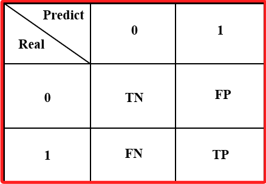

# 混淆矩陣（Confusion Matrix）

_二分類混淆矩陣_



<br>

## 說明

1. 混淆矩陣是用於評估 `分類模型` 性能的一種工具，特別適用於 `二元分類` 和 `多類分類` 問題。

<br>

2. 混淆矩陣提供了 `真實值` 與 `模型預測值` 之間的比較結果，透過矩陣能展示模型在哪些類別上表現良好，在哪些類別上容易出錯。

<br>

3. 混淆矩陣是一個方陣，其中橫軸表示模型的 `預測標籤（Predicted Label）`，縱軸表示 `真實標籤（True Label）`；請忽略行列因翻譯所造成的差異，這裏所稱的 `橫軸` 就是 `row`、列，縱軸就是 `column`、行，矩陣中的每個元素代表的是該分類的樣本分佈。

<br>

4. 在混淆矩陣中，時常會看到關於 `型一誤` 與 `型二誤` 的描述，雖然在許多文章或是書籍中都會見到，但在機器學習領域的混淆矩陣中，並沒有嚴格定義型一誤和型二誤，這一點由混淆矩陣適用於多維度數據即可佐證，而之所以有這些術語的使用，更多的是借用了統計學的概念來說明二維矩陣中的 FP 與 FN，也就是借用概念來描述錯誤類型以便對結果進行解釋和分析，但要特別注意，這並非機器學習領域的嚴格定義，留意這一點可避免錯誤理解與不當引用描述。

<br>

5. 由於這是一個可以多維度使用的方陣，所以縱軸與橫軸只要正確對應，基本上都能分析正確結果；其中在二維的混淆矩陣中，使用二分類來解釋 FP、FN、TN、TP 時，其在座標上的順序將影響象限中元素的位置，雖然順序並無嚴謹定義，但橫軸為預測標籤、縱軸為實際值的規範還是要依循的， _以下就是一個不符合規範的矩陣範例_。

    

<br>

6. 另外，在統計中並無混淆矩陣的定義與應用，只是常見將 `虛無假設的真假` 以及 `模型顯著與否（接受或拒絕虛無假設）` 套入類似於  2x2 混淆矩陣的方陣中進行說明，並藉此觀察模型的型一誤與型二誤，這雖是個很好的理解途徑，但要特別注意，無須刻意與混淆矩陣做對應，不然容易模糊了觀念，由下圖來說，橫軸其實是真實值，縱軸則是預測結果，但這卻與混淆矩陣是相反的，但若將兩軸交換，這又與一般進行資料分析的邏輯有衝突，因為在資料分析中，列所代表的是一筆資料，欄位代表的是標籤，故將 `H₀` 作為橫軸標籤相對是比較合理的，但這卻又與混淆矩陣的模式衝突，特別提出比對以端正觀念。

    

<br>

## 混淆矩陣的結構

_對於二元分類問題，混淆矩陣通常是 2x2 的矩陣，結構如下_


1. TP（True Positive，真正例）：模型正確地將正例分類為正例。

<br>

2. TN（True Negative，真負例）：模型正確地將負例分類為負例。

<br>

3. FP（False Positive，假正例）：模型錯誤地將負例分類為正例，概念類似於統計學的 `Type I Error`，虛無假設為真卻拒絕虛無假設，也就是被判定為正例，但實際是無效果的，也就是偽陽性。

<br>

4. FN（False Negative，假負例）：模型錯誤地將正例分類為負例，概念類似於統計學的 `Type II Error`，無法拒絕錯誤的虛無假設，也就是被判定為負例，但實際上是正例，也就是偽陰性。

<br>

## 混淆矩陣的使用

1. 混淆矩陣可以用來計算多種性能指標，如 `準確率（Accuracy）`、`精確率（Precision）`、`召回率（Recall）`、`F1分數（F1-Score）` 等。

<br>

2. 以下範例使用 Keras 提供的 MNIST 數據集來演示如何構建一個簡單的 `人工神經網絡（ANN）` 模型，並使用 `混淆矩陣` 來評估模型的性能，這是一個相對較為複雜得多維度矩陣，可用於處理多分類問題。

    ```python
    import numpy as np
    import matplotlib.pyplot as plt
    from tensorflow.keras.models import Sequential
    from tensorflow.keras.layers import Dense, Flatten
    from tensorflow.keras.utils import to_categorical
    from tensorflow.keras.datasets import mnist
    from sklearn.metrics import confusion_matrix, ConfusionMatrixDisplay

    # 加載 MNIST 數據集
    (X_train, y_train), (X_test, y_test) = mnist.load_data()

    # 數據預處理：將影像數據轉換為浮點數並歸一化
    X_train = X_train.astype('float32') / 255
    X_test = X_test.astype('float32') / 255

    # 將類別標籤進行 One-hot 編碼
    y_train = to_categorical(y_train, 10)
    y_test = to_categorical(y_test, 10)

    # 建立簡單的 ANN 模型
    model = Sequential()
    # 展平層
    model.add(Flatten(input_shape=(28, 28)))
    # 第一個隱藏層
    model.add(Dense(128, activation='relu'))
    # 輸出層
    model.add(Dense(10, activation='softmax'))

    # 編譯模型
    model.compile(
        loss='categorical_crossentropy', 
        optimizer='adam', 
        metrics=['accuracy']
    )

    # 訓練模型
    model.fit(
        X_train, y_train, 
        epochs=10, 
        batch_size=128, 
        verbose=1, 
        validation_data=(X_test, y_test)
    )

    # 使用測試集進行預測
    y_pred = model.predict(X_test)

    # 將預測結果轉為類別索引
    y_pred_classes = np.argmax(y_pred, axis=1)
    # 將真實標籤轉為類別索引
    y_true = np.argmax(y_test, axis=1)

    # 生成混淆矩陣
    cm = confusion_matrix(y_true, y_pred_classes)

    # 可視化混淆矩陣
    disp = ConfusionMatrixDisplay(confusion_matrix=cm)
    disp.plot()
    plt.title('混淆矩陣')
    plt.show()
    ```

<br>

3. 以上代碼可輸出以下 `10x10` 的混淆矩陣，與前面介紹的相同，橫向列表示模型的預測標籤、縱向行代表實際的數字標籤，對角線元素表示被正確分類的樣本數量，透過這個矩陣可以觀察每個標籤能被正確辨識的水準。

    

<br>

## 混淆矩陣的優點

1. 能夠顯示模型在不同類別上的具體表現。

<br>

2. 幫助識別分類錯誤的類別，這有助於調整模型或數據處理流程。

<br>

3. 能夠計算其他重要的分類指標，如 `精確率（Precision）`、`召回率（Recall）` 和 `F1 分數（F1-Score）`。

<br>

## 統計學的交叉表與機器學習的混淆矩陣

_特別注意，兩個矩陣在標籤位置上是不同的_

<br>

1. 使用統計交叉表呈現型一誤與型二誤，橫軸是實際值、縱軸是預測值。

    

<br>

2. 在機器學習領域的混淆矩陣，橫軸是預測值、縱軸是實際值，其中 FP（偽陽性）類似於 H₀ 為真實卻拒絕 H₀，也就是 _錯誤地接受了對立假設_。

    

<br>

## 二維混淆矩陣

_補充說明二維混淆矩陣的程式碼_

1. 程式碼。

    ```python
    import matplotlib.pyplot as plt
    import numpy as np

    # 定義混淆矩陣的數據
    data = np.array([[50, 5], [10, 35]])

    # 創建圖形
    fig, ax = plt.subplots()

    # 使用imshow顯示數據
    cax = ax.matshow(data, cmap='Blues')

    # 添加顏色條
    plt.colorbar(cax)

    # 設置軸標籤
    ax.set_xticklabels([
        '', 'Predicted Negative', 'Predicted Positive'
    ])
    ax.set_yticklabels([
        '', 'Actual Negative', 'Actual Positive'
    ])

    # 在方塊內添加數據標籤
    for (i, j), val in np.ndenumerate(data):
        ax.text(
            j, i, 
            f'{val}', 
            ha='center', va='center', 
            color='black'
        )

    # 添加標題和坐標標籤
    plt.xlabel('Predicted Label')
    plt.ylabel('Actual Label')
    plt.title('Confusion Matrix')

    plt.show()
    ```

    

<br>

___

_END_