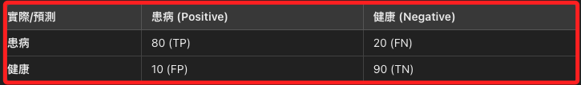
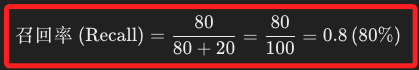

# 召回率（Recall）

_計算式為分子是 TP（真陽），分母是 TP 加 FN（偽陰），FN 就是真實值為陽，卻被判定為陰的樣本，所以召回率就是實際值為陽性，並且被正確判定為陽性的樣本。_

 

## 說明

1. 也稱為 `靈敏度（Sensitivity）`或 `真陽性率（True Positive Rate，TPR）`，是分類模型的一個性能評估指標，可用來衡量模型在所有實際為正例的樣本中，能夠正確識別出來的比例；例如在信息檢索中，`召回率` 描述的是從所有相關文檔中成功檢索到的相關文檔比例，代表模型的 `敏感性`，高召回率代表模型能夠找到更多的相關文檔，但也可能會引入更多不相關的文檔，也就是提高 `FP` 的可能性；另外在醫療診斷等需要避免漏診的場景中，高召回率表示模型能夠檢測出更多的實際陽性病例，從而減少漏診率，因為醫療檢測中錯過真正例的代價是非常高的。

 

2. 以下是召回率的計算公式，其中 `TP（True Positive，真正例）` 是模型正確預測為正例的數量，而 `FN（False Negative，假負例）` 是模型錯誤預測為負例，但實際為正例的數量，召回率強調的是對正類樣本的 `完整檢測能力`，這也是被稱為 `召回率` 的原因。

    

 

## 實作

1. 以下範例假設有一個模型用於檢測患有某種疾病的患者，給出以下混淆矩陣。

    

 

2. 召回率計算如下，這表示模型能夠正確識別出 80% 的患病患者。

    

 

___

_END_