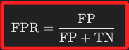
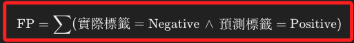
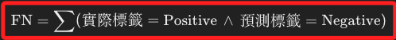

# False Positive vs. Type I Error

_混淆矩陣的偽陽性（FP）與統計上的型一誤（α）_

 

## 說明

1. 在統計學中，`型一誤（Type I Error，α）` 是指在假設檢定中，當 `H₀` 為真時，錯誤地拒絕 `H₀` 的機率，這個機率是由研究者在設計實驗時設定的，也稱為 `顯著水準`；而在機器學習中，`偽陽性（False Positive，FP）` 是在混淆矩陣中使用的術語，指的是分類模型將實際為負例（Negative）的樣本錯誤地預測為正例（Positive）的數量；雖然兩者在矩陣上的呈現極為相似，但它們的定義和應用背景不同，本質上指的並非同樣一件事情。

 

2. 統計上的型一誤是一個理論上的錯誤機率，定義為在假設檢定框架下，當 `H₀` 為真時，錯誤地拒絕 `H₀` 的機率，這個顯著水準是研究者預先設定的，用來控制在研究中的最大可接受型一誤發生的機率；例如 `α = 0.05` 表示研究者可以接受在 100 次試驗中有 5 次錯誤拒絕真實的 `H₀`，這種型一誤是基於理論分佈和假設檢定的統計推論，強調的是長期平均的錯誤機率。

 

3. 混淆矩陣中的偽陽性是一個描述分類模型性能的指標，表示模型在分類過程中，將實際為負例的樣本錯誤地分類為正例的數量，這是一個基於具體數據集的實際觀測結果，FP 反映模型在特定數據集上分類錯誤的具體情況，因此用於評估模型的分類能力。混淆矩陣中的偽陽性率計算公式如下。

    

 

4. 再次強調，雖然 `型一誤（α）` 和 `偽陽性（FP）` 在矩陣的呈現上具有相似性，但它們的應用背景和概念本質不同，這兩者不能直接互換，也不能用一個來代替另一個。

 

## FP 和 FN

_混淆矩陣中 FP 和 FN 的計算公式，`∧` 表示邏輯運算 `AND`_

 

1. 偽陽性（FP，False Positive）表示實際為負例（Negative），但被模型錯誤地分類為正例（Positive）的數量；概念相同於 _H₀ 為真卻被拒絕_。

    

 

2. 假陰性（FN，False Negative）表示實際為正例（Positive），但被模型錯誤地分類為負例（Negative）的數量。

    

 

3. FP 和 FN 是針對不同的實際類別和預測類別組合，因此它們不能相互推導或計算得出，而是需要分別通過模型的預測結果與真實標籤的比較來計算。

 

## 統計中的型一誤

_在統計假設檢定中，以型一誤（Type I Error）為基礎來設定假設是恰當的_

 

1. 使用統計學進行假設檢定時，會先指定一個顯著性水準（α），這同時代表可以接受型一誤的機率；例如，`α = 0.05` 表示接受有 5% 的機率會犯型一誤，也就是在 `H₀` 為真時錯誤地拒絕它的機率，而顯著性水準反映了對型一誤的容忍度，也就是說，`顯著水準` 的選擇往往取決於研究者對誤拒零假設所帶來後果的承受度、容忍度，而這個容忍度的設置並非隨意，必須是基於特定領域和研究問題的理論基礎來決定。

 

2. 設定信賴水準 α 值的目的就是為了控制型一誤的機率，因此大多數統計檢定和推論方法都圍繞著型一誤進行設計，這表示意在大多數情況下，會試圖將型一誤控制在一個可接受的顯著水準內，並以這個前提設計和評估統計模型。

 

3. 因為 `型一誤（α）` 是可控的和已定義的，所以經常使用它來設置檢定的臨界值和計算樣本量，這使得以型一誤為基礎來討論和評估模型錯誤是一個常見且合理的做法；另外，由於 `型二誤（Type II Error）` 的機率 `β 值` 依賴於 `樣本數`、`效應大小` 和 `型一誤`，因此型一誤常常是討論錯誤時的起點。

 

4. `β 型二誤` 不能直接通過 `α 型一誤` 求得，因為這兩者受不同的因素影響，並且它們之間沒有簡單的數學公式關係；`β` 的值取決於 `效應大小`、`樣本量`、`顯著水準` 以及 `數據的變異性` 和 `分佈`，其中任何一個因素都會影響 β 的大小。

 

5. 雖然型一誤與型二誤同樣重要且各有其定義，兩者間在重要性上無法比較，但基於避免型一誤來進行統計假設有其一定的理論依據；所以，進行統計假設時，基於 `避免型一誤` 這樣的角度出發是合理的作法。

 

## 統計中的 `H₀`

1. 通常在統計檢定中，`H₀` 是設定為 `沒有差異` 或 `無效效果`，以醫療診斷為例，`H₀` 通常是 `患者無病`，而對立假設是 `患者有病`，這種設置是因為零假設通常代表一個保守的、初始的假設狀態；在這樣的假設下，型一誤（α）是指 `錯誤地拒絕無病的假設`，也就是 `錯誤地診斷為有病（假陽性）`，這會導致不必要的進一步檢查或治療；而型二誤（β）是指 `未能拒絕無病的假設`，即 `發生漏診（假陰性）`，也就是 `實際有病卻被診斷為無病`，這在醫療中可能是更嚴重的錯誤，因為它可能導致延誤治療，對患者健康造成更大的風險，在這樣的視角下，型二誤比起型一誤來得更加嚴重。

 

2. 延續上一點，若基於將更嚴重的錯誤放置在型一誤而調整假設的方向，就是將零假設設為 `有病`，嚴格說來這不符合統計學的標準做法，統計學的假設檢定通常使用零假設代表 `無效情況`，如無病、無罪，因為這是 `更保守` 的假設，也是一種在不確定情況下的 `基線狀態`，用這種 `基線` 的角度來思考，比起使用 `重要性` 來思考更為恰當。

 

3. 至於在醫療行為中，如果希望避免漏診，重點應該放在檢測的 `敏感性（sensitivity）`，也就是關注 `召回率（recall）`，應試圖增強模型識別 `真陽性（TP）`的能力，而不是改變假設檢定的基線設定，也就是考慮調整決策閾值，或增加檢測敏感性，即使這可能增加假陽性（FP）的數量。 

 

## 統計中的型二誤

1. 回顧前面提及的 `型一誤（Type I Error）` ，就是 `H₀ 為真卻錯誤地拒絕 H₀`（在矩陣的位置是左下方）；依照相同邏輯，`型二誤（Type II Error，β）` 則是 `H₁ 為真卻錯誤地拒絕 H₁`，基於統計分析是檢驗 `H₀`，那 `型二誤` 也就是 `H₁ 為真卻錯誤地未能拒絕 H₀`。

 

2. 換句話說，統計學通常以顯著水準（α）作為控制標準，也就是從 `型一誤` 的視角來設計檢定；同理，`型二誤` 可以轉換視角為 `當 H₀ 為假時，錯誤地未能拒絕 H₀`，也就是 `未能拒絕實際上錯誤的 H₀`，也就是前一點說的 `H₁ 為真卻錯誤地未能拒絕 H₀`。

 

3. 當發生 `型二誤` 時，也就是 `接受了錯誤的 H₀` 或說 `未能拒絕錯誤的 H₀`，這導致忽略了 `實際存在的效應或差異`；例如在醫學研究中，`型二誤` 可能導致未能檢測到治療的真實效果，從而錯過了一個有效的治療方法。

 

4. `型二誤` 的機率用 `β` 表示，是在 `H₁ 為真時，未能拒絕 H₀` 的機率，這個機率不是事先設定的，而是依賴於多個因素，包括 `效應大小（effect size）`、`樣本量（sample size）`、`顯著水準（α）`、`數據的變異性`、`數據的分佈情況` 等。

 

5. `檢驗力（Power）` 是與 `型二誤` 相關的重要概念，計算公式為 `(1 - β)`，也就是不發生 `型二誤` 的機率，表示了 `檢測出 H₁ 為真的能力`；所以型二誤的機率越低、檢驗力也就越高，反之亦然。通常研究者希望檢驗力至少達到 `0.8`，這表示有 80% 的機會正確拒絕一個錯誤的零假設 H₀。

 

6. 所以若想要提高檢驗力，從統計上也就是要降低型二誤的機率，這可通過增加樣本量、提高效應大小、降低數據的變異性，或選擇更高的顯著水準（α）來實現；然而，這些操作會有相對代價，例如增大樣本量會增加研究的時間和成本、提高顯著水準會增加型一誤的風險等；因此，在實驗設計中，需要在控制型一誤和型二誤之間取得平衡。

 

7. 補充說明，`檢驗力`是統計假設檢定中的概念，衡量的是 `在假設檢定中正確拒絕零假設的能力`，而 `檢驗力` 並不出現在混淆矩陣中，因為混淆矩陣是用於 `分類模型的性能評估`，衡量的是模型在實際數據集上的預測結果，如真正例、假正例、假負例和真負例等四個象限。

 

___

_END_