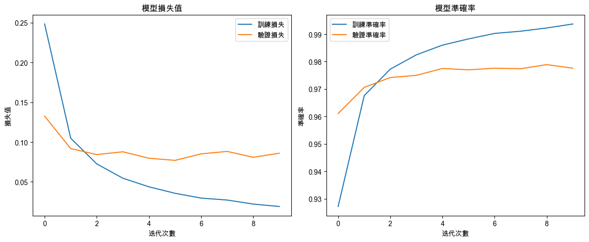

# 反向傳播（Backpropagation）

<br>

## 說明

1. 反向傳播是機器學習和深度學習中訓練神經網絡的核心算法，通過計算損失函數相對於每個權重的偏導數，並使用這些梯度來更新神經網絡的權重，以最小化損失，這個過程使得神經網絡能夠學習並改進其預測能力。

<br>

2. 之所以被稱為 `反向`，是因為這個模式涉及從 `最終預測結果的輸出層` 向回傳播 `誤差`，逐層計算和更新神經網絡中每個 `權重` 的 `梯度`；簡言之，`反向傳播` 強調的是 `誤差` 和 `梯度` 是從 `輸出層` 反向傳遞到 `輸入層` 的這個過程。

<br>

## 基本步驟

1. 前向傳播（Forward Propagation）：將輸入數據通過神經網絡，計算出輸出結果。

<br>

2. 計算損失（Loss Calculation）：使用預測結果與真實標籤之間的差異來計算損失值。

<br>

3. 反向傳播（Backpropagation）：計算損失相對於每個權重的偏導數（梯度）。

<br>

4. 權重更新（Weight Update）：使用梯度下降算法更新權重，減少損失。

<br>

## 反向傳播的範例

_使用MNIST資料集進行手寫數字識別_

<br>

1. 以下範例基於 `手寫數字識別 MNIST 數據集`，說明在深度神經網絡中使用反向傳播進行訓練，這個數據集包括 `60000` 個訓練樣本和 `10000` 個測試樣本，每個樣本是一個 `28x28` 像素的 `灰度圖像`。

<br>

2. 資料集載入後對圖像數據正規化，將其縮放到 `0 ~ 1` 之間，然後將標籤轉換為 `One-Hot 編碼` 格式以適應分類模型。

<br>

3. 構建神經網絡模型時，第一層為 `Flatten層`，在這將 `28x28` 的圖像展開成 `784` 維的向量；接著是 `全連接層 Dense`，其中兩個 `隱藏層` 使用 `ReLU` 激活函數，`輸出層` 使用 `Softmax 激活函數` 對每個類別進行概率預測。

<br>

4. 編譯模型使用 `categorical_crossentropy` 作為損失函數，`adam` 作為優化器來訓練模型。

<br>

## 範例

1. 程式碼。

    ```python
    import numpy as np
    import matplotlib.pyplot as plt
    from tensorflow.keras.datasets import mnist
    from tensorflow.keras.models import Sequential
    from tensorflow.keras.layers import Dense, Flatten
    from tensorflow.keras.utils import to_categorical

    # 設定支持中文的字體，避免顯示錯誤
    plt.rcParams['font.sans-serif'] = ['Arial Unicode MS']
    # 用來正常顯示負號
    plt.rcParams['axes.unicode_minus'] = False

    # 載入MNIST數據集
    (X_train, y_train), (X_test, y_test) = mnist.load_data()

    # 正規化數據，將像素值縮放到0到1之間
    X_train = X_train.astype('float32') / 255
    X_test = X_test.astype('float32') / 255

    # 將標籤轉換為One-Hot編碼
    y_train = to_categorical(y_train, 10)
    y_test = to_categorical(y_test, 10)

    # 構建神經網絡模型
    model = Sequential()
    # 將28x28的圖像攤平成784維的向量
    model.add(Flatten(input_shape=(28, 28)))
    # 第一個隱藏層，有128個神經元，使用ReLU激活函數
    model.add(Dense(128, activation='relu'))
    # 第二個隱藏層，有64個神經元，使用ReLU激活函數
    model.add(Dense(64, activation='relu'))
    # 輸出層，有10個神經元（對應10個類別），使用Softmax激活函數
    model.add(Dense(10, activation='softmax'))

    # 編譯模型，使用損失函數為categorical_crossentropy，優化器為adam
    model.compile(
        optimizer='adam', 
        loss='categorical_crossentropy', 
        metrics=['accuracy']
    )

    # 訓練模型，並記錄訓練過程中的損失和準確率
    history = model.fit(
        X_train, y_train,
        epochs=10, 
        batch_size=32, 
        validation_data=(X_test, y_test)
    )

    # 可視化訓練過程中的損失和準確率
    plt.figure(figsize=(12, 5))

    # 損失值（Loss）可視化
    plt.subplot(1, 2, 1)
    plt.plot(history.history['loss'], label='訓練損失')
    plt.plot(history.history['val_loss'], label='驗證損失')
    plt.title('模型損失值')
    plt.xlabel('迭代次數')
    plt.ylabel('損失值')
    plt.legend()

    # 準確率（Accuracy）可視化
    plt.subplot(1, 2, 2)
    plt.plot(history.history['accuracy'], label='訓練準確率')
    plt.plot(history.history['val_accuracy'], label='驗證準確率')
    plt.title('模型準確率')
    plt.xlabel('迭代次數')
    plt.ylabel('準確率')
    plt.legend()

    plt.tight_layout()
    plt.show()

    # 評估模型性能
    test_loss, test_acc = model.evaluate(X_test, y_test)
    print(f'測試集上的準確率：{test_acc:.2f}')
    ```

<br>

2. 結果 `accuracy：0.9735`、`loss：0.1036`。

    

<br>

## 梯度下降

1. `反向傳播` 與 `梯度下降（Gradient Descent）` 密切相關，兩者共同構成了神經網絡的訓練過程。

<br>

2. 反向傳播的主要作用是計算損失函數相對於每個網絡權重的偏導數，也就是 `梯度`；它通過從輸出層向輸入層反向傳播誤差，逐層應用鏈式法則來計算每個權重的梯度。

<br>

3. `梯度下降算法` 利用由反向傳播計算出的梯度來更新神經網絡的權重，這個過程是通過在梯度的反方向上（負梯度方向）調整權重來最小化損失函數。

<br>

4. 簡單說，`反向傳播` 提供了 `梯度`，也就是調整每個權重以減小損失；而 `梯度下降` 使用這些 `梯度` 來實際更新 `權重`，進而訓練神經網絡；兩者相輔相成，反向傳播負責計算梯度，梯度下降負責應用梯度來優化模型。

<br>

___

_END_