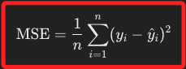
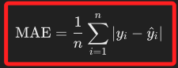
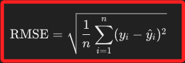
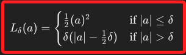
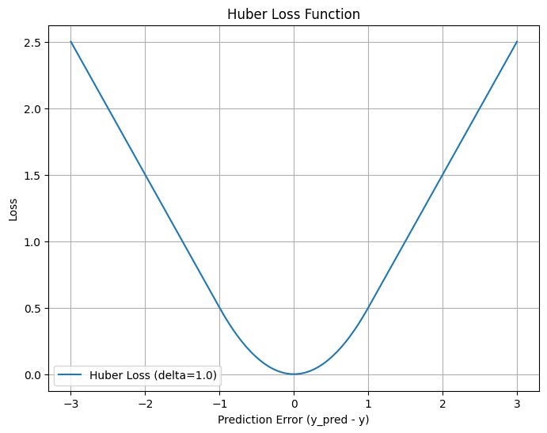

# 優化函數：迴歸問題

_也稱為損失函數，用於衡量模型的預測結果與實際結果之間的差異；訓練模型的目標就是最小化這個差異，用以提高模型的預測能力。_

<br>

## 均方誤差（Mean Squared Error，MSE）

1. 通常用於迴歸模型的訓練中，目的是最小化預測結果與實際結果之間的差異，公式如下；其中 $(y_i)$ 是實際值，$(\hat{y}_i)$ 是預測值。

    

<br>

2. 是模型 `預測值與實際值差異的平方平均值`，也就是 `誤差平方的均值`，因為平方運算會放大大誤差，所以 `MSE` 對於 `離群點` 非常敏感。

<br>

3. 程式碼。

    ```python
    import numpy as np

    # 真實值 y
    y = np.array([3.0, -0.5, 2.0, 7.0])
    # 預測值 y_pred
    y_pred = np.array([2.5, 0.0, 2.0, 8.0])

    # 計算 MSE
    mse = np.mean((y - y_pred)  ** 2)
    print(f"Mean Squared Error: {mse}")
    ```

<br>

## 平均絕對誤差（Mean Absolute Error，MAE）

1. MAE 是模型預測值與實際值之間的 `絕對誤差的平均值`，也就是 `誤差項絕對值的平均`，因為沒有進行平方，所以不會像 `MSE` 會放大極端值，換句話說，存在異常值的情況下，它比 MSE 更穩健；公式如下。

    

<br>

2. 程式碼。

    ```python
    import numpy as np

    # 真實值 y
    y = np.array([3.0, -0.5, 2.0, 7.0])
    # 預測值 y_pred
    y_pred = np.array([2.5, 0.0, 2.0, 8.0])

    # 計算 MAE
    mae = np.mean(np.abs(y - y_pred))
    print(f"Mean Absolute Error: {mae}")
    ```

<br>

## 均方根誤差（Root Mean Squared Error，RMSE）

1. `RMSE` 是 `MSE` 的平方根，也就是對 `MSE` 開根號；這指標可表示預測值與實際值之間誤差的 `平方平均值的平方根`；`RMSE` 的度量結果保持了與原數據相同的單位，這與 `MSE` 是以平方的單位呈現誤差不同；公式如下，其中，$(y_i)$ 是實際值，$(\hat{y_i})$ 是預測值。

    

<br>

2. `RMSE` 是用於衡量模型預測結果與實際值之間的差異的一個重要指標，它與 `MAE` 都可以用於評估模型的預測性能，但 `RMSE` 對於大的錯誤更加敏感，因此在對大的偏差特別關注的情況下更適用，這與 `MSE` 是相同的。而 `MSE` 和 `RMSE` 通常用於 `常態分佈` 的誤差，而 `MAE` 用於對誤差分佈不作任何假設的情況。

<br>

3. 程式碼。

    ```python
    import numpy as np

    # 真實值 y
    y = np.array([3.0, -0.5, 2.0, 7.0])
    # 預測值 y_pred
    y_pred = np.array([2.5, 0.0, 2.0, 8.0])

    # 計算 RMSE
    rmse = np.sqrt(np.mean((y - y_pred) ** 2))
    print(f"Root Mean Squared Error: {rmse}")
    ```

<br>

## Huber 損失（Huber Loss）

1. `Huber 損失` 結合了 `MSE` 和 `MAE` 的優點，對小誤差使用 MSE，達到對誤差更敏感的目的，而對大誤差使用 MAE，這對離群點更穩健；公式如下，其中 $(a = y - \hat{y})$，而 𝛿 是閾值。

    

<br>

2. 程式碼。

    ```python
    import numpy as np
    import matplotlib.pyplot as plt


    def huber_loss(y, y_pred, delta=1.0):
        residual = y - y_pred
        condition = np.abs(residual) <= delta
        squared_loss = 0.5 * residual**2
        linear_loss = delta * (np.abs(residual) - 0.5 * delta)
        return np.where(condition, squared_loss, linear_loss)


    # 定義實際值和預測值範圍
    # 固定實際值
    y = 0
    # 預測值的範圍
    y_pred = np.linspace(-3, 3, 100)

    # 計算Huber損失
    delta = 1.0
    loss = huber_loss(y, y_pred, delta)

    # 繪製Huber損失圖形
    plt.figure(figsize=(8, 6))
    plt.plot(y_pred, loss, label=f"Huber Loss (delta={delta})")
    plt.xlabel("Prediction Error (y_pred - y)")
    plt.ylabel("Loss")
    plt.title("Huber Loss Function")
    plt.legend()
    plt.grid()
    plt.show()
    ```

    

<br>

___

_END_