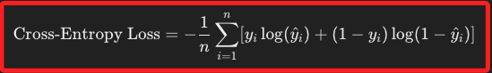
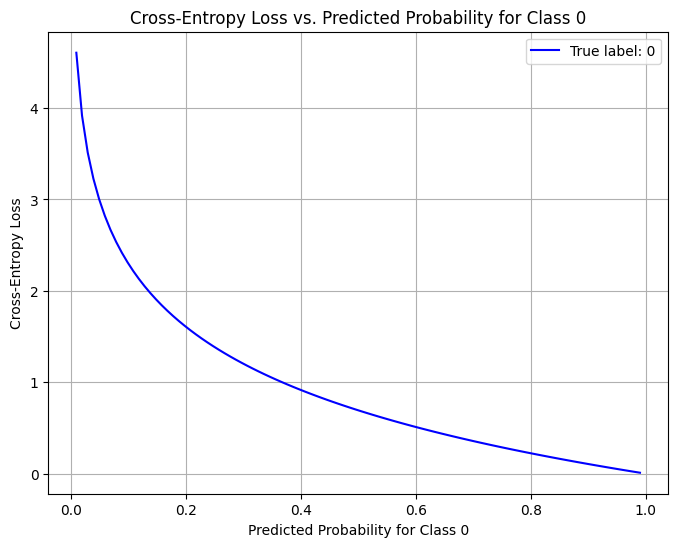
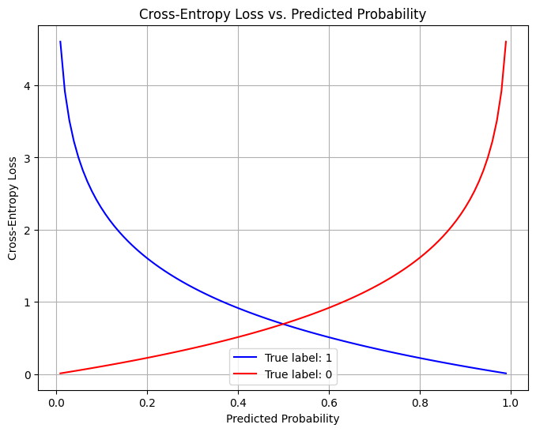
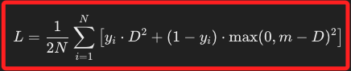
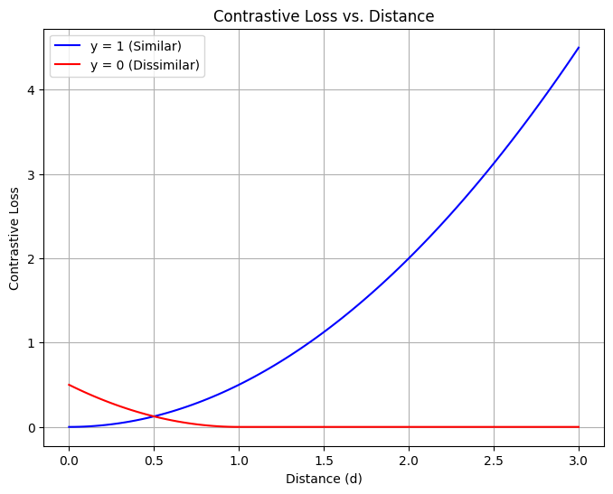

# 優化函數：分類問題

_（重複前一小節的描述）也稱為損失函數，用於衡量模型的預測結果與實際結果之間的差異，模型訓練的目標是最小化這個差異，以提高模型的預測能力。_

<br>

## 交叉熵損失（Cross-Entropy Loss）

1. 交叉熵損失主要用於分類問題，特別是二分類或多分類的神經網絡，用以度量 `預測機率分布與真實分布之間的差異`，當真實標籤為 1 時，預測機率越接近 1，損失越小；公式如下。

    

<br>

2. 基礎程式碼。

    ```python
    from sklearn.metrics import log_loss

    # 真實標籤 y
    y = np.array([1, 0, 1, 0])
    # 預測機率 y_pred_proba
    y_pred_proba = np.array([0.9, 0.1, 0.8, 0.4])

    # 計算交叉熵損失
    cross_entropy = log_loss(y, y_pred_proba)
    print(f"Cross-Entropy Loss: {cross_entropy}")
    ```

<br>

3. 以下是個進階範例，考慮多分類問題，並計算每個類別的預測機率，然後使用 `sklearn.metrics.log_loss` 來計算多類別的交叉熵損失，並可視化不同預測機率下的交叉熵損失。

    ```python
    import numpy as np
    import matplotlib.pyplot as plt
    from sklearn.metrics import log_loss

    # 真實標籤 y (多分類情況，有三個類別: 0, 1, 2)
    y_true = np.array([0, 1, 2, 2, 1, 0])

    # 預測機率 y_pred_proba，這裡每個樣本的預測機率分佈在三個類別上
    y_pred_proba = np.array([
        [0.7, 0.2, 0.1],  # 樣本1的預測機率
        [0.1, 0.8, 0.1],  # 樣本2的預測機率
        [0.2, 0.2, 0.6],  # 樣本3的預測機率
        [0.1, 0.3, 0.6],  # 樣本4的預測機率
        [0.1, 0.7, 0.2],  # 樣本5的預測機率
        [0.8, 0.1, 0.1]   # 樣本6的預測機率
    ])

    # 計算交叉熵損失
    cross_entropy = log_loss(y_true, y_pred_proba)
    print(f"Cross-Entropy Loss: {cross_entropy}")

    # 可視化不同預測機率對交叉熵損失的影響
    pred_prob_1 = np.linspace(0.01, 0.99, 100)
    pred_prob_2 = 1 - pred_prob_1
    loss_list = []

    # 對於固定真實標籤 y = 0，計算不同機率下的交叉熵損失
    for p1, p2 in zip(pred_prob_1, pred_prob_2):
        # 兩個類別的預測機率
        y_pred_example = np.array([[p1, p2, 0.0]])
        y_true_example = np.array([0])
        loss = log_loss(y_true_example, y_pred_example, labels=[0, 1, 2])
        loss_list.append(loss)

    # 可視化
    plt.figure(figsize=(8, 6))
    plt.plot(pred_prob_1, loss_list, label='True label: 0', color='blue')
    plt.xlabel('Predicted Probability for Class 0')
    plt.ylabel('Cross-Entropy Loss')
    plt.title('Cross-Entropy Loss vs. Predicted Probability for Class 0')
    plt.legend()
    plt.grid()
    plt.show()
    ```

<br>

4. 輸出如下，`X 軸` 代表預測的類別 0 的機率（Predicted Probability for Class 0），`Y 縱` 代表交叉熵損失（Cross-Entropy Loss）；當預測機率接近 `0` 時，交叉熵損失接近 0，這表示模型的預測非常準確、損失很小；當預測機率逐漸偏向 `1` 時，交叉熵損失急劇增加，這是因為模型自信地預測錯誤，導致損失值變大。

    

<br>

5. 交叉熵損失的特性是在真實標籤為 0 或 1 的情況下，損失的值取決於預測機率，當預測接近真實標籤時，損失值較低；當預測偏離真實標籤時，損失值增大；通過最小化交叉熵損失，模型調整權重，將使預測更接近真實標籤。

<br>

## 二元交叉熵（Binary Cross-Entropy Loss）

1. 這是 `交叉熵損失的特例`，專門用於二元分類問題。它度量模型預測的機率分布和真實分布之間的差異。

<br>

2. 基礎程式碼。

    ```python
    # 對於二元分類問題，log_loss 也可用於計算二元交叉熵損失
    binary_cross_entropy = log_loss(y, y_pred_proba)
    print(f"Binary Cross-Entropy Loss: {binary_cross_entropy}")
    ```

<br>

3. 進階程式碼。

    ```python
    import numpy as np
    import matplotlib.pyplot as plt
    from sklearn.metrics import log_loss

    # 真實標籤 y 為1的情況
    y_true_1 = np.array([1])
    # 預測機率從0到1
    y_pred_proba = np.linspace(0.01, 0.99, 100)

    # 計算交叉熵損失，當真實標籤為1，並提供所有可能的標籤 [0, 1]
    loss_1 = [
        log_loss(y_true_1, [p], labels=[0, 1]) for p in y_pred_proba
    ]

    # 真實標籤 y 為0的情況
    y_true_0 = np.array([0])

    # 計算交叉熵損失，當真實標籤為0，並提供所有可能的標籤 [0, 1]
    loss_0 = [
        log_loss(y_true_0, [p], labels=[0, 1]) for p in y_pred_proba
    ]

    # 可視化
    plt.figure(figsize=(8, 6))

    plt.plot(y_pred_proba, loss_1, label='True label: 1', color='blue')
    plt.plot(y_pred_proba, loss_0, label='True label: 0', color='red')
    plt.xlabel('Predicted Probability')
    plt.ylabel('Cross-Entropy Loss')
    plt.title('Cross-Entropy Loss vs. Predicted Probability')
    plt.legend()
    plt.grid()
    plt.show()
    ```

<br>

4. 輸出的結果如下圖，也就是 `交叉熵損失（Cross-Entropy Loss）` 相對於 `預測機率（Predicted Probability）` 的圖示，呈現的是 `真實標籤為1（藍線）` 和 `真實標籤為0（紅線）` 時，交叉熵損失如何隨著預測機率的變化而變化；當 `真實標籤為1` 時，交叉熵損失在模型預測機率接近真實值 `1` 時最小，隨著預測機率接近 `0`，損失快速增大，這表示模型的預測越不準確，也就是預測為 `0` 的機率越大時，損失越高；當 `真實標籤為0`時，交叉熵損失在模型預測機率接近真實值 `0`時最小，隨著預測機率接近 `1`，損失快速增大，同樣表示模型預測越不準確，也就是預測為 `1` 的機率越大、損失越高。

    

<br>

## 對比損失（Contrastive Loss）

1. `對比損失` 主要用於度量學習（Metric Learning）中的雙輸入模型，例如孿生網絡（Siamese Networks），它用於最小化相似對之間的距離，同時最大化不同對之間的距離；公式如下，其中 $(D)$ 是樣本對的距離，$(m)$ 是邊界距離。

    

<br>

2. 基礎範例程式碼。

    ```python
    import torch
    import torch.nn.functional as F

    def contrastive_loss(y, d, margin=1.0):
        loss = 0.5 * (y * d ** 2 + (1 - y) * F.relu(margin - d) ** 2)
        return loss.mean()

    # 假設有一些相似度標籤 y 和樣本對之間的距離 d
    y = torch.Tensor([1, 0, 1, 0])
    d = torch.Tensor([0.5, 2.0, 1.0, 3.0])

    # 計算對比損失
    loss = contrastive_loss(y, d)
    print(f"Contrastive Loss: {loss.item()}")
    ```

<br>

3. 進階範例，繪製對比損失隨著距離 𝑑 的變化來觀察損失函數的行為。

    ```python
    import numpy as np
    import matplotlib.pyplot as plt
    import torch
    import torch.nn.functional as F

    # 對比損失函數
    def contrastive_loss(y, d, margin=1.0):
        loss = 0.5 * (
            y * d ** 2 + (1 - y) * F.relu(margin - d) ** 2
        )
        return loss.mean()

    # 生成距離範圍 d
    d_range = np.linspace(0, 3, 100)

    # 計算不同距離 d 下的對比損失
    # 標籤 1 表示相似
    y_similar = torch.tensor([1.0])
    # 標籤 0 表示不相似
    y_dissimilar = torch.tensor([0.0])
    loss_similar = [
        contrastive_loss(
            y_similar, torch.tensor([d])
        ).item() for d in d_range
    ]
    loss_dissimilar = [
        contrastive_loss(
            y_dissimilar, torch.tensor([d])
        ).item() for d in d_range
    ]

    # 繪製結果
    plt.figure(figsize=(8, 6))
    plt.plot(
        d_range, loss_similar, 
        label='y = 1 (Similar)', 
        color='blue'
    )
    plt.plot(
        d_range, loss_dissimilar, 
        label='y = 0 (Dissimilar)', 
        color='red'
    )
    plt.xlabel('Distance (d)')
    plt.ylabel('Contrastive Loss')
    plt.title('Contrastive Loss vs. Distance')
    plt.legend()
    plt.grid(True)
    plt.show()
    ```

<br>

4. 輸出結果如下，透過圖形這可理解 `對比損失（Contrastive Loss` 隨 `樣本距離（𝑑）` 變化的曲線。

    

<br>

5. 進一步說明輸出結果，在藍線（y = 1，Similar）部分，當樣本對是相似的 $(𝑦=1)$，損失值隨距離 $(𝑑)$ 的增加而增加，這表示模型的目標是最小化相似樣本對之間的距離，讓它們盡可能接近。因此，損失曲線是對距離 $(𝑑)$ 的平方函數，距離越大，損失越高。

<br>

6. 延續上一點；在紅線（y = 0，Dissimilar）部分， 當樣本對是不相似的 $(𝑦=0)$，損失值隨距離 𝑑 的增加而減少，直到距離達到設定的 margin 值（假設 margin = 1），此後損失值趨於零。這表示模型的目標是最大化不相似樣本對之間的距離，至少要大於 margin，這樣可以確保模型學到的表示能夠有效區分不相似的樣本對。

<br>

___

_END_