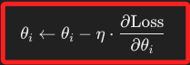
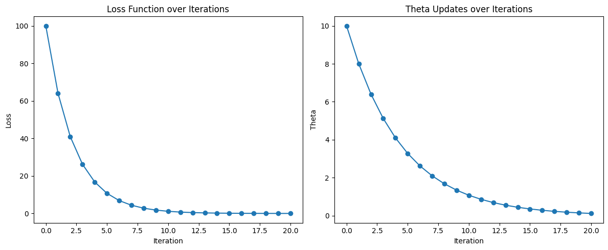

# 學習率 `Learning Rate`

_學習率在機器學習和深度學習模型訓練中決定每次迭代中，模型參數更新的步幅大小，直接影響模型收斂的速度和穩定性_

<br>

## 學習率的角色

1. 控制參數更新的步幅大小，在梯度下降算法中，模型參數的更新公式如下；學習率控制了每次參數更新的步幅大小，過大的學習率會導致更新步幅過大，可能跳過損失函數的最小值；過小的學習率會導致更新步幅過小，使得模型收斂速度變慢；較小的學習率能提供更精細的參數調整，有助於找到更精確的最小值，但需要更多的計算資源和時間。

    

    

<br>

2. 不同數據集可能需要不同的學習率，而較深或較複雜的模型可能需要較小的學習率，較大的學習率可能加快訓練，但需避免模型震盪。

<br>

## 調整學習率的方法

1. 通過實驗來找到最佳的 `固定學習率（Fixed Learning Rate）` 。

<br>

2. 使用 `學習率衰減（Learning Rate Decay）` 方式隨著訓練的進展逐漸減小學習率。

<br>

3. 使用 `自適應學習率方法（Adaptive Learning Rate Methods）`，如 `Adagrad`、`RMSprop`、`Adam` 等來自動調整學習率。

<br>

4. 使用 `預熱學習率（Learning Rate Warm-up）`，也就是開始時使用較小的學習率，然後逐漸增加。

<br>

## 範例

1. 使用梯度下降算法進行優化，其中展示了學習率在參數更新中的作用。

    ```python
    import numpy as np

    # 定義一個簡單的二次損失函數
    def loss_function(theta):
        return theta ** 2

    # 定義損失函數的梯度
    def gradient(theta):
        return 2 * theta

    # 梯度下降算法
    def gradient_descent(initial_theta, learning_rate, num_iterations):
        theta = initial_theta
        for i in range(num_iterations):
            grad = gradient(theta)
            theta = theta - learning_rate * grad
            current_loss = loss_function(theta)
            print(f"Iteration {i+1}: theta = {theta:.4f}, loss = {current_loss:.4f}")
        return theta

    # 設定初始條件
    # 初始參數
    initial_theta = 10.0
    # 學習率
    learning_rate = 0.1
    # 迭代次數
    num_iterations = 20

    # 執行梯度下降
    final_theta = gradient_descent(initial_theta, learning_rate, num_iterations)
    print(
        f"Final theta after {num_iterations} iterations: {final_theta:.4f}"
    )
    ```

<br>

2. 結果。

    ```bash
    Iteration 1: theta = 8.0000, loss = 64.0000
    Iteration 2: theta = 6.4000, loss = 40.9600
    # 省略 ...
    Iteration 18: theta = 0.1801, loss = 0.0325
    Iteration 19: theta = 0.1441, loss = 0.0208
    Iteration 20: theta = 0.1153, loss = 0.0133
    Final theta after 20 iterations: 0.1153
    ```

<br>

3. 可視化結果如下，左圖顯示了損失函數值隨著迭代次數的減少，展示了模型逐漸收斂的過程。
右圖（Theta Updates over Iterations） 顯示了參數 𝜃 的變化，展示了在每次迭代中，𝜃 如何逐步更新以最小化損失函數。

    

<br>

___

_END_