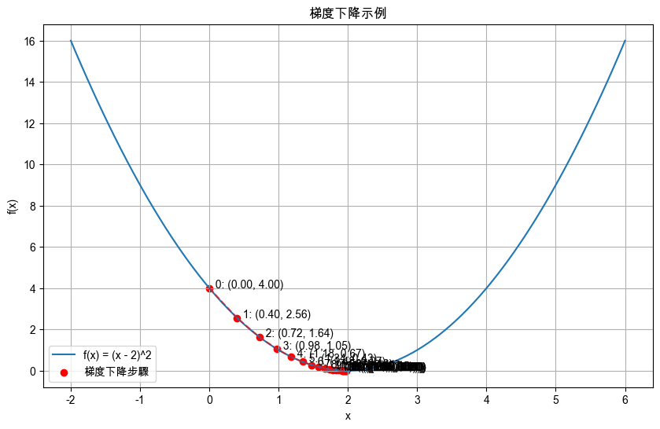

# 梯度下降（Gradient Descent）

_使用簡單的二次函數說明梯度下降如何找到函數的最小值_

<br>

## 梯度消失與梯度爆炸

_梯度消失和梯度爆炸是神經網絡訓練過程中常見的問題，尤其在深層網絡（Deep Networks）中更為顯著。_

<br>

### 梯度消失

_Vanishing Gradient_

<br>

1. 在 `反向傳播` 過程中，當誤差從輸出層向輸入層傳遞時，梯度逐漸變得非常小，最終接近於零。

<br>

2. 原因是激活函數的導數在輸入為大或小的極值時會趨近於零，這會導致多層之間的梯度積累逐漸減小。

<br>

3. 在深層網絡中，這種累積效應使得靠近輸入層的參數更新非常緩慢甚至無法更新。

<br>

4. 使得網絡無法有效學習深層特徵，從而導致訓練速度變慢或陷入局部最小值，訓練效果不佳。

<br>

### 梯度爆炸

_Exploding Gradient_

<br>

1. 與梯度消失剛好相反，在反向傳播過程中，梯度值不斷增大，最終導致數值溢出，超出電腦的表示範圍，原因是網絡權重初始化不當或網絡層數過深，導致反向傳播時梯度的連續乘積變得非常大，當權重值或激活函數的導數較大時，梯度也會隨之增大，累積至幾何級數增長，導致參數更新過度，使得網絡權重變得極大或極小，最終導致訓練過程不穩定甚至崩潰。

<br>

### 解決方法

1. 使用適當的權重初始化方法，如 Xavier 或 He 初始化。

<br>

2. 使用合適的激活函數如 ReLU、Leaky ReLU 等來緩解梯度消失問題。

<br>

3. 應用批量正規化（Batch Normalization）來穩定訓練過程。

<br>

4. 使用梯度裁剪（Gradient Clipping）技術來防止梯度爆炸。

<br>

## 基本原理說明

1. 假設一個簡單的二次函數。

    ```bash
    f(x) = (x - 2)^2
    ```

<br>

2. 目標是通過 `梯度下降` 找到這個函數的最小值，即找到函數的 `最低點（谷底）`。

<br>

3. `導數 f'(x) = 2(x - 2)` 就是 `梯度`，用於計算每一步的梯度。

<br>

4. 初始化變數 `x_current` 為起始點，每次迭代中計算當前點的梯度 `grad`，並通過 `x_current = x_current - learning_rate * grad` 更新點的位置，過程中會存儲每一步的 `x` 和 `f(x)` 值以便可視化。

<br>

## 範例

1. 程式碼。

    ```python
    import numpy as np
    import matplotlib.pyplot as plt

    # 定義二次函數 f(x) = (x - 2)^2
    def f(x):
        return (x - 2) ** 2

    # 定義函數的導數（梯度） f'(x) = 2*(x - 2)
    def gradient(x):
        return 2 * (x - 2)

    # 設定初始參數
    x_current = 0  # 初始點
    learning_rate = 0.1  # 學習率（步長）
    iterations = 20  # 迭代次數

    # 用於存儲每次迭代的 x 值和 f(x) 值
    x_values = [x_current]
    f_values = [f(x_current)]

    # 梯度下降算法
    for _ in range(iterations):
        # 計算當前點的梯度
        grad = gradient(x_current)
        # 更新 x 值
        x_current = x_current - learning_rate * grad
        # 存儲新 x 值
        x_values.append(x_current)
        # 存儲新 f(x) 值
        f_values.append(f(x_current))

    # 可視化梯度下降過程
    # 用於繪製函數圖像的 x 軸數據
    x_plot = np.linspace(-2, 6, 100)
    # 函數 f(x) 的值
    y_plot = f(x_plot)

    plt.figure(figsize=(10, 6))

    # 繪製二次函數曲線
    plt.plot(
        x_plot, y_plot, label='f(x) = (x - 2)^2'
    )

    # 繪製梯度下降過程中的每一步
    plt.scatter(
        x_values, f_values, 
        color='red', 
        label='梯度下降步驟'
    )
    plt.plot(
        x_values, 
        f_values, 
        color='red', 
        linestyle='dashed', 
        alpha=0.6
    )

    # 標註每一步的 x 值和 f(x) 值
    for i, (x, y) in enumerate(zip(x_values, f_values)):
        plt.text(x, y, f'  {i}: ({x:.2f}, {y:.2f})')

    plt.title('梯度下降示例')
    plt.xlabel('x')
    plt.ylabel('f(x)')
    plt.legend()
    plt.grid(True)
    plt.show()
    ```

<br>

2. 結果如下，藍色函數曲線展示二次函數的形狀，紅色點是梯度下降步驟，顯示了梯度下降算法從起始點開始，逐步向最小值（谷底）移動的過程，虛線的箭頭線展示每一步的移動方向和距離，顯示了梯度下降如何利用負梯度方向逐步逼近最小值。

    

<br>

___

_END_