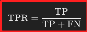
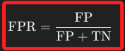
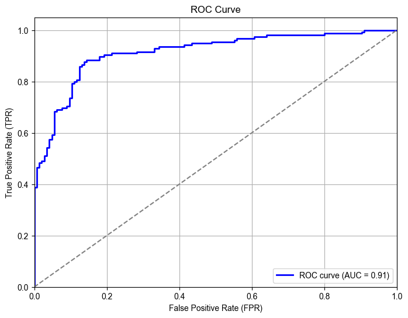

# ROC Curve 與 AUC

_ROC 曲線和 AUC 值是評估分類模型性能的重要指標，尤其在處理不平衡數據集時，AUC 是一個相對穩定的指標，可以幫助選擇合適的模型和調整模型參數。_

<br>

## 說明

1. `ROC Curve` 是一個常用於評估分類模型性能的工具，特別是在二元分類問題中。

<br>

2. `ROC Curve` 全名 `Receiver Operating Characteristic Curve（接收者操作特徵曲線）`，繪製了不同閾值下的 `真正例率（True Positive Rate，TPR）` 與 `假正例率（False Positive Rate，FPR）` 之間的關係。

<br>

3. `AUC（Area Under the Curve）` 表示 ROC 曲線下的面積，它是一個介於 `0 到 1` 之間的數值，_數值越大表示模型的性能越好_。

<br>

4. 真正例率（TPR），也稱為召回率（Recall）或靈敏度（Sensitivity），模型正確識別出正例的比例。

    

<br>

5. 假正例率（FPR），模型將負例錯誤識別為正例的比例。

    

<br>

6. ROC 曲線可通過改變閾值，計算一系列的 TPR 和 FPR，並將其繪製成曲線，當 ROC 曲線越接近左上角，模型性能越好；相對的，AUC 值越接近 1，模型的性能越好；AUC 值為 0.5 表示模型的性能與隨機猜測相當。

<br>

## 範例

1. 以下使用 `scikit-learn` 庫來計算 AUC 與 ROC 並進行可視化；步驟已寫在代碼註解中，不再贅述。

    ```python
    import numpy as np
    import matplotlib.pyplot as plt
    from sklearn.metrics import roc_curve, auc
    from sklearn.datasets import make_classification
    from sklearn.model_selection import train_test_split
    from sklearn.linear_model import LogisticRegression
    from sklearn.metrics import roc_auc_score

    # 1. 生成一個二元分類的樣本數據集
    X, y = make_classification(
        n_samples=1000, 
        n_features=20, 
        n_classes=2, 
        random_state=42
    )

    # 2. 將數據集拆分為訓練集和測試集
    X_train, X_test, y_train, y_test = train_test_split(
        X, y, 
        test_size=0.3, 
        random_state=42
    )

    # 3. 使用邏輯回歸模型進行訓練
    model = LogisticRegression()
    model.fit(X_train, y_train)

    # 4. 使用模型預測測試集的概率
    y_pred_prob = model.predict_proba(X_test)[:, 1]

    # 5. 計算 FPR 和 TPR
    fpr, tpr, thresholds = roc_curve(y_test, y_pred_prob)

    # 6. 計算 AUC
    roc_auc = auc(fpr, tpr)

    # 7. 繪製 ROC 曲線
    plt.figure(figsize=(8, 6))
    plt.plot(
        fpr, tpr, 
        color='blue', lw=2, 
        label=f'ROC curve (AUC = {roc_auc:.2f})'
    )
    plt.plot([0, 1], [0, 1], color='gray', linestyle='--')
    plt.xlim([0.0, 1.0])
    plt.ylim([0.0, 1.05])
    plt.xlabel('False Positive Rate (FPR)')
    plt.ylabel('True Positive Rate (TPR)')
    plt.title('ROC Curve')
    plt.legend(loc='lower right')
    plt.grid()
    plt.show()

    # 8. 輸出 AUC 分數
    print(f"AUC Score: {roc_auc:.2f}")
    ```

<br>

2. 結果呈現如下，顯示了模型具有不錯的 AUC 值（0.91），也就是模型在區分陽性和陰性樣本方面具有很好的性能；曲線大部分位於左上方，這表示模型在保持較低假陽性率的同時，能夠較好地識別出大多數陽性樣本。

    

<br>

___

_END_


