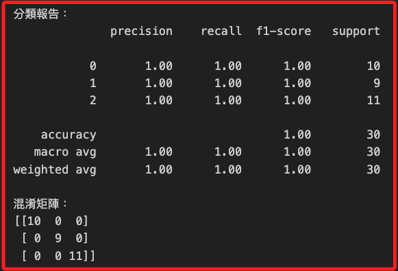
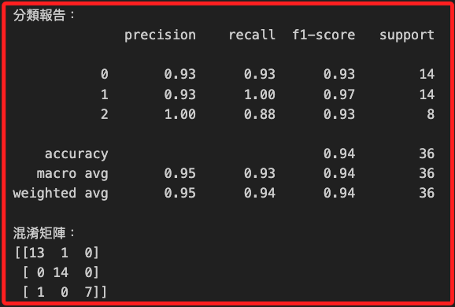
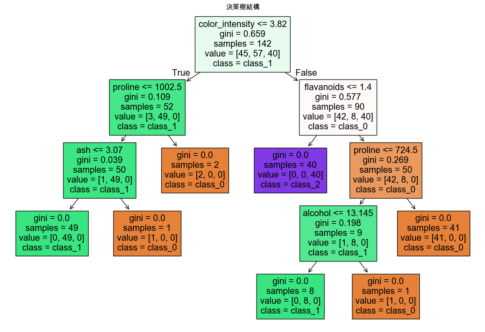
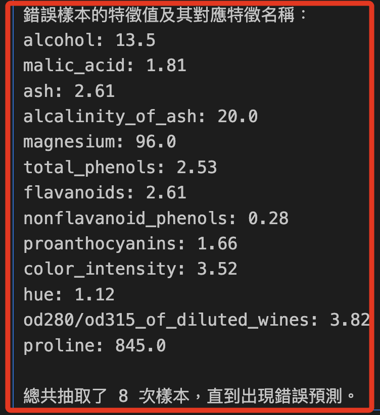

# 決策樹

_決策樹（Decision Tree）是種機器學習演算法，特別適合於 `分類` 和 `迴歸` 問題。它的主要概念是將決策過程表示為一棵樹，其中每個節點代表一個特徵或屬性的測試，每個分支代表測試結果的可能值，而每個葉節點代表分類結果或連續值的預測；以下分別使用 `Iris 數據集`、 `Wine 數據集` 進行訓練。_

<br>

## 說明

1. 決策樹的優勢在於易於理解和解釋，並且能夠處理 `數值型` 和 `類別型` 數據；作業上，這個算法不需對數據進行特別的 `預處理（如歸一化或標準化）`；另外，也能夠處理 `多輸出` 問題。

<br>

2. 然而，決策樹容易 `過度擬合`，所以需要對數據進行 `修剪（pruning）` 或使用其他技術或集成方法來提高泛化能力，例如集成為隨機森林算法，這將在後續說明。

<br>

## 範例

1. 以下使用 `Iris 數據集` 來展示決策樹進行的分類任務。

    ```python
    # 導入Iris數據集
    from sklearn.datasets import load_iris
    # 導入決策樹分類器
    from sklearn.tree import DecisionTreeClassifier
    # 用於分割數據集
    from sklearn.model_selection import train_test_split
    # 用於評估模型性能
    from sklearn.metrics import (
        classification_report, confusion_matrix
    )

    # 加載Iris數據集
    iris = load_iris()
    X, y = iris.data, iris.target

    # 分割數據集為訓練集和測試集，80% 訓練，20% 測試
    X_train, X_test, y_train, y_test = train_test_split(
        X, y,
        test_size=0.2,
        random_state=42
    )

    # 初始化決策樹分類器
    model = DecisionTreeClassifier(random_state=42)

    # 訓練模型
    model.fit(X_train, y_train)

    # 使用模型進行預測
    y_pred = model.predict(X_test)

    # 顯示模型性能評估結果
    print("分類報告：")
    print(classification_report(y_test, y_pred))

    print("混淆矩陣：")
    print(confusion_matrix(y_test, y_pred))
    ```

    

<br>

2. 可通過可視化決策樹來更好地理解模型的決策過程。

    ```python
    from sklearn import tree
    import matplotlib.pyplot as plt

    # 可視化決策樹
    plt.figure(figsize=(12, 8))
    tree.plot_tree(
        model, filled=True, 
        feature_names=iris.feature_names, 
        class_names=iris.target_names
    )
    plt.title("決策樹結構")
    plt.show()
    ```

    


<br>

## 使用決策樹進行分類

1. 接下來使用筆 `Iris 數據集` 更大的 `Wine 數據集` 進一步展示決策樹的應用；這個數據集包含了 `13` 個不同的化學屬性測量數據，用於區分三種不同的葡萄酒類型。

    ```python
    # 導入Wine數據集
    from sklearn.datasets import load_wine
    # 用於分割數據集
    from sklearn.model_selection import train_test_split
    # 導入決策樹分類器
    from sklearn.tree import DecisionTreeClassifier
    # 用於評估模型性能
    from sklearn.metrics import (
        classification_report, confusion_matrix
    )
    from sklearn import tree
    import matplotlib.pyplot as plt

    # 加載數據集
    data = load_wine()
    X = data.data
    y = data.target

    # 分割數據集為訓練集和測試集
    X_train, X_test, y_train, y_test = train_test_split(
        X, y,
        # 比例為80%訓練和20%測試
        test_size=0.2,
        random_state=42
    )

    # 初始化決策樹分類器
    model = DecisionTreeClassifier(
        # 選擇 `gini` 為評價準則
        criterion='gini', 
        # 設定最大深度為4來防止過擬合
        max_depth=4, 
        random_state=42
    )

    # 訓練模型
    model.fit(X_train, y_train)

    # 使用模型進行預測
    y_pred = model.predict(X_test)

    # 評估模型性能
    print("分類報告：")
    print(classification_report(y_test, y_pred))

    print("混淆矩陣：")
    print(confusion_matrix(y_test, y_pred))

    # 可視化決策樹
    plt.figure(figsize=(15, 10))
    tree.plot_tree(
        model, filled=True, 
        feature_names=data.feature_names, 
        class_names=data.target_names
    )
    plt.title("決策樹結構")
    plt.show()
    ```

<br>

2. 報表包含了精確率、召回率、f1分數，其中 `support` 是指每個類別在測試集中出現的真實樣本數，有助於理解模型在每個類別上的性能，特別是在類別不平衡的數據集上，support 對於了解評估指標的可靠性非常重要；例如類別 0 的 support 是 14，表示在測試集中有 14 個實際為類別 0 的樣本，這些 support 值用於計算每個類別的精確率、召回率和 F1 分數

    

<br>

3. 決策樹中有幾個重點說明，每個節點下面的 gini 值表示基尼不純度，用來衡量數據的混合程度，數值越小表明數據越純，當 `gini = 0` 時，節點是完全純的，也就是所有樣本都屬於同一類別，samples 表示在這個節點上有多少樣本，value 表示每個類別在這個節點上的樣本數，class 表示在這個節點上占主導地位的類別，也就是樣本數最多的類別；特別注意，決策樹的深度影響其對數據的擬合能力，當深度越大時模型越複雜，也越容易過擬合。

    

<br>

4. 若要計算正確預測樣本數量佔所有樣本數量的比例，可添加以下代碼。

    ```python
    from sklearn.metrics import accuracy_score

    # 使用測試集的真實標籤 y_test 和模型預測的標籤 y_pred
    accuracy = accuracy_score(y_test, y_pred)
    print(f"整體準確率（Overall Accuracy）: {accuracy:.2f}")
    ```

    _得到結果_

    ```bash
    整體準確率（Overall Accuracy）: 0.94
    ```

<br>

## 驗證模型

1. 隨機選取一個測試集中的樣本，然後使用訓練好的決策樹模型進行預測，藉此觀察模型對該樣本的預測準確性。

    ```python
    import numpy as np

    # 導入Wine數據集
    from sklearn.datasets import load_wine
    # 用於分割數據集
    from sklearn.model_selection import train_test_split
    # 導入決策樹分類器
    from sklearn.tree import DecisionTreeClassifier
    # 用於評估模型性能
    from sklearn.metrics import (
        classification_report, confusion_matrix
    )
    from sklearn import tree
    import matplotlib.pyplot as plt

    # 設定支持中文的字體，避免顯示錯誤
    plt.rcParams['font.sans-serif'] = ['Arial Unicode MS']
    # 用來正常顯示負號
    plt.rcParams['axes.unicode_minus'] = False

    # 加載數據集
    data = load_wine()
    X = data.data
    y = data.target

    # 分割數據集為訓練集和測試集
    X_train, X_test, y_train, y_test = train_test_split(
        X, y,
        # 比例為80%訓練和20%測試
        test_size=0.2,
        random_state=42
    )

    # 初始化決策樹分類器
    model = DecisionTreeClassifier(
        # 選擇 `gini` 為評價準則
        criterion='gini', 
        # 設定最大深度為4來防止過擬合
        max_depth=4, 
        random_state=42
    )

    # 訓練模型
    model.fit(X_train, y_train)

    # 使用模型進行預測
    y_pred = model.predict(X_test)

    # 評估模型性能
    print("分類報告：")
    print(classification_report(y_test, y_pred))

    print("混淆矩陣：")
    print(confusion_matrix(y_test, y_pred))

    # 可視化決策樹
    plt.figure(figsize=(15, 10))
    tree.plot_tree(
        model, filled=True, 
        feature_names=data.feature_names, 
        class_names=data.target_names
    )
    plt.title("決策樹結構")
    plt.show()

    # 隨機選取一個測試樣本進行預測
    sample_index = np.random.randint(0, len(X_test))
    sample = X_test[sample_index].reshape(1, -1)
    true_value = y_test[sample_index]

    # 使用模型進行預測
    predicted_value = model.predict(sample)

    print("\n選取的測試樣本索引:", sample_index)
    print("選取的測試樣本的真實類別:", data.target_names[true_value])
    print("模型預測的類別:", data.target_names[predicted_value[0]])

    # 比較預測值和真實值
    if predicted_value == true_value:
        print("模型預測正確！")
    else:
        print("模型預測錯誤。")
    ```

<br>

2. 結果顯示測試樣本真實類別與模型預測的類別相同 `class_0`，模型預測正確。

    

<br>

## 連續抽取並檢視誤判

1. 優化代碼使其可進行連續抽取驗證，直到出現誤判時停止，並展示樣本的預測結果與真實樣本以利觀察數據特徵，如此可協助理解在什麼樣的數據特徵下模型容易出現誤判，從而進一步調整模型的超參數或進行特徵工程。

    ```python
    import numpy as np
    from sklearn.datasets import load_wine
    from sklearn.model_selection import train_test_split
    from sklearn.tree import DecisionTreeClassifier
    from sklearn.metrics import (
        classification_report, confusion_matrix
    )
    from sklearn import tree
    import matplotlib.pyplot as plt

    # 設定支持中文的字體，避免顯示錯誤
    plt.rcParams['font.sans-serif'] = ['Arial Unicode MS']
    plt.rcParams['axes.unicode_minus'] = False

    # 加載數據集
    data = load_wine()
    X = data.data
    y = data.target

    # 分割數據集為訓練集和測試集
    X_train, X_test, y_train, y_test = train_test_split(
        X, y,
        # 比例為80%訓練和20%測試
        test_size=0.2,
        random_state=42
    )

    # 初始化決策樹分類器
    model = DecisionTreeClassifier(
        # 選擇 `gini` 為評價準則
        criterion='gini',
        # 設定最大深度為4來防止過擬合
        max_depth=4,
        random_state=42
    )

    # 訓練模型
    model.fit(X_train, y_train)

    # 使用模型進行預測
    y_pred = model.predict(X_test)

    # 評估模型性能
    print("分類報告：")
    print(classification_report(y_test, y_pred))

    print("混淆矩陣：")
    print(confusion_matrix(y_test, y_pred))

    # 可視化決策樹
    plt.figure(figsize=(15, 10))
    tree.plot_tree(
        model, filled=True,
        feature_names=data.feature_names,
        class_names=data.target_names
    )
    plt.title("決策樹結構")
    plt.show()

    # 進行隨機抽樣預測直到發生錯誤
    count = 0
    while True:
        # 隨機選取一個測試樣本進行預測
        sample_index = np.random.randint(0, len(X_test))
        sample = X_test[sample_index].reshape(1, -1)
        true_value = y_test[sample_index]

        # 使用模型進行預測
        predicted_value = model.predict(sample)

        print(f"\n第 {count + 1} 次抽樣:")
        print("選取的測試樣本索引:", sample_index)
        print(
            "選取的測試樣本的真實類別:",
            data.target_names[true_value]
        )
        print(
            "模型預測的類別:",
            data.target_names[predicted_value[0]]
        )

        # 比較預測值和真實值
        if predicted_value == true_value:
            print("模型預測正確！")
        else:
            print("模型預測錯誤。")
            
            # 打印出錯誤樣本的數據特徵
            print("\n錯誤樣本的特徵值及其對應特徵名稱：")
            for feature_name, feature_value in zip(
                data.feature_names, sample.flatten()
            ):
                print(f"{feature_name}: {feature_value}")
            # 退出迴圈，因為預測錯誤
            break

        count += 1

    print(f"\n總共抽取了 {count + 1} 次樣本，直到出現錯誤預測。")
    ```

<br>

2. 結果。

    

<br>

___

_END_