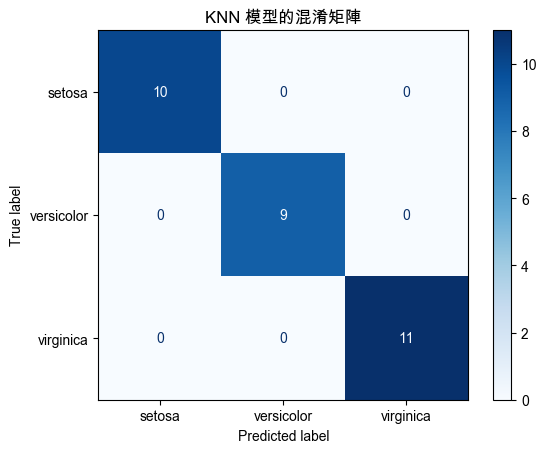

# k-NN

_k-Nearest Neighbors，k 最近鄰算法_

<br>

## 說明

1. k-NN 是一種 `監督式學習` 算法，廣泛用於分類和迴歸問題，也能處理多模態數據。

<br>

2. k-NN 是一種基於實例的學習方法，假定相似的數據點在特徵空間中相互鄰近，算法的核心思想是給定一個新的樣本點，通過計算它與訓練集中所有樣本點的距離，選擇距離最近的 k 個樣本點，根據這些最近鄰的標籤進行分類或取平均值，也就是迴歸線上的點，在預測階段，k-NN 需要計算新樣本與所有訓練樣本的距離，這在大數據集或高維空間中可能會變得非常耗時。

<br>

3. k-NN 是一種簡單且直觀的算法，不需要進行任何參數的學習，只需記住訓練數據集，屬於無參數、非參數化的學習，不依賴於數據的分佈假設，因此適用於各種類型的數據；另外，k-NN 也是一種懶惰學習算法，訓練階段不進行顯式學習，只在需要預測時才計算最近鄰。

<br>

4. k-NN 的缺點是計算成本高，對於大規模數據集，計算所有點之間的距離開銷巨大，所以不適用於高維數據，因為隨著維度的增加，距離度量的有效性會急劇下降，同時也無法處理數據不均衡問題，所以在類別不均衡的情況下，少數類別可能被忽略。

<br>

## 範例

1. 使用 `Iris` 數據集來演示如何使用 k-NN 進行分類。

    ```python
    # 引入所需的庫
    import numpy as np
    import matplotlib.pyplot as plt
    from sklearn.datasets import load_iris
    from sklearn.model_selection import train_test_split
    from sklearn.neighbors import KNeighborsClassifier
    from sklearn.metrics import (
        classification_report, 
        confusion_matrix, 
        ConfusionMatrixDisplay
    )

    # 設定支持中文的字體，避免顯示錯誤
    plt.rcParams['font.sans-serif'] = ['Arial Unicode MS']
    plt.rcParams['axes.unicode_minus'] = False

    # 加載數據集
    data = load_iris()
    X = data.data
    y = data.target

    # 將數據集拆分為訓練集和測試集
    X_train, X_test, y_train, y_test = train_test_split(
        X, y, 
        test_size=0.2, 
        random_state=42
    )

    # 初始化 k-NN 分類器，設置最近鄰居數量為 5
    knn = KNeighborsClassifier(n_neighbors=5)

    # 訓練模型
    knn.fit(X_train, y_train)

    # 使用訓練好的模型進行預測
    y_pred = knn.predict(X_test)

    # 計算混淆矩陣
    cm = confusion_matrix(y_test, y_pred)

    # 可視化混淆矩陣
    disp = ConfusionMatrixDisplay(
        confusion_matrix=cm, 
        display_labels=data.target_names
    )
    disp.plot(cmap=plt.cm.Blues)
    plt.title('k-NN 模型的混淆矩陣')
    plt.show()

    # 計算分類報告
    report = classification_report(
        y_test, y_pred, 
        target_names=data.target_names
    )
    print("分類報告：")
    print(report)
    ```

<br>

2. 混淆矩陣。

    

<br>

3. 報表。

    

<br>

## 數據分佈

_展示 k-NN 的數據分佈和分類過程_

<br>

1. 同樣使用 Wine 數據集進行 k-NN 分析和可視化。

    ```python
    # 引入所需的庫
    import numpy as np
    import matplotlib.pyplot as plt
    from sklearn.datasets import load_wine
    from sklearn.model_selection import train_test_split
    from sklearn.neighbors import KNeighborsClassifier
    from sklearn.metrics import (
        confusion_matrix,
        classification_report
    )
    from matplotlib.colors import ListedColormap

    # 加載Wine數據集
    data = load_wine()
    # 為簡化可視化，我們只使用前兩個特徵
    X = data.data[:, :2]
    y = data.target

    # 將數據集劃分為訓練集和測試集
    X_train, X_test, y_train, y_test = train_test_split(
        X, y, 
        test_size=0.3, random_state=42
    )

    # 創建k-NN分類器，這裡我們設置k=3
    knn = KNeighborsClassifier(n_neighbors=3)
    knn.fit(X_train, y_train)

    # 預測測試集
    y_pred = knn.predict(X_test)

    # 繪製數據分佈和分類邊界
    # 邊界的步長
    h = .02

    # 創建顏色映射
    cmap_light = ListedColormap(['#FFAAAA', '#AAFFAA', '#AAAAFF'])
    cmap_bold = ListedColormap(['#FF0000', '#00FF00', '#0000FF'])

    # 計算邊界
    x_min, x_max = X[:, 0].min() - 1, X[:, 0].max() + 1
    y_min, y_max = X[:, 1].min() - 1, X[:, 1].max() + 1
    xx, yy = np.meshgrid(np.arange(x_min, x_max, h),
                        np.arange(y_min, y_max, h))

    # 預測所有點的分類
    Z = knn.predict(np.c_[xx.ravel(), yy.ravel()])
    Z = Z.reshape(xx.shape)

    # 繪製邊界
    plt.figure(figsize=(8, 6))
    plt.contourf(xx, yy, Z, cmap=cmap_light)

    # 繪製訓練點和測試點
    plt.scatter(
        X_train[:, 0], X_train[:, 1], 
        c=y_train, cmap=cmap_bold, 
        edgecolor='k', 
        s=20, label='訓練數據'
    )
    plt.scatter(
        X_test[:, 0], X_test[:, 1], 
        c=y_pred, cmap=cmap_bold, 
        edgecolor='k', 
        marker='x', 
        s=50, label='測試數據'
    )

    # 設置圖形標題和標籤
    plt.title('k-NN 數據分佈與分類邊界（k=3）')
    plt.xlabel('特徵 1')
    plt.ylabel('特徵 2')
    plt.legend()
    plt.show()

    # 打印混淆矩陣和分類報告
    cm = confusion_matrix(y_test, y_pred)
    print("混淆矩陣：\n", cm)
    print("\n分類報告：\n", classification_report(y_test, y_pred))
    ```

<br>

2. 分佈圖。

    

<br>

3. 添加混淆矩陣；`類別 1` 具有最高的正確預測率（17/21），`類別 2` 的誤判率相對較高（3 個誤判），特別是被錯誤預測為類別 0 和類別 1 的情況，`類別 0` 被錯誤預測為類別 2 的次數較多，這可能表明這兩個類別之間的樣本有一定的重疊或模型在這些特徵上難以區分。

    ```python
    import seaborn as sns

    # 繪製混淆矩陣
    plt.figure(figsize=(8, 6))
    sns.heatmap(
        cm,
        # 確保單元格顯示為數字
        annot=True,
        # 確保單元格的數字顯示為整數
        fmt="d",
        cmap="Blues", cbar=False,
        xticklabels=data.target_names,
        yticklabels=data.target_names
    )
    plt.title('k-NN 模型的混淆矩陣')
    plt.xlabel('預測類別')
    plt.ylabel('真實類別')
    plt.show()
    ```

<br>

4. 可視化混淆矩陣考。

    

<br>

___

_END_