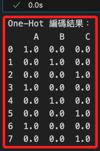
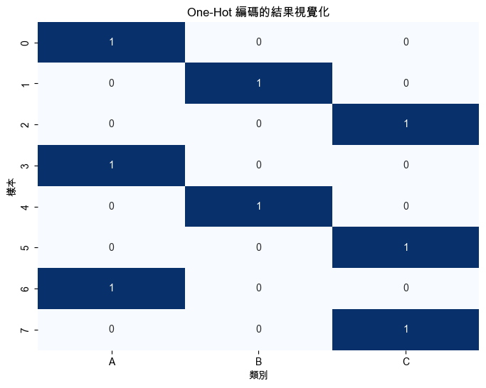

# One-Hot 編碼

<br>

## 說明

1. `One-Hot 編碼` 是一種將 `類別型變量` 轉換為 `數值型表示` 的方法，它將每個類別值映射為一個 `二進制向量`，其中只有一個位置為 `1`，其他位置為 `0`。

<br>

2. 這種方式在機器學習模型中特別有用，因為模型通常只能接受數值輸入，不能直接處理類別型變量。

<br>

3. 舉例說，假設有三個類別 `['A', 'B', 'C']`，使用 `One-Hot 編碼` 後，`A` 變為 `[1, 0, 0]`、`B` 變為 `[0, 1, 0]`、`C` 變為 `[0, 0, 1]`。

<br>

## 範例

1. 以下範例使用 `Scikit-learn` 進行 `One-Hot 編碼`，使用 `OneHotEncoder` 將類別數據轉換為二進制向量表示，然後使用 `Seaborn` 繪製編碼結果的熱力圖。

    ```python
    import numpy as np
    import pandas as pd
    import matplotlib.pyplot as plt
    import seaborn as sns
    from sklearn.preprocessing import OneHotEncoder

    # 設定支持中文的字體，避免顯示錯誤
    plt.rcParams['font.sans-serif'] = ['Arial Unicode MS']
    # 用來正常顯示負號
    plt.rcParams['axes.unicode_minus'] = False

    # 模擬一個類別數據集
    categories = np.array([
        'A', 'B', 'C', 'A', 'B', 'C', 'A', 'C'
    ]).reshape(-1, 1)

    # 建立 One-Hot 編碼器
    encoder = OneHotEncoder(sparse_output=False)

    # 將類別數據進行 One-Hot 編碼
    one_hot_encoded = encoder.fit_transform(categories)

    # 將編碼後的結果轉換為 DataFrame，方便展示
    df_one_hot = pd.DataFrame(
        one_hot_encoded,
        columns=encoder.categories_[0]
    )

    # 輸出 One-Hot 編碼結果
    print("One-Hot 編碼結果：")
    print(df_one_hot)

    # 可視化編碼結果
    plt.figure(figsize=(8, 6))
    sns.heatmap(
        df_one_hot, annot=True,
        cmap='Blues', cbar=False
    )
    plt.title('One-Hot 編碼的結果視覺化')
    plt.xlabel('類別')
    plt.ylabel('樣本')
    plt.show()
    ```

<br>

2. 編碼結果。

    

<br>

3. 熱力圖。

    

<br>

___

_END_