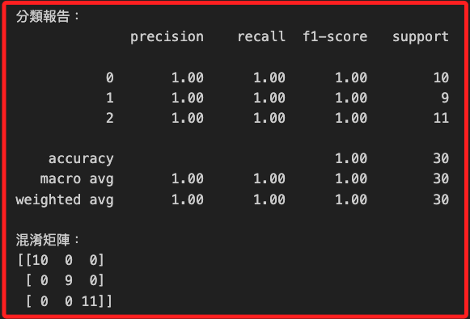
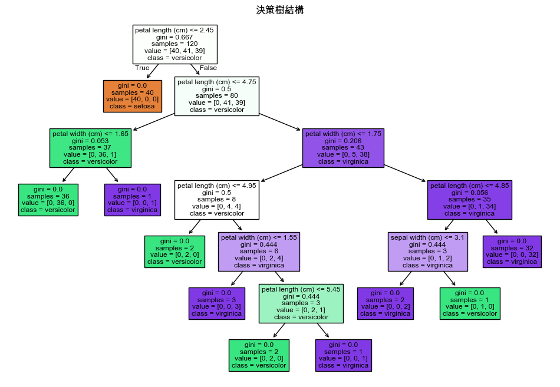
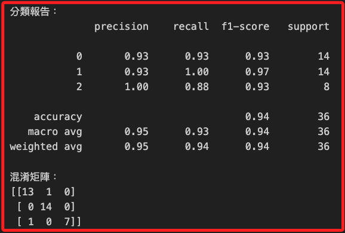
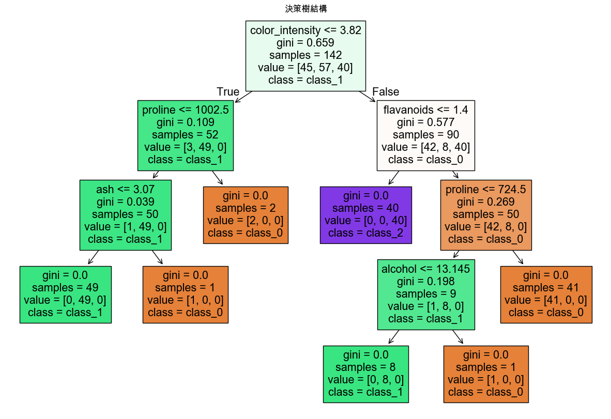

# 決策樹

_決策樹（Decision Tree）是一種常用的機器學習演算法，特別適合於分類和迴歸問題。它的主要概念是將決策過程表示為一棵樹，其中每個節點代表一個特徵或屬性的測試，每個分支代表測試結果的可能值，而每個葉節點代表分類結果或連續值的預測。_

<br>

## 說明

1. 決策樹的優勢在於易於理解和解釋，並且能夠處理數值型和類別型數據。它還不需要對數據進行特別的預處理（如歸一化或標準化），並且能夠處理多輸出問題。

<br>

2. 然而，決策樹容易過度擬合，因此通常需要修剪（pruning）或使用其他技術（如隨機森林或集成方法）來提高泛化能力。

<br>

## 範例

1. 以下使用著名的 `Iris 數據集` 來展示如何使用決策樹進行分類任務。

    ```python
    # 導入Iris數據集
    from sklearn.datasets import load_iris
    # 導入決策樹分類器
    from sklearn.tree import DecisionTreeClassifier
    # 用於分割數據集
    from sklearn.model_selection import train_test_split
    # 用於評估模型性能
    from sklearn.metrics import (
        classification_report, confusion_matrix
    )

    # 加載Iris數據集
    iris = load_iris()
    X, y = iris.data, iris.target

    # 分割數據集為訓練集和測試集，80% 訓練，20% 測試
    X_train, X_test, y_train, y_test = train_test_split(
        X, y, test_size=0.2, random_state=42
    )

    # 初始化決策樹分類器
    model = DecisionTreeClassifier(random_state=42)

    # 訓練模型
    model.fit(X_train, y_train)

    # 使用模型進行預測
    y_pred = model.predict(X_test)

    # 顯示模型性能評估結果
    print("分類報告：")
    print(classification_report(y_test, y_pred))

    print("混淆矩陣：")
    print(confusion_matrix(y_test, y_pred))
    ```

    

<br>

2. 可通過可視化決策樹來更好地理解模型的決策過程。

    ```python
    from sklearn import tree
    import matplotlib.pyplot as plt

    # 可視化決策樹
    plt.figure(figsize=(12, 8))
    tree.plot_tree(
        model, filled=True, 
        feature_names=iris.feature_names, 
        class_names=iris.target_names
    )
    plt.title("決策樹結構")
    plt.show()
    ```

    

<br>

## 使用決策樹進行分類

1. 接下來將使用更大的 `Wine` 數據集來進一步展示決策樹的應用；這個數據集包含了 `13` 個不同的化學屬性測量數據，用於區分三種不同的葡萄酒類型。

    ```python
    # 導入Wine數據集
    from sklearn.datasets import load_wine
    # 用於分割數據集
    from sklearn.model_selection import train_test_split
    # 導入決策樹分類器
    from sklearn.tree import DecisionTreeClassifier
    # 用於評估模型性能
    from sklearn.metrics import (
        classification_report, confusion_matrix
    )
    from sklearn import tree
    import matplotlib.pyplot as plt

    # 加載數據集
    data = load_wine()
    X = data.data
    y = data.target

    # 分割數據集為訓練集和測試集
    X_train, X_test, y_train, y_test = train_test_split(
        X, y,
        # 比例為80%訓練和20%測試
        test_size=0.2,
        random_state=42
    )

    # 初始化決策樹分類器
    model = DecisionTreeClassifier(
        # 選擇 `gini` 為評價準則
        criterion='gini', 
        # 設定最大深度為4來防止過擬合
        max_depth=4, 
        random_state=42
    )

    # 訓練模型
    model.fit(X_train, y_train)

    # 使用模型進行預測
    y_pred = model.predict(X_test)

    # 評估模型性能
    print("分類報告：")
    print(classification_report(y_test, y_pred))

    print("混淆矩陣：")
    print(confusion_matrix(y_test, y_pred))

    # 可視化決策樹
    plt.figure(figsize=(15, 10))
    tree.plot_tree(
        model, filled=True, 
        feature_names=data.feature_names, 
        class_names=data.target_names
    )
    plt.title("決策樹結構")
    plt.show()
    ```

<br>

2. 報表包含了精確率、召回率、f1分數，其中 `support` 是指每個類別在測試集中出現的真實樣本數，有助於理解模型在每個類別上的性能，特別是在類別不平衡的數據集上，support 對於了解評估指標的可靠性非常重要；例如類別 0 的 support 是 14，表示在測試集中有 14 個實際為類別 0 的樣本，這些 support 值用於計算每個類別的精確率、召回率和 F1 分數

    

<br>

3. 決策樹中有幾個重點說明，每個節點下面的 gini 值表示基尼不純度，用來衡量數據的混合程度，數值越小表明數據越純，當 `gini = 0` 時，節點是完全純的，也就是所有樣本都屬於同一類別，samples 表示在這個節點上有多少樣本，value 表示每個類別在這個節點上的樣本數，class 表示在這個節點上占主導地位的類別，也就是樣本數最多的類別；特別注意，決策樹的深度影響其對數據的擬合能力，當深度越大時模型越複雜，也越容易過擬合。

    

<br>

4. 若要計算正確預測樣本數量佔所有樣本數量的比例，可添加以下代碼。

    ```python
    from sklearn.metrics import accuracy_score

    # 使用測試集的真實標籤 y_test 和模型預測的標籤 y_pred
    accuracy = accuracy_score(y_test, y_pred)
    print(f"整體準確率（Overall Accuracy）: {accuracy:.2f}")
    ```

    _得到結果_

    ```bash
    整體準確率（Overall Accuracy）: 0.94
    ```

<br>

___

_END_