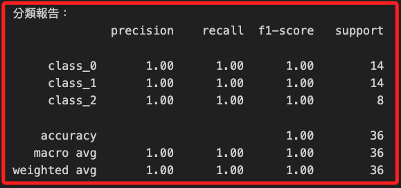

# 隨機森林（Random Forest）

_隨機森林是一種集成學習方法（Ensemble Learning Method），通過對多棵樹的預測進行平均（回歸）或投票（分類）來提高模型的準確性和穩定性_

<br>

## 說明

1. 隨機森林通過訓練多棵決策樹並結合它們的輸出結果來提高模型的穩定性和預測能力。每棵樹在分裂節點時，隨機選擇特徵進行分裂，這樣可以降低模型的偏差並減少過擬合。

<br>

2. 隨機森林可以應用於回歸和分類任務，並且可以處理多維數據，相比其他算法，隨機森林的參數調整較為簡單，主要是樹的數量和最大深度。

<br>

3. 由於隨機森林是基於多棵決策樹的集成，因此對於異常值和噪聲數據具有更強的抵抗能力。

<br>

4. 隨機森林的缺點主要是計算成本高，這是因為需要構建大量的決策樹，計算開銷較大；另外，由於是多棵樹的集成，難以解釋每個單獨的預測，模型解釋性較低。

<br>

## 範例

1. 以下範例使用 `wine` 數據集來演示如何使用隨機森林進行分類。

    ```python
    # 引入所需的庫
    import numpy as np
    import matplotlib.pyplot as plt
    from sklearn.datasets import load_wine
    from sklearn.model_selection import train_test_split
    from sklearn.ensemble import RandomForestClassifier
    from sklearn.metrics import (
        classification_report, 
        confusion_matrix, 
        ConfusionMatrixDisplay, 
        accuracy_score
    )

    # 設定支持中文的字體，避免顯示錯誤
    plt.rcParams['font.sans-serif'] = ['Arial Unicode MS']
    plt.rcParams['axes.unicode_minus'] = False

    # 加載數據集
    data = load_wine()
    X = data.data
    y = data.target

    # 將數據集拆分為訓練集和測試集，分成訓練集80%和測試集20%
    X_train, X_test, y_train, y_test = train_test_split(
        X, y, 
        test_size=0.2, random_state=42
    )

    # 初始化隨機森林分類器
    model = RandomForestClassifier(
        # 設置樹的數量為 100
        n_estimators=100, 
        random_state=42
    )

    # 訓練模型
    model.fit(X_train, y_train)

    # 使用訓練好的模型進行預測
    y_pred = model.predict(X_test)

    # 計算混淆矩陣
    cm = confusion_matrix(y_test, y_pred)

    # 可視化混淆矩陣
    disp = ConfusionMatrixDisplay(
        confusion_matrix=cm, 
        display_labels=data.target_names
    )
    disp.plot(cmap=plt.cm.Blues)
    plt.title('隨機森林模型的混淆矩陣')
    plt.show()

    # 計算分類報告
    report = classification_report(
        y_test, y_pred, 
        target_names=data.target_names
    )
    print("分類報告：")
    print(report)

    # 計算整體準確率
    accuracy = accuracy_score(y_test, y_pred)
    print(f"整體準確率（Overall Accuracy）: {accuracy:.2f}")

    # 顯示特徵的重要性
    feature_importances = model.feature_importances_
    indices = np.argsort(feature_importances)[::-1]
    print("特徵的重要性排序：")
    for f in range(X.shape[1]):
        print(
            f"{data.feature_names[indices[f]]}:"
            f" {feature_importances[indices[f]]:.4f}"
        )

    # 可視化特徵的重要性
    plt.figure(figsize=(10, 6))
    plt.title('特徵的重要性')
    plt.bar(
        range(X.shape[1]), 
        feature_importances[indices], 
        color='b', 
        align='center'
    )
    plt.xticks(range(X.shape[1]), [data.feature_names[i] for i in indices], rotation=90)
    plt.xlabel('特徵')
    plt.ylabel('重要性分數')
    plt.grid(True)
    plt.show()
    ```

<br>

2. 從輸出混淆矩陣可見模型對於所有類別的分類都是 100% 正確的。

    

<br>

3. 輸出報表，其中每個類別的支持數（support）表示每個類別中的實際數據點數量，其中 class_0 和 class_1 的支持數都是 `14`，而 class_2 是 `8`，分類報告中的所有評估指標也都達到了1.00，表示模型完美地分類了所有的數據點；然而這種完美的結果在現實數據集上並不常見，可能需要進一步的模型驗證或交叉驗證來確認模型的穩定性和泛化能力。

    

<br>

4. 特徵的重要性排序圖示。

    

<br>

___

_END_