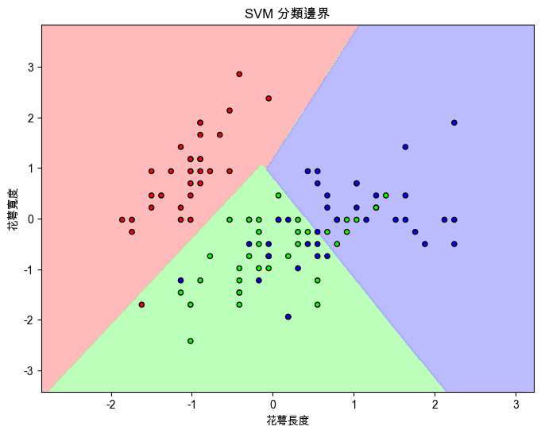
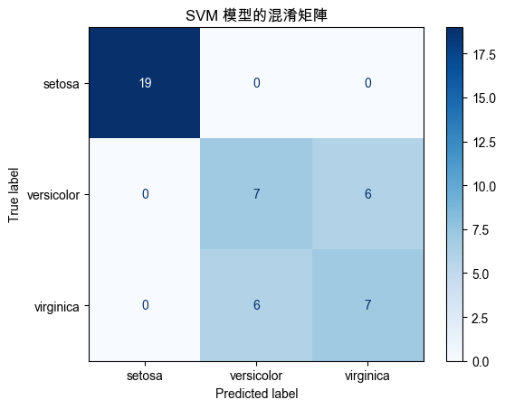
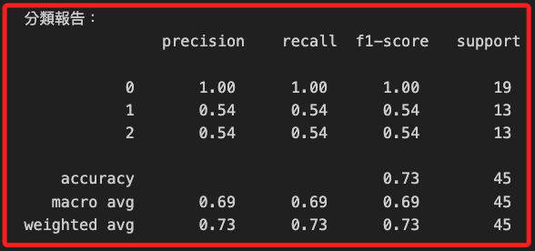

# SVM

_Support Vector Machine，支持向量機_

<br>

## 說明

1. SVM 是一種 `監督學習` 算法，主要用於 `分類` 和 `回歸分析`，主要思想是找到一條最佳的分隔超平面，使得不同類別之間的間隔最大化，這種最大化間隔的方法可使模型對新數據具有更好的泛化能力。

<br>

2. SVM 不僅可以進行線性分類，還可以通過核函數，如多項式核、RBF 核等進行非線性分類。

<br>

## 範例

1. 使用 `Iris 數據集` 進行 `SVM 分析`，Iris 數據集包含三種不同的 Iris 花 `（Setosa、Versicolour 和 Virginica）` 的四個特徵 `（花萼長度、花萼寬度、花瓣長度、花瓣寬度）`，以下範例將使用前兩個特徵進行可視化。

    ```python
    # 引入所需的庫
    import numpy as np
    import matplotlib.pyplot as plt
    from sklearn import datasets
    from sklearn.model_selection import train_test_split
    from sklearn.svm import SVC
    from sklearn.metrics import (
        classification_report,
        confusion_matrix,
        accuracy_score,
        ConfusionMatrixDisplay
    )
    from sklearn.preprocessing import StandardScaler
    from matplotlib.colors import ListedColormap

    # 設定支持中文的字體，避免顯示錯誤
    plt.rcParams['font.sans-serif'] = ['Arial Unicode MS']
    plt.rcParams['axes.unicode_minus'] = False

    # 加載 Iris 數據集
    iris = datasets.load_iris()
    # 為簡化可視化，使用前兩個特徵：花萼長度和花萼寬度
    X = iris.data[:, :2]
    y = iris.target

    # 將數據集劃分為訓練集和測試集
    X_train, X_test, y_train, y_test = train_test_split(
        X, y,
        test_size=0.3,
        random_state=42
    )

    # 標準化數據
    scaler = StandardScaler()
    X_train = scaler.fit_transform(X_train)
    X_test = scaler.transform(X_test)

    # 創建 SVM 模型，使用線性核函數
    svm_model = SVC(
        kernel='linear', 
        C=1.0, 
        random_state=42
    )
    svm_model.fit(X_train, y_train)

    # 預測測試集
    y_pred = svm_model.predict(X_test)

    # 可視化 SVM 分類邊界
    def plot_decision_boundary(X, y, model):
        # 設置顏色映射
        cmap_light = ListedColormap(['#FFAAAA', '#AAFFAA', '#AAAAFF'])
        cmap_bold = ListedColormap(['#FF0000', '#00FF00', '#0000FF'])

        # 設置圖的邊界
        x_min, x_max = X[:, 0].min() - 1, X[:, 0].max() + 1
        y_min, y_max = X[:, 1].min() - 1, X[:, 1].max() + 1
        xx, yy = np.meshgrid(
            np.arange(x_min, x_max, 0.02),
            np.arange(y_min, y_max, 0.02)
        )

        # 預測所有點的分類
        Z = model.predict(np.c_[xx.ravel(), yy.ravel()])
        Z = Z.reshape(xx.shape)

        # 繪製分界面
        plt.figure(figsize=(8, 6))
        plt.contourf(
            xx, yy, Z,
            cmap=cmap_light,
            alpha=0.8
        )
        plt.scatter(
            X[:, 0], X[:, 1], 
            c=y, 
            cmap=cmap_bold, 
            edgecolor='k',
            s=20
        )
        plt.title('SVM 分類邊界')
        plt.xlabel('花萼長度')
        plt.ylabel('花萼寬度')
        plt.show()

    # 繪製決策邊界
    plot_decision_boundary(X_train, y_train, svm_model)

    # 計算整體準確率
    overall_accuracy = accuracy_score(y_test, y_pred)
    print(
        f"\n整體準確率（Overall Accuracy）:"
        f" {overall_accuracy:.2f}"
    )

    # 繪製混淆矩陣
    cm = confusion_matrix(y_test, y_pred)
    disp = ConfusionMatrixDisplay(
        confusion_matrix=cm,
        display_labels=iris.target_names
    )
    disp.plot(cmap=plt.cm.Blues)
    plt.title('SVM 模型的混淆矩陣')
    plt.show()

    # 打印分類報告
    print("\n分類報告：\n", classification_report(y_test, y_pred))
    ```

<br>

2. 分類邊界圖，圖中不同顏色的區域表示 SVM 模型劃分的不同類別的區域，`紅、綠、藍` 色區域分別表示類別 `0、1、2`，SVM 的目標是找到一條或多條超平面，使得不同類別的數據點在超平面的不同側，並且最大化類別間的間隔，其中每個點的顏色表示該樣本的真實類別，點落在不同顏色的區域內表示該樣本被分類到相應的類別。

    

<br>

3. 混淆矩陣。

    

<br>

4. 分類報表。

    

<br>

___

_END_