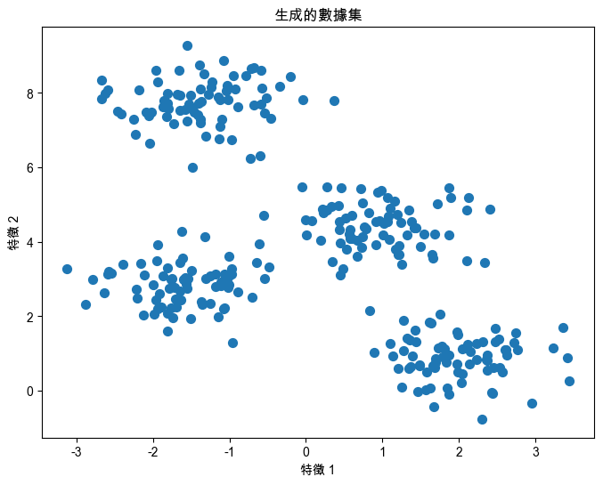
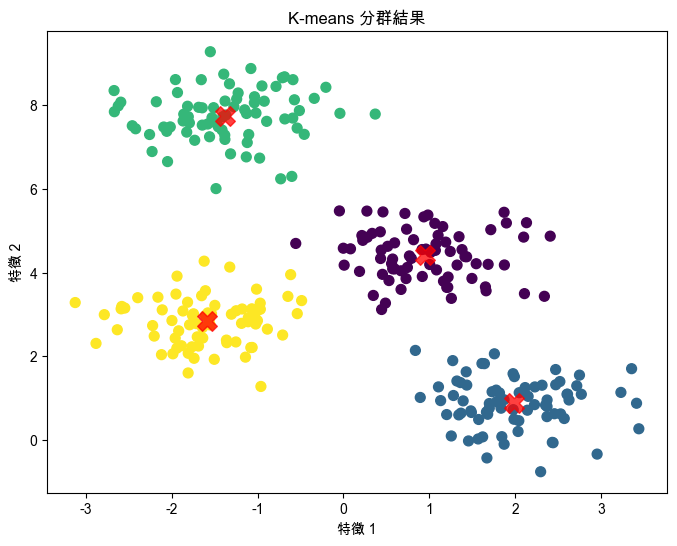
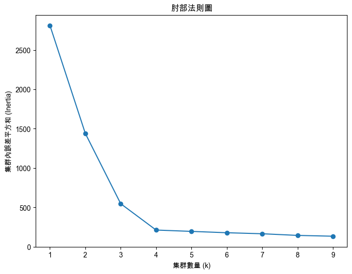
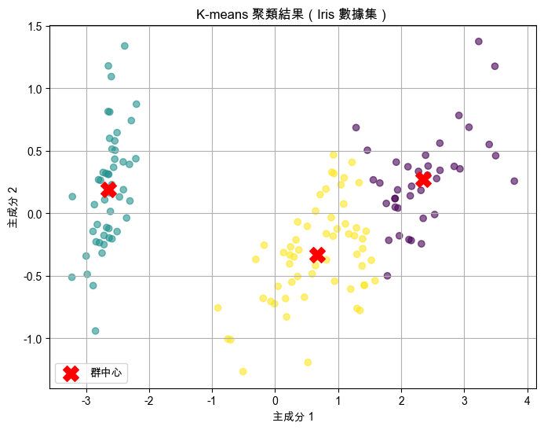
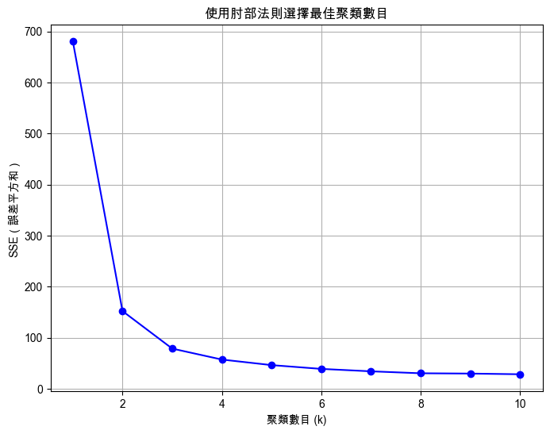
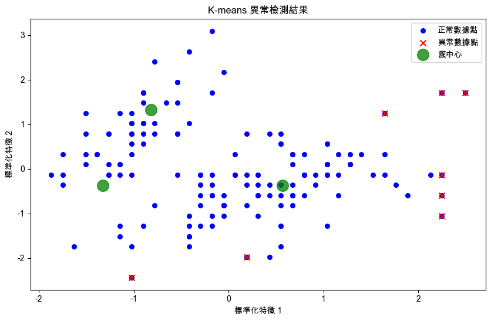
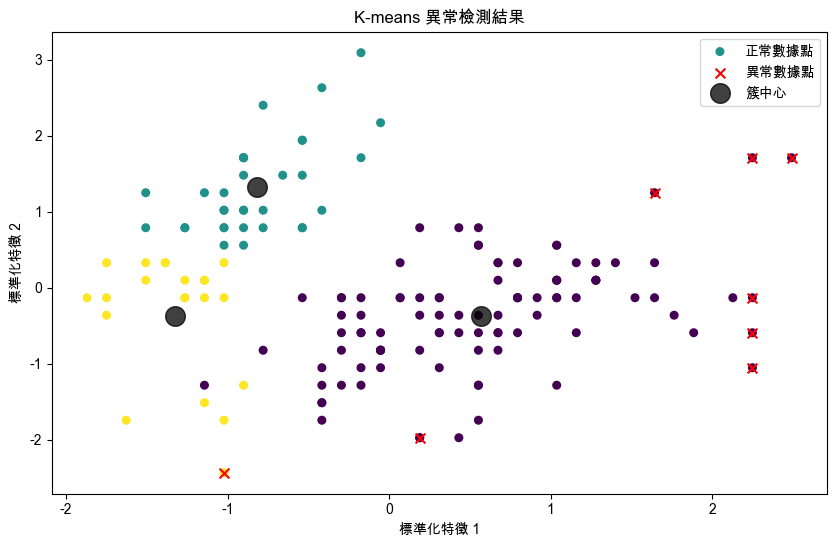

# K-means

<br>

## 說明

1. `K-means` 是一種非監督式學習演算法，用於將數據集分成 $(k)$ 個 Clusters，稱為簇或集群。

<br>

2. 演算法的目的是最小化集群內點到各自集群中心的距離平方和。

<br>

## 步驟

_反覆執行直到收斂_

<br>

1. 隨機選擇 $(k)$ 個初始中心點。

<br>

2. 將每個數據點指派到離它最近的中心點，形成 $(k)$ 個集群。

<br>

3. 計算每個集群的新中心點，即集群內所有點的平均值。

<br>

4. 如果中心點不再變動或變動很小，則演算法收斂，否則返回步驟 2。

<br>

## 範例

1. 以下範例使用 `sklearn` 提供的常用數據集來演示 K-means 的範例程式碼。

    ```python
    # 匯入所需的庫
    import numpy as np
    import matplotlib.pyplot as plt
    from sklearn.datasets import make_blobs
    from sklearn.cluster import KMeans

    # 設定支持中文的字體，避免顯示錯誤
    plt.rcParams['font.sans-serif'] = ['Arial Unicode MS']
    plt.rcParams['axes.unicode_minus'] = False

    # 生成數據集
    # 使用 make_blobs 生成樣本數據集
    X, y = make_blobs(
        # 總樣本數
        n_samples=300,
        # 集群的數量
        centers=4,
        # 集群內點的標準差
        cluster_std=0.60,
        # 隨機種子
        random_state=0
    )

    # 視覺化生成的數據集
    plt.figure(figsize=(8, 6))
    # 繪製數據點
    plt.scatter(X[:, 0], X[:, 1], s=50)
    # 圖片標題
    plt.title('生成的數據集')
    # x 軸標題
    plt.xlabel('特徵 1')
    # y 軸標題
    plt.ylabel('特徵 2')
    plt.show()

    # 初始化 K-means 演算法
    # n_clusters: 集群的數量
    # random_state: 隨機種子
    kmeans = KMeans(n_clusters=4, random_state=0)

    # 訓練模型，將數據集分成 4 個集群
    kmeans.fit(X)

    # 預測每個數據點的集群標籤
    y_kmeans = kmeans.predict(X)

    # 繪製 K-means 分群結果
    plt.figure(figsize=(8, 6))
    plt.scatter(
        # 根據集群標籤為每個點上色
        X[:, 0], X[:, 1], 
        c=y_kmeans, 
        s=50, 
        cmap='viridis'
    )

    # 繪製集群中心點
    # 獲取集群中心點
    centers = kmeans.cluster_centers_
    plt.scatter(
        # 標記集群中心點
        centers[:, 0], centers[:, 1], 
        c='red', 
        s=200, 
        alpha=0.75, 
        marker='X'
    )

    # 圖片標題
    plt.title('K-means 分群結果')
    plt.xlabel('特徵 1')
    plt.ylabel('特徵 2')
    plt.show()

    # 評估 K-means 模型
    # 獲取集群內誤差平方和
    inertia = kmeans.inertia_
    print(f"集群內誤差平方和 (Inertia): {inertia:.2f}")

    # 使用 "肘部法則" 來選擇最佳集群數量
    # 初始化誤差平方和列表
    inertia_list = []
    for k in range(1, 10):
        kmeans = KMeans(
            n_clusters=k, random_state=0
        )
        kmeans.fit(X)
        inertia_list.append(kmeans.inertia_)

    # 繪製 "肘部法則" 圖表
    plt.figure(figsize=(8, 6))
    # 繪製誤差平方和變化圖
    plt.plot(range(1, 10), inertia_list, marker='o')
    plt.title('肘部法則圖')
    plt.xlabel('集群數量 (k)')
    plt.ylabel('集群內誤差平方和 (Inertia)')
    plt.show()
    ```

<br>

2. 生成的集群樣本分佈。

    

<br>

3. 集群分類的結果。

    

<br>

4. 以 `肘部法（Elbow Method）` 進行繪圖，其中 X 軸代表 K 值，Y 軸代表集群內誤差平方和，也就是 `Inertia`，隨著 K 值的增加，Inertia 會逐漸減小，因為越是細分，每個集群內部成員距離該群中心點也會更近；當 K 值增加到一個合適程度時，Inertia 的下降速度會減緩，圖形呈現類似於成 `肘部` 而以此命名。

    

<br>

## 使用數據集

_適合用於 K-means 演算法進行聚類分析的數據集很多，例如 `Iris（鳶尾花）數據集`、`Wine（葡萄酒）數據集`和 `Mall Customer Segmentation Data` 等。_

<br>

1. 以下使用 `Iris 數據集` 作為範例來進行 K-means 分析。

    ```python
    # 匯入必要的庫
    import numpy as np
    import matplotlib.pyplot as plt
    from sklearn.datasets import load_iris
    from sklearn.cluster import KMeans
    from sklearn.decomposition import PCA

    # 設定支持中文的字體，避免顯示錯誤
    plt.rcParams['font.sans-serif'] = ['Arial Unicode MS']
    plt.rcParams['axes.unicode_minus'] = False

    # 加載 Iris 數據集
    iris = load_iris()
    # 獲取數據的特徵
    X = iris.data
    # 獲取數據的標籤
    y = iris.target

    # 使用主成份法(PCA)將數據降至 2 維，方便可視化
    pca = PCA(2)
    X_pca = pca.fit_transform(X)

    # 使用 K-means 演算法進行聚類分析，假設聚類數為 3
    kmeans = KMeans(
        n_clusters=3, random_state=42
    )
    kmeans.fit(X_pca)

    # 獲取 K-means 演算法的聚類標籤
    y_kmeans = kmeans.labels_

    # 繪製數據的散佈圖，根據 K-means 的聚類標籤進行著色
    plt.figure(figsize=(8, 6))
    plt.scatter(
        X_pca[:, 0], X_pca[:, 1], 
        c=y_kmeans, 
        cmap='viridis', 
        alpha=0.6
    )
    plt.scatter(
        kmeans.cluster_centers_[:, 0], 
        kmeans.cluster_centers_[:, 1], 
        s=200, 
        c='red', 
        marker='X',
        label='群中心'
    )
    plt.xlabel('主成分 1')
    plt.ylabel('主成分 2')
    plt.title('K-means 聚類結果（Iris 數據集）')
    plt.legend()
    plt.grid(True)
    plt.show()

    # 使用肘部法則選擇最佳的聚類數目
    # 存儲每個聚類數目下的 SSE（Sum of Squared Errors）
    sse = []
    for k in range(1, 11):
        kmeans = KMeans(
            n_clusters=k, random_state=42
        )
        kmeans.fit(X)
        sse.append(kmeans.inertia_)

    # 繪製 SSE 與聚類數目的關係圖（肘部法則圖）
    plt.figure(figsize=(8, 6))
    plt.plot(
        range(1, 11), sse, 
        marker='o', 
        linestyle='-', 
        color='b'
    )
    plt.xlabel('聚類數目 (k)')
    plt.ylabel('SSE（誤差平方和）')
    plt.title('使用肘部法則選擇最佳聚類數目')
    plt.grid(True)
    plt.show()
    ```

<br>

3. 分群的結果。

    

<br>

4. 肘部法結果圖示，似乎可添加一個類。

    

<br>

## K-means 進行異常檢測

_K-means 是一種聚類算法，通常用於將數據集劃分為 K 個簇（clusters）；而在異常檢測中，假設大多數數據點會形成密集的簇，而那些遠離所有簇中心的數據點可被視為異常點。_

<br>

1. 同樣使用 `Iris 數據集` 來展示 `K-means 進行異常檢測`，特別說明，Iris 數據集主要是用於分類，但可通過聚類的方法來檢測異常點。

    ```python
    import numpy as np
    import matplotlib.pyplot as plt
    from sklearn.cluster import KMeans
    from sklearn.datasets import load_iris
    from sklearn.preprocessing import StandardScaler

    # 設定支持中文的字體，避免顯示錯誤
    plt.rcParams['font.sans-serif'] = ['Arial Unicode MS']
    # 用來正常顯示負號
    plt.rcParams['axes.unicode_minus'] = False

    # 加載 Iris 數據集
    data = load_iris()
    X = data.data

    # 標準化數據
    scaler = StandardScaler()
    X_scaled = scaler.fit_transform(X)

    # 查看數據集形狀
    print(f"數據集形狀: {X.shape}")

    # 設置 K-means 模型，將數據分成 3 個簇
    kmeans = KMeans(
        n_clusters=3, random_state=42
    )
    kmeans.fit(X_scaled)

    # 獲取每個數據點距離最近簇中心的距離
    distances = kmeans.transform(X_scaled).min(axis=1)

    # 設置距離的閾值（可以通過觀察數據決定）
    # 假設前 95% 為正常點，其餘為異常點
    threshold = np.percentile(distances, 95)

    # 標記異常點
    anomalies = distances > threshold
    print(f"檢測到的異常數據點數量: {anomalies.sum()}")

    # 可視化 K-means 聚類結果和異常點
    plt.figure(figsize=(10, 6))
    plt.scatter(
        X_scaled[:, 0], X_scaled[:, 1], 
        c='b', s=30, 
        label='正常數據點'
    )
    plt.scatter(
        X_scaled[anomalies, 0], X_scaled[anomalies, 1], 
        c='r', s=50, 
        label='異常數據點', marker='x'
    )

    # 繪製簇中心
    centers = kmeans.cluster_centers_
    plt.scatter(
        centers[:, 0], centers[:, 1], c='g', 
        s=200, alpha=0.75, marker='o', 
        label='簇中心'
    )

    plt.title('K-means 異常檢測結果')
    plt.xlabel('標準化特徵 1')
    plt.ylabel('標準化特徵 2')
    plt.legend()
    plt.show()
    ```

<br>

2. 結果顯示。

    

<br>

3. 圖中藍色圓點表示被 K-means 判斷為正常的數據點，紅色叉表示異常數據點，即遠離所有簇中心的數據點，綠色圓圈標記為 K-means 計算出的簇中心；正常數據點通常會聚集在簇中心附近，而異常點則遠離簇中心。

    

<br>

4. 若不易觀察，可優化代碼使每個聚類中的數據點顯示為不同的顏色。

    ```python
    import numpy as np
    import matplotlib.pyplot as plt
    from sklearn.cluster import KMeans
    from sklearn.datasets import load_iris
    from sklearn.preprocessing import StandardScaler

    # 加載 Iris 數據集
    data = load_iris()
    X = data.data

    # 標準化數據
    scaler = StandardScaler()
    X_scaled = scaler.fit_transform(X)

    # 設置 K-means 模型，將數據分成 3 個簇
    kmeans = KMeans(n_clusters=3, random_state=42)
    kmeans.fit(X_scaled)

    # 獲取每個數據點距離最近簇中心的距離
    distances = kmeans.transform(X_scaled).min(axis=1)

    # 設置距離的閾值（可以通過觀察數據決定）
    # 假設前 95% 為正常點，其餘為異常點
    threshold = np.percentile(distances, 95)

    # 標記異常點
    anomalies = distances > threshold
    print(f"檢測到的異常數據點數量: {anomalies.sum()}")

    # 預測每個數據點的聚類標籤
    labels = kmeans.labels_

    # 可視化 K-means 聚類結果和異常點
    plt.figure(figsize=(10, 6))
    
    plt.scatter(
        X_scaled[:, 0], X_scaled[:, 1], 
        c=labels, s=30,
        # 使用聚類標籤來設置每個點的顏色
        cmap='viridis', 
        label='正常數據點'
    )
    plt.scatter(
        X_scaled[anomalies, 0], X_scaled[anomalies, 1], 
        c='r', s=50, 
        label='異常數據點', marker='x'
    )

    # 繪製簇中心
    centers = kmeans.cluster_centers_
    plt.scatter(
        centers[:, 0], centers[:, 1], 
        c='black', s=200, alpha=0.75, 
        marker='o', label='簇中心'
    )

    plt.title('K-means 異常檢測結果')
    plt.xlabel('標準化特徵 1')
    plt.ylabel('標準化特徵 2')
    plt.legend()
    plt.show()
    ```

    

___

_END_