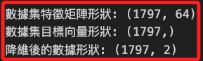
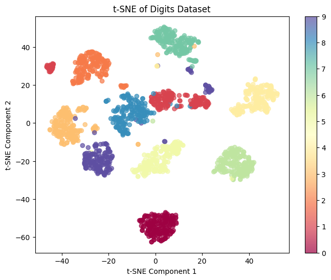

# t-SNE

_t-Distributed Stochastic Neighbor Embedding，t分佈隨機鄰域嵌入_

<br>

## 說明

1. t-SNE 是一種 `非監督學習` 技術，主要用於 `高維數據的降維與可視化`，它的目標是將高維數據映射到低維空間，通常是 `2D` 或 `3D`，同時保持數據的局部結構，使得在高維空間中相似的數據點在低維空間中仍然保持相近。

<br>

2. t-SNE 尤其適合用於 `探索性數據分析`，幫助識別數據中存在的 `集群（clusters）` 或 `數據的內在結構`，它不依賴於數據的任何特定分佈假設，適用於各種數據集，如圖像、文本、基因數據等。

<br>

## 範例

1. 使用 `Digits 數據集` 進行 `t-SNE 分析`，Digits 數據集是 Scikit-learn 中的一個手寫數字數據集，包含8x8像素的灰度圖像，共10個數字類別（0-9）。我們將使用 t-SNE 將這些64維的數據降維到2維，並進行可視化。

    ```python
    # 引入所需的庫
    import numpy as np
    import matplotlib.pyplot as plt
    from sklearn.datasets import load_digits
    from sklearn.manifold import TSNE

    # 加載 Digits 數據集
    digits = load_digits()
    X, y = digits.data, digits.target

    # 查看數據集的大小和形狀
    # (1797, 64)
    print("數據集特徵矩陣形狀:", X.shape)
    # (1797,)
    print("數據集目標向量形狀:", y.shape)

    # 初始化 t-SNE，設定將數據降至2維
    tsne = TSNE(n_components=2, random_state=42)

    # 將數據集進行降維
    X_tsne = tsne.fit_transform(X)
    # (1797, 2)
    print("降維後的數據形狀:", X_tsne.shape)

    # 繪製 t-SNE 降維後的數據
    plt.figure(figsize=(8, 6))
    scatter = plt.scatter(
        X_tsne[:, 0], X_tsne[:, 1], 
        c=y, cmap='Spectral', 
        alpha=0.7
    )
    plt.colorbar(scatter)
    plt.title('t-SNE of Digits Dataset')
    plt.xlabel('t-SNE Component 1')
    plt.ylabel('t-SNE Component 2')
    plt.show()
    ```

<br>

2. 結果顯示數據集特徵矩陣形狀 `(1797, 64)`，表示有 `1,797` 個樣本，每個樣本有 `64` 個特徵，也就是 `8x8` 像素；降維後的數據形狀為 `(1797, 2)`，表示每個樣本被投影到 `2` 維空間中。

    

<br>

3. 使用 t-SNE 後，可在 `2D` 空間中查看數據的分佈，不同顏色代表不同的數字類別（0-9），在這個低維空間中，相似的數字形成明顯的群集，顯示了 t-SNE 保留數據局部結構的能力。

    

<br>

___

_END_