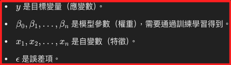

# 線性迴歸

_Linear Regression，是一種基本且常用的監督學習算法，用來建立自變數（輸入特徵）與因變數（目標變量）之間的線性關係，目標是通過找到最佳擬合線，來最小化預測值與真實值之間的誤差。_

<br>

## 說明

1. 在數學上，線性迴歸的模型可以表示如下。

    

<br>

2. 相關變數定義如下。

    

<br>

## 範例

1. 以下使用 `scikit-learn` 庫來實現線性迴歸。

    ```python
    # 引入所需的庫
    import numpy as np
    import matplotlib.pyplot as plt
    from sklearn.model_selection import train_test_split
    from sklearn.linear_model import LinearRegression
    from sklearn.metrics import mean_squared_error, r2_score

    # 生成一些示例數據
    # 設定隨機種子，使結果可重現
    np.random.seed(0)
    # 生成 100 個隨機點
    # 特徵 (自變數)
    X = 2.5 * np.random.randn(100) + 1.5
    # 目標變量 (因變數)
    y = 2 * X + np.random.randn(100) * 2

    # 可視化原始數據
    plt.figure(figsize=(8, 6))
    plt.scatter(X, y, color='blue')
    plt.title('原始數據點')
    plt.xlabel('自變數 X')
    plt.ylabel('因變數 y')
    plt.grid(True)
    plt.show()

    # 將數據轉換為正確的形狀
    # 將 X 轉換為二維數組
    X = X.reshape(-1, 1)

    # 分割數據集為訓練集和測試集
    X_train, X_test, y_train, y_test = train_test_split(
        X, y, test_size=0.2, random_state=0
    )

    # 初始化線性迴歸模型
    model = LinearRegression()

    # 訓練模型
    model.fit(X_train, y_train)

    # 使用模型進行預測
    y_pred = model.predict(X_test)

    # 計算模型的性能指標
    # 均方誤差
    mse = mean_squared_error(y_test, y_pred)
    # 決定係數 (R^2)
    r2 = r2_score(y_test, y_pred)

    print(f"均方誤差（MSE）: {mse:.2f}")
    print(f"決定係數（R^2 Score）: {r2:.2f}")

    # 可視化回歸線和測試數據
    plt.figure(figsize=(8, 6))
    plt.scatter(
        X_test, y_test, color='blue', label='測試數據'
    )
    plt.plot(
        X_test, y_pred, color='red', linewidth=2, label='回歸線'
    )
    plt.title('線性迴歸模型結果')
    plt.xlabel('自變數 X')
    plt.ylabel('因變數 y')
    plt.legend()
    plt.grid(True)
    plt.show()
    ```

<br>

2. 原始數據的分佈。

    

<br>

3. 分析結果，其中均方誤差（MSE）3.92，這數值越小越好，表示模型預測值與實際值之間的誤差越小；決定係數（R^2 Score）0.84，這數值越接近 1 越好，表示模型對數據的解釋能力越強。

    

<br>

___

_END_