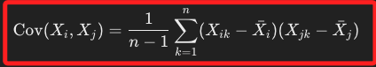
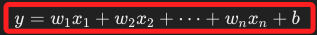
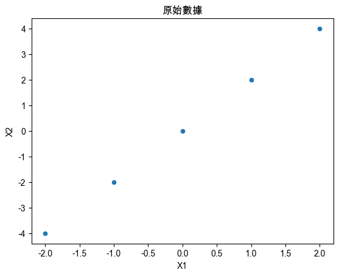
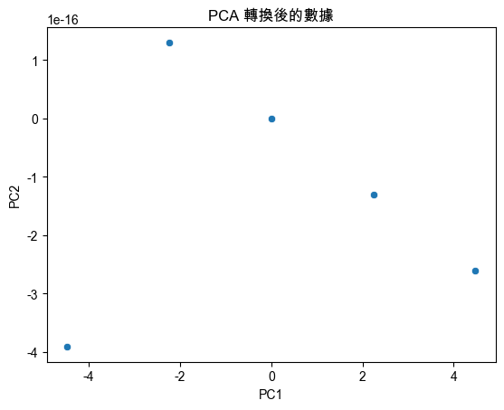

# 相關矩陣 與 共變異矩陣

_`Correlation Matrix` & `Covariance Matrix`_

<br>

## 說明

1. `相關矩陣` 又稱為 `相依矩陣`，在機器學習和統計學中，用於表示不同變數之間的相依性或相關性；另外一個常見的矩陣是 `共變異矩陣`，這是用來衡量變數間的共變異程度；特別注意，以上兩者的概念不同，不能互換使用。

<br>

2. `共變異矩陣` 衡量的是 `變數間變動的聯動程度`，或描述為 `變數間的聯合變化程度`；對於一組變數 `（X₁、X₂ ... Xn）` 而言，其共變異矩陣的 `成員` 或稱 `元素` 的表達式為 `Cov(Xi,Xj)`，也就是變數 `Xi` 和 `Xj` 的共變異數，公式如下。

    

<br>

3. 延續前一點，相關矩陣表示的是 `標準化的共變異數`，或描述為相關矩陣是 `共變異數的標準化版本`，成員值的範圍介於 `-1 和 1` 之間，且不受變數的尺度影響，表示變數之間的相關強度，公式如下；其中 `σχi`、`σxj` 分別代表 Xi、Xj 的標準差，由公式中可以得知，相關係數是對共變異數除以變數的標準差後得到的，而這正是標準化的處理流程。

    

<br>

4. 在機器學習中，`變數` 和 `參數` 是不同的概念；`變數` 指的是輸入數據中的特徵，而 `參數` 則指的是模型中的可調整值，例如 `權重` 和 `偏差`，這些值決定模型的行為；以下公式中，其中 `𝑤` 和 `𝑏` 是參數，而 `𝑥` 是變數。

    

<br>

5. 用於表示變數之間關係的元素稱為 `相關係數`，是衡量變數之間相關性的度量。

<br>

## 相關矩陣、相關性

_相關矩陣是一種 `方形矩陣`，每個矩陣的元素代表兩個參數之間的相關性_

<br>

1. 相關矩陣展示數據集中各個參數間的相依性，可用於判斷兩個參數間關係的強弱以及方向；其相關方式包括 `正相關`、`負相關` 與 `無相關`。

<br>

2. 兩參數正相關時，一個參數增加、另一個參數也會增加，相關係數會大於 `0` 而向 `1` 接近；負相關則與正相關反方向，相關係數小於 `0` 而趨近於 `-1`；當兩參數無相關時，表示兩個參數間沒有明顯的 `線性關係`，相關係數接近 `0`；在相關強度的表示上，`0.0≤∣r∣<0.3` 間為低相關性、`0.3≤∣r∣<0.7` 為中度相關、`0.7≤∣r∣≤1.0` 屬於高相關性。

<br>

3. 可藉由相關性了解參數間是否存在 `多重共線性（multicollinearity）`， `共線性` 對線性迴歸模型會造成不良影響。

<br>

## 相關矩陣的應用

_基於前述說明，說明相關矩陣在機器學習中的應用；特別注意，在機器學習的相關矩陣中，置入的是變數，也就是輸入模型中的特徵，相關矩陣就是衡量這些特徵間的線性相關性，而不是模型中的參數。_

<br>

1. **特徵選擇**：如果兩個變數之間有很高的正負相關性，說明存在冗餘變數問題，建模時可進行篩選僅加入其中一個變數，而不需要同時使用；特別注意，評估時同時考量了正負相關性，因為無論是正相關或負相關，在機器學習中的效果是等效的；特別說明，對於相關性而言，正負號依舊是有意義的，但在消除冗餘變數時，正負相關性都可以視為冗餘，只需保留一個變數即可。

<br>

2. **數據可視化**：可以用相關矩陣來繪製熱力圖，清晰地看到不同變數之間的相關程度。

<br>

3. **避免共線性**：在某些機器學習模型中，例如線性迴歸，高相關性的變數可能會導致共線性問題，這會影響模型的準確性，可通過相依矩陣來識別和處理共線性參數。

<br>

## 代碼範例

1. 使用 numpy 和 pandas 計算相關矩陣，先安裝套件。

    ```bash
    pip ionstall numpy pandas
    ```

<br>

2. 範例代碼。

    ```python
    import numpy as np
    import pandas as pd

    # 建立樣本數據
    data = {
        'X': [1, 2, 3, 4, 5],
        'Y': [2, 4, 6, 8, 10],
        'Z': [5, 4, 3, 2, 1]
    }

    # 將數據轉為 DataFrame
    df = pd.DataFrame(data)

    # 計算相關矩陣
    correlation_matrix = df.corr()
    print("相關矩陣:\n", correlation_matrix)
    ```

<br>

3. 以上代碼會輸出相關矩陣，其中 `斜對角以外` 的 `係數` 就是變數間的 `相關係數`，以結果來解釋，`X 和 Y` 之間有非常高的正相關，而 `Z 和 X` 、 `Z 和 Y` 之間有強烈的負相關。

    ```bash
    相關矩陣:
          X    Y    Z
    X    1.0  1.0 -1.0
    Y    1.0  1.0 -1.0
    Z   -1.0 -1.0  1.0
    ```

<br>

## 共變異數

1. 簡單說，共變異數就是 `兩個變數的偏差乘積的平均值`，`偏差` 指的是樣本與平均數的差異，計算結果可代表聯動程度；共變異數越大，代表兩個變數之間的變動關聯性越強，變動方向一致的趨勢越明顯；反之，共變異數越小或為負值，代表兩個變數之間的變動關聯性較弱或呈反向關聯，表示一個變數增加時，另一個變數傾向於減少。

<br>

2. 在統計學中，共變異矩陣用於表示多個變數間的共變異關係，有助於理解變數間的相互關聯；在機器學習中，共變異矩陣的應用更廣泛，特別是在主成分分析（PCA）等降維方法中，共變異矩陣可幫助找出數據中的主要變異方向，從而降低數據的維度並保留數據中的重要信息，使得模型更有效率地處理高維數據。

<br>

## 共變異矩陣

1. 顧名思義，`共變異矩陣` 用來衡量兩個變數間的 `共變性（covariance）`，它不僅提供了變數間的相依性程度，還能表明變數的量綱如何影響相依性；所稱的 `量綱` 是指物理量的基本屬性，通常用來表示物理量的單位關係，它描述的是物理量的性質，而不涉及具體的數值大小，例如 `速度`的量綱為長度除以時間，可用 `L/T` 表示。

<br>

2. 與相關矩陣不同，共變異矩陣中元素會基於變數的尺度變化，因此當變數的尺度改變時，矩陣中的數值也會隨之變動；反之，相關矩陣將變數的值標準化而介於 `-1 ~ 1` 之間，不受變數尺度的影響，專注於變數間的相對關聯性。

<br>

3. 共變異矩陣在 `降維技術` 中扮演重要角色，如 `主成分分析法 PCA` 用來找到數據中的主要變異方向，並進行降維處理；另外，在 `多元高斯分佈模型` 中，共變異矩陣用來描述數據的分散程度與方向，這對於一些 `混合模型（GMM）` 尤為重要。

<br>

## 範例說明

1. 安裝套件。

    ```bash
    pip install scikit-learn seaborn
    ```

<br>

2. 觀察數據。

    ```python
    import pandas as pd
    import seaborn as sns
    import matplotlib.pyplot as plt

    # 設定支持中文的字體，避免顯示錯誤
    plt.rcParams['font.sans-serif'] = ['Arial Unicode MS']
    # 用來正常顯示負號
    plt.rcParams['axes.unicode_minus'] = False

    # 假設 df 是原始數據
    df = pd.DataFrame({
        'X1': [-2, -1, 0, 1, 2],
        'X2': [-4, -2, 0, 2, 4]
    })

    # 顯示基本統計訊息
    print(df.describe())

    # 繪製原始數據的散點圖
    sns.scatterplot(x='X1', y='X2', data=df)
    plt.title('原始數據')
    plt.show()
    ```

<br>

3. 輸出結果。

    ```bash
                X1         X2
    count    5.000000    5.000000
    mean     0.000000    0.000000
    std      1.581139    3.162278
    min     -2.000000   -4.000000
    25%     -1.000000   -2.000000
    50%      0.000000    0.000000
    75%      1.000000    2.000000
    max      2.000000    4.000000
    ```

    

<br>

4. 轉換。

    ```python
    from sklearn.decomposition import PCA

    # 進行 PCA 分析，將數據降為 2 維
    pca = PCA(n_components=2)
    principal_components = pca.fit_transform(df)

    # 將主成分轉換為 DataFrame
    principal_df = pd.DataFrame(
        principal_components,
        columns=['PC1', 'PC2']
    )

    # 繪製 PCA 之後的數據
    sns.scatterplot(x='PC1', y='PC2', data=principal_df)
    plt.title('PCA 轉換後的數據')
    plt.show()
    ```

    

<br>

5. 共變異矩陣 (Covariance Matrix)。

    ```python
    import numpy as np
    import pandas as pd

    # 建立樣本數據
    data = {
        'X': [1, 2, 3, 4, 5],
        'Y': [2, 4, 6, 8, 10],
        'Z': [5, 4, 3, 2, 1]
    }

    # 將數據轉為 DataFrame
    df = pd.DataFrame(data)
    # 計算共變異矩陣
    covariance_matrix = df.cov()
    print("共變異矩陣:\n", covariance_matrix)
    ```

2. 輸出共變異矩陣，顯示數據間的變異程度，X 和 Y 有很高的共變異，顯示正相關。

    ```bash
    共變異矩陣:
        X     Y     Z
    X    2.5   5.0  -2.5
    Y    5.0  10.0  -5.0
    Z   -2.5  -5.0   2.5
    ```

<br>

7. 主成分分析（PCA） 是一種降維方法，通過共變異矩陣找到數據中主要的變異方向。在實際應用中，PCA 幫助我們將多維數據轉換為更少的變量。

    ```python
    from sklearn.decomposition import PCA

    # 進行 PCA 分析
    pca = PCA(n_components=2)
    principal_components = pca.fit_transform(df)

    # 將主成分轉換為 DataFrame
    principal_df = pd.DataFrame(
        principal_components,
        columns=['PC1', 'PC2']
    )
    print("主成分:\n", principal_df)
    ```

<br>

8. 以下說明輸出結果，PCA 在兩個變量 `X1` 和 `X2` 中找到了一個新的坐標軸，這就是主成分軸 `PC1`，這個軸捕捉了數據中最大變異的方向，這個主要的變異方向與原來的數據是 `線性相關` 的，也就是說，數據的變異會集中在這個軸上；另外，`PCA` 會將次要變異移除，也就是變異很小的方向，這就是 PC2 的作用。從以下報表可以看到 `PC2` 的值非常小、接近於 `0`，這表明數據在這個次要方向上幾乎沒有變化；降維的目的是透過找到數據中的主要變異方向，來減少數據的維度。數據的變化主要集中在 PC1 上，因此可以忽略 PC2 的次要變異，這樣可將原始的 2 維數據（X1 和 X2）轉換為 1 維數據（PC1），而幾乎不會丟失信息。

    ```bash
    主成分:
            PC1          PC2
    0   -4.472136   -3.910328e-16
    1   -2.236068    1.303443e-16
    2    0.000000   -0.000000e+00
    3    2.236068   -1.303443e-16
    4    4.472136   -2.606886e-16
    ```

<br>

___

_END_
