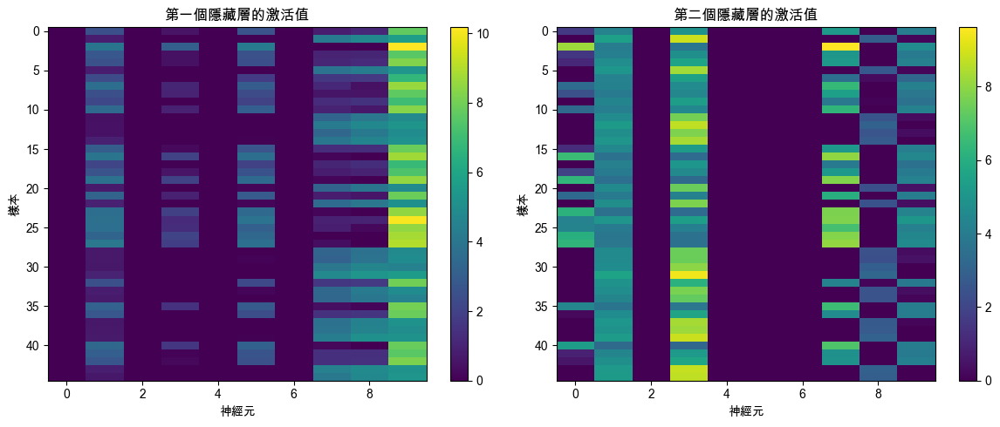

## MLP

_MLP，多層感知器，Multilayer Perceptron_

<br>

## 說明

1. 在機器學習中，MLP 是一種 `前向傳播` 的人工神經網絡，是最基礎且廣泛使用的神經網絡結構之一。

<br>

2. 非線性激活函數如 ReLU、Sigmoid、Tanh 等激活函數，使網絡能夠學習非線性關係。

<br>

3. 訓練方法上使用反向傳播算法來更新網絡中的權重和偏置，最小化損失函數。

<br>

4. MLP 可以處理線性不可分的問題，這是其相較於感知器的優勢，廣泛應用於分類、迴歸、特徵提取等任務中。

<br>

## 結構

1. 輸入層：接收輸入數據特徵。

<br>

2. 隱藏層：包含一個或多個層，每層由多個神經元組成。隱藏層中的每個神經元接收來自前一層的輸入，進行加權和偏置計算，然後應用激活函數。

<br>

3. 輸出層：產生最終的預測結果。輸出層的神經元數量通常等於預測問題的類別數量（分類問題）或一個標量值（迴歸問題）。

<br>

## 範例

1. 以下使用 `iris 數據集` 展示一個簡單的範例，更直觀地展示 MLP `多層` 的特性，將訓練過程中 `隱藏層` 的激活值可視化，進而理解 MLP 如何從數據中學習特徵。

    ```python
    import numpy as np
    import matplotlib.pyplot as plt
    from sklearn.neural_network import MLPClassifier
    from sklearn.datasets import load_iris
    from sklearn.model_selection import train_test_split
    from sklearn.metrics import accuracy_score

    # 加載數據集
    data = load_iris()
    X = data.data
    y = data.target

    # 拆分訓練集和測試集
    X_train, X_test, y_train, y_test = train_test_split(
        X, y,
        # 測試比例
        test_size=0.3,
        random_state=42
    )

    # 初始化 MLP 模型
    mlp = MLPClassifier(
        # 設置兩個隱藏層，每個有10個神經元
        hidden_layer_sizes=(10, 10),
        # 激活函數使用 ReLU
        activation='relu',
        # 使用 Adam 優化器
        solver='adam',
        # 最大迭代次數為 1000
        max_iter=1000
    )

    # 訓練模型
    mlp.fit(X_train, y_train)

    # 預測
    y_pred = mlp.predict(X_test)

    # 評估模型
    accuracy = accuracy_score(y_test, y_pred)
    print(f"模型準確率: {accuracy:.2f}")

    # 可視化隱藏層的激活值
    def plot_hidden_layer_activations(mlp, X):
        # 將數據傳遞到第一個隱藏層
        hidden_layer_1_output = np.maximum(
            0,
            np.dot(
                X, mlp.coefs_[0]
            ) + mlp.intercepts_[0]
        )
        
        # 將第一個隱藏層的輸出傳遞到第二個隱藏層
        hidden_layer_2_output = np.maximum(
            0,
            np.dot(
                hidden_layer_1_output, mlp.coefs_[1]
            ) + mlp.intercepts_[1]
        )

        plt.figure(figsize=(12, 5))

        # 第一個隱藏層激活值的可視化
        plt.subplot(1, 2, 1)
        plt.imshow(
            hidden_layer_1_output, 
            aspect='auto', 
            cmap='viridis'
        )
        plt.colorbar()
        plt.title('第一個隱藏層的激活值')
        plt.xlabel('神經元')
        plt.ylabel('樣本')

        # 第二個隱藏層激活值的可視化
        plt.subplot(1, 2, 2)
        plt.imshow(
            hidden_layer_2_output, 
            aspect='auto', 
            cmap='viridis'
        )
        plt.colorbar()
        plt.title('第二個隱藏層的激活值')
        plt.xlabel('神經元')
        plt.ylabel('樣本')

        plt.tight_layout()
        plt.show()

    # 可視化隱藏層的激活值
    plot_hidden_layer_activations(mlp, X_test)
    ```

<br>

2. 在訓練 MLP 時，可通過每一層的 `權重` 和 `偏置` 計算隱藏層的激活值，這些值展示了神經網絡如何在每一層提取特徵並傳遞給下一層，可將其理解為神經元對輸入數據的反應程度，在以下的可視化中，顏色越亮表示激活值越高，神經元對該輸入數據的響應越強。其中左圖展示第一個 `隱藏層` 中每個神經元對不同輸入樣本的激活情況；右圖展示第二個 `隱藏層` 中的激活情況。

    

<br>

___

_END_