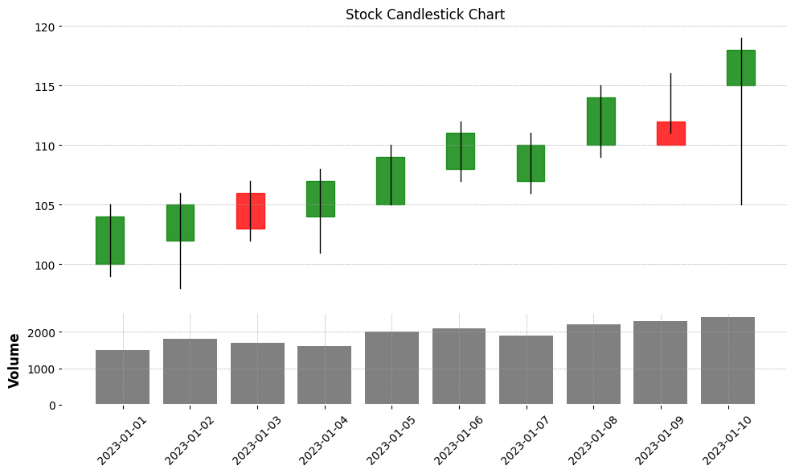

# `Matplotlib` 

_Python 視覺化工具，以下是常見的圖形類型_

<br>

## 折線圖（Line Plot）

1. 折線圖常用於顯示數據隨時間或順序變化的趨勢。

    ```python
    import matplotlib.pyplot as plt
    import numpy as np

    # 設定支持中文的字體，避免顯示錯誤
    plt.rcParams['font.sans-serif'] = ['Arial Unicode MS']
    # 用來正常顯示負號
    plt.rcParams['axes.unicode_minus'] = False

    # 模擬數據
    x = np.linspace(0, 10, 100)
    y = np.sin(x)

    # 繪製折線圖
    plt.plot(x, y)
    plt.title('Line Plot')
    plt.xlabel('X Axis')
    plt.ylabel('Y Axis')
    plt.show()
    ```

    

<br>

2. 使用了 twstock 模組來抓取台股的資料，並透過 matplotlib 來繪製折線圖；要先進行套件安裝 `pip install twstock`。

    ```python
    # 匯入所需的模組
    import twstock
    import matplotlib.pyplot as plt

    # 設定支持中文的字體，避免顯示錯誤
    plt.rcParams['font.sans-serif'] = ['Arial Unicode MS']
    # 用來正常顯示負號
    plt.rcParams['axes.unicode_minus'] = False

    # 獲取 TSMC（台積電）2330 的歷史股價數據
    tsmc = twstock.Stock('2330')

    # 獲取最近的 100 筆交易日的股價資料，從 2023 年 12 月開始
    stock_data = tsmc.fetch_from(2023, 12)

    # 提取日期與收盤價數據，將日期與收盤價分別儲存於 lists 中
    dates = [data.date for data in stock_data]
    closing_prices = [data.close for data in stock_data]

    # 繪製收盤價的折線圖，設定圖表大小為 10x6 英吋
    plt.figure(figsize=(10, 6)) 
    # 繪製折線圖，並以圓圈標記每個點
    plt.plot(
        dates, closing_prices, 
        marker='o', linestyle='-', 
        color='blue'
    )

    # 設定圖表標題與軸標籤
    plt.title(
        'TSMC 收盤價時間序列圖',
        fontsize=16, color='green'
    )
    # X 軸標籤
    plt.xlabel('日期', fontsize=12)
    # Y 軸標籤
    plt.ylabel('收盤價', fontsize=12)

    # 設定 X 軸的日期標籤，並將其旋轉 45 度，避免重疊
    plt.xticks(rotation=45)

    # 加入網格線，讓圖表更清晰
    plt.grid(True)

    # 自動調整子圖參數，避免標籤重疊
    plt.tight_layout()

    # 顯示圖表
    plt.show()
    ```

    

<br>

3. 在 3D 空間中展示折線圖。

    ```python
    import matplotlib.pyplot as plt
    import numpy as np
    from mpl_toolkits.mplot3d import Axes3D

    # 設定支持中文的字體，避免顯示錯誤
    plt.rcParams['font.sans-serif'] = ['Arial Unicode MS']
    # 用來正常顯示負號
    plt.rcParams['axes.unicode_minus'] = False

    # 模擬數據
    x = np.linspace(0, 10, 100)
    y = np.sin(x)
    # 使用正弦函數來模擬 Z 軸的變化，讓 Z 軸與 X 軸的變化更加明顯
    # Z 軸使用線性變化（或可以使用 x**2, np.sin(x) 等視覺效果更強的函數）
    z = x 

    # 創建 3D 圖
    fig = plt.figure()
    ax = fig.add_subplot(111, projection='3d')

    # 繪製 3D 折線圖
    ax.plot(x, y, z, label='3D Line Plot', color='b', lw=2)

    # 設置標題和標籤
    ax.set_title('3D Line Plot')
    ax.set_xlabel('X Axis')
    ax.set_ylabel('Y Axis')
    ax.set_zlabel('Z Axis')

    # 顯示圖表
    plt.show()
    ```

    

<br>

4. 在 3D 折線圖中，可通過變化線條顏色來表示數據的變化，舉例說，若是要觀察 X、Y 對 Z 的影響趨勢，可通過顏色來反映 Z 軸數據的變化；但從這個圖可以發現，這個圖形並不適合這類的呈現。

    ```python
    import matplotlib.pyplot as plt
    import numpy as np
    from mpl_toolkits.mplot3d import Axes3D
    # 用於顏色映射
    from matplotlib import cm

    # 設定支持中文的字體，避免顯示錯誤
    plt.rcParams['font.sans-serif'] = ['Arial Unicode MS']
    # 用來正常顯示負號
    plt.rcParams['axes.unicode_minus'] = False

    # 模擬數據
    x = np.linspace(0, 10, 100)
    y = np.sin(x)
    # 使用正弦函數來模擬 Z 軸的變化
    z = np.sin(2 * np.pi * x)

    # 創建 3D 圖
    fig = plt.figure()
    ax = fig.add_subplot(111, projection='3d')

    # 繪製 3D 折線圖，並使用 colormap 映射 Z 軸數據來設置顏色
    points = ax.plot(x, y, z, label='3D Line Plot')

    # 使用顏色映射，根據 Z 值的大小變化顏色
    for i in range(len(x) - 1):
        ax.plot(
            x[i:i+2], 
            y[i:i+2], 
            z[i:i+2], 
            color=cm.viridis(z[i]/max(z))
        )

    # 設置標題和標籤
    ax.set_title('3D Line Plot with Color Mapping')
    ax.set_xlabel('X Axis')
    ax.set_ylabel('Y Axis')
    ax.set_zlabel('Z Axis')

    # 顯示圖表
    plt.show()
    ```

    

<br>

## 散點圖（Scatter Plot）

1. 散點圖展示數據點的分佈，通常用來觀察變數之間的關係。

    ```python
    # 模擬數據
    x = np.random.rand(50)
    y = np.random.rand(50)

    # 繪製散點圖
    plt.scatter(x, y)
    plt.title('Scatter Plot')
    plt.xlabel('X Axis')
    plt.ylabel('Y Axis')
    plt.show()
    ```

    

<br>

2. 通過添加顏色、大小和透明度來優化散點圖。

    ```python
    import matplotlib.pyplot as plt
    import numpy as np

    # 模擬數據
    x = np.random.rand(50)
    y = np.random.rand(50)
    # 隨機顏色
    colors = np.random.rand(50)
    # 隨機大小
    sizes = 1000 * np.random.rand(50)

    # 繪製散點圖
    plt.scatter(
        x, y, c=colors, s=sizes, alpha=0.5, cmap="viridis"
    )
    plt.title("Enhanced Scatter Plot")
    plt.xlabel("X Axis")
    plt.ylabel("Y Axis")
    # 添加顏色條
    plt.colorbar()
    plt.show()
    ```

    

<br>

3. 使用 mpl_toolkits.mplot3d 將散點圖擴展為 3D 圖形。這需要為每個點添加第三個維度（Z 軸數據）。

    ```python
    import matplotlib.pyplot as plt
    import numpy as np
    from mpl_toolkits.mplot3d import Axes3D

    # 模擬數據
    x = np.random.rand(50)
    y = np.random.rand(50)
    # 第三維數據
    z = np.random.rand(50)

    # 創建 3D 圖
    fig = plt.figure()
    ax = fig.add_subplot(111, projection='3d')

    # 繪製 3D 散點圖
    ax.scatter(
        x, y, z, c=z, cmap='viridis', s=100, alpha=0.6
    )

    # 設置標題和軸標籤
    ax.set_title('3D Scatter Plot')
    ax.set_xlabel('X Axis')
    ax.set_ylabel('Y Axis')
    ax.set_zlabel('Z Axis')

    plt.show()
    ```

    

<br>

## 柱狀圖（Bar Plot）

_或稱 `長條圖`_

<br>

1. 柱狀圖用於比較不同類別的數據。

    ```python
    # 模擬數據
    categories = ['A', 'B', 'C', 'D']
    values = [10, 15, 7, 10]

    # 繪製柱狀圖
    plt.bar(categories, values)
    plt.title('Bar Plot')
    plt.ylabel('Values')
    plt.show()
    ```

    

<br>

2. 橫向佈局。

    ```python
    import matplotlib.pyplot as plt
    import numpy as np

    # 模擬資料，關鍵字
    words = [
        'court appeal',
        'supreme court',
        'police officer',
        'civil right'
    ]
    # 模擬重要性數據
    importance = [0.01, 0.005, 0.008, 0.007] 
    # 模擬主題編號
    topics = [0, 1, 2, 1]

    # 定義顏色對應每個 topic
    colors = {0: 'red', 1: 'green', 2: 'blue'}

    # 繪製橫向長條圖
    plt.barh(
        words, importance, 
        color=[colors[t] for t in topics]
    )

    # 設定標題與軸標籤
    plt.title('Main Topics', fontsize=16)
    plt.xlabel('Word Importance')
    plt.ylabel('Word')

    # 顯示圖表
    plt.tight_layout()
    plt.show()
    ```

    

<br>

3. 適合處理複雜的數據，其中包含使用 plt.tight_layout() 自動調整佈局，確保圖表不會因為字詞過長而重疊。

    ```python
    import matplotlib.pyplot as plt
    import numpy as np

    # 模擬資料
    words = [
        'district court', 'court appeal', 'united state', 'u court', 'circuit affirmed', 
        'ninth circuit', 'en banc', 'supreme court', 'fifth circuit', 'federal court', 
        'u supreme', 'appeal u', 'fourth amendment', 'granted summary', 'violent felony', 
        'police officer', 'school district', 'summary judgment', 'funeral home', 'circuit court',
        'title vii', 'court decided', 'civil right', 'appellate court'
    ]
    # 模擬重要性數據
    importance = np.random.rand(len(words)) / 100

    # 為每個字詞分配主題編號 (Topic)
    topics = np.random.randint(0, 3, len(words))

    # 定義顏色對應每個 topic
    colors = {0: 'red', 1: 'green', 2: 'blue'}

    # 繪製橫向長條圖
    fig, ax = plt.subplots(figsize=(10, 6))

    # 將字詞與其對應的 Word Importance 值進行繪製
    ax.barh(
        words, importance,
        color=[colors[t] for t in topics]
    )

    # 設定標題與軸標籤
    ax.set_title('Main Topics', fontsize=16)
    ax.set_xlabel('Word Importance')
    ax.set_ylabel('Word')

    # 添加圖例來區分不同 Topic
    from matplotlib.patches import Patch
    legend_elements = [
        Patch(facecolor='red', label='Topic 0'),
        Patch(facecolor='green', label='Topic 1'),
        Patch(facecolor='blue', label='Topic 2')
    ]
    ax.legend(handles=legend_elements, title="Topic")

    # 自動調整圖表佈局以防止標籤重疊
    plt.tight_layout()

    # 顯示圖表
    plt.show()
    ```

    

<br>

4. 柱狀圖可使用 matplotlib 中的 `Axes3D` 來繪製 3D 柱狀圖；立體的柱狀圖預設沒間隔，看起來會很像長條圖，所以在 x_pos 和 y_pos 之間增加一些空隙。

    ```python
    import matplotlib.pyplot as plt
    import numpy as np
    from mpl_toolkits.mplot3d import Axes3D

    # 模擬數據
    categories = ['A', 'B', 'C', 'D']
    values = [10, 15, 7, 10]

    # 創建 3D 圖
    fig = plt.figure()
    ax = fig.add_subplot(111, projection='3d')

    # 設置 X 軸位置並增加間隔
    # 每個柱子之間設置 1.5 的間隔
    x_pos = np.arange(len(categories)) * 1.5
    y_pos = np.zeros(len(categories))
    z_pos = np.zeros(len(categories))

    # 設置柱子的寬度和深度
    # 每個柱子的寬度設置為 0.95
    dx = np.ones(len(categories)) * 0.95
    # 每個柱子的深度設置為 5
    dy = np.ones(len(categories)) * 5
    # Z 軸高度為對應的值
    dz = values

    # 定義不同顏色
    colors = ['#FF9999', '#66B2FF', '#99FF99', '#FFCC99']

    # 繪製 3D 柱狀圖，每個柱子不同顏色
    ax.bar3d(x_pos, y_pos, z_pos, dx, dy, dz, color=colors, alpha=0.8)

    # 設置 X 軸標籤
    ax.set_xticks(x_pos)
    ax.set_xticklabels(categories)

    # 設置標題和標籤
    ax.set_title('3D Bar Plot with Spacing and Colors')
    ax.set_xlabel('Category')
    ax.set_ylabel('Y Axis')
    ax.set_zlabel('Values')

    # 顯示圖表
    plt.show()
    ```

    

<br>

5. 進一步優化圖形功能，每個柱子的 Y 值不同，同時保持所有柱子的起點相同，並設置了適當的 Y 軸範圍。

    ```python
    import matplotlib.pyplot as plt
    import numpy as np
    from mpl_toolkits.mplot3d import Axes3D

    # 模擬數據
    categories = ['A', 'B', 'C', 'D']
    # X 軸數據
    x_values = [1, 2, 3, 4]
    # Y 軸數據
    y_values = [1, 3, 5, 2] 
    # Z 軸數據（高度）
    z_values = [10, 15, 7, 10] 

    # 創建 3D 圖
    fig = plt.figure()
    ax = fig.add_subplot(111, projection='3d')

    # 設置 X 和 Y 軸位置，間隔設置為 1.5
    x_pos = np.array(x_values)
    y_pos = np.array(y_values)
    # 起點設為 0
    z_pos = np.zeros(len(categories))

    # 設置柱子的寬度和深度
    # 寬度設置為 0.95
    dx = np.ones(len(categories)) * 0.95
    # 深度設置為 1
    dy = np.ones(len(categories)) * 1  
    # Z 軸高度
    dz = z_values  

    # 定義不同顏色
    colors = ['#FF9999', '#66B2FF', '#99FF99', '#FFCC99']

    # 繪製 3D 柱狀圖，每個柱子不同顏色
    ax.bar3d(
        x_pos, y_pos, z_pos, dx, dy, dz, color=colors, alpha=0.8
    )

    # 設置 X 軸標籤
    ax.set_xticks(x_pos)
    ax.set_xticklabels(categories)

    # 設置 Y 軸範圍和標籤
    # 設置 Y 軸範圍 0-5
    ax.set_yticks(np.arange(0, 6, 1))  
    ax.set_yticklabels(np.arange(0, 6, 1))

    # 設置標題和標籤
    ax.set_title('3D Bar Plot with Different Y Values')
    ax.set_xlabel('Category')
    ax.set_ylabel('Y Axis')
    ax.set_zlabel('Values')

    # 顯示圖表
    plt.show()
    ```

    

<br>

6. 在3D柱狀圖中以Y軸的長度來顯示不同的Y數值，其中dy已經對應到不同的Y數值，這樣每個柱狀體會按照不同的Y值來顯示深度。

    ```python
    import matplotlib.pyplot as plt
    import numpy as np
    from mpl_toolkits.mplot3d import Axes3D

    # 模擬數據
    categories = ['A', 'B', 'C', 'D']
    # X 軸數據
    x_values = [1, 2, 3, 4]
    # Y 軸數據（用來控制每個柱子的深度）
    y_values = [1, 3, 5, 2] 
    # Z 軸數據（柱子的高度）
    z_values = [10, 15, 7, 10] 

    # 創建 3D 圖
    fig = plt.figure()
    ax = fig.add_subplot(111, projection='3d')

    # 設置 X 和 Y 軸位置，Y 軸不再設置為全 0，避免圖形渲染空白
    x_pos = np.array(x_values)
    y_pos = np.zeros(len(categories))  # 固定 y_pos 起點為 0
    z_pos = np.zeros(len(categories))  # Z 軸起點設為 0

    # 設置柱子的寬度
    dx = np.ones(len(categories)) * 0.95  # X 軸寬度固定
    # 使用 Y 軸數據作為每個柱子的深度
    dy = np.array(y_values)  # 根據不同的Y值顯示深度
    # 使用 Z 軸數據作為柱子的高度
    dz = np.array(z_values)

    # 定義不同顏色
    colors = ['#FF9999', '#66B2FF', '#99FF99', '#FFCC99']

    # 繪製 3D 柱狀圖，每個柱子不同顏色
    ax.bar3d(
        x_pos, y_pos, z_pos, dx, dy, dz, color=colors, alpha=0.8
    )

    # 設置 X 軸標籤
    ax.set_xticks(x_pos)
    ax.set_xticklabels(categories)

    # 設置標題和標籤
    ax.set_title('3D Bar Plot with Y as Depth and Z as Height')
    ax.set_xlabel('Category (X Axis)')
    ax.set_ylabel('Y Axis (Depth)')
    ax.set_zlabel('Z Axis (Height)')

    # 顯示圖表
    plt.show()
    ```

    

<br>

7. 延續前一點，使用 `ax.invert_yaxis()` 函數來反轉 Y 軸，將 Y 軸的起點由內向外繪製，也就是反轉 Y 軸的方向，這樣可以讓 Y 軸的值從內向外增加，使得柱狀圖的深度變得更加明顯；但由這兩點的結果可知， 3D 的柱狀圖並不適合當前情境。

    ```python
    import matplotlib.pyplot as plt
    import numpy as np
    from mpl_toolkits.mplot3d import Axes3D

    # 模擬數據
    categories = ['A', 'B', 'C', 'D']
    # X 軸數據
    x_values = [1, 2, 3, 4]
    # Y 軸數據（用來控制每個柱子的深度）
    y_values = [1, 3, 5, 2] 
    # Z 軸數據（柱子的高度）
    z_values = [10, 15, 7, 10] 

    # 創建 3D 圖
    fig = plt.figure()
    ax = fig.add_subplot(111, projection='3d')

    # 設置 X 和 Y 軸位置，Y 軸不再設置為全 0，避免圖形渲染空白
    x_pos = np.array(x_values)
    y_pos = np.zeros(len(categories))  # 固定 y_pos 起點為 0
    z_pos = np.zeros(len(categories))  # Z 軸起點設為 0

    # 設置柱子的寬度
    dx = np.ones(len(categories)) * 0.95  # X 軸寬度固定
    # 使用 Y 軸數據作為每個柱子的深度
    dy = np.array(y_values)  # 根據不同的Y值顯示深度
    # 使用 Z 軸數據作為柱子的高度
    dz = np.array(z_values)

    # 定義不同顏色
    colors = ['#FF9999', '#66B2FF', '#99FF99', '#FFCC99']

    # 繪製 3D 柱狀圖，每個柱子不同顏色
    ax.bar3d(
        x_pos, y_pos, z_pos, dx, dy, dz, color=colors, alpha=0.8
    )

    # 反轉 Y 軸，讓 Y 軸值由內向外增加
    ax.invert_yaxis()

    # 設置 X 軸標籤
    ax.set_xticks(x_pos)
    ax.set_xticklabels(categories)

    # 設置標題和標籤
    ax.set_title('3D Bar Plot with Y as Depth and Z as Height')
    ax.set_xlabel('Category (X Axis)')
    ax.set_ylabel('Y Axis (Depth)')
    ax.set_zlabel('Z Axis (Height)')

    # 顯示圖表
    plt.show()
    ```

    

<br>

## 直方圖（Histogram）

1. 直方圖用於顯示數據分佈的頻率，可以用來觀察數據的分佈模式。

    ```python
    # 模擬數據
    data = np.random.randn(1000)

    # 繪製直方圖
    plt.hist(data, bins=30)
    plt.title('Histogram')
    plt.xlabel('Value')
    plt.ylabel('Frequency')
    plt.show()
    ```

    

<br>

2. 使用 3D 呈現；也就是添加一個 Z 軸，將原本反映在 Y 軸的數據顯示於 Z 軸。

    ```python
    import matplotlib.pyplot as plt
    import numpy as np
    from mpl_toolkits.mplot3d import Axes3D
    from matplotlib import cm

    # 模擬數據
    data = np.random.randn(1000)

    # 設定直方圖參數
    hist, bins = np.histogram(data, bins=30)

    # 創建 3D 圖
    fig = plt.figure()
    ax = fig.add_subplot(111, projection='3d')

    # 設置 X 軸位置
    # 每個 bin 的中心點作為 X 軸位置
    x_pos = (bins[:-1] + bins[1:]) / 2  
    # 固定 y_pos 起點為 0
    y_pos = np.zeros_like(x_pos)         
    # 固定 z_pos 起點為 0
    z_pos = np.zeros_like(x_pos)         

    # 設置條的寬度和深度
    # X 軸每個條的寬度
    dx = np.ones_like(x_pos) * (bins[1] - bins[0])
    # Y 軸每個條的深度
    dy = np.ones_like(x_pos)                        
    # Z 軸高度為頻率（histogram 值）
    dz = hist                                       

    # 使用顏色映射，根據 Z 軸高度來設置顏色
    # 將頻率值歸一化到 [0, 1]，並使用 'viridis' 色彩映射
    colors = cm.viridis(dz / max(dz))  

    # 繪製 3D 直方圖
    ax.bar3d(
        x_pos, y_pos, z_pos, dx, dy, dz, color=colors, alpha=0.7
    )

    # 設置標題和標籤
    ax.set_title('3D Histogram with Color Mapping')
    ax.set_xlabel('Value')
    ax.set_ylabel('Y Axis (Fixed)')
    ax.set_zlabel('Frequency')

    # 顯示圖表
    plt.show()
    ```

    

<br>

3. 每個數據都有適合的圖形，若要有效應用多餘的一個座標，這裡以 `X` 軸代表價格範圍、Y 軸代表不同的地區或店鋪、Z 軸代表在某地區的產品銷售頻率；另外，使用 ax.view_init() 方法來調整視角，依據數據特徵將特定的軸面向使用者觀察視角。

    ```python
    import matplotlib.pyplot as plt
    import numpy as np
    from mpl_toolkits.mplot3d import Axes3D
    from matplotlib import cm

    # 模擬數據，三個地區的銷售數據
    data_region_1 = np.random.randn(1000) + 1
    data_region_2 = np.random.randn(1000) - 1
    data_region_3 = np.random.randn(1000)

    regions = [data_region_1, data_region_2, data_region_3]
    y_labels = ['Region 1', 'Region 2', 'Region 3']

    # 創建 3D 圖
    fig = plt.figure()
    ax = fig.add_subplot(111, projection='3d')

    # 設置條的寬度
    dx = 0.8  # X 軸寬度

    # 對每個地區繪製 3D 直方圖
    for i, data in enumerate(regions):
        # 設定直方圖參數
        hist, bins = np.histogram(data, bins=30)
        # 每個 bin 的中心點作為 X 軸位置
        x_pos = (bins[:-1] + bins[1:]) / 2  
        # 將每個地區映射到不同的 Y 軸位置
        y_pos = np.ones_like(x_pos) * i      
        # Z 軸起點為 0
        z_pos = np.zeros_like(x_pos)         
        # Z 軸高度為頻率
        dz = hist                            

        # 使用顏色映射，根據 Z 軸高度來設置顏色
        # 將頻率值歸一化並映射顏色
        colors = cm.viridis(dz / max(dz)) 

        # 繪製 3D 直方圖
        ax.bar3d(
            x_pos, y_pos, z_pos, dx, 0.5, dz, 
            color=colors, alpha=0.7
        )

    # 設置 X、Y、Z 軸標籤
    ax.set_title('3D Histogram for Multiple Regions')
    ax.set_xlabel('Value')
    ax.set_ylabel('Region')
    ax.set_zlabel('Frequency')

    # 設置 Y 軸標籤為不同的地區
    ax.set_yticks(np.arange(len(y_labels)))
    ax.set_yticklabels(y_labels)

    # 調整視角
    ax.view_init(elev=60, azim=160)

    # 顯示圖表
    plt.show()
    ```

    

<br>

## 餅圖（Pie Chart）

1. 餅圖用於顯示各類別佔總數的比例。

    ```python
    import matplotlib.pyplot as plt

    # 模擬數據
    labels = ['A', 'B', 'C', 'D']
    sizes = [20, 30, 25, 25]

    # 繪製餅圖
    plt.pie(sizes, labels=labels, autopct='%1.1f%%')
    plt.title('Pie Chart')
    plt.show()
    ```

    

<br>

2. 這是另一個模擬數據，以下將對此進行延伸。

    ```python
    import matplotlib.pyplot as plt

    # 模擬數據
    data = {'男性': 77.78, '女性': 22.22}
    labels = data.keys()
    sizes = data.values()

    # 繪製餅圖
    plt.figure(figsize=(6, 6))
    plt.pie(
        sizes, 
        labels=labels, 
        autopct='%1.2f%%', 
        startangle=90, 
        colors=['#1f77b4', '#ff7f0e'], 
        wedgeprops={'edgecolor': 'black'}
    )

    # 添加標題
    plt.title("DATA TYPE", fontsize=14, color='green')

    # 顯示餅圖
    plt.show()
    ```

    

<br>

3. 強調特定區塊，使其懸浮。

    ```python
    import matplotlib.pyplot as plt

    # 模擬數據
    data = {'男性': 77.78, '女性': 22.22}
    labels = data.keys()
    sizes = data.values()

    # 使用 explode 讓 `女性` 區塊懸浮
    explode = (0, 0.1)

    # 繪製餅圖
    plt.figure(figsize=(6, 6))
    plt.pie(
        sizes,
        explode=explode,
        labels=labels,
        autopct='%1.2f%%',
        startangle=90, 
        colors=['#1f77b4', '#ff7f0e'],
        wedgeprops={'edgecolor': 'black'}
    )

    # 添加標題
    plt.title("DATA TYPE", fontsize=14, color='green')

    # 顯示餅圖
    plt.show()
    ```

    

<br>

4. 若要添加立體感，可透過增加邊框與陰影效果來達成。

    ```python
    import matplotlib.pyplot as plt

    # 模擬數據
    data = {'男性': 77.78, '女性': 22.22}
    labels = data.keys()
    sizes = data.values()

    # 使用 explode 讓 `女性` 區塊懸浮
    explode = (0, 0.1)

    # 繪製餅圖
    plt.figure(figsize=(6, 6))
    plt.pie(
        sizes,
        explode=explode,
        labels=labels,
        autopct='%1.2f%%',
        startangle=90, 
        colors=['#1f77b4', '#ff7f0e'],
        # 增加陰影效果
        shadow=True,  
        # 增加邊框來強調立體感
        wedgeprops={'edgecolor': 'black', 'linewidth': 1.5} 
    )

    # 添加標題
    plt.title("DATA TYPE", fontsize=14, color='green')

    # 顯示餅圖
    plt.show()
    ```

    

<br>

5. 透過參數調整來讓結果更加立體。

    ```python
    import matplotlib.pyplot as plt

    # 模擬數據
    labels = ['Python', 'C++', 'Ruby', 'Java']
    sizes = [215, 130, 245, 210]
    # 讓第一塊區域懸浮出來
    explode = (0.1, 0, 0, 0)

    # 繪製餅圖，並設置陰影和 3D 效果
    plt.pie(
        sizes, 
        explode=explode, 
        labels=labels, 
        autopct='%1.1f%%', 
        shadow=True, 
        startangle=140
    )

    # 保持比例一致，防止餅圖變形
    plt.axis('equal')  

    plt.title('3D Pie Chart (2D with Shadow Effect)')
    plt.show()
    ```

    

<br>

6. 繪製巢狀餅圖，可以使用 Matplotlib 庫的 wedgeprops 和 explode 等屬性來調整餅圖的層次結構。此外，也可以利用 Doughnut Chart（甜甜圈圖）的內外層來達到巢狀效果。

    ```python
    import matplotlib.pyplot as plt

    # 模擬數據
    # 外層數據
    labels_outer = ['A1', 'A2', 'A3', 'A4']
    sizes_outer = [35, 37, 39, 40]
    colors_outer = ['#ff9999','#66b3ff','#99ff99','#ffcc99']

    # 內層數據
    labels_inner = ['B1', 'B2', 'B3', 'B4', 'B5', 'B6']
    sizes_inner = [15, 10, 20, 15, 20, 20]
    colors_inner = ['#c2c2f0','#ffb3e6', '#c4e17f', '#ffcc99', '#ff9999','#66b3ff']

    # 創建圖表
    fig, ax = plt.subplots()

    # 外層甜甜圈圖
    ax.pie(
        sizes_outer, 
        labels=labels_outer, 
        colors=colors_outer, 
        radius=1.3, 
        wedgeprops=dict(width=0.3, edgecolor='w')
    )

    # 內層甜甜圈圖
    ax.pie(
        sizes_inner, 
        labels=labels_inner, 
        colors=colors_inner, 
        radius=1, 
        wedgeprops=dict(width=0.3, edgecolor='w')
    )

    # 添加標題
    plt.title('Nested Pie Chart')

    # 顯示圖表
    plt.show()
    ```

    

<br>

7. Axes3D 無法直接繪製 pie 圖，因為 pie 函數無法在 3D 投影中直接使用，以下範例使用 2D 的餅圖並添加投影效果來模擬 3D 的視覺效果。

    ```python
    import matplotlib.pyplot as plt

    # 模擬數據
    # 外層數據
    labels_outer = ['A1', 'A2', 'A3', 'A4']
    sizes_outer = [35, 37, 39, 40]
    colors_outer = ['#ff9999', '#66b3ff', '#99ff99', '#ffcc99']

    # 定義外層的懸浮參數，讓第二塊區域懸浮
    # 第二個區塊 A2 懸浮
    explode_outer = [0, 0.1, 0, 0]

    # 內層數據
    labels_inner = ['B1', 'B2', 'B3', 'B4', 'B5', 'B6']
    sizes_inner = [15, 10, 20, 15, 20, 20]
    colors_inner = [
        '#c2c2f0', '#ffb3e6', '#c4e17f', 
        '#ffcc99', '#ff9999', '#66b3ff'
    ]

    # 創建圖表
    fig, ax = plt.subplots(figsize=(8, 8))

    # 外層甜甜圈圖
    ax.pie(
        sizes_outer, 
        labels=labels_outer, 
        colors=colors_outer, 
        # 懸浮設定
        explode=explode_outer,
        radius=1.3*0.9, 
        wedgeprops=dict(width=0.3, edgecolor='w'), 
        startangle=90,
        # 添加陰影以模擬 3D 效果
        shadow=True 
    )

    # 內層甜甜圈圖，將半徑縮小至 0.8
    ax.pie(
        sizes_inner, 
        labels=labels_inner, 
        colors=colors_inner, 
        # 將內圓的半徑減小到 0.8
        radius=0.8,
        wedgeprops=dict(width=0.3, edgecolor='w'), 
        startangle=90,
        # 添加陰影以模擬 3D 效果
        shadow=True 
    )

    # 添加標題
    plt.title('Nested Pie Chart with Floating Outer Section')

    # 顯示圖表
    plt.show()
    ```

    

<br>

## 箱線圖（Box Plot）

1. 箱線圖顯示數據的分佈情況，包括中位數和四分位數範圍。

    ```python
    # 模擬數據
    data = [np.random.normal(0, std, 100) for std in range(1, 4)]

    # 繪製箱線圖
    plt.boxplot(data)
    plt.title('Box Plot')
    plt.show()
    ```

    

<br>

2. 使用 matplotlib 繪製 `K 線圖`，也稱 `燭台圖`；由於 matplotlib 沒有內建的 K 線圖功能，因此需要手動設定每根 K 線的開盤價、收盤價、最高價、最低價來完成繪圖。

    ```python
    import matplotlib.pyplot as plt
    import pandas as pd
    import numpy as np

    # 模擬股票數據
    data = {
        "Date": pd.date_range(start="2023-01-01", periods=10, freq="D"),
        "Open": [100, 102, 106, 104, 105, 108, 107, 110, 112, 115],
        "High": [105, 106, 107, 108, 110, 112, 111, 115, 116, 119],
        "Low": [99, 98, 102, 101, 105, 107, 106, 109, 111, 105],
        "Close": [104, 105, 103, 107, 109, 111, 110, 114, 110, 118],
        "Volume": [1500, 1800, 1700, 1600, 2000, 2100, 1900, 2200, 2300, 2400],
    }

    # 將數據轉換為 DataFrame 並設置日期為索引
    df = pd.DataFrame(data)
    df.set_index("Date", inplace=True)

    # 創建子圖，用來同時顯示 K 線圖和成交量
    fig, (ax1, ax2) = plt.subplots(
        2, 1, gridspec_kw={"height_ratios": [3, 1]}, figsize=(10, 6)
    )

    # K 線圖顏色設定
    colors = [
        "green" if close >= open_ else "red"
        for open_, close in zip(df["Open"], df["Close"])
    ]

    # 繪製 K 線圖
    for i, (date, open_, close, high, low) in enumerate(
        zip(df.index, df["Open"], df["Close"], df["High"], df["Low"])
    ):
        # 影線（最高價到最低價）
        ax1.plot([i, i], [low, high], color="black", linewidth=1)

        # 繪製矩形代表 K 線燭台
        rect = plt.Rectangle(
            (i - 0.2, min(open_, close)),
            0.4,
            abs(open_ - close),
            color=colors[i],
            alpha=0.8,
        )
        ax1.add_patch(rect)

    # 隱藏 K 線圖的 X 軸標籤
    ax1.set_xticks([])
    ax1.set_title("Stock Candlestick Chart")

    # 繪製成交量圖
    ax2.bar(range(len(df.index)), df["Volume"], color="gray")
    ax2.set_xticks(range(len(df.index)))
    ax2.set_xticklabels(df.index.strftime("%Y-%m-%d"), rotation=45)
    ax2.set_ylabel("Volume")

    # 調整布局
    plt.tight_layout()
    plt.show()
    ```

    

<br>

3. 可使用 mplfinance 繪製股票K線圖，這是一個專門用於財務數據視覺化的庫；需要安裝套件 `pip install mplfinance`。

    ```python
    import mplfinance as mpf
    import pandas as pd

    # 模擬股票數據
    data = {
        "Date": pd.date_range(start="2023-01-01", periods=10, freq="D"),
        "Open": [100, 102, 106, 104, 105, 108, 107, 110, 112, 115],
        "High": [105, 106, 107, 108, 110, 112, 111, 115, 116, 119],
        "Low": [99, 98, 102, 101, 105, 107, 106, 109, 111, 105],
        "Close": [104, 105, 103, 107, 109, 111, 110, 114, 110, 118],
        "Volume": [1500, 1800, 1700, 1600, 2000, 2100, 1900, 2200, 2300, 2400]
    }


    # 將數據轉換為 DataFrame 並設置日期為索引
    df = pd.DataFrame(data)
    df.set_index("Date", inplace=True)

    # 使用 mplfinance 繪製 K 線圖
    mpf.plot(
        df, type="candle", style="charles", 
        volume=True, title="Stock Candlestick Chart"
    )
    ```

    

<br>

4. 繼續使用 Matplotlib，在 K 線圖上添加一條平滑的五日移動平均線，可以計算收盤價的移動平均值，然後將其繪製在 K 線圖上，使用平滑曲線來顯示。

    ```python
    import matplotlib.pyplot as plt
    import pandas as pd
    import numpy as np

    # 模擬股票數據
    data = {
        "Date": pd.date_range(start="2023-01-01", periods=10, freq="D"),
        "Open": [100, 102, 106, 104, 105, 108, 107, 110, 112, 115],
        "High": [105, 106, 107, 108, 110, 112, 111, 115, 116, 119],
        "Low": [99, 98, 102, 101, 105, 107, 106, 109, 111, 105],
        "Close": [104, 105, 103, 107, 109, 111, 110, 114, 110, 118],
        "Volume": [1500, 1800, 1700, 1600, 2000, 2100, 1900, 2200, 2300, 2400],
    }

    # 將數據轉換為 DataFrame 並設置日期為索引
    df = pd.DataFrame(data)
    df.set_index("Date", inplace=True)

    # 計算 5 日移動平均線
    df['MA5'] = df['Close'].rolling(window=5).mean()

    # 創建子圖，用來同時顯示 K 線圖和成交量
    fig, (ax1, ax2) = plt.subplots(2, 1, gridspec_kw={"height_ratios": [3, 1]}, figsize=(10, 6))

    # K 線圖顏色設定
    colors = ["green" if close >= open_ else "red" for open_, close in zip(df["Open"], df["Close"])]

    # 繪製 K 線圖
    for i, (date, open_, close, high, low) in enumerate(
        zip(df.index, df["Open"], df["Close"], df["High"], df["Low"])
    ):
        # 影線（最高價到最低價）
        ax1.plot(
            [i, i], 
            [low, high], 
            color="black", 
            linewidth=1
        )

        # 繪製矩形代表 K 線燭台
        rect = plt.Rectangle(
            (i - 0.2, min(open_, close)),
            0.4,
            abs(open_ - close),
            color=colors[i],
            alpha=0.8,
        )
        ax1.add_patch(rect)

    # 繪製收盤價的 5 日移動平均線
    ax1.plot(
        range(len(df.index)), 
        df['MA5'], 
        label='MA5', 
        color='blue', 
        linewidth=2
    )

    # 隱藏 K 線圖的 X 軸標籤
    ax1.set_xticks([])
    ax1.set_title("Stock Candlestick Chart with MA5")

    # 添加移動平均線圖例
    ax1.legend()

    # 繪製成交量圖
    ax2.bar(
        range(len(df.index)), 
        df["Volume"], 
        color="gray"
    )
    ax2.set_xticks(range(len(df.index)))
    ax2.set_xticklabels(
        df.index.strftime("%Y-%m-%d"), 
        rotation=45
    )
    ax2.set_ylabel("Volume")

    # 調整布局
    plt.tight_layout()
    plt.show()
    ```

    

<br>

## 熱圖（Heatmap）

1. 熱圖用來顯示矩陣形式的數據，並通過顏色來表示數值的大小。

    ```python
    import seaborn as sns

    # 模擬數據
    data = np.random.rand(10, 10)

    # 繪製熱圖
    sns.heatmap(data, annot=True, cmap='coolwarm')
    plt.title('Heatmap')
    plt.show()
    ```

    

<br>

## 面積圖（Area Plot）

1. 面積圖展示累積數據的變化。

    ```python
    # 模擬數據
    x = np.arange(1, 6)
    y1 = np.array([3, 6, 9, 12, 15])
    y2 = np.array([2, 4, 6, 8, 10])

    # 繪製面積圖
    plt.fill_between(x, y1, label='y1', alpha=0.5)
    plt.fill_between(x, y2, label='y2', alpha=0.5)
    plt.title('Area Plot')
    plt.legend()
    plt.show()
    ```

    

<br>

## 堆積柱狀圖（Stacked Bar Plot）

1. 堆積柱狀圖顯示不同類別在總數中的構成。

    ```python
    # 模擬數據
    labels = ['A', 'B', 'C']
    x1 = [3, 2, 5]
    x2 = [4, 7, 1]

    # 繪製堆積柱狀圖
    plt.bar(labels, x1, label='X1')
    plt.bar(labels, x2, bottom=x1, label='X2')
    plt.title('Stacked Bar Plot')
    plt.legend()
    plt.show()
    ```

    

<br>

## 極區圖（Polar Plot）

1. 極區圖用於展示數據的角度和半徑。

    ```python
    # 模擬數據
    theta = np.linspace(0, 2*np.pi, 100)
    r = np.abs(np.sin(theta))

    # 繪製極區圖
    plt.polar(theta, r)
    plt.title('Polar Plot')
    plt.show()
    ```

    

<br>

## 雷達圖（Radar Chart）

1. 雷達圖主要用於顯示多個變量的表現，它通常應用於比較不同類別的多個維度。

    ```python
    import numpy as np
    import matplotlib.pyplot as plt
    from math import pi

    # 模擬數據
    categories = ['A', 'B', 'C', 'D', 'E']
    values = [4, 3, 2, 5, 4]

    # 計算角度
    N = len(categories)
    angles = [n / float(N) * 2 * pi for n in range(N)]
    values += values[:1]  # 閉合圖形
    angles += angles[:1]

    # 繪製雷達圖
    fig, ax = plt.subplots(figsize=(6, 6), subplot_kw=dict(polar=True))
    ax.fill(angles, values, color='blue', alpha=0.25)
    ax.plot(angles, values, color='blue', linewidth=2)
    ax.set_yticklabels([])

    # 設定軸標籤
    ax.set_xticks(angles[:-1])
    ax.set_xticklabels(categories)
    plt.title('Radar Chart')
    plt.show()
    ```

    

<br>

## 3D 分佈圖（3D Plot）

_這在散點圖時已結合使用過，這裡介紹 3D Plot 本身的基礎與進階用法_

<br>

1. 基礎的 3D 分佈圖，適合用於顯示三維數據的分佈情況，例如用於觀察數據點在三維空間中的分佈。

    ```python
    from mpl_toolkits.mplot3d import Axes3D

    # 模擬數據
    x = np.random.randn(100)
    y = np.random.randn(100)
    z = np.random.randn(100)

    # 繪製 3D 散點圖
    fig = plt.figure()
    ax = fig.add_subplot(111, projection='3d')
    ax.scatter(x, y, z)

    # 設定標籤
    ax.set_xlabel('X Label')
    ax.set_ylabel('Y Label')
    ax.set_zlabel('Z Label')
    plt.title('3D Scatter Plot')
    plt.show()
    ```

    

<br>

2. 添加其他圖形元素、提高顏色精度、使用漸變色、調整光照等。

    ```python
    import matplotlib.pyplot as plt
    import numpy as np
    from mpl_toolkits.mplot3d import Axes3D

    # 模擬數據
    x = np.random.rand(50)
    y = np.random.rand(50)
    z = np.random.rand(50)

    # 創建 3D 圖
    fig = plt.figure()
    ax = fig.add_subplot(111, projection='3d')

    # 繪製散點圖
    scatter = ax.scatter(
        x, y, z, c=z, cmap='cool', s=80, alpha=0.6, edgecolor='w'
    )

    # 添加顏色條
    cbar = plt.colorbar(scatter)
    cbar.set_label('Color Scale')

    # 設置標籤
    ax.set_xlabel('X Axis')
    ax.set_ylabel('Y Axis')
    ax.set_zlabel('Z Axis')
    plt.title('Enhanced 3D Scatter Plot')

    plt.show()
    ```

    

<br>

3. 結合 `plotly` 套件增強圖表的交互功能，可旋轉視角、縮放等，方便更直觀地觀察數據；先進行安裝相關套件。

    ```bash
    pip install plotly nbformat
    ```

<br>

4. 運行以下腳本，可嘗試使用滑鼠進行互動。

    ```python
    import plotly.graph_objs as go
    import numpy as np

    # 模擬數據
    x = np.random.randn(100)
    y = np.random.randn(100)
    z = np.random.randn(100)

    # 創建 3D 散點圖
    trace = go.Scatter3d(
        x=x, y=y, z=z,
        mode='markers',
        marker=dict(
            size=5,
            # 以 z 軸數據為基礎的顏色映射
            color=z,
            # 使用 Viridis 顏色圖譜
            colorscale='Viridis',
            opacity=0.8
        )
    )

    # 設定圖表布局
    layout = go.Layout(
        title='Interactive 3D Scatter Plot',
        scene=dict(
            xaxis_title='X Axis',
            yaxis_title='Y Axis',
            zaxis_title='Z Axis'
        )
    )

    # 繪製圖表
    fig = go.Figure(data=[trace], layout=layout)
    fig.show()
    ```

    

<br>

5. 如果要觀察數據的密度分佈，可在散點圖中疊加密度估計，並且將密度信息映射到點的顏色上，如此便可直觀地看到數據分佈的集中程度。

    ```python
    import numpy as np
    import matplotlib.pyplot as plt
    from scipy.stats import gaussian_kde
    from mpl_toolkits.mplot3d import Axes3D

    # 模擬數據
    x = np.random.randn(500)
    y = np.random.randn(500)
    z = np.random.randn(500)

    # 計算數據密度
    xyz = np.vstack([x, y, z])
    density = gaussian_kde(xyz)(xyz)

    # 繪製 3D 散點圖，根據密度設置顏色
    fig = plt.figure()
    ax = fig.add_subplot(111, projection='3d')

    # 散點圖
    ax.scatter(x, y, z, c=density, cmap='plasma', s=50)

    # 設置軸標籤
    ax.set_xlabel('X Label')
    ax.set_ylabel('Y Label')
    ax.set_zlabel('Z Label')
    plt.title('3D Scatter Plot with Density')

    plt.show()
    ```

    

<br>

6. 在 3D 散點圖中，除了散點，還可疊加平面或曲面來表示回歸結果或分佈趨勢，這樣能夠提供更多的信息，特別是對於機器學習中的數據可視化；以下代碼是在散點圖的基礎上，疊加了一個模擬的回歸平面，這樣可更好觀察數據的趨勢和模型的擬合情況。

    ```python
    import numpy as np
    import matplotlib.pyplot as plt
    from mpl_toolkits.mplot3d import Axes3D

    # 模擬數據
    x = np.random.randn(100)
    y = np.random.randn(100)
    # 模擬回歸關係
    z = x * 0.5 + y * 0.2 + np.random.randn(100) * 0.1 

    # 創建 3D 圖
    fig = plt.figure()
    ax = fig.add_subplot(111, projection='3d')

    # 散點圖
    ax.scatter(x, y, z, c='blue', s=50)

    # 創建回歸平面
    xx, yy = np.meshgrid(
        np.linspace(-3, 3, 50), np.linspace(-3, 3, 50)
    )
    # 模擬回歸平面
    zz = 0.5 * xx + 0.2 * yy
    ax.plot_surface(
        xx, yy, zz, alpha=0.3, 
        rstride=100, cstride=100, color='orange'
    )

    # 設置軸標籤
    ax.set_xlabel('X Label')
    ax.set_ylabel('Y Label')
    ax.set_zlabel('Z Label')
    plt.title('3D Scatter Plot with Regression Plane')

    plt.show()
    ```

    

<br>

## 3D 曲面圖（3D Surface Plot）

1. 3D 曲面圖常用於顯示函數的三維曲面，適合於觀察變數之間的複雜關係。

    ```python
    from mpl_toolkits.mplot3d import Axes3D

    # 模擬數據
    x = np.linspace(-5, 5, 50)
    y = np.linspace(-5, 5, 50)
    x, y = np.meshgrid(x, y)
    z = np.sin(np.sqrt(x**2 + y**2))

    # 繪製 3D 曲面圖
    fig = plt.figure()
    ax = fig.add_subplot(111, projection='3d')
    ax.plot_surface(x, y, z, cmap='viridis')

    # 設定標籤
    ax.set_xlabel('X Label')
    ax.set_ylabel('Y Label')
    ax.set_zlabel('Z Label')
    plt.title('3D Surface Plot')
    plt.show()
    ```

    

<br>

## 帕累托圖（Pareto Chart）

1. 帕累托圖展示數據值的排序以及累積百分比，通常用於分析主要因素。

    ```python
    from matplotlib.ticker import PercentFormatter

    # 模擬數據
    values = [10, 20, 15, 35, 40]
    categories = ['A', 'B', 'C', 'D', 'E']

    # 繪製帕累托圖
    fig, ax = plt.subplots()
    ax.bar(categories, values)

    # 累積百分比
    cumsum = np.cumsum(values)
    ax2 = ax.twinx()
    ax2.plot(categories, cumsum, color='red', marker='D', ms=7)
    ax2.yaxis.set_major_formatter(PercentFormatter(cumsum[-1]))

    plt.title('Pareto Chart')
    plt.show()
    ```

    

<br>

2. 優化代碼。

    ```python
    import matplotlib.pyplot as plt
    import numpy as np
    from matplotlib.ticker import PercentFormatter

    # 模擬數據
    values = [10, 20, 15, 35, 40]
    categories = ['A', 'B', 'C', 'D', 'E']

    # 計算累積百分比
    cumsum = np.cumsum(values)
    total = cumsum[-1]
    cumsum_percentage = cumsum / total * 100

    # 設置顏色
    colors = ['#FF9999', '#66B2FF', '#99FF99', '#FFCC99', '#FF6666']

    # 繪製帕累托圖
    fig, ax = plt.subplots(figsize=(8, 6))

    # 繪製柱狀圖，使用不同顏色
    bars = ax.bar(categories, values, color=colors)

    # 累積百分比曲線
    ax2 = ax.twinx()
    ax2.plot(categories, cumsum_percentage, color='red', marker='D', ms=7, linestyle='-', label="Cumulative %")

    # 添加累積百分比的百分比格式
    ax2.yaxis.set_major_formatter(PercentFormatter())

    # 設置標題和軸標籤
    ax.set_title('Pareto Chart')
    ax.set_xlabel('Category')
    ax.set_ylabel('Values')
    ax2.set_ylabel('Cumulative Percentage')

    # 顯示圖例
    ax2.legend(loc="upper left")

    # 顯示圖表
    plt.show()
    ```

    

<br>

## 瀑布圖（Waterfall Chart）

1. 瀑布圖展示某些變量的累積效果，常用於財務分析。

    ```python
    import matplotlib.pyplot as plt
    import numpy as np

    # 模擬數據
    categories = ['Start', 'Increase 1', 'Increase 2', 'Decrease 1', 'Final']
    values = [1000, 300, 200, -400, 1100]

    # 計算累計效果
    y = np.zeros(len(values))
    y[1:] = np.cumsum(values[:-1])

    # 定義每個條形圖的顏色，根據正負值不同顯示不同顏色
    colors = ['green' if val >= 0 else 'red' for val in values]

    # 繪製條形圖
    plt.bar(categories, values, bottom=y, color=colors)

    # 添加標題和標籤
    plt.title('Waterfall Chart')
    plt.ylabel('Values')

    # 顯示圖形
    plt.show()
    ```

    

<br>

## 等高線圖（Contour Plot）

1. 等高線圖用於表示三維數據的二維投影，其中等高線代表數據中相同值的點。

    ```python
    # 模擬數據
    x = np.linspace(-5, 5, 50)
    y = np.linspace(-5, 5, 50)
    x, y = np.meshgrid(x, y)
    z = np.sin(np.sqrt(x**2 + y**2))

    # 繪製等高線圖
    plt.contour(x, y, z, cmap='coolwarm')
    plt.title('Contour Plot')
    plt.show()
    ```

    

<br>

2. 這種圖形在地形圖、氣象數據中非常有用，比如想分析一片地區的山脈，使用等高線圖可以直觀地看到不同區域的高度分佈。

    ```python
    import numpy as np
    import matplotlib.pyplot as plt

    # 模擬數據：x 和 y 為平面坐標，z 表示高度（例如地形的高度）
    x = np.linspace(-5, 5, 100)
    y = np.linspace(-5, 5, 100)
    x, y = np.meshgrid(x, y)

    # z 為高度，這裡模擬一個圓形波浪的高度分佈
    z = np.sin(np.sqrt(x**2 + y**2))

    # 繪製填充的等高線圖
    plt.contourf(x, y, z, cmap='coolwarm')

    # 添加等高線
    contours = plt.contour(x, y, z, colors='black')
    # 添加等高線標籤
    plt.clabel(contours, inline=True, fontsize=8) 

    # 添加標題
    plt.title('Filled Contour Plot with Labels')

    # 顯示圖表，顯示顏色條，對應不同的高度數值
    plt.colorbar()
    plt.show()
    ```

    

<br>

3. 等高線圖可以與 3D 圖相結合，使用 Matplotlib 中的 Axes3D 模塊來實現 3D 視角的效果，這樣可以在同一個圖中既展示 2D 等高線圖，又展示 3D 的數據分佈；在前面的範例中，使用了 `Axes3D` 繪圖，適用於基本的 3D 曲面圖顯示，主要目的是展示數據的三維結構，而不考慮等高線或其他細節，而這個同時包含高解析度數據、3D 曲面圖、2D 等高線圖，展示曲面和等高線的情況下，該腳本提供了更多的視覺細節和交互性。

    ```python
    import numpy as np
    import matplotlib.pyplot as plt
    from mpl_toolkits.mplot3d import Axes3D

    # 模擬數據：x 和 y 為平面坐標，z 表示高度（例如地形的高度）
    x = np.linspace(-5, 5, 100)
    y = np.linspace(-5, 5, 100)
    x, y = np.meshgrid(x, y)

    # z 為高度，這裡模擬一個圓形波浪的高度分佈
    z = np.sin(np.sqrt(x**2 + y**2))

    # 創建 3D 圖表
    fig = plt.figure(figsize=(8, 6))
    ax = fig.add_subplot(111, projection="3d")

    # 繪製 3D 曲面圖，使用 'coolwarm' 配色方案
    surf = ax.plot_surface(x, y, z, cmap="coolwarm", edgecolor="none")

    # 添加等高線
    ax.contour(x, y, z, zdir="z", offset=-1, cmap="coolwarm")

    # 設置 z 軸的範圍
    ax.set_zlim(-1, 1)

    # 添加顏色條
    fig.colorbar(surf, ax=ax, shrink=0.5, aspect=5)

    # 添加標題
    ax.set_title("3D Contour Plot")

    # 顯示圖表
    plt.show()
    ```

    

<br>

___

_未完_