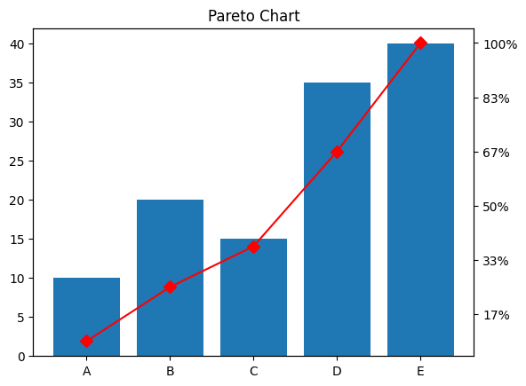
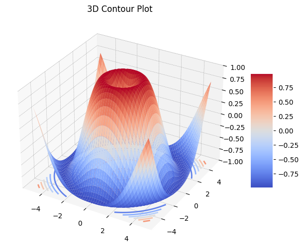

# `Matplotlib` 

_Python 視覺化工具，以下是常見的圖形類型_

<br>

## 折線圖（Line Plot）

1. 折線圖常用於顯示數據隨時間或順序變化的趨勢。

    ```python
    import matplotlib.pyplot as plt
    import numpy as np

    # 設定支持中文的字體，避免顯示錯誤
    plt.rcParams['font.sans-serif'] = ['Arial Unicode MS']
    # 用來正常顯示負號
    plt.rcParams['axes.unicode_minus'] = False

    # 模擬數據
    x = np.linspace(0, 10, 100)
    y = np.sin(x)

    # 繪製折線圖
    plt.plot(x, y)
    plt.title('Line Plot')
    plt.xlabel('X Axis')
    plt.ylabel('Y Axis')
    plt.show()
    ```

    

<br>

2. 使用了 twstock 模組來抓取台股的資料，並透過 matplotlib 來繪製折線圖；要先進行套件安裝 `pip install twstock`。

    ```python
    # 匯入所需的模組
    import twstock
    import matplotlib.pyplot as plt

    # 設定支持中文的字體，避免顯示錯誤
    plt.rcParams['font.sans-serif'] = ['Arial Unicode MS']
    # 用來正常顯示負號
    plt.rcParams['axes.unicode_minus'] = False

    # 獲取 TSMC（台積電）2330 的歷史股價數據
    tsmc = twstock.Stock('2330')

    # 獲取最近的 100 筆交易日的股價資料，從 2023 年 12 月開始
    stock_data = tsmc.fetch_from(2023, 12)

    # 提取日期與收盤價數據，將日期與收盤價分別儲存於 lists 中
    dates = [data.date for data in stock_data]
    closing_prices = [data.close for data in stock_data]

    # 繪製收盤價的折線圖，設定圖表大小為 10x6 英吋
    plt.figure(figsize=(10, 6)) 
    # 繪製折線圖，並以圓圈標記每個點
    plt.plot(
        dates, closing_prices, 
        marker='o', linestyle='-', 
        color='blue'
    )

    # 設定圖表標題與軸標籤
    plt.title(
        'TSMC 收盤價時間序列圖',
        fontsize=16, color='green'
    )
    # X 軸標籤
    plt.xlabel('日期', fontsize=12)
    # Y 軸標籤
    plt.ylabel('收盤價', fontsize=12)

    # 設定 X 軸的日期標籤，並將其旋轉 45 度，避免重疊
    plt.xticks(rotation=45)

    # 加入網格線，讓圖表更清晰
    plt.grid(True)

    # 自動調整子圖參數，避免標籤重疊
    plt.tight_layout()

    # 顯示圖表
    plt.show()
    ```

    

<br>

## 散點圖（Scatter Plot）

1. 散點圖展示數據點的分佈，通常用來觀察變數之間的關係。

    ```python
    # 模擬數據
    x = np.random.rand(50)
    y = np.random.rand(50)

    # 繪製散點圖
    plt.scatter(x, y)
    plt.title('Scatter Plot')
    plt.xlabel('X Axis')
    plt.ylabel('Y Axis')
    plt.show()
    ```

    

<br>

2. 通過添加顏色、大小和透明度來優化散點圖。

    ```python
    import matplotlib.pyplot as plt
    import numpy as np

    # 模擬數據
    x = np.random.rand(50)
    y = np.random.rand(50)
    # 隨機顏色
    colors = np.random.rand(50)
    # 隨機大小
    sizes = 1000 * np.random.rand(50)

    # 繪製散點圖
    plt.scatter(
        x, y, c=colors, s=sizes, alpha=0.5, cmap="viridis"
    )
    plt.title("Enhanced Scatter Plot")
    plt.xlabel("X Axis")
    plt.ylabel("Y Axis")
    # 添加顏色條
    plt.colorbar()
    plt.show()
    ```

    

<br>

3. 使用 mpl_toolkits.mplot3d 將散點圖擴展為 3D 圖形。這需要為每個點添加第三個維度（Z 軸數據）。

    ```python
    import matplotlib.pyplot as plt
    import numpy as np
    from mpl_toolkits.mplot3d import Axes3D

    # 模擬數據
    x = np.random.rand(50)
    y = np.random.rand(50)
    # 第三維數據
    z = np.random.rand(50)

    # 創建 3D 圖
    fig = plt.figure()
    ax = fig.add_subplot(111, projection='3d')

    # 繪製 3D 散點圖
    ax.scatter(
        x, y, z, c=z, cmap='viridis', s=100, alpha=0.6
    )

    # 設置標題和軸標籤
    ax.set_title('3D Scatter Plot')
    ax.set_xlabel('X Axis')
    ax.set_ylabel('Y Axis')
    ax.set_zlabel('Z Axis')

    plt.show()
    ```

    

<br>

## 柱狀圖（Bar Plot）

_或稱 `長條圖`_

<br>

1. 柱狀圖用於比較不同類別的數據。

    ```python
    # 模擬數據
    categories = ['A', 'B', 'C', 'D']
    values = [10, 15, 7, 10]

    # 繪製柱狀圖
    plt.bar(categories, values)
    plt.title('Bar Plot')
    plt.ylabel('Values')
    plt.show()
    ```

    

<br>

2. 橫向佈局。

    ```python
    import matplotlib.pyplot as plt
    import numpy as np

    # 模擬資料，關鍵字
    words = [
        'court appeal',
        'supreme court',
        'police officer',
        'civil right'
    ]
    # 模擬重要性數據
    importance = [0.01, 0.005, 0.008, 0.007] 
    # 模擬主題編號
    topics = [0, 1, 2, 1]

    # 定義顏色對應每個 topic
    colors = {0: 'red', 1: 'green', 2: 'blue'}

    # 繪製橫向長條圖
    plt.barh(
        words, importance, 
        color=[colors[t] for t in topics]
    )

    # 設定標題與軸標籤
    plt.title('Main Topics', fontsize=16)
    plt.xlabel('Word Importance')
    plt.ylabel('Word')

    # 顯示圖表
    plt.tight_layout()
    plt.show()
    ```

    

<br>

3. 適合處理複雜的數據，其中包含使用 plt.tight_layout() 自動調整佈局，確保圖表不會因為字詞過長而重疊。

    ```python
    import matplotlib.pyplot as plt
    import numpy as np

    # 模擬資料
    words = [
        'district court', 'court appeal', 'united state', 'u court', 'circuit affirmed', 
        'ninth circuit', 'en banc', 'supreme court', 'fifth circuit', 'federal court', 
        'u supreme', 'appeal u', 'fourth amendment', 'granted summary', 'violent felony', 
        'police officer', 'school district', 'summary judgment', 'funeral home', 'circuit court',
        'title vii', 'court decided', 'civil right', 'appellate court'
    ]
    # 模擬重要性數據
    importance = np.random.rand(len(words)) / 100

    # 為每個字詞分配主題編號 (Topic)
    topics = np.random.randint(0, 3, len(words))

    # 定義顏色對應每個 topic
    colors = {0: 'red', 1: 'green', 2: 'blue'}

    # 繪製橫向長條圖
    fig, ax = plt.subplots(figsize=(10, 6))

    # 將字詞與其對應的 Word Importance 值進行繪製
    ax.barh(
        words, importance,
        color=[colors[t] for t in topics]
    )

    # 設定標題與軸標籤
    ax.set_title('Main Topics', fontsize=16)
    ax.set_xlabel('Word Importance')
    ax.set_ylabel('Word')

    # 添加圖例來區分不同 Topic
    from matplotlib.patches import Patch
    legend_elements = [
        Patch(facecolor='red', label='Topic 0'),
        Patch(facecolor='green', label='Topic 1'),
        Patch(facecolor='blue', label='Topic 2')
    ]
    ax.legend(handles=legend_elements, title="Topic")

    # 自動調整圖表佈局以防止標籤重疊
    plt.tight_layout()

    # 顯示圖表
    plt.show()
    ```

    

<br>

## 直方圖（Histogram）

1. 直方圖用於顯示數據分佈的頻率，可以用來觀察數據的分佈模式。

    ```python
    # 模擬數據
    data = np.random.randn(1000)

    # 繪製直方圖
    plt.hist(data, bins=30)
    plt.title('Histogram')
    plt.xlabel('Value')
    plt.ylabel('Frequency')
    plt.show()
    ```

    

<br>

## 餅圖（Pie Chart）

1. 餅圖用於顯示各類別佔總數的比例。

    ```python
    # 模擬數據
    labels = ['A', 'B', 'C', 'D']
    sizes = [20, 30, 25, 25]

    # 繪製餅圖
    plt.pie(sizes, labels=labels, autopct='%1.1f%%')
    plt.title('Pie Chart')
    plt.show()
    ```

    

<br>

## 箱線圖（Box Plot）

1. 箱線圖顯示數據的分佈情況，包括中位數和四分位數範圍。

    ```python
    # 模擬數據
    data = [np.random.normal(0, std, 100) for std in range(1, 4)]

    # 繪製箱線圖
    plt.boxplot(data)
    plt.title('Box Plot')
    plt.show()
    ```

    

<br>

## 熱圖（Heatmap）

1. 熱圖用來顯示矩陣形式的數據，並通過顏色來表示數值的大小。

    ```python
    import seaborn as sns

    # 模擬數據
    data = np.random.rand(10, 10)

    # 繪製熱圖
    sns.heatmap(data, annot=True, cmap='coolwarm')
    plt.title('Heatmap')
    plt.show()
    ```

    

<br>

## 面積圖（Area Plot）

1. 面積圖展示累積數據的變化。

    ```python
    # 模擬數據
    x = np.arange(1, 6)
    y1 = np.array([3, 6, 9, 12, 15])
    y2 = np.array([2, 4, 6, 8, 10])

    # 繪製面積圖
    plt.fill_between(x, y1, label='y1', alpha=0.5)
    plt.fill_between(x, y2, label='y2', alpha=0.5)
    plt.title('Area Plot')
    plt.legend()
    plt.show()
    ```

    

<br>

## 堆積柱狀圖（Stacked Bar Plot）

1. 堆積柱狀圖顯示不同類別在總數中的構成。

    ```python
    # 模擬數據
    labels = ['A', 'B', 'C']
    x1 = [3, 2, 5]
    x2 = [4, 7, 1]

    # 繪製堆積柱狀圖
    plt.bar(labels, x1, label='X1')
    plt.bar(labels, x2, bottom=x1, label='X2')
    plt.title('Stacked Bar Plot')
    plt.legend()
    plt.show()
    ```

    

<br>

## 極區圖（Polar Plot）

1. 極區圖用於展示數據的角度和半徑。

    ```python
    # 模擬數據
    theta = np.linspace(0, 2*np.pi, 100)
    r = np.abs(np.sin(theta))

    # 繪製極區圖
    plt.polar(theta, r)
    plt.title('Polar Plot')
    plt.show()
    ```

    

<br>

## 雷達圖（Radar Chart）

1. 雷達圖主要用於顯示多個變量的表現，它通常應用於比較不同類別的多個維度。

    ```python
    import numpy as np
    import matplotlib.pyplot as plt
    from math import pi

    # 模擬數據
    categories = ['A', 'B', 'C', 'D', 'E']
    values = [4, 3, 2, 5, 4]

    # 計算角度
    N = len(categories)
    angles = [n / float(N) * 2 * pi for n in range(N)]
    values += values[:1]  # 閉合圖形
    angles += angles[:1]

    # 繪製雷達圖
    fig, ax = plt.subplots(figsize=(6, 6), subplot_kw=dict(polar=True))
    ax.fill(angles, values, color='blue', alpha=0.25)
    ax.plot(angles, values, color='blue', linewidth=2)
    ax.set_yticklabels([])

    # 設定軸標籤
    ax.set_xticks(angles[:-1])
    ax.set_xticklabels(categories)
    plt.title('Radar Chart')
    plt.show()
    ```

    

<br>

## 3D 分佈圖（3D Plot）

_這在散點圖時已結合使用過，這裡介紹 3D Plot 本身的基礎與進階用法_

<br>

1. 基礎的 3D 分佈圖，適合用於顯示三維數據的分佈情況，例如用於觀察數據點在三維空間中的分佈。

    ```python
    from mpl_toolkits.mplot3d import Axes3D

    # 模擬數據
    x = np.random.randn(100)
    y = np.random.randn(100)
    z = np.random.randn(100)

    # 繪製 3D 散點圖
    fig = plt.figure()
    ax = fig.add_subplot(111, projection='3d')
    ax.scatter(x, y, z)

    # 設定標籤
    ax.set_xlabel('X Label')
    ax.set_ylabel('Y Label')
    ax.set_zlabel('Z Label')
    plt.title('3D Scatter Plot')
    plt.show()
    ```

    

<br>

2. 添加其他圖形元素、提高顏色精度、使用漸變色、調整光照等。

    ```python
    import matplotlib.pyplot as plt
    import numpy as np
    from mpl_toolkits.mplot3d import Axes3D

    # 模擬數據
    x = np.random.rand(50)
    y = np.random.rand(50)
    z = np.random.rand(50)

    # 創建 3D 圖
    fig = plt.figure()
    ax = fig.add_subplot(111, projection='3d')

    # 繪製散點圖
    scatter = ax.scatter(
        x, y, z, c=z, cmap='cool', s=80, alpha=0.6, edgecolor='w'
    )

    # 添加顏色條
    cbar = plt.colorbar(scatter)
    cbar.set_label('Color Scale')

    # 設置標籤
    ax.set_xlabel('X Axis')
    ax.set_ylabel('Y Axis')
    ax.set_zlabel('Z Axis')
    plt.title('Enhanced 3D Scatter Plot')

    plt.show()
    ```

    

<br>

3. 結合 `plotly` 套件增強圖表的交互功能，可旋轉視角、縮放等，方便更直觀地觀察數據；先進行安裝相關套件。

    ```bash
    pip install plotly nbformat
    ```

<br>

4. 運行以下腳本，可嘗試使用滑鼠進行互動。

    ```python
    import plotly.graph_objs as go
    import numpy as np

    # 模擬數據
    x = np.random.randn(100)
    y = np.random.randn(100)
    z = np.random.randn(100)

    # 創建 3D 散點圖
    trace = go.Scatter3d(
        x=x, y=y, z=z,
        mode='markers',
        marker=dict(
            size=5,
            # 以 z 軸數據為基礎的顏色映射
            color=z,
            # 使用 Viridis 顏色圖譜
            colorscale='Viridis',
            opacity=0.8
        )
    )

    # 設定圖表布局
    layout = go.Layout(
        title='Interactive 3D Scatter Plot',
        scene=dict(
            xaxis_title='X Axis',
            yaxis_title='Y Axis',
            zaxis_title='Z Axis'
        )
    )

    # 繪製圖表
    fig = go.Figure(data=[trace], layout=layout)
    fig.show()
    ```

    

<br>

5. 如果要觀察數據的密度分佈，可在散點圖中疊加密度估計，並且將密度信息映射到點的顏色上，如此便可直觀地看到數據分佈的集中程度。

    ```python
    import numpy as np
    import matplotlib.pyplot as plt
    from scipy.stats import gaussian_kde
    from mpl_toolkits.mplot3d import Axes3D

    # 模擬數據
    x = np.random.randn(500)
    y = np.random.randn(500)
    z = np.random.randn(500)

    # 計算數據密度
    xyz = np.vstack([x, y, z])
    density = gaussian_kde(xyz)(xyz)

    # 繪製 3D 散點圖，根據密度設置顏色
    fig = plt.figure()
    ax = fig.add_subplot(111, projection='3d')

    # 散點圖
    ax.scatter(x, y, z, c=density, cmap='plasma', s=50)

    # 設置軸標籤
    ax.set_xlabel('X Label')
    ax.set_ylabel('Y Label')
    ax.set_zlabel('Z Label')
    plt.title('3D Scatter Plot with Density')

    plt.show()
    ```

    

<br>

6. 在 3D 散點圖中，除了散點，還可疊加平面或曲面來表示回歸結果或分佈趨勢，這樣能夠提供更多的信息，特別是對於機器學習中的數據可視化；以下代碼是在散點圖的基礎上，疊加了一個模擬的回歸平面，這樣可更好觀察數據的趨勢和模型的擬合情況。

    ```python
    import numpy as np
    import matplotlib.pyplot as plt
    from mpl_toolkits.mplot3d import Axes3D

    # 模擬數據
    x = np.random.randn(100)
    y = np.random.randn(100)
    # 模擬回歸關係
    z = x * 0.5 + y * 0.2 + np.random.randn(100) * 0.1 

    # 創建 3D 圖
    fig = plt.figure()
    ax = fig.add_subplot(111, projection='3d')

    # 散點圖
    ax.scatter(x, y, z, c='blue', s=50)

    # 創建回歸平面
    xx, yy = np.meshgrid(
        np.linspace(-3, 3, 50), np.linspace(-3, 3, 50)
    )
    # 模擬回歸平面
    zz = 0.5 * xx + 0.2 * yy
    ax.plot_surface(
        xx, yy, zz, alpha=0.3, 
        rstride=100, cstride=100, color='orange'
    )

    # 設置軸標籤
    ax.set_xlabel('X Label')
    ax.set_ylabel('Y Label')
    ax.set_zlabel('Z Label')
    plt.title('3D Scatter Plot with Regression Plane')

    plt.show()
    ```

    

<br>

## 3D 曲面圖（3D Surface Plot）

1. 3D 曲面圖常用於顯示函數的三維曲面，適合於觀察變數之間的複雜關係。

    ```python
    from mpl_toolkits.mplot3d import Axes3D

    # 模擬數據
    x = np.linspace(-5, 5, 50)
    y = np.linspace(-5, 5, 50)
    x, y = np.meshgrid(x, y)
    z = np.sin(np.sqrt(x**2 + y**2))

    # 繪製 3D 曲面圖
    fig = plt.figure()
    ax = fig.add_subplot(111, projection='3d')
    ax.plot_surface(x, y, z, cmap='viridis')

    # 設定標籤
    ax.set_xlabel('X Label')
    ax.set_ylabel('Y Label')
    ax.set_zlabel('Z Label')
    plt.title('3D Surface Plot')
    plt.show()
    ```

    

<br>

## 帕累托圖（Pareto Chart）

1. 帕累托圖展示數據值的排序以及累積百分比，通常用於分析主要因素。

    ```python
    from matplotlib.ticker import PercentFormatter

    # 模擬數據
    values = [10, 20, 15, 35, 40]
    categories = ['A', 'B', 'C', 'D', 'E']

    # 繪製帕累托圖
    fig, ax = plt.subplots()
    ax.bar(categories, values)

    # 累積百分比
    cumsum = np.cumsum(values)
    ax2 = ax.twinx()
    ax2.plot(categories, cumsum, color='red', marker='D', ms=7)
    ax2.yaxis.set_major_formatter(PercentFormatter(cumsum[-1]))

    plt.title('Pareto Chart')
    plt.show()
    ```

    

<br>

## 瀑布圖（Waterfall Chart）

1. 瀑布圖展示某些變量的累積效果，常用於財務分析。

    ```python
    import matplotlib.pyplot as plt
    import numpy as np

    # 模擬數據
    categories = ['Start', 'Increase 1', 'Increase 2', 'Decrease 1', 'Final']
    values = [1000, 300, 200, -400, 1100]

    # 計算累計效果
    y = np.zeros(len(values))
    y[1:] = np.cumsum(values[:-1])

    # 定義每個條形圖的顏色，根據正負值不同顯示不同顏色
    colors = ['green' if val >= 0 else 'red' for val in values]

    # 繪製條形圖
    plt.bar(categories, values, bottom=y, color=colors)

    # 添加標題和標籤
    plt.title('Waterfall Chart')
    plt.ylabel('Values')

    # 顯示圖形
    plt.show()
    ```

    

<br>

## 等高線圖（Contour Plot）

1. 等高線圖用於表示三維數據的二維投影，其中等高線代表數據中相同值的點。

    ```python
    # 模擬數據
    x = np.linspace(-5, 5, 50)
    y = np.linspace(-5, 5, 50)
    x, y = np.meshgrid(x, y)
    z = np.sin(np.sqrt(x**2 + y**2))

    # 繪製等高線圖
    plt.contour(x, y, z, cmap='coolwarm')
    plt.title('Contour Plot')
    plt.show()
    ```

    

<br>

2. 這種圖形在地形圖、氣象數據中非常有用，比如想分析一片地區的山脈，使用等高線圖可以直觀地看到不同區域的高度分佈。

    ```python
    import numpy as np
    import matplotlib.pyplot as plt

    # 模擬數據：x 和 y 為平面坐標，z 表示高度（例如地形的高度）
    x = np.linspace(-5, 5, 100)
    y = np.linspace(-5, 5, 100)
    x, y = np.meshgrid(x, y)

    # z 為高度，這裡模擬一個圓形波浪的高度分佈
    z = np.sin(np.sqrt(x**2 + y**2))

    # 繪製填充的等高線圖
    plt.contourf(x, y, z, cmap='coolwarm')

    # 添加等高線
    contours = plt.contour(x, y, z, colors='black')
    # 添加等高線標籤
    plt.clabel(contours, inline=True, fontsize=8) 

    # 添加標題
    plt.title('Filled Contour Plot with Labels')

    # 顯示圖表，顯示顏色條，對應不同的高度數值
    plt.colorbar()
    plt.show()
    ```

    

<br>

3. 等高線圖可以與 3D 圖相結合，使用 Matplotlib 中的 Axes3D 模塊來實現 3D 視角的效果，這樣可以在同一個圖中既展示 2D 等高線圖，又展示 3D 的數據分佈；在前面的範例中，使用了 `Axes3D` 繪圖，適用於基本的 3D 曲面圖顯示，主要目的是展示數據的三維結構，而不考慮等高線或其他細節，而這個同時包含高解析度數據、3D 曲面圖、2D 等高線圖，展示曲面和等高線的情況下，該腳本提供了更多的視覺細節和交互性。

    ```python
    import numpy as np
    import matplotlib.pyplot as plt
    from mpl_toolkits.mplot3d import Axes3D

    # 模擬數據
    x = np.linspace(-5, 5, 100)
    y = np.linspace(-5, 5, 100)
    x, y = np.meshgrid(x, y)
    z = np.sin(np.sqrt(x**2 + y**2))

    # 創建 3D 圖
    fig = plt.figure(figsize=(10, 6))
    ax = fig.add_subplot(111, projection='3d')

    # 繪製 3D 曲面圖
    ax.plot_surface(x, y, z, cmap='viridis', edgecolor='none', alpha=0.8)

    # 在底部繪製 2D 等高線圖
    ax.contour(x, y, z, zdir='z', offset=-1, cmap='coolwarm')

    # 設定視角
    ax.view_init(45, 240)

    # 標籤與標題
    ax.set_xlabel('X')
    ax.set_ylabel('Y')
    ax.set_zlabel('Z')
    ax.set_title('3D Contour Plot with Surface')

    # 顯示圖表
    plt.show()
    ```

    

<br>

___

_未完_