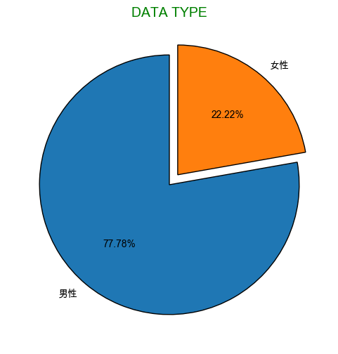

# 繪製懸浮餅圖

<br>

## 一般繪圖

1. 使用 `matplotlib` 和 `pandas` 模組來模擬數據並繪製餅圖。

    ```python
    import matplotlib.pyplot as plt
    import pandas as pd

    # 模擬數據
    data = {'男性': 77.78, '女性': 22.22}
    labels = data.keys()
    sizes = data.values()

    # 繪製餅圖
    plt.figure(figsize=(6, 6))
    plt.pie(
        sizes, 
        labels=labels, 
        autopct='%1.2f%%', 
        startangle=90, 
        colors=['#1f77b4', '#ff7f0e'], 
        wedgeprops={'edgecolor': 'black'}
    )

    # 添加標題
    plt.title("DATA TYPE", fontsize=14, color='green')

    # 顯示餅圖
    plt.show()
    ```

    

<br>

2. 強調特定區塊，使其懸浮。

    ```python
    import matplotlib.pyplot as plt

    # 模擬數據
    data = {'男性': 77.78, '女性': 22.22}
    labels = data.keys()
    sizes = data.values()

    # 使用 explode 讓 `女性` 區塊懸浮
    explode = (0, 0.1)

    # 繪製餅圖
    plt.figure(figsize=(6, 6))
    plt.pie(
        sizes,
        explode=explode,
        labels=labels,
        autopct='%1.2f%%',
        startangle=90, 
        colors=['#1f77b4', '#ff7f0e'],
        wedgeprops={'edgecolor': 'black'}
    )

    # 添加標題
    plt.title("DATA TYPE", fontsize=14, color='green')

    # 顯示餅圖
    plt.show()
    ```

    

<br>

3. 若要添加立體感，可透過增加邊框與陰影效果來達成。

    ```python
    import matplotlib.pyplot as plt

    # 模擬數據
    data = {'男性': 77.78, '女性': 22.22}
    labels = data.keys()
    sizes = data.values()

    # 使用 explode 讓 `女性` 區塊懸浮
    explode = (0, 0.1)

    # 繪製餅圖
    plt.figure(figsize=(6, 6))
    plt.pie(
        sizes,
        explode=explode,
        labels=labels,
        autopct='%1.2f%%',
        startangle=90, 
        colors=['#1f77b4', '#ff7f0e'],
        # 增加陰影效果
        shadow=True,  
        # 增加邊框來強調立體感
        wedgeprops={'edgecolor': 'black', 'linewidth': 1.5} 
    )

    # 添加標題
    plt.title("DATA TYPE", fontsize=14, color='green')

    # 顯示餅圖
    plt.show()
    ```

    

<br>

___

_END_