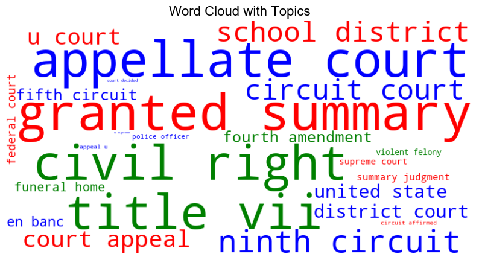

# 文字雲

_處理複雜文本數據時，可透過文字雲進行可視化_

<br>

## 說明

1. 安裝套件。

    ```bash
    pip install wordcloud
    ```

<br>

2. 使用 `wordcloud` 庫來生成文字雲，在以下的範例中，文字雲將根據單詞的重要性（`importance`）來調整每個單詞的字體大小，並可以根據 `topics` 來為不同的單詞著色。

    ```python
    import matplotlib.pyplot as plt
    from wordcloud import WordCloud
    import numpy as np

    # 模擬資料
    words = [
        'district court', 'court appeal', 'united state', 'u court', 'circuit affirmed', 
        'ninth circuit', 'en banc', 'supreme court', 'fifth circuit', 'federal court', 
        'u supreme', 'appeal u', 'fourth amendment', 'granted summary', 'violent felony', 
        'police officer', 'school district', 'summary judgment', 'funeral home', 'circuit court',
        'title vii', 'court decided', 'civil right', 'appellate court'
    ]
    # 模擬重要性數據
    importance = np.random.rand(len(words)) / 100

    # 為每個字詞分配主題編號 (Topic)
    topics = np.random.randint(0, 3, len(words))

    # 定義顏色對應每個 topic
    colors = {0: 'red', 1: 'green', 2: 'blue'}

    # 創建單詞和重要性字典，準備生成文字雲
    word_importance = {word: imp for word, imp in zip(words, importance)}

    # 自定義著色函數，根據 topic 來設置單詞的顏色
    def color_func(word, font_size, position, orientation, random_state=None, **kwargs):
        index = words.index(word)
        topic = topics[index]
        return colors[topic]

    # 生成文字雲
    wordcloud = WordCloud(
        width=800, height=400, 
        background_color='white', 
        color_func=color_func
    ).generate_from_frequencies(word_importance)

    # 顯示文字雲
    plt.figure(figsize=(10, 6))
    plt.imshow(wordcloud, interpolation='bilinear')
    plt.axis('off')
    plt.title('Word Cloud with Topics', fontsize=16)
    plt.show()
    ```

    

<br>

___

_END_