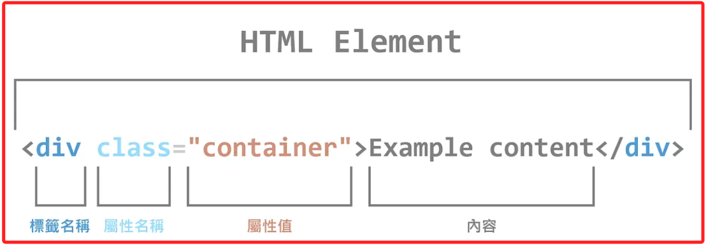
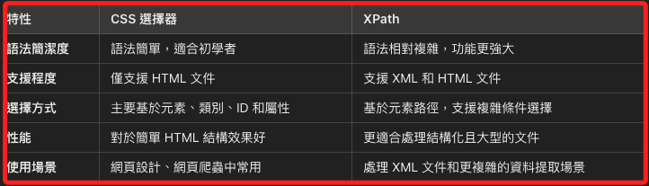

# CSS 選擇器

_CSS Selectors_



<br>

## 常見標籤

_在 HTML 中，除了部分是 `自閉合元素` 外，多數元素會有 `起始標籤` 與 `結束標籤`，標籤名稱決定元素的類型；以下列舉常用的幾個，更多元素介紹可參考 [W3 School](https://www.w3schools.com/tags/default.asp)。_

<br>

1. `div`：區塊。

2. `p`：段落文字。

3. `a`：超連結。

4. `input`：輸入框。

5. `button`：按鈕。

<br>

## 常見 HTML 屬性

1. `class`：為 HTML 元素指定一個或多個類別名稱，這些類別可以在 CSS 中用來設計樣式，或在 JavaScript 中用來搜尋和操作該元素，若有多個類名時以空格分隔；網頁爬蟲常使用 `class` 配合 CSS Selector 來定位和提取內容。

<br>

2. `id`：為 HTML 元素賦予唯一的標識符，用於在 CSS 中應用樣式，或在 JavaScript 中精準選取和操作單個元素；每個 `id` 必須在同一頁面中是唯一的。

<br>

3. `href`：用於指定超連結或資源的目標 URL，常見於 `<a>`（超連結）和 `<link>`（外部資源）標籤中，指向頁面或文件的目標位置。

<br>

## 自閉合元素

_如前所介紹，並非所有的 HTML 元素都有起始標籤和結束標籤_

<br>

1. HTML 元素依據是否有 `結素標籤` 分做兩類；第一類有明確的 `起始標籤` 與 `結束標籤`，該元素稱為 `成對標籤元素`， 例如 `<p></p>`、`<div></div>`、`<h1></h1>` 等，這類元素在開始和結束標籤間可放置內容。

    ```html
    <p>這是一個段落。</p>
    ```

<br>

2. 另一類是無需結束標籤的 `自閉合元素`，該標籤稱為 `自閉合標籤`，例如：``、`<input>`、`<br>`、`<hr>` 等；這類元素是 `沒有具體內容` 的單一標籤，通常只執行某個功能或表示一個狀態，例如換行、插入圖片、輸入欄位等，所以不需要顯式的結束標籤。

    ```html
    
    <br> <!-- 換行 -->
    ```

<br>

2. 關於自閉合元素的寫法，在 `HTML5` 中可簡單使用單個標籤表示，如 ``；而在 `XHTML` 中的寫法則需使用 `/` 來表示自閉合，如 ``，XHTML 是 XML 的一種應用，它將 HTML 的語法與 XML 的嚴格規範結合在一起，也就是 _遵循 XML 規範的 HTML_，而 XML 是用來定義資料結構的標記語言，其規則除所有標籤必須正確閉合，還有標籤名稱是區分大小寫的，例如 `<Div>` 和 `<div>` 會被視為不同的標籤；另外，屬性值必須用引號括起來，例如 `<input type="text" />` 中的屬性 `type` 的值 `"text"` 必須用引號括起來。

    ```html
    
    <br /> <!-- 換行 -->
    <input type="text" placeholder="輸入文字" />
    ```

<br>

## 說明

1. `CSS 選擇器` 是網頁中用來應用樣式的語法，可雙向用於設計網頁樣式與資料提取，尤其在網頁爬蟲中是一種直觀的工具；與 `XPath` 相似，但語法更簡單。

<br>

2. Python 提供多個工具來使用 CSS 選擇器進行網頁元素提取，最常用的庫是 `BeautifulSoup`。

<br>

3. 面對不同的情境時選擇合適的工具，若是處理 `結構化資料` 如 `XML` 時，`XPath` 可能會提供更多靈活性的功能。

<br>

## CSS 選擇器語法與用法

1. 基本元素選擇器：直接選擇特定標籤的所有元素。

    ```css
    /* 選擇所有 `<p>` 元素 */
    p { ... }
    ```

<br>

2. 類別選擇器：選擇具有特定 class 屬性的元素。

    ```css
    /* 選擇 class 為 `description` 的元素 */
    .classname { ... }
    ```

<br>

3. ID 選擇器：選擇具有特定 id 屬性的元素。

    ```css
    /* 選擇 id 為 `main` 的元素 */
    #idname { ... }
    ```

<br>

## 屬性選擇器

1. 根據元素的屬性進行選擇。

    ```css
    /*  */
    [attribute=value] { ... }
    ```

    _範例_

    ```css
    /* 選擇所有 `type="button"` 的 `<input>` 元素 */
    input[type="button"] { ... }
    ```

<br>

## 組合選擇器

1. 後代選擇器：選擇元素的所有後代元素。

    ```css
    /* 選擇所有位於 `<div>` 中的 `<p>` 元素 */
    div p { ... }
    ```

<br>

2. 子選擇器：選擇元素的直接子元素。

    ```css
    /* 選擇所有 `<div>` 的直接子元素 `<p>` */
    div > p { ... }
    ```

<br>

3. 緊鄰兄弟選擇器：選擇緊鄰的兄弟元素。

    ```css
    /* 選擇緊接在 `<h1>` 後的第一個 `<p>` */
    h1 + p { ... }
    ```

<br>

4. 一般兄弟選擇器：選擇所有的兄弟元素。

    ```css
    /* 選擇所有在 `<h1>` 之後的 `<p>` 元素 */
    h1 ~ p { ... }
    ```

<br>

## `BeautifulSoup`

_比 `XPath` 語法更簡潔，且更適合處理 `HTML` 結構_

<br>

1. 安裝 BeautifulSoup。

    ```bash
    pip install beautifulsoup4
    ```

<br>

2. 範例：使用元素選擇器。

    ```python
    from bs4 import BeautifulSoup

    html_content = """
    <html>
      <body>
        <h1>網站標題</h1>
        <p>這是一段文字。</p>
        <p>這是另一段文字。</p>
      </body>
    </html>
    """

    # 使用 BeautifulSoup 解析 HTML
    soup = BeautifulSoup(html_content, 'html.parser')

    # 使用 `soup.select('p')`
    # 可以選擇所有的 `<p>` 標籤，並提取其文本內容
    paragraphs = soup.select('p')
    for p in paragraphs:
        print("段落內容:", p.text)
    ```

    _輸出結果_

    ```bash
    段落內容: 這是一段文字。
    段落內容: 這是另一段文字。
    ```

<br>

3. 範例：使用類別選擇器。

    ```python
    html_content = """
    <html>
      <body>
        <div class="header">
          <h1>網站標題</h1>
        </div>
        <p class="description">這是一段範例描述。</p>
        <p>這是一般段落。</p>
      </body>
    </html>
    """

    # 使用 BeautifulSoup 解析 HTML
    soup = BeautifulSoup(html_content, 'html.parser')

    # 使用 `.description` 選擇 class 為 `description` 的元素
    description = soup.select('.description')
    for d in description:
        print("描述段落:", d.text)
    ```

    _輸出結果_

    ```bash
    描述段落: 這是一段範例描述。
    ```

<br>

4. 範例：使用 ID 選擇器與屬性選擇器。

    ```python
    html_content = """
    <html>
      <body>
        <div id="main">
          <h1>網站標題</h1>
          <input type="text" name="username" value="admin">
          <input type="password" name="password" value="123456">
          <input type="submit" value="Login">
        </div>
      </body>
    </html>
    """

    # 使用 BeautifulSoup 解析 HTML
    soup = BeautifulSoup(html_content, 'html.parser')

    # 使用 `#main` 選擇 id 為 `main` 的 `<div>`
    main_div = soup.select('#main')
    print("主內容區:", main_div[0].text.strip())

    # 使用 `input[type="text"]`
    # 選擇所有 `type="text"` 的 `<input>` 元素
    text_inputs = soup.select('input[type="text"]')
    for input_tag in text_inputs:
        print("文字輸入框的值:", input_tag['value'])
    ```

    _輸出結果_

    ```bash
    主內容區: 網站標題Login
    文字輸入框的值: admin
    ```

<br>

5. 使用組合選擇器。

    ```python
    html_content = """
    <html>
      <body>
        <div class="content">
          <h1>網站標題</h1>
          <p>第一段文字</p>
          <p>第二段文字</p>
        </div>
        <div class="footer">
          <p>網站版權資訊</p>
        </div>
      </body>
    </html>
    """

    # 使用 BeautifulSoup 解析 HTML
    soup = BeautifulSoup(html_content, 'html.parser')

    # 使用後代選擇器選擇 class 為 content 的 div 中的所有段落
    # 使用 `.content p`
    # 選擇 `.content` 中所有 `<p>` 元素（後代選擇器）
    content_paragraphs = soup.select('.content p')
    for p in content_paragraphs:
        print("內容區段落:", p.text)

    # 使用子選擇器選擇 class 為 footer 的 div 中的直接子段落
    # 使用 `.footer > p`
    # 選擇 `.footer` 中的直接子元素 `<p>`（子選擇器）
    footer_paragraph = soup.select('.footer > p')
    for p in footer_paragraph:
        print("頁腳區段落:", p.text)
    ```

    _輸出結果_

    ```bash
    內容區段落: 第一段文字
    內容區段落: 第二段文字
    頁腳區段落: 網站版權資訊
    ```

<br>

## CSS 選擇器 vs XPath

_參考下表說明_

<br>



<br>

___

_END_