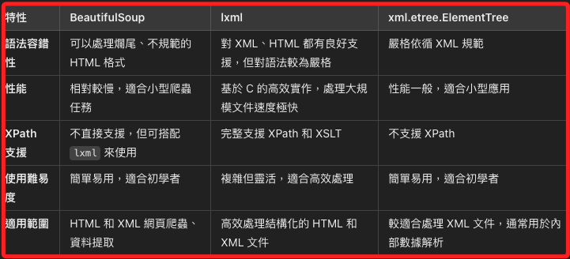

# 正向解析

_Parsing Libraries_


1. `正向解析` 是指用來讀取、解析並處理結構化數據的工具。這些解析器可以將 XML、HTML 等文件結構轉換成程式可以理解的樹狀結構，以便從中提取資料或進行修改。正向解析的重點在於根據文件的語法和結構，將其轉換成程式語言的數據結構。

在 Python 中，有多個常見的解析庫可以用來處理 XML 和 HTML 文件，包括 `BeautifulSoup`、`lxml` 和 `xml.etree.ElementTree`，每個庫有不同的優勢和適用場景。

---

### 常見解析庫與結構解析

#### 1. `BeautifulSoup`
   - 用途：用來解析 HTML 和 XML 文件，主要針對不完整或格式不嚴格的 HTML 文件進行解析和處理。
   - 優勢：`BeautifulSoup` 能夠處理破損或不規範的 HTML，並能以簡單直觀的語法輕鬆提取資料，對於網頁爬蟲特別有用。
   - 常用情境：適合初學者以及處理爛尾、格式不嚴謹的網頁結構。

#### 2. `lxml`
   - 用途：支援完整的 XML 和 HTML 文件解析，性能優異，能夠處理大規模的結構化數據。
   - 優勢：`lxml` 是基於 C 的高效庫，提供了更快速的解析速度，並且完整支援 XPath 和 XSLT 等強大的 XML 操作工具。
   - 常用情境：適合處理結構嚴謹的 XML/HTML 文件，尤其是對速度有高要求的應用。

#### 3. `xml.etree.ElementTree`
   - 用途：Python 標準庫內建的 XML 解析器，用於解析 XML 文件，適合處理較小且結構化的 XML 文件。
   - 優勢：由於是 Python 內建庫，無需額外安裝。語法簡單，適合處理小型 XML 文件。
   - 常用情境：適合初學者以及不需要外部庫的小型應用，通常用於處理標準化的 XML 文件。

---

### 各解析庫的差異性



---

### Python 範例程式碼

#### 1. `BeautifulSoup` 的使用範例

使用 `BeautifulSoup` 解析 HTML 文件並提取標題與段落文字：
```python
from bs4 import BeautifulSoup

html_content = """
<html>
  <head><title>網站標題</title></head>
  <body>
    <p class="description">這是一段範例文字。</p>
    <p>這是另一段範例文字。</p>
  </body>
</html>
"""

# 初始化 BeautifulSoup 解析器
soup = BeautifulSoup(html_content, 'html.parser')

# 提取標題
title = soup.title.string
print("標題:", title)

# 提取所有段落文字
paragraphs = soup.find_all('p')
for p in paragraphs:
    print("段落:", p.text)
```

輸出結果：
```
標題: 網站標題
段落: 這是一段範例文字。
段落: 這是另一段範例文字。
```

解析：`BeautifulSoup` 使得操作 HTML 文件非常簡單，甚至可以處理結構不完整的 HTML 文件。

---

#### 2. `lxml` 的使用範例

使用 `lxml` 解析 HTML 並使用 XPath 提取元素：
```python
from lxml import html

html_content = """
<html>
  <body>
    <div id="main">
      <h1>網站標題</h1>
      <p>這是一段範例文字。</p>
      <ul>
        <li>項目一</li>
        <li>項目二</li>
      </ul>
    </div>
  </body>
</html>
"""

# 解析 HTML 文件
tree = html.fromstring(html_content)

# 使用 XPath 提取標題
title = tree.xpath('//h1/text()')[0]
print("標題:", title)

# 提取列表項目
list_items = tree.xpath('//ul/li/text()')
print("列表項目:", list_items)
```

輸出結果：
```
標題: 網站標題
列表項目: ['項目一', '項目二']
```

解析：`lxml` 支援 XPath，因此可以輕鬆且高效地提取指定元素，適合處理大型且結構嚴謹的文件。

---

#### 3. `xml.etree.ElementTree` 的使用範例

使用 `xml.etree.ElementTree` 解析 XML 並提取資料：
```python
import xml.etree.ElementTree as ET

xml_content = """
<catalog>
  <book id="bk101">
    <author>John Doe</author>
    <title>Python Programming</title>
    <price>29.99</price>
  </book>
  <book id="bk102">
    <author>Jane Smith</author>
    <title>Advanced Machine Learning</title>
    <price>39.99</price>
  </book>
</catalog>
"""

# 解析 XML 文件
root = ET.fromstring(xml_content)

# 提取書籍標題和價格
for book in root.findall('book'):
    title = book.find('title').text
    price = book.find('price').text
    print(f"書名: {title}, 價格: {price}")
```

輸出結果：
```
書名: Python Programming, 價格: 29.99
書名: Advanced Machine Learning, 價格: 39.99
```

解析：`xml.etree.ElementTree` 非常適合用來處理小型 XML 文件，使用簡單且輕量。

---

### 總結

- `BeautifulSoup` 是解析 HTML 文件的首選，特別適合處理不規範的網頁結構。
- `lxml` 是高效的 XML 和 HTML 解析器，支援 XPath，適合處理大型文件並進行高效資料提取。
- `xml.etree.ElementTree` 是 Python 標準庫的一部分，簡單易用，適合處理結構化的 XML 文件，但對 HTML 支援有限。

每個庫在不同的解析場景中各有優勢，可以根據具體的需求選擇最適合的工具。