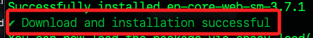
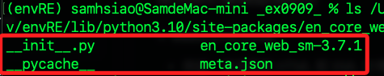

# ML 與 RE

_使用機器學習模型輔助正則表達式進行資料提取_

<br>

## 說明

1. 在資料提取工作中，正則表達式（RE） 非常適合處理結構化和半結構化資料，如特定格式的 `日期、郵件地址、電話號碼`等；然而，當文本數據更加 `非結構化` 如自然語言文本，正則表達式可能無法處理複雜的上下文關係；在這些情況下，機器學習模型可以輔助正則表達式更精確地提取所需的資料，特別是在 `命名實體識別（Named Entity Recognition，NER）`等應用中。

<br>

2. 當資料提取涉及更複雜的語言模式或上下文依賴時，如提取人名、地名、組織名稱等，或是當正則表達式過於繁瑣或難以管理時，可以結合機器學習模型進行初步篩選，然後用正則表達式做精細匹配。

<br>

## 範例

1. 以下範例將使用機器學習模型如 `spaCy` 的命名實體識別模型來輔助正則表達式提取電子郵件地址與人名，機器學習模型會先進行初步的資料提取，正則表達式則用來進行具體格式的資料過濾；具體步驟大致為先使用 `spaCy` 來辨識文本中的人名，然後使用正則表達式從文本中提取電子郵件地址，最後結合兩者的結果來完成複雜資料的提取。

<br>

2. 安裝所需套件，使用 `spaCy` 進行命名實體識別、使用 `re` 來處理正則表達式。

   ```bash
   pip install spacy
   ```

<br>

3. 下載模型。

   ```bash
   python -m spacy download en_core_web_sm
   ```

   

<br>

4. 查看模型路徑。

   ```python
   import spacy
   print(spacy.util.get_package_path('en_core_web_sm'))
   ```

   _輸出_

   ```bash
   /Users/samhsiao/Documents/PythonVenv/envRE/lib/python3.10/site-packages/en_core_web_sm
   ```

<br>

5. 查詢。

   ```bash
   ls /Users/samhsiao/Documents/PythonVenv/envRE/lib/python3.10/site-packages/en_core_web_sm
   ```

   

<br>

6. 程式碼。

   ```python
   import re
   import spacy

   # 初始化 spaCy 模型：加載 en_core_web_sm 模型
   # 這是一個通用的英文模型，能識別文本中的人名、地名、組織名稱等
   nlp = spacy.load("en_core_web_sm")

   # 模擬一段文本，其中包含電子郵件地址與人名
   text = """
   Please contact John Doe at john.doe@example.com for further information.
   Alternatively, you can reach Jane Smith via jane.smith@sample.org.
   Thank you!
   """

   # 步驟 1：使用正則表達式提取電子郵件地址
   #  以下這個模式可匹配大多數標準的電子郵件格式
   email_pattern = r'[a-zA-Z0-9._%+-]+@[a-zA-Z0-9.-]+\.[a-zA-Z]{2,}'
   # 抓取所有符合此模式的電子郵件地址
   emails = re.findall(email_pattern, text)

   # 步驟 2：使用 spaCy 模型提取人名
   doc = nlp(text)
   # doc.ents 是 spaCy 提取出的實體
   # 透過 ent.label_ == "PERSON" 可以篩選出被標註為人名的實體
   persons = [ent.text for ent in doc.ents if ent.label_ == "PERSON"]

   # 輸出
   print("提取的電子郵件地址：", emails)
   print("提取的人名：", persons)

   # 結合兩者，進行進階的處理或篩選
   for person, email in zip(persons, emails):
      print(f"{person} 的電子郵件是：{email}")
   ```

<br>

7. 輸出如下，將正則表達式提取的電子郵件與 NER 提取的人名結合，進一步進行篩選或關聯；這便是機器學習與正則表達式結合的典型應用場景。

   ```bash
   提取的電子郵件地址： ['john.doe@example.com', 'jane.smith@sample.org']
   提取的人名： ['John Doe', 'Jane Smith']
   John Doe 的電子郵件是：john.doe@example.com
   Jane Smith 的電子郵件是：jane.smith@sample.org
   ```

<br>

___

_END_