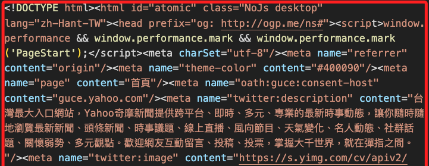
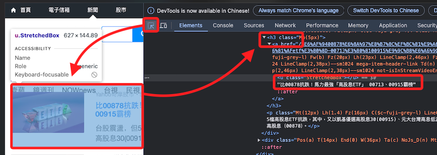
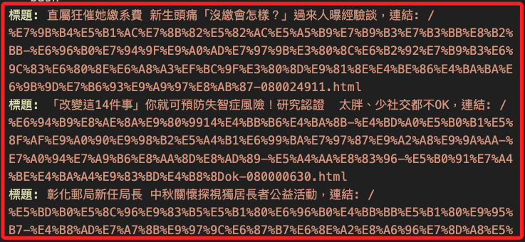
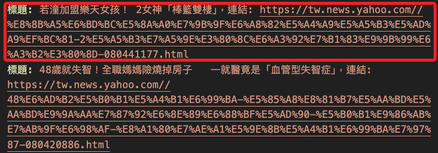
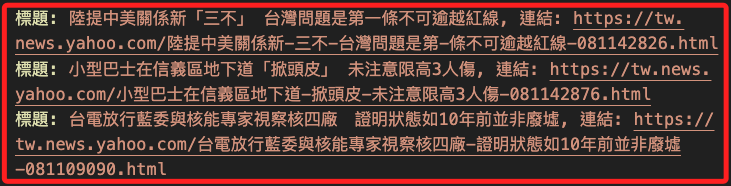

# 探索 Yahoo 新聞

<br>

## 環境

1. 更新 pip。

    ```bash
    pip install --upgrade pip
    ```

<br>

2. 安裝必要套件。

    ```bash
    pip install requests
    pip install lxml
    pip install beautifulsoup4
    ```

<br>

## 編輯腳本

1. [Yahoo 台灣新聞首頁](https://tw.news.yahoo.com/)。

    

<br>

2. 取得 HTML 文本，觀察前 `1000` 個字元。

    ```python
    import requests

    # 目標網址
    url = 'https://tw.news.yahoo.com/'

    # 使用 requests 下載網頁內容
    response = requests.get(url)

    # 輸出 HTML 內容來觀察，可限制長度以免輸出過多
    print(response.text[:1000])
    ```

    

<br>

3. 擷取目標是 `各家新聞` 裡面的標題。 

    

<br>

4. 在網頁瀏覽器中的點擊右鍵中的 `檢查`，根據 CSS 選擇器，可從 `<div>`、`<h3>` 或者 `<a>` 標籤中提取資訊。

    

<br>

5. 嘗試提取所有 h3 內的 a 標籤。

    ```python
    import requests
    from bs4 import BeautifulSoup

    # 目標網址
    url = 'https://tw.news.yahoo.com/'

    # 使用 requests 下載網頁內容
    response = requests.get(url)

    # 確認請求成功
    if response.status_code == 200:
        # 使用 BeautifulSoup 解析 HTML 內容
        soup = BeautifulSoup(response.text, 'html.parser')
        
        # 新聞標題位於 h3 標籤內
        headlines = soup.select('h3 a')
        
        # 遍歷
        for headline in headlines:
            # 輸出 a 標籤純文本內容以及連結
            title = headline.get_text()
            link = headline['href']
            print(f"標題: {title}，連結: {link}")
    else:
        print(f"無法下載網頁，狀態碼: {response.status_code}")
    ```

    _輸出_

    

<br>

6. 使用 `正則表達式` 處理提取到的 `連結`，將它們轉換為完整的 URL。

    ```python
    import requests
    from bs4 import BeautifulSoup
    import re

    # 目標網址，也是 Yahoo 的基本域名，將用於正則表達
    url = 'https://tw.news.yahoo.com/'

    # 使用 requests 下載網頁內容
    response = requests.get(url)

    # 確認請求成功
    if response.status_code == 200:
        # 使用 BeautifulSoup 解析 HTML 內容
        soup = BeautifulSoup(response.text, 'html.parser')
        
        # 新聞標題位於 h3 標籤內
        headlines = soup.select('h3 a') 
        
        for headline in headlines:
            # 提取新聞標題與相對連結
            title = headline.get_text()
            link = headline['href']
            
            # 使用正則表達式處理相對連結，將其轉換為完整的 URL
            if not link.startswith('http'):
                full_url = re.sub(r'^/', url + '/', link)
            else:
                full_url = link
            
            # 輸出
            print(f"標題: {title}，連結: {full_url}")
    else:
        print(f"無法下載網頁，狀態碼: {response.status_code}")
    ```

    

<br>

7. 解析後，網址部分依舊 `百分比編碼`，使用 Python 中的 urllib.parse.unquote() 函數來解碼這些 URL 中的百分比編碼，使其變得可讀，並使用 `urllib.parse.urljoin(url, link)` 將相對路徑如 `/news/xxxx` 與基本 URL 合併為完整 URL。

    ```python
    import requests
    from bs4 import BeautifulSoup
    import urllib.parse

    # Yahoo 台灣新聞首頁
    url = 'https://tw.news.yahoo.com/'

    # 使用 requests 下載網頁內容
    response = requests.get(url)

    # 確認請求成功
    if response.status_code == 200:
        # 使用 BeautifulSoup 解析 HTML 內容
        soup = BeautifulSoup(response.text, 'html.parser')
        
        # 假設新聞標題位於 h3 標籤內
        headlines = soup.select('h3 a')  # 提取所有 h3 內的 a 標籤
        
        for headline in headlines:
            # 提取新聞標題與相對連結
            title = headline.get_text()
            link = headline['href']
            
            # 構造完整 URL
            full_url = urllib.parse.urljoin(url, link)
            
            # 將 URL 進行解碼轉換為人類可讀的文字
            decoded_url = urllib.parse.unquote(full_url)
            
            # 輸出新聞標題與解碼後的完整連結
            print(f"標題: {title}, 連結: {decoded_url}")
    else:
        print(f"無法下載網頁，狀態碼: {response.status_code}")
    ```

    _輸出_

    

<br>

8. 補充說明，`百分比編碼（Percent-Encoding）` 的用意是將特殊字元或非 ASCII 字元轉換為 URL 安全的格式，以便在 URL 中正確傳輸和解讀，這是因為 URL 中只能包含有限的一些字元，如字母、數字、-、_、. 和 / 等，而其他字元如空格、中文、特殊符號等必須進行編碼，以避免混淆或出錯，經過百分比編碼的字元以 `%` 開頭，後面跟隨該字元的十六進位表示。

<br>

___

_END_