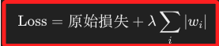
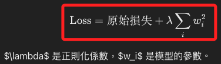
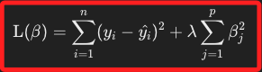
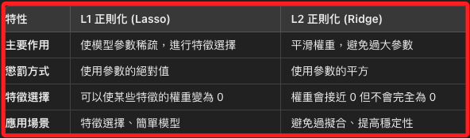
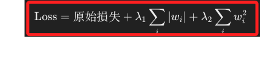
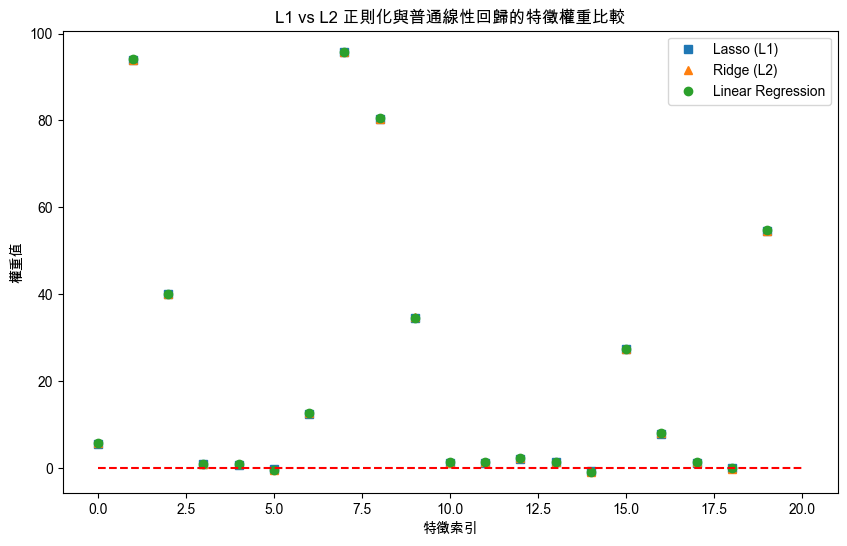

# 正則化

_L1 & L2_

<br>

## 說明

1. 在機器學習中，`L1 和 L2 正則化` 是兩種常見的正則化技術，它們主要用來 `防止模型過擬合（overfitting）`，即模型在訓練資料上表現很好，但在測試資料或新資料上表現較差。

<br>

2. 這兩種方法透過在 `損失函數（loss function）` 中添加一項 `懲罰項`，來限制模型參數的大小或複雜度，從而提高模型的泛化能力。

<br>

3. 安裝套件。

    ```bash
    pip install scikit-learn matplotlib
    ```

<br>

## L1 正則化

_Lasso Regression，套索迴歸_

<br>

1. L1 正則化透過在損失函數中加入權重的 `L1 範數（L1 norm）`，即 `所有權重絕對值之和`。

<br>

2. L1 正則化的公式。

    

<br>

3. 在效果上，L1 正則化會將一些不重要的權重變為 0，從而使模型變得稀疏，這表示 L1 正則化能夠同時進行特徵選擇，因為一些特徵的權重可能會完全消失。

<br>

4. 在機器學習中，`Lasso` 是 `Least Absolute Shrinkage and Selection Operator` 的縮寫，也就是 `最小絕對收縮與選擇運算子`，或稱 `套索算法`；這個技術是用來進行 `線性迴歸` 的一種變數選擇方法，Lasso 會將一些係數逼近為零，這樣可以同時達到變數選擇和縮減模型的複雜度的目的，以套索的意思來說，象徵模型將不重要的變數套住並縮減它們的影響，達到簡化模型的效果。

<br>

## L2 正則化

_Ridge Regression，嶺迴歸_

<br>

1. `L2 正則化` 是透過在 `損失函數` 中加入正則化項，而這個正則化項是 `所有權重係數的平方和`，也稱為 `L2 範數（L2 norm）`，目的是防止模型過度擬合；就字面上的`Ridge` 原意是 `山脊`，象徵優化過程中加上的懲罰就像是 `跨過一個山脊` 來避免過度擬合的問題。

    

<br>

2. 在效果上，`L2 正則化` 會將不重要的權重逼近 0，但不會完全變為 0，L2 會均勻地減少權重，使模型更加穩定，防止過於依賴某些特徵；從數學上來說，`L2 正則化` 通過最小化 `均方誤差` 與 `權重係數的平方和` 的總和，來實現模型的穩健性，這樣當變數之間存在共線性或模型過度擬合時，Ridge 透過縮小回歸係數來改善模型的泛化能力。

    

<br>

## L1 vs L2

    

<br>

## Elastic Net 正則化

1. Elastic Net 是將 L1 和 L2 正則化的優點結合在一起，既能夠進行特徵選擇，又能夠防止模型參數過度縮小。

    

<br>

2. 在效果上，Elastic Net 可以同時進行特徵選擇和參數的平滑調整，適合用在高維度數據且特徵之間存在高度相關性的情況。

<br>

## 其他正則化技術

1. Dropout 正則化：主要用於神經網路中，隨機移除神經元來防止過擬合。

<br>

2. Early Stopping：在模型訓練過程中監測驗證集損失，一旦損失開始增加，就停止訓練，防止過擬合。

<br>

3. Data Augmentation：通過生成更多的數據樣本來增加訓練數據的多樣性，防止模型過擬合。

<br>

## 範例

_以下是在線性迴歸中，使用 `scikit-learn` 來進行 L1 和 L2 正則化的範例_

<br>

1. 使用 L1 正則化。

    ```python
    from sklearn.linear_model import Lasso
    from sklearn.model_selection import train_test_split
    from sklearn.datasets import make_regression

    # 生成一個範例回歸數據集
    X, y = make_regression(
      n_samples=100, n_features=10, noise=0.1, random_state=42
    )

    # 分割數據集為訓練集和測試集
    X_train, X_test, y_train, y_test = train_test_split(
      X, y, test_size=0.2, random_state=42
    )

    # 初始化 Lasso 模型 (L1 正則化)
    lasso = Lasso(alpha=0.1)

    # 訓練模型
    lasso.fit(X_train, y_train)

    # 評估模型
    score = lasso.score(X_test, y_test)
    print(f"Lasso 模型準確度: {score}")
    ```

    _輸出_

    ```bash
    Lasso 模型準確度: 0.9999969484195118
    ```

<br>

2. 使用 L2 正則化。

    ```python
    from sklearn.linear_model import Ridge

    # 初始化 Ridge 模型 (L2 正則化)
    ridge = Ridge(alpha=0.1)

    # 訓練模型
    ridge.fit(X_train, y_train)

    # 評估模型
    score = ridge.score(X_test, y_test)
    print(f"Ridge 模型準確度: {score}")
    ```

    _輸出_

    ```bash
    Ridge 模型準確度: 0.9999975776543794
    ```

<br>

## 三種模式比較

1. 程式碼。

    ```python
    import numpy as np
    import matplotlib.pyplot as plt
    from sklearn.linear_model import (
      Lasso, Ridge, LinearRegression
    )
    from sklearn.model_selection import train_test_split
    from sklearn.datasets import make_regression

    # 設定支持中文的字體，避免顯示錯誤
    plt.rcParams["font.sans-serif"] = ["Arial Unicode MS"]
    # 用來正常顯示負號
    plt.rcParams["axes.unicode_minus"] = False

    # 生成一個具有噪聲和冗餘特徵的回歸數據集
    X, y = make_regression(
      n_samples=100, n_features=20,
      noise=10, random_state=42
    )

    # 分割數據集為訓練集和測試集
    X_train, X_test, y_train, y_test = train_test_split(
        X, y, test_size=0.2,
        random_state=42
    )

    # 初始化三個模型
    # Lasso（L1 正則化）
    lasso = Lasso(alpha=0.1)
    # Ridge（L2 正則化）
    ridge = Ridge(alpha=0.1)
    # 普通線性回歸（無正則化）
    linear_reg = LinearRegression()

    # 訓練模型
    lasso.fit(X_train, y_train)
    ridge.fit(X_train, y_train)
    linear_reg.fit(X_train, y_train)

    # 評估模型
    lasso_score = lasso.score(X_test, y_test)
    ridge_score = ridge.score(X_test, y_test)
    linear_reg_score = linear_reg.score(X_test, y_test)

    print(f"Lasso 模型準確度: {lasso_score}")
    print(f"Ridge 模型準確度: {ridge_score}")
    print(f"普通線性回歸模型準確度: {linear_reg_score}")

    # 打印每個模型的權重（係數）
    print("\nLasso 模型權重:", lasso.coef_)
    print("\nRidge 模型權重:", ridge.coef_)
    print("\n普通線性回歸模型權重:", linear_reg.coef_)

    # 視覺化特徵權重
    plt.figure(figsize=(10, 6))
    plt.plot(lasso.coef_, "s", label="Lasso (L1)")
    plt.plot(ridge.coef_, "^", label="Ridge (L2)")
    plt.plot(linear_reg.coef_, "o", label="Linear Regression")
    plt.hlines(0, 0, 20, colors="r", linestyles="dashed")
    plt.xlabel("特徵索引")
    plt.ylabel("權重值")
    plt.legend()
    plt.title("L1 vs L2 正則化與普通線性回歸的特徵權重比較")
    plt.show()
    ```

<br>

2. 圖形顯示。

    

<br>

3. 數據顯示模型準確度，從結果來看，`L1（Lasso）`、`L2（Ridge）` 和 `普通線性回歸` 在這個特定的數據集上，模型準確度非常接近，幾乎沒有顯著差異，這說明在這個數據集上，並不能說 L1 或 L2 正則化一定比普通線性回歸更好。

    ```bash
    Lasso     模型準確度: 0.9909893261589957
    Ridge     模型準確度: 0.9909262771832699
    普通線性回歸模型準確度: 0.9909439489679167

    Lasso 模型權重: [ 5.53379003e+00  9.39491221e+01  3.99912190e+01  7.76221043e-01
      7.47509154e-01 -3.64135406e-01  1.23758899e+01  9.57080467e+01
      8.04231108e+01  3.44772457e+01  1.07587684e+00  1.18041032e+00
      2.11292177e+00  1.25075268e+00 -7.02598739e-01  2.73810828e+01
      7.87642179e+00  1.19714356e+00 -3.88465650e-02  5.45201691e+01]

    Ridge 模型權重: [ 5.68073036 93.92981128 40.04476337  0.82806665  0.99424193 -0.55561376
    12.53772007 95.63596897 80.36387126 34.61808111  1.20854332  1.38111659
      2.31954794  1.40195515 -0.89853076 27.41137779  7.99951876  1.25436865
    -0.18232764 54.55055775]

    普通線性回歸模型權重: [ 5.67967903 94.0225149  40.12270665  0.79090588  0.9906183  -0.5469879
    12.57050486 95.81154364 80.48535992 34.60293171  1.24152143  1.369508
      2.27832545  1.42568345 -0.88043861 27.44672945  8.0178409   1.29256083
    -0.14809805 54.66769774]
    ```

<br>

4. `紅色虛線` 代表的是權重的基準線 `0`，在回歸模型中，當某個特徵的權重接近或等於 0 時，這表明該特徵對模型的輸出沒有顯著影響；具體來說，`Lasso 模型（L1 正則化）` 傾向於將不重要的特徵權重壓縮為 0，從而進行特徵選擇；`Ridge 模型（L2 正則化）` 則會對所有特徵施加懲罰，但不會將權重完全變為 0；而普通線性回歸不進行正則化，因此所有特徵的權重都可能不為 0。

<br>

5. L1 和 L2 正則化通常在模型出現過擬合（overfitting）時使用，當模型在訓練集上表現得很好，但在測試集或新數據上表現較差時，表示模型過度擬合了訓練數據，學到了過多的噪音和不必要的細節；這時通過在模型的損失函數中加入懲罰項（L1 或 L2），可以限制模型的過度擬合行為，從而提高模型在測試集或新數據上的泛化能力。

<br>

___

_END_