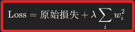

# 正則化

_L1 & L2_

<br>

## 說明

1. 在機器學習中，`L1 和 L2 正則化` 是兩種常見的正則化技術，它們主要用來 `防止模型過擬合（overfitting）`，即模型在訓練資料上表現很好，但在測試資料或新資料上表現較差。

<br>

2. 這兩種方法透過在 `損失函數（loss function）` 中添加一項 `懲罰項`，來限制模型參數的大小或複雜度，從而提高模型的泛化能力。

<br>

## L1 正則化

_Lasso Regression_

<br>

1. L1 正則化透過在損失函數中加入權重的 `L1 範數（L1 norm）`，即 `所有權重絕對值之和`。

<br>

2. L1 正則化的公式。

    

<br>

3. 在效果上，L1 正則化會將一些不重要的權重變為 0，從而使模型變得稀疏，這表示 L1 正則化能夠同時進行特徵選擇，因為一些特徵的權重可能會完全消失。

<br>

## L2 正則化

_Ridge Regression_

<br>

1. L2 正則化透過在 `損失函數` 中加入權重的 `L2 範數（L2 norm）`，即`所有權重平方的和`。

    

<br>

2. 在效果上，L2 正則化會將不重要的權重逼近 0，但不會完全變為 0，L2 會均勻地減少權重，使模型更加穩定，防止過於依賴某些特徵。

<br>

## L1 vs L2

    

<br>

## Elastic Net 正則化

1. Elastic Net 是將 L1 和 L2 正則化的優點結合在一起，既能夠進行特徵選擇，又能夠防止模型參數過度縮小。

    

<br>

2. 在效果上，Elastic Net 可以同時進行特徵選擇和參數的平滑調整，適合用在高維度數據且特徵之間存在高度相關性的情況。

<br>

## 其他正則化技術

1. Dropout 正則化：主要用於神經網路中，隨機移除神經元來防止過擬合。

<br>

2. Early Stopping：在模型訓練過程中監測驗證集損失，一旦損失開始增加，就停止訓練，防止過擬合。

<br>

3. Data Augmentation：通過生成更多的數據樣本來增加訓練數據的多樣性，防止模型過擬合。

<br>

## 範例

_以下是在線性迴歸中，使用 `scikit-learn` 來進行 L1 和 L2 正則化的範例_

<br>

1. 使用 L1 正則化。

    ```python
    from sklearn.linear_model import Lasso
    from sklearn.model_selection import train_test_split
    from sklearn.datasets import make_regression

    # 生成一個範例回歸數據集
    X, y = make_regression(
      n_samples=100, n_features=10, noise=0.1, random_state=42
    )

    # 分割數據集為訓練集和測試集
    X_train, X_test, y_train, y_test = train_test_split(
      X, y, test_size=0.2, random_state=42
    )

    # 初始化 Lasso 模型 (L1 正則化)
    lasso = Lasso(alpha=0.1)

    # 訓練模型
    lasso.fit(X_train, y_train)

    # 評估模型
    score = lasso.score(X_test, y_test)
    print(f"Lasso 模型準確度: {score}")
    ```

<br>

2. 使用 L2 正則化。

    ```python
    from sklearn.linear_model import Ridge

    # 初始化 Ridge 模型 (L2 正則化)
    ridge = Ridge(alpha=0.1)

    # 訓練模型
    ridge.fit(X_train, y_train)

    # 評估模型
    score = ridge.score(X_test, y_test)
    print(f"Ridge 模型準確度: {score}")
    ```

<br>

___

_END_