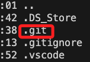

# 過大檔案


先退到 Git 根目錄

確保 .git 存在當前目錄


```bash
git lfs install
```

```bash
git lfs track "三大法人爬蟲資料.csv"
```

```bash
git add .gitattributes
```

假如已經提交
```bash
git rm --cached "三大法人爬蟲資料.csv"
```
這裡顯示


```bash
git commit -m "Remove large file"
```

