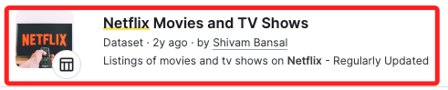

# 使用 Python 和 dash 創建儀表板

[參考](https://www.mvrlink.com/creating-dashboards-using-python-and-dash/)


## 說明

1. 使用 [Kaggle](https://www.kaggle.com/) 中的 [Netflix Movies and TV Shows](https://www.kaggle.com/datasets/shivamb/netflix-shows) 資料集。




## 步驟

1. 建立專案
```bash
mkdir netflix-dashboard && cd netflix-dashboard
```

2. 建立虛擬環境
```bash```