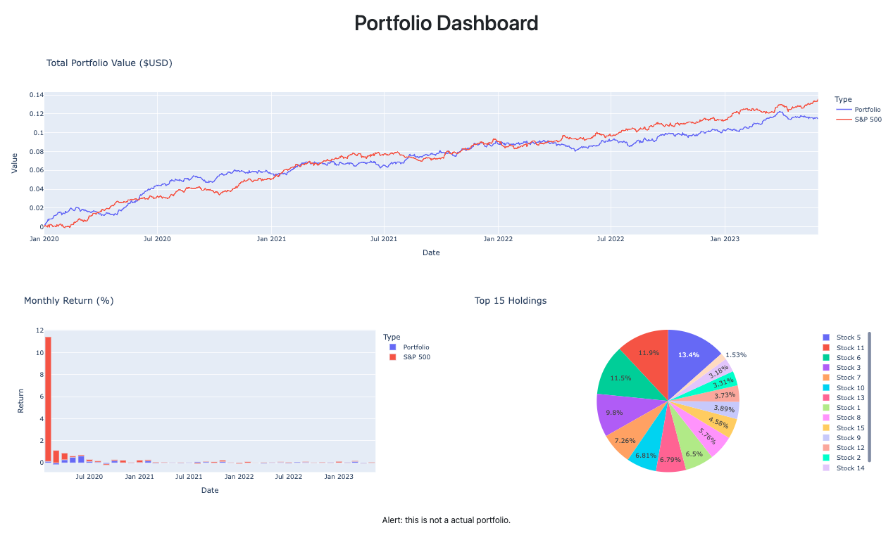
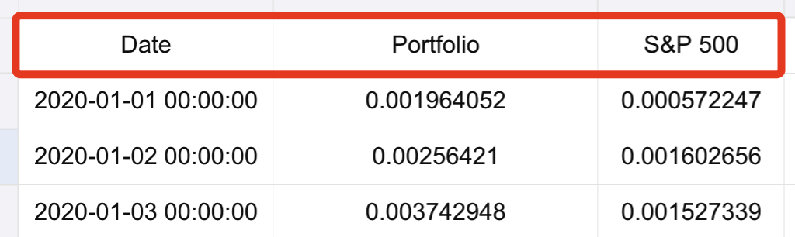
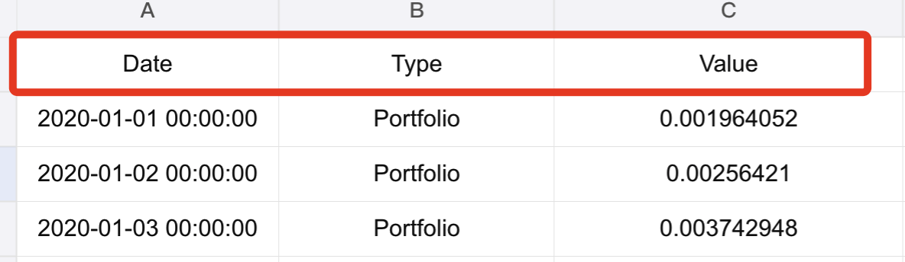
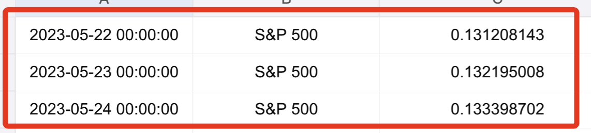
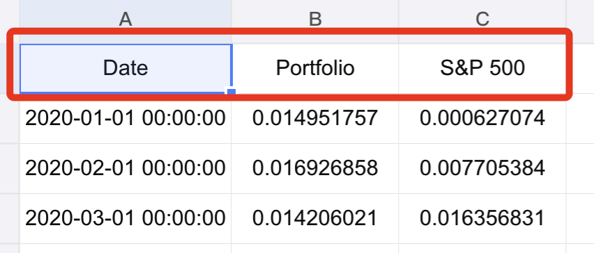

# 模擬數據

_以下將透過模擬數據建立 Dash 網站_

<br>

## 介紹並準備

_逐步撰寫並完成各細部內容_

<br>

1. 最終呈現效果。

    

<br>

2. 專案架構：建立一個腳本 `app.py` 貼上以下內容。

    ```python
    '''導入庫'''

    '''模擬數據'''

    '''保存數據'''

    '''建立圖表'''

    '''運行服務器'''
    ```

<br>

## 導入庫

<br>

1. 程式碼。

    ```python
    # 從 dash 庫導入 Dash, dcc, html 用於應用構建
    from dash import Dash, dcc, html

    # 導入 plotly.express 用於數據可視化
    import plotly.express as px

    # 導入 pandas 用於數據處理
    import pandas as pd

    # 導入 numpy 用於數值計算
    import numpy as np

    # 導入 dash_bootstrap_components 用於引入 Bootstrap 風格
    import dash_bootstrap_components as dbc
    ```

<br>

2. 模組 `dash`：這是網站架構的主軸，使用 `Dash` 建立應用，使用 `dcc.Graph` 來涵蓋部件來組成網頁，使用 `html` 提供超文本語法。
3. 模組 `px`：用於繪製折線圖、柱狀圖、餅圖。
4. 模組 `pd`：用於生成並管理數據。
5. 模組 `np`：用於隨機運算。
6. 模組 `dbc`：用於提供 `Bootstrap` 各種樣式與部件功能。
   

<br>

## 模擬數據

1. 程式碼。
    
    ```python
    # 設置隨機種子
    np.random.seed(0)
    # 生成工作日的日期範圍
    dates = pd.date_range(
        # 開始日期
        "2020-01-01",
        # 結束日期
        "2023-05-31",
        # 頻率 B 表示 business day frequency，就是工作日的意思
        freq="B"
    )
    # 常態分配隨機數：生成投資組合價值的模擬數據
    portfolio_values = np.random.normal(
        # 隨機數、標準差、資料數
        loc=0.0002, scale=0.001, size=len(dates)
    ).cumsum()
    # 常態分配隨機數：生成標準普爾 500 指數的模擬數據
    snp_values = np.random.normal(
        loc=0.0001, scale=0.001, size=len(dates)
    ).cumsum()

    # 創建 DataFrame：日期、投資組合價值、S&P 數據
    df_portfolio = pd.DataFrame(
        {
            "Date": dates,
            "Portfolio": portfolio_values,
            "S&P 500": snp_values
        }
    )
    
    # 透過 pd 中的 melt 函數將數據從寬格式轉換為長格式，這在統計中稱為 Reshaping 或 Melting
    # 使用日期為 id，原本的欄位名稱作為資料名稱，放在新的欄位 Type 中
    # 原本儲存格中的數據被放入新的欄位 Value 中
    df_portfolio = df_portfolio.melt(
        # 這個欄位將用於識別，所以不會被轉換
        id_vars="Date",
        # 轉換為長格式後 id 的名稱
        var_name="Type",
        # 轉換為長格式後 value 欄位的名稱
        value_name="Value"
    )

    # 透過長格式數據，計算月度回報數據：採用了兩個分組標準月份、類型
    monthly_return = (
        df_portfolio.groupby(
            # 依據月份作為分組
            [df_portfolio["Date"].dt.to_period("M"), "Type"]
        )["Value"]
        # 每個分組中最後一個數值
        .last()
        # unstack 會將分組結果從長格式再轉換為寬格式
        .unstack()
    )
    # 透過 pct_change() 計算每個值與前一個值的百分比變化
    # 然後透過 dropna() 刪除因百分比計算產生的 NaN
    # 再透過 stack() 將寬格式再度轉換為長格式
    # 使用 reset_index() ，並將數值欄位更名為 Return
    monthly_return = \
        monthly_return.pct_change().dropna().stack().reset_index(name="Return")
    # 對 Date 欄位進行格式轉換
    monthly_return["Date"] = monthly_return["Date"].dt.strftime("%Y-%m")
    # 創建持股比例餅圖的數據
    top_holdings = pd.Series(
        # 建立 15 個範圍在 0~1 之間的隨機數
        np.random.rand(15),
        # 給每個隨機數建立一個索引，命名為 Stock {i}
        index=[f"Stock {i}" for i in range(1, 16)]
    )
    ```

<br>

2. 原本的寬格式內容如下。

    

<br>

3. 轉換為長格式後內容如下，排在前面，然後就是下一個 Type。

    

    

<br>

4. `.unstack()` 的效果。

    
    
<br>

5. 關於 `np.random.normal()`：這是 Numpy 中用於生成 `常態分配隨機數` 的函數。
   
   - 參數 `loc=0.0002` 用於指定平均值，這是用於表示投資組合每日平均報酬率；

   - 參數 `scale=0.001` 用於指定常態分配的標準差，在統計中，標準差代表的是數據的分散程度，也就反映了波動與風險程度；

   - 參數 `size=len(dates)` 用於指定生成隨機數的數量，結果要與 `dates` 適配，確保每日都有一個隨機的-報酬率；

   - `.cumsum()` 是 Array 的函數，用於計算給定軸向上的累積和，也就是 `np.random.normal()` 所生成隨機數的和。

<br>

6. `.Series`：就是 pandas 的數據格式，只是欄位名稱尚未指令。

<br>

## 保存數據

_可優化封裝為函數，並且只執行一次。_

<br>

1. 程式碼。

    ```python
    # 儲存為 Excel
    df_portfolio.to_excel('portfolio_data.xlsx', index=False)
    # 儲存為 Excel
    monthly_return.to_excel('monthly_return_data.xlsx', index=False)

    # 將 Series 格式的數據轉換為 DataFrame 格式，資料欄位命名為 Value
    top_holdings_df = pd.DataFrame(top_holdings, columns=['Value'])
    # 儲存為 Excel
    top_holdings_df.to_excel('top_holdings_data.xlsx')

    # 顯示完成
    print("檔案儲存完畢。")
    ```

<br>

2. `.to_excel`：這是 pandas 的函數，用於將數據儲存到 Excel 文件中，參數 `index` 代表是否包含 DataFrame 的索引。

<br>

## 建立圖表

_使用 Dash Bootstrap Components (dbc) 組織內容_

<br>

1. 網站架構說明。

    ```python
    # 建立應用：這只是一個外殼
    app = Dash()
    # 規劃佈局：這是內容樣式
    # Container 是 Bootstrap 的容器
    app.layout = dbc.Container(
        [
            dbc.Row(
                dbc.Col(html.P()),
                dbc.Col(html.H1())
            ),
            dbc.Row(
                dbc.Col(
                    dcc.Graph()
                )
            )
        ],
        # 容器流體佈局：表示容器寬度會隨螢幕尺寸自適應
        fluid=True,
    )
    ```

<br>

2. 程式碼。

    ```python
    # 建立 Dash 應用
    app = Dash(
        __name__,
        # 使用 Bootstrap 主題
        external_stylesheets=[dbc.themes.BOOTSTRAP]
    )

    # 設置佈局
    app.layout = dbc.Container(
        [
            dbc.Row(
                dbc.Col(
                    # 應用標題，透過 mt-4 設定 margin-top
                    html.H1("Portfolio Dashboard", className="mt-4"),
                    # 設置列寬 6 和偏移 3
                    # width={"size": 6, "offset": 3},
                    # 設置列寬為全寬
                    width=12,
                    # 文本居中類
                    className="text-center",
                )
            ),
            dbc.Row(
                dbc.Col(
                    dcc.Graph(
                        # 圖表 ID
                        id="portfolio-value-graph",
                        # 折線圖表
                        figure=px.line(
                            df_portfolio,
                            x="Date",
                            y="Value",
                            color="Type",
                            title="Total Portfolio Value ($USD)",
                        ),
                    ),
                    # 占滿整行
                    width=12,
                )
            ),
            # 中間列
            dbc.Row(
                [
                    # 左側柱狀圖
                    dbc.Col(
                        dcc.Graph(
                            # 圖表 ID
                            id="monthly-return-graph",
                            # 柱狀圖表
                            figure=px.bar(
                                monthly_return,
                                x="Date",
                                y="Return",
                                color="Type",
                                title="Monthly Return (%)",
                            ),
                        ),
                        # 占一半行
                        width=6,
                    ),
                    # 右側餅圖
                    dbc.Col(
                        dcc.Graph(
                            # 圖表 ID
                            id="holdings-pie-chart",
                            # 餅圖表
                            figure=px.pie(
                                top_holdings,
                                values=top_holdings.values,
                                names=top_holdings.index,
                                title="Top 15 Holdings",
                            ),
                        ),
                        # 占一半行
                        width=6,
                    ),
                ]
            ),
            # 底部區塊
            dbc.Row(
                dbc.Col(
                    html.P(
                        # 底部聲明
                        "Alert: this is not a actual portfolio.",
                        # 文本居中類
                        className="text-center",
                    )
                )
            ),
        ],
        # 容器流體佈局
        fluid=True,
    )
    ```

<br>

## 運行服務器

1. 程式碼。

    ```python
    if __name__ == "__main__":
        # 開啟調試模式
        app.run_server(debug=True)
    ```

<br>

2. 在部署到服務器的時候會關閉調適模式，也可能透過不同的方式啟動應用，在介紹不同服務器的時候另做說明。

<br>

## 完整範例

1. 程式碼。

    ```python
    '''導入庫'''
    # 從 dash 庫導入 Dash, dcc, html 用於應用構建
    from dash import Dash, dcc, html

    # 導入 plotly.express 用於數據可視化
    import plotly.express as px

    # 導入 pandas 用於數據處理
    import pandas as pd

    # 導入 numpy 用於數值計算
    import numpy as np

    # 導入 dash_bootstrap_components 用於引入 Bootstrap 風格
    import dash_bootstrap_components as dbc

    '''模擬數據'''
    '''
    這裡說明一下，首先透過模擬的方式產生數據，然後把這個數據儲存為 EXCEL
    透過觀察 EXCEL 可知道文件的內容，特過這樣的過程，
    下一步可以試圖取得與 EXCEL 中的數據相同的內容來製圖
    那這個腳本就會是一個相對完整的腳本了
    '''
    # 設置隨機種子
    np.random.seed(0)
    # 生成工作日的日期範圍
    dates = pd.date_range("2020-01-01", "2023-05-31", freq="B")
    # 生成投資組合價值的模擬數據
    portfolio_values = np.random.normal(
        loc=0.0002, scale=0.001, size=len(dates)
    ).cumsum()
    # 生成標準普爾 500 指數的模擬數據
    snp_values = np.random.normal(
        loc=0.0001, scale=0.001, size=len(dates)
    ).cumsum()

    # 創建 DataFrame 並進行整形處理
    df_portfolio = pd.DataFrame(
        {"Date": dates, "Portfolio": portfolio_values, "S&P 500": snp_values}
    )
    df_portfolio = df_portfolio.melt(
        id_vars="Date", var_name="Type", value_name="Value"
    )

    # 計算月度回報數據
    monthly_return = (
        df_portfolio.groupby(
            [df_portfolio["Date"].dt.to_period("M"), "Type"]
        )["Value"]
        .last()
        .unstack()
    )
    monthly_return = \
        monthly_return.pct_change().dropna().stack().reset_index(name="Return")
    monthly_return["Date"] = monthly_return["Date"].dt.strftime("%Y-%m")

    # 創建持股比例餅圖的數據
    top_holdings = pd.Series(
        np.random.rand(15), index=[f"Stock {i}" for i in range(1, 16)]
    )

    '''保存數據'''
    # 儲存為 Excel
    df_portfolio.to_excel('portfolio_data.xlsx', index=False)
    monthly_return.to_excel('monthly_return_data.xlsx', index=False)

    # 對於 Series 要先轉換為 DataFrame
    top_holdings_df = pd.DataFrame(top_holdings, columns=['Value'])
    top_holdings_df.to_excel('top_holdings_data.xlsx')

    # 輸出結果
    print("Files have been saved successfully.")

    '''建立圖表'''
    # 創建 Dash 應用，並使用 Bootstrap 主題
    app = Dash(__name__, external_stylesheets=[dbc.themes.BOOTSTRAP])

    # 設置應用佈局
    app.layout = dbc.Container(
        [
            dbc.Row(
                dbc.Col(
                    # 應用標題，透過 mt-4 設定 margin-top
                    html.H1("Portfolio Dashboard", className="mt-4"),
                    # 設置列寬 6 和偏移 3
                    # width={"size": 6, "offset": 3},
                    # 設置列寬為全寬
                    width=12,
                    # 文本居中類
                    className="text-center",
                )
            ),
            dbc.Row(
                dbc.Col(
                    dcc.Graph(
                        # 圖表 ID
                        id="portfolio-value-graph",
                        # 折線圖表
                        figure=px.line(
                            df_portfolio,
                            x="Date",
                            y="Value",
                            color="Type",
                            title="Total Portfolio Value ($USD)",
                        ),
                    ),
                    # 占滿整行
                    width=12,
                )
            ),
            # 中間列
            dbc.Row(
                [
                    # 左側柱狀圖
                    dbc.Col(
                        dcc.Graph(
                            # 圖表 ID
                            id="monthly-return-graph",
                            # 柱狀圖表
                            figure=px.bar(
                                monthly_return,
                                x="Date",
                                y="Return",
                                color="Type",
                                title="Monthly Return (%)",
                            ),
                        ),
                        # 占一半行
                        width=6,
                    ),
                    # 右側餅圖
                    dbc.Col(
                        dcc.Graph(
                            # 圖表 ID
                            id="holdings-pie-chart",
                            # 餅圖表
                            figure=px.pie(
                                top_holdings,
                                values=top_holdings.values,
                                names=top_holdings.index,
                                title="Top 15 Holdings",
                            ),
                        ),
                        # 占一半行
                        width=6,
                    ),
                ]
            ),
            # 底部區塊
            dbc.Row(
                dbc.Col(
                    html.P(
                        # 底部聲明
                        "Alert: this is not a actual portfolio.",
                        # 文本居中類
                        className="text-center",
                    )
                )
            ),
        ],
        # 容器流體佈局
        fluid=True,
    )

    '''運行服務器'''
    if __name__ == "__main__":
        # 開啟調試模式
        app.run_server(debug=True)
    ```

<br>

---

_END_