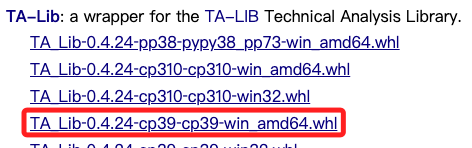
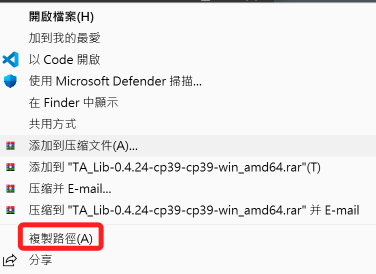
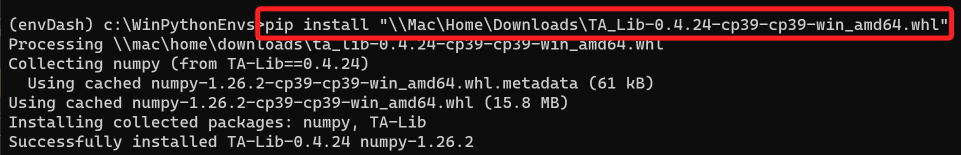
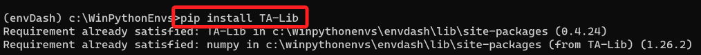

# TA-Lib

_Technical Analysis Library，可參考 [官網](https://ta-lib.github.io/ta-lib-python/doc_index.html)_

## 說明

1. TA-Lib 包含了超過 150 種技術分析指標，如移動平均線、相對強弱指數（RSI）、布林帶等。
2. [下載](https://www.lfd.uci.edu/~gohlke/pythonlibs/#ta-lib)。

## Mac 安裝

1. 假如還沒安裝 Homebrew，先參考 [官網](https://brew.sh/) 的安裝指令。
```bash
/bin/bash -c "$(curl -fsSL https://raw.githubusercontent.com/Homebrew/install/HEAD/install.sh)"
```
2. 使用 Homebrew 來安裝 TA-Lib 的 C 語言庫。
```bash
brew install ta-lib
```

3. 通過 pip 安裝 Python 的 TA-Lib 接口。

```bash
pip install TA-Lib
```

## Windows 安裝

1. 依照官網說明先進行必要檔案的 [下載](https://sourceforge.net/projects/ta-lib/files/ta-lib/0.4.0/ta-lib-0.4.0-msvc.zip/download?use_mirror=nchc)。
2. 解壓縮放在 C 根目錄下。
3. 將解壓縮資料夾加入環境參數。
4. 訪問微軟官網[下載 Microsoft C++ Build Tools](https://visualstudio.microsoft.com/zh-hant/visual-cpp-build-tools/)
5. 選取 C++ 然後安裝。
6. 下載(https://www.lfd.uci.edu/~gohlke/pythonlibs/#ta-lib) 。



7. 下載的檔案上點擊右鍵。


8. 安裝


9. 再安裝一次試試。
```bash
pip install TA-Lib
```
