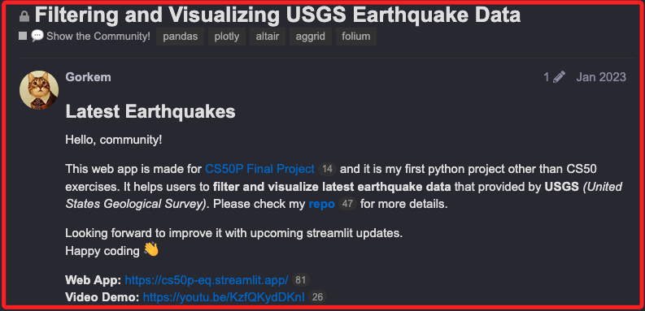
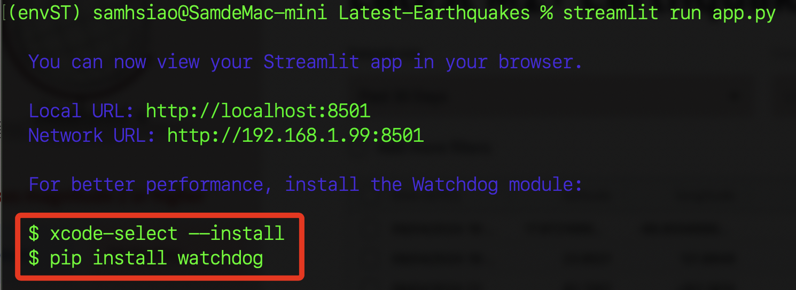
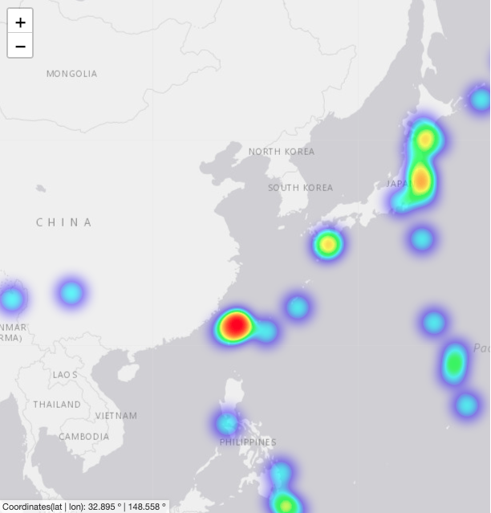

# 地震資訊

<br>

## 說明

1. 這是 Streamlit 社區的一個 [範例](https://discuss.streamlit.io/t/filtering-and-visualizing-usgs-earthquake-data/36391)，專案可由 [Github 下載](https://github.com/gorkemuna1/Latest-Earthquakes)。


<br>

## 說明

<br>

1. 運行後顯示如下訊息。

   

<br>

2. 依指示安裝。

   ```bash
   xcode-select --install

   python -m pip install watchdog
   ```

<br>

## 修改初始視角

1. 在 `utility.py` 中修改程式碼，加入 `location` 參數，並以台灣的緯度 `23.6978`、經度 `120.9605` 作為初始值進行手動調整，另外調整 `zoom_start` 的初始說放比例優化視圖。

   ```python
   def draw_world_map(tiles: str):
       """Create empty map centered on the coordinates (0,0) with given map tileset"""

       map = folium.Map(
           location=[30, 130],  # 調整到以台灣為相對合理的視角
           zoom_start=5,  # 初始縮放級別
           min_zoom=1.5,
           min_lon=-250,
           max_lon=250,
           min_lat=-85,
           max_lat=85,
           max_bounds=True,
           tiles=tiles,
           attr="Latest Earthquakes",
       )

       formatter = "function(num) {return L.Util.formatNum(num, 3) + ' º ';};"
       MousePosition(
           position="bottomleft",
           separator=" | ",
           empty_string="NaN",
           lng_first=False,
           num_digits=20,
           prefix="Coordinates(lat | lon):",
           lat_formatter=formatter,
           lng_formatter=formatter,
       ).add_to(map)

       return map
   ```

<br>

## 運行

1. 指令。

   ```bash
   streamlit run app.py
   ```

<br>

2. 顯示台灣確實在熱區。

   

<br>
