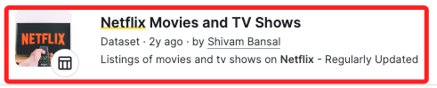
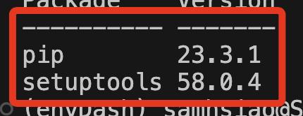
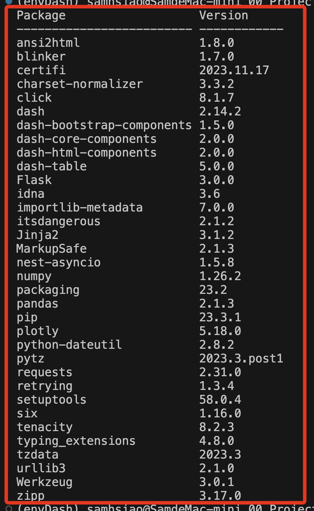
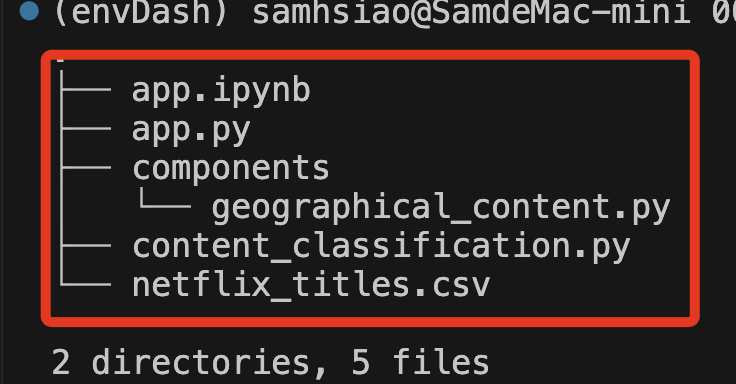
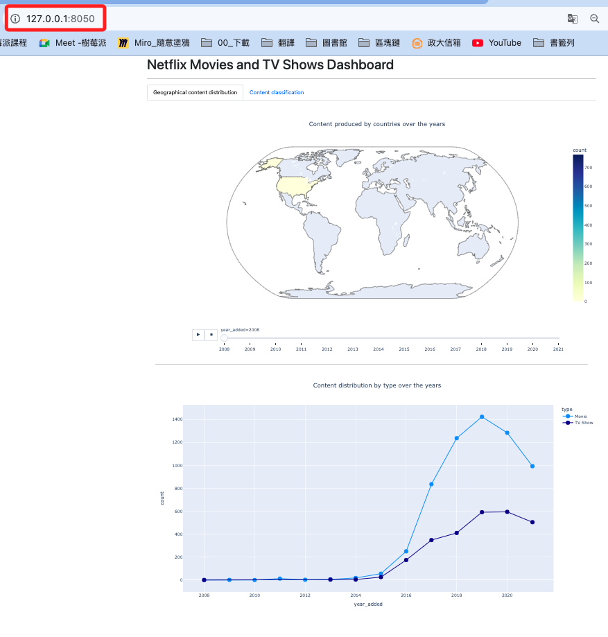
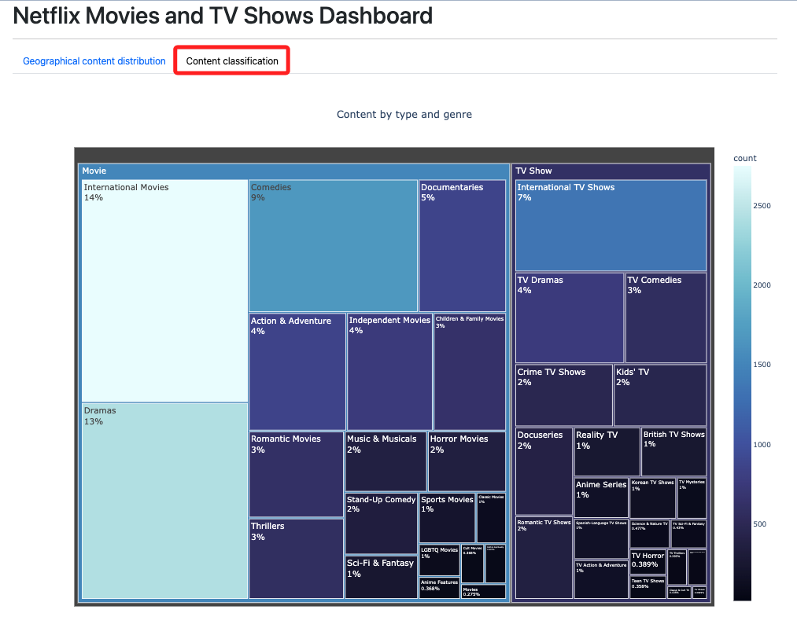

# 使用 Python 和 dash 創建儀表板

[參考](https://www.mvrlink.com/creating-dashboards-using-python-and-dash/)

<br>

## 說明

1. 使用 [Kaggle](https://www.kaggle.com/) 中的 [Netflix Movies and TV Shows](https://www.kaggle.com/datasets/shivamb/netflix-shows) 資料集。

    

<br>

## 步驟

1. 建立專案

    ```bash
    mkdir netflix-dashboard && cd netflix-dashboard
    ```

<br>

2. 建立虛擬環境

    ```bash
    python -m venv envDash
    ```

<br>

3. 建立好的時候，可透過指令查詢有哪些庫。

    ```bash
    pip list
    ```

    

<br>

4. 安裝庫。

    ```bash
    pip install pandas dash plotly dash-bootstrap-components
    ```

<br>

5. 再查詢一次安裝了哪些庫。

    

<br>

## 清洗數據

1. 填充其中導演、演員、國家三個欄位的遺漏值，其他有遺漏值就刪除。

<br>

2. 完整程式碼。
    
    ```python
    # 導入 pandas 庫
    import pandas as pd

    '''載入數據集'''
    # 讀取數據檔案
    df = pd.read_csv('netflix_titles.csv')

    '''處理遺漏值'''
    # 將導演欄位遺漏值填充為 'No director'
    df['director'].fillna('No director', inplace=True)
    # 將演員欄位遺漏值填充為：'No cast'
    df['cast'].fillna('No cast', inplace=True)
    # 將國家欄位遺漏值填充為：'No country'
    df['country'].fillna('No country', inplace=True)

    '''數據清洗'''
    # 刪除包含遺漏值 NA 的 row
    df.dropna(inplace=True)
    # 刪除有重複值的 row
    df.drop_duplicates(inplace=True)

    # 刪除 date_added 欄位中頭尾空白並轉換為 datetime 格式
    df['date_added'] = pd.to_datetime(df['date_added'].str.strip())

    # 覆蓋原本的檔案：不包含索引
    df.to_csv('netflix_titles.csv', index=False)
    ```

<br>

## 建立專案

1. 建立專案資料夾。

    ```bash
    mkdir MyFirstProject && cd MyFirstProject
    ```

<br>

2. 一個 Dash App 會由一個或多個網頁組成，以下將示範兩個頁籤的網頁。

<br>

3. 建立主檔案。

    ```bash
    touch app.py
    ```

<br>

4. 編輯內容：建立基本內容。

    ```python
    # 從 dash 庫導入 Dash 和 html
    # Dash 用於初始化 Dash 應用，主要包含基本的屬性
    # html 包含超文本所需的標籤語法
    from dash import Dash, html

    # 初始化一個 Dash 應用
    app = Dash(__name__)

    # 定義應用的佈局：使用 HTML 的 Div 標籤來組織佈局
    app.layout = html.Div(
        [
            # 使用 H1 標籤顯示標題
            html.H1("Netflix Movies and TV Shows Dashboard"),
            # 使用水平線 (Hr 標籤) 分隔內容
            html.Hr(),
        ]
    )

    # 檢查該腳本是否作為主程序運行
    if __name__ == "__main__":
        # 在本地開發模式下啟動 Dash 應用運行伺服器
        # 開啟 debug 模式以支持熱重新載入和錯誤日誌
        app.run_server(debug=True)

    ```

<br>

## 使用 dcc 與 dbc

1. 導入 `dcc`：Dash Core Components，包含了一系列高級組件，如圖表、滑桿、下拉選單等。

    ```python
    # 添加導入 dcc
    from dash import Dash, html, dcc
    ```

<br>

2. 導入 `dbc`：Dash Bootstrap Components，提供一系列基於 Bootstrap 的組件。

    ```python
    # 添加導入 dbc
    import dash_bootstrap_components as dbc
    ```

<br>

3. 加入外部樣式：`dbc.themes.BOOTSTRAP` 。

    ```python
    # 原本
    # app = Dash(__name__)
    # 改用外部樣式
    app = Dash(__name__, external_stylesheets=[dbc.themes.BOOTSTRAP])
    ```

<br>

4. 修改內容，本來使用 `html.Div()`，改用 `dbc.Container()` 。

    ```python
    # 改用 dbc.Container()
    app.layout = dbc.Container(
        [
            dcc.Store(id='store'),
            html.H1('Netflix Movies and TV Shows Dashboard'),
            html.Hr(),
            dbc.Tabs(
                # 加入兩個頁籤
                [
                    dbc.Tab(label='Geographical content distribution', tab_id='tab1'),
                    dbc.Tab(label='Content classification', tab_id='tab2'),
                ],
                id='tabs',
                active_tab='tab1',
            ),
            html.Div(id='tab-content', className='p-4'),
        ]
    )
    ```

<br>

## 添加 Callback

1. 建立資料夾 `components`，並新增文件 `geographical_content.py`。

    _Win_
    ```bash
    mkdir components && type nul > components\geographical_content.py
    ```

    _Mac_
    ```bash
    mkdir -p components && touch components/geographical_content.py
    ```

<br>

2. 編輯文件 `geographical_content.py`。

    ```python
    # 導入 pandas 庫
    import pandas as pd
    # 導入 plotly express 用於製作圖表
    import plotly.express as px
    # 從 dash 庫導入 dcc 和 html
    from dash import dcc, html
    # 讀取 Netflix 標題數據
    df = pd.read_csv("netflix_titles.csv")

    # 過濾掉沒有國家信息的列
    # 如果有多個國家，則以第一個國家為準
    df["country"] = (
        df["country"]
        .str.split(",")
        .apply(lambda x: x[0].strip() if isinstance(x, list) else None)
    )

    # 從 date_added 列提取年份
    df["year_added"] = pd.to_datetime(df["date_added"]).dt.year
    # 刪除 country 和 year_added 列中有缺失值的列
    df = df.dropna(subset=["country", "year_added"])

    # 計算每個國家每年製作的內容數量
    df_counts = df.groupby(
        ["country", "year_added"]
    ).size().reset_index(name="count")

    # 按 year_added 排序，確保動畫播放順序按升序排列
    df_counts = df_counts.sort_values("year_added")

    # 創建地圖，包含年份的滑動條
    fig1 = px.choropleth(
        df_counts,
        locations="country",
        locationmode="country names",
        color="count",
        hover_name="country",
        animation_frame="year_added",
        projection="natural earth",
        title="Content produced by countries over the years",
        color_continuous_scale="YlGnBu",
        range_color=[0, df_counts["count"].max()],
    )
    # 更新佈局設置
    fig1.update_layout(width=1280, height=720, title_x=0.5)

    # 計算每年按類型製作的內容數量，並為缺失的類型-年份對填充零
    df_year_counts = df.groupby(["year_added", "type"]).size().reset_index(name="count")

    # 使用 plotly express 創建折線圖
    fig2 = px.line(
        df_year_counts,
        x="year_added",
        y="count",
        color="type",
        title="Content distribution by type over the years",
        markers=True,
        color_discrete_map={"Movie": "dodgerblue", "TV Show": "darkblue"},
    )
    # 更新線條的跟踪器設置
    fig2.update_traces(marker=dict(size=12))
    # 更新佈局設置
    fig2.update_layout(width=1280, height=720, title_x=0.5)

    # 定義 dash 的佈局
    layout = html.Div(
        [   
            # 添加地圖圖表
            dcc.Graph(figure=fig1),
            # 添加水平分隔線
            html.Hr(),
            # 添加折線圖
            dcc.Graph(figure=fig2),
        ]
    )

    ```

<br>

3. 建立文件 `content_classification.py` 。

    ```python
    # 導入 pandas 庫
    import pandas as pd

    # 導入 plotly express 庫，用於製作圖表
    import plotly.express as px

    # 從 dash 庫導入 dcc 和 html
    from dash import dcc, html

    # 讀取數據
    df = pd.read_csv("netflix_titles.csv")

    # 分割 listed_in 列並展開以處理多個類型
    # 將 listed_in 列的每個項目分割為列表
    df["listed_in"] = df["listed_in"].str.split(", ")
    # 將列表展開成多行
    df = df.explode("listed_in")

    # 計算每種類型和類型組合的數量
    df_counts = df.groupby(["type", "listed_in"]).size().reset_index(name="count")

    # 創建樹形圖來顯示不同類型和類型的內容
    fig = px.treemap(
        df_counts,
        path=["type", "listed_in"],
        values="count",
        color="count",
        color_continuous_scale="Ice",
        title="Content by type and genre",
    )

    # 更新圖表的佈局設置
    fig.update_layout(width=1280, height=960, title_x=0.5)
    # 更新圖表痕跡的文本信息和字體大小
    fig.update_traces(textinfo="label+percent entry", textfont_size=14)

    # 定義 Dash 應用的佈局
    layout = html.Div(
        [
            # 將圖表添加到 Dash 應用的佈局中
            dcc.Graph(figure=fig),
        ]
    )
    ```

<br>

4. 截至目前的結構。

    

<br>

## 修改 app.py

1. 加入 `Input、Output`。

    ```python
    # 加入 Input、Output
    from dash import Dash, dcc, html, Input, Output
    ```

<br>

2. 加入自訂模組。

    ```python
    # 加入自訂模組
    from components import (
        geographical_content,
        content_classification
    )
    ```

<br>

3. 加入回調。

    ```python
    # 加入回調
    @app.callback(Output('tab-content', 'children'), [Input('tabs', 'active_tab')])
    def switch_tab(at):
        if at == 'tab1':
            return geographical_content.layout
        elif at == 'tab2':
            return content_classification.layout
    ```

<br>

4. 導入自訂的兩個模組。

    ```python
    #
    from dash import Dash, dcc, html, Input, Output
    import dash_bootstrap_components as dbc
    #
    from components import (
        geographical_content,
        content_classification
    )

    app = Dash(__name__, external_stylesheets=[dbc.themes.BOOTSTRAP])

    app.layout = dbc.Container(
        [
            dcc.Store(id='store'),
            html.H1('Netflix Movies and TV Shows Dashboard'),
            html.Hr(),
            dbc.Tabs(
                [
                    dbc.Tab(label='Geographical content distribution', tab_id='tab1'),
                    dbc.Tab(label='Content classification', tab_id='tab2'),
                ],
                id='tabs',
                active_tab='tab1',
            ),
            html.Div(id='tab-content', className='p-4'),
        ]
    )


    # 回調
    @app.callback(Output('tab-content', 'children'), [Input('tabs', 'active_tab')])
    def switch_tab(at):
        if at == 'tab1':
            return geographical_content.layout
        elif at == 'tab2':
            return content_classification.layout


    if __name__ == '__main__':
        app.run(debug=True)
    ```

<br>

## 啟動

1. 在終端機或命令提示字元中執行腳本。

    ```bash
    python app.py
    ```

<br>

2. 透過樓覽器訪問首頁，預設顯示第一個頁籤。

    

<br>

3. 可切換到第二個頁籤。

    

<br>

---

_END：以上完成一個簡單的腳本_