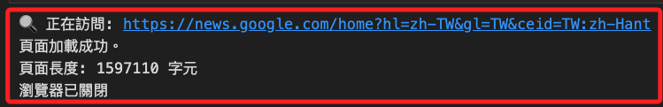
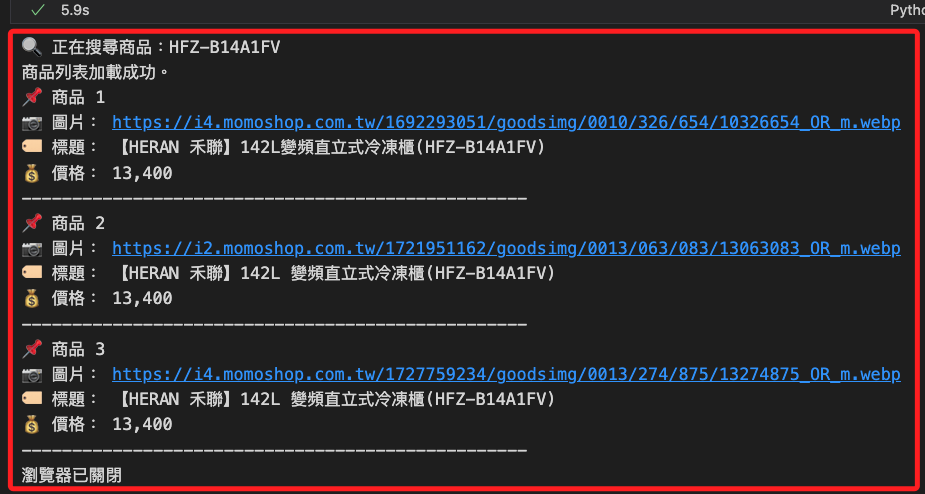

# Selenium

[參考](https://www.npmjs.com/package/chromedriver) 

<br>

## 一般安裝

_無論 MacOS 或是 Win 皆相同，關於安裝的補充會在後續說明_

<br>

1. 直接安裝。

    ```bash
    pip install selenium
    ```

<br>

## 新版說明

_新的 4.x 版 Selenium 相較於 3.x 及更早版本有許多 API 變更，尤其是在瀏覽器驅動管理、元素查找、等待機制、以及與 WebDriver 互動的方式 上有顯著不同。_

<br>

## 主要變更

1. 新版 Selenium 內建了 WebDriver 管理工具，不再需要手動下載 `chromedriver`、`geckodriver` 等驅動程式，也無需傳入路徑 `webdriver.Chrome(executable_path="path")`。

    ```python
    from selenium import webdriver

    # 不需要手動下載，Selenium 會自動安裝與管理
    driver = webdriver.Chrome()  
    ```

<br>

2. `find_element` 需使用 `By` 指定元素，與舊版 Selenium 允許直接傳入 `find_element_by_*` 方法不同；特別注意，舊版的 `find_element_by_id`、`find_element_by_class_name` 都已棄用，需要改用 `By.ID`、`By.CLASS_NAME`。

    ```python
    from selenium.webdriver.common.by import By

    element = driver.find_element(By.ID, "username")
    ```

<br>

## `ActionChains`、`wait` API 變更

1. `ActionChains` 變更，Selenium 4 新增的 `scroll_to_element`。

    ```python
    from selenium.webdriver.common.action_chains import ActionChains

    actions = ActionChains(driver)
    actions.scroll_to_element(element).perform()
    ```

<br>

2. `wait` API 變更，新版 `By` 必須顯式指定。

    ```python
    from selenium.webdriver.support.ui import WebDriverWait
    from selenium.webdriver.support import expected_conditions as EC
    from selenium.webdriver.common.by import By

    WebDriverWait(driver, 10).until(
        EC.presence_of_element_located(
            (By.ID, "username")
        )
    )
    ```

<br>

## 滾動與視窗管理 API

1. Selenium 4.x 提供了更好的滾動與視窗管理功能

    ```python
    # 滾動到特定元素
    driver.execute_script("arguments[0].scrollIntoView();", element)

    # 取得當前視窗大小
    size = driver.get_window_rect()
    print(size)
    ```

<br>

2. 新版 Selenium 4.x 內建支援 `relative locators` 相對定位，允許相對於其他元素來尋找目標元素，這對於無法直接定位的元素如 `動態產生的按鈕` 很有幫助。

    ```python
    from selenium.webdriver.common.by import By
    from selenium.webdriver.support.relative_locator import locate_with

    # 找到某個元素"旁邊"的按鈕
    element = driver.find_element(
        locate_with(By.TAG_NAME, "button").to_right_of(By.ID, "login-form")
    )
    ```

<br>

## 測試代碼

1. 基本測試。

    ```python
    from selenium import webdriver
    from selenium.webdriver.chrome.service import Service
    from selenium.webdriver.common.by import By
    from selenium.webdriver.chrome.options import Options
    from selenium.webdriver.support.ui import WebDriverWait
    from selenium.webdriver.support import expected_conditions as EC
    from webdriver_manager.chrome import ChromeDriverManager

    # 設定 Chrome 選項
    options = Options()
    # 無頭模式 (新版)
    options.add_argument("--headless=new") 
    # 避免某些環境問題
    options.add_argument("--disable-gpu")
    # 在 Linux 環境避免權限問題
    options.add_argument("--no-sandbox")
    # 避免 Chrome 在 Docker 內記憶體不足
    options.add_argument("--disable-dev-shm-usage")
    # 防止 Selenium 被檢測
    options.add_argument("--disable-blink-features=AutomationControlled")

    # 自動安裝 ChromeDriver
    service = Service(ChromeDriverManager().install())

    # 啟動 WebDriver
    driver = webdriver.Chrome(service=service, options=options)

    # 目標網址
    _URL = "https://news.google.com/home?hl=zh-TW&gl=TW&ceid=TW:zh-Hant"
    print(f"🔍 正在訪問: {_URL}")
    driver.get(_URL)

    # 使用 WebDriverWait 確保頁面載入
    try:
        WebDriverWait(driver, 10).until(
            EC.presence_of_element_located((By.TAG_NAME, "body"))
        )
        print("頁面加載成功")

        # 取得頁面原始碼
        page_source = driver.page_source
        print(f"頁面長度：{len(page_source)} 字元")

    except Exception as e:
        print(f"頁面加載失敗：{e}")

    finally:
        # 關閉 WebDriver
        driver.quit()
        print("瀏覽器已關閉")
    ```

    

<br>

2. 實測查詢 MOMO 購物網的指定商品。

    ```python
    from selenium import webdriver
    from selenium.webdriver.chrome.service import Service
    from selenium.webdriver.common.by import By
    from selenium.webdriver.chrome.options import Options
    from selenium.webdriver.support.ui import WebDriverWait
    from selenium.webdriver.support import expected_conditions as EC
    from webdriver_manager.chrome import ChromeDriverManager
    import time

    # 設定 Selenium 瀏覽器參數
    options = Options()
    # 使用新版 headless 模式
    options.add_argument("--headless=new")
    # 避免 GPU 錯誤
    options.add_argument("--disable-gpu")
    # 避免 Linux 權限問題
    options.add_argument("--no-sandbox")
    # 防止 Selenium 被檢測
    options.add_argument("--disable-blink-features=AutomationControlled")

    # 自動安裝 ChromeDriver
    service = Service(ChromeDriverManager().install())
    driver = webdriver.Chrome(service=service, options=options)

    # 指定最多查詢筆數
    MAX_RECORDS = 10
    # 設定查詢商品
    PRODUCT = "HFZ-B14A1FV"
    _URL = f"https://www.momoshop.com.tw/search/searchShop.jsp?keyword={PRODUCT}"

    print(f"🔍 正在搜尋商品：{PRODUCT}")
    driver.get(_URL)

    # 使用 WebDriverWait 等待商品列表加載
    try:
        WebDriverWait(driver, 10).until(
            EC.presence_of_element_located((By.CLASS_NAME, "listArea"))
        )
        print("商品列表加載成功。")
    except Exception as e:
        print(f"❌ 商品列表加載失敗: {e}")
        driver.quit()
        exit()

    # 確認商品數量
    product_elements = driver.find_elements(
        By.XPATH, "//ul[@class='listAreaUl']/li[@class='listAreaLi']"
    )
    num_products = len(product_elements)

    if num_products == 0:
        print("⚠️ 沒有找到商品，結束程式。")
        driver.quit()
        exit()
    elif num_products == 1:
        print("⚠️ 只有 1 個商品，將只抓取這筆資料。")

    # 滾動頁面確保所有商品載入
    driver.execute_script("window.scrollTo(0, document.body.scrollHeight);")
    # 等待 JavaScript 完全載入
    time.sleep(3)

    # 爬取所有商品，最多抓取 `MAX_RECORDS` 個商品
    for i in range(1, min(num_products, MAX_RECORDS) + 1):
        try:
            base_xpath = f"//ul[@class='listAreaUl']/li[@class='listAreaLi'][{i}]"

            # 產品資訊 XPath
            img_xpath = base_xpath + "//picture/img[@class='prdImg']"
            title_xpath = base_xpath + "//h3[@class='prdName']"
            price_xpath = base_xpath + "//span[@class='price']/b"

            # 取得商品圖片
            product_img = (
                WebDriverWait(driver, 5)
                .until(EC.presence_of_element_located((By.XPATH, img_xpath)))
                .get_attribute("src")
            )

            # 取得商品標題
            product_title = (
                WebDriverWait(driver, 5)
                .until(EC.presence_of_element_located((By.XPATH, title_xpath)))
                .text
            )

            # 取得商品價格
            product_price = (
                WebDriverWait(driver, 5)
                .until(EC.presence_of_element_located((By.XPATH, price_xpath)))
                .text
            )

            # 顯示結果
            print(f"📌 商品 {i}")
            print("📷 圖片：", product_img)
            print("🏷 標題：", product_title)
            print("💰 價格：", product_price)
            # 分隔
            print("-" * 50)

        except Exception as e:
            print(f"⚠️ 商品 {i} 無法獲取：{e}")
            continue

    # 關閉瀏覽器
    driver.quit()
    print("瀏覽器已關閉")
    ```

    

<br>

___

_END_