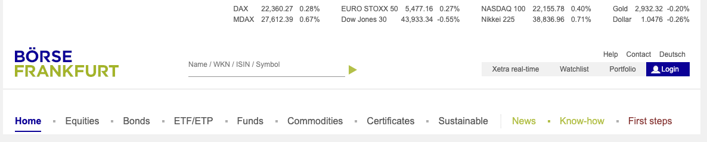
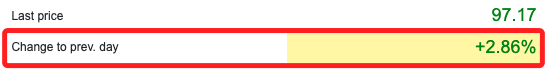
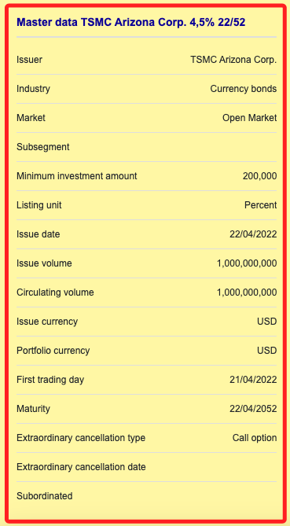
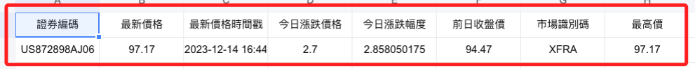
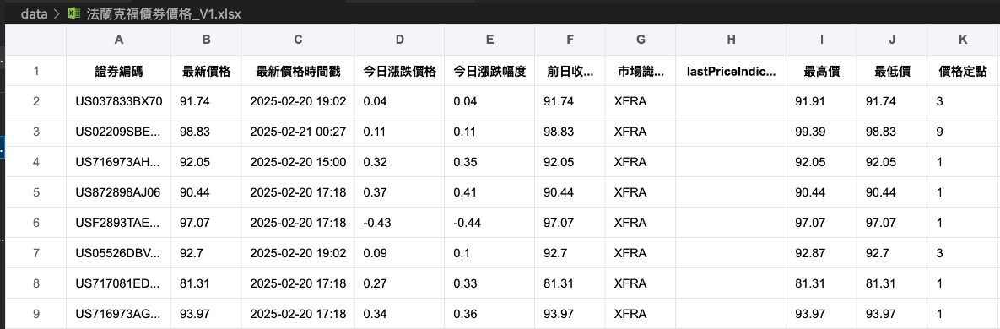

# 法蘭克福

_以下分做兩個單元，各自使用 `Selenium` 及 `request` 兩種方式取得資訊_

<br>

## 基本介紹

1. [官網](https://www.boerse-frankfurt.de/en)。

    

<br>

2. 輸入 `ISIN Code` 進行查詢，這是 `台積電 2052 4.5` 公司債。

    ```txt
    US872898AJ06
    ```
    

<br>

3. 搜尋後使用開發者工具 `F12` 進行檢視，在清單中可看到類似 `price_information ...` 的單元，右側切換到 `Headers`，可看到 `Request URL`。

    

<br>

## 查看網頁資訊

1. `Request URL`。

    ```txt
    https://api.boerse-frankfurt.de/v1/data/price_information?isin=US872898AJ06&mic=XFRA
    ```

<br>

2. `Request Headers`。
    
    ```txt
    Accept:
    */*
    Accept-Encoding:
    gzip, deflate, br
    Accept-Language:
    zh-TW,zh;q=0.9,en-US;q=0.8,en;q=0.7
    Access-Control-Request-Headers:
    cache-control,client-date,expires,ngsw-bypass,pragma,x-client-traceid,x-security
    Access-Control-Request-Method:
    GET
    Origin:
    https://www.boerse-frankfurt.de
    Referer:
    https://www.boerse-frankfurt.de/
    Sec-Fetch-Dest:
    empty
    Sec-Fetch-Mode:
    cors
    Sec-Fetch-Site:
    same-site
    User-Agent:
    Mozilla/5.0 (Macintosh; Intel Mac OS X 10_15_7) AppleWebKit/537.36 (KHTML, like Gecko) Chrome/120.0.0.0 Safari/537.36
    ```

<br>

## 使用 Selenium + XPATH 

_使用 XPATH 插件_

<br>

1. Last price。

    

    ```txt
    /html/body/app-root/app-wrapper[@class='ng-star-inserted']/div[@class='widget-container']/div[@class='content-wrapper']/app-bond[@class='ng-star-inserted']/div[@class='ng-star-inserted']/div[@class='row'][2]/div[@class='col-12 col-lg-6 ar-half-pl-lg ar-mt']/div[@class='h-100 widget']/div[1]/app-widget-price-box/div[@class='widget ar-p']/div[@class='table-responsive widget-table-responsive']/table[@class='table table-borderless widget-table']/tbody/tr[@class='widget-table-row'][1]/td[@class='widget-table-cell text-right last-price text-color-green']
    ```

<br>

2. Change to prev. day。

    

    ```txt
    /html/body/app-root/app-wrapper[@class='ng-star-inserted']/div[@class='widget-container']/div[@class='content-wrapper']/app-bond[@class='ng-star-inserted']/div[@class='ng-star-inserted']/div[@class='row'][2]/div[@class='col-12 col-lg-6 ar-half-pl-lg ar-mt']/div[@class='h-100 widget']/div[1]/app-widget-price-box/div[@class='widget ar-p']/div[@class='table-responsive widget-table-responsive']/table[@class='table table-borderless widget-table']/tbody/tr[@class='widget-table-row'][2]/td[@class='widget-table-cell text-right change-percent text-color-green']
    ```

<br>

3. Bid。

    

    ```txt
    /html/body/app-root/app-wrapper[@class='ng-star-inserted']/div[@class='widget-container']/div[@class='content-wrapper']/app-bond[@class='ng-star-inserted']/div[@class='ng-star-inserted']/div[@class='row'][2]/div[@class='col-12 col-lg-6 ar-half-pl-lg ar-mt']/div[@class='h-100 widget']/div[@class='ar-bt']/app-widget-quote-box/div[@class='widget app-loading-spinner-parent ar-p h-100']/div[@class='table-responsive widget-table-responsive']/table[@class='table table-borderless widget-table']/tbody/tr[@class='widget-table-row'][3]/td[@class='widget-table-cell askBidLimit']
    ```

<br>

4. Ask。

    

    ```txt
    /html/body/app-root/app-wrapper[@class='ng-star-inserted']/div[@class='widget-container']/div[@class='content-wrapper']/app-bond[@class='ng-star-inserted']/div[@class='ng-star-inserted']/div[@class='row'][2]/div[@class='col-12 col-lg-6 ar-half-pl-lg ar-mt']/div[@class='h-100 widget']/div[@class='ar-bt']/app-widget-quote-box/div[@class='widget app-loading-spinner-parent ar-p h-100']/div[@class='table-responsive widget-table-responsive']/table[@class='table table-borderless widget-table']/tbody/tr[@class='widget-table-row'][3]/td[@class='widget-table-cell askBidLimit text-right']
    ```

<br>

5. 取回發行條件看看再來整理。

    

    ```txt
    /html/body/app-root/app-wrapper[@class='ng-star-inserted']/div[@class='widget-container']/div[@class='content-wrapper']/app-bond[@class='ng-star-inserted']/div[@class='ng-star-inserted']/div[@class='row'][5]/div[@class='col-12 ar-col-lg-1-3 ar-mr-lg ar-mt'][1]/app-widget-master-data-bond[@class='d-block']/div[@class='widget app-loading-spinner-parent ar-p']
    ```

<br>

## 程式碼

1. 特別注意，腳本執行的時候，有時候會出現兩組 `data:`，有時候會出現三組，接著就是一直出現 `event:health_event data:health_event`，所以腳本必須對這個問題作出處理，不然程序會一直卡在 `request`。

    

<br>

2. 完整程式碼。

    ```python
    import requests
    import json
    import pandas as pd
    import pytz

    # 指定 ISIN 程式碼和 URL
    _ISIN_CODE = 'US872898AJ06'
    url = f"https://api.boerse-frankfurt.de/v1/data/price_information?isin={_ISIN_CODE}&mic=XFRA"

    # 定義英文欄位名稱到中文的映射
    column_mapping = {
        'isin': '證券編碼',
        'lastPrice': '最新價格',
        'timestampLastPrice': '最新價格時間戳',
        'changeToPrevDayAbsolute': '今日漲跌價格',
        'changeToPrevDayInPercent': '今日漲跌幅度',
        'closingPricePrevTradingDay': '前日收盤價',
        'mic': '市場識別碼',
        'dayHigh': '最高價',
        'dayLow': '最低價',
        'priceFixings': '價格定點',
        'tradedInPercent': '以百分比交易',
        'tradingTimeEnd': '交易結束時間',
        'tradingTimeStart': '交易開始時間',
        'turnoverInEur': '成交額（歐元）',
        'turnoverInPieces': '成交量（件數）',
        'turnoverNominal': '名義成交額',
        'weeks52High': '52週最高價',
        'weeks52Low': '52週最低價',
        'currency': '貨幣',
        'minimumTradableUnit': '最小可交易單位'
    }

    # 使用 with 語句發送請求並取得響應
    with requests.get(url, stream=True) as response:
        # 確保響應成功
        if response.status_code == 200:
            data_count = 0
            data_json = None
            for line in response.iter_lines():
                # 解碼每一行
                line = line.decode('utf-8')
                # 檢查行是否包含 'data:'
                if 'data:' in line:
                    data_count += 1
                    if data_count == 1:
                        # 提取第一次出現 'data:' 之後的內容
                        data_json = line.split('data:', 1)[1].strip()
                    elif data_count == 2:
                        # 當第二次出現 'data:' 時終止循環
                        break
        else:
            print(f"發生錯誤：無法取得資料：{response.status_code}")

    # 檢查是否有取得到數據
    if data_json:
        try:
            # 解析 JSON 數據
            data = json.loads(data_json)

            # 轉換為 pandas DataFrame
            df = pd.DataFrame([data])
            # 轉換 DataFrame 的列名
            df.rename(columns=column_mapping, inplace=True)

            # 將 '最新價格時間戳' 轉換為台灣時間 (UTC+8) 並格式化
            df['最新價格時間戳'] = pd.to_datetime(df['最新價格時間戳'])
            taipei_tz = pytz.timezone('Asia/Taipei')
            df['最新價格時間戳'] = df['最新價格時間戳'].dt.tz_convert(taipei_tz)
            df['最新價格時間戳'] = df['最新價格時間戳'].dt.strftime('%Y-%m-%d %H:%M')
            
            # 原始數據為中歐時間（CET/CEST）
            frankfurt_tz = pytz.timezone('Europe/Berlin')
            # 將 '交易開始時間' 和 '交易結束時間' 從字串轉換為 datetime 對象
            # 並轉換為當地時間
            df['交易開始時間'] = pd.to_datetime(df['交易開始時間']).dt.tz_localize(frankfurt_tz)
            df['交易結束時間'] = pd.to_datetime(df['交易結束時間']).dt.tz_localize(frankfurt_tz)
            # 轉換為台灣時間 (UTC+8)
            df['交易開始時間'] = df['交易開始時間'].dt.tz_convert(taipei_tz).dt.strftime('%Y-%m-%d %H:%M')
            df['交易結束時間'] = df['交易結束時間'].dt.tz_convert(taipei_tz).dt.strftime('%Y-%m-%d %H:%M')

            # 儲存為 Excel 文件
            excel_file = 'price_information.xlsx'
            df.to_excel(excel_file, index=False)

            print(f"資料已儲存為 {excel_file}")
        except json.JSONDecodeError as e:
            print(f"JSON 無法解析： {e}")
    else:
        print("未找到有效的 'data:' 資料")

    df
    ```

<br>

3. 會儲存為 EXCEL 文件。

    

<br>

## 優化代碼

1. 先上代碼，之後再說明。

    ```python
    import requests
    import json
    import pandas as pd
    import pytz
    import time

    # 對照表：ISIN 對應中文債券名稱
    isin_to_name = {
        'US02209SBF92': '高特力 2039 5.95',
        'US037833BX70': '蘋果 2046 4.65',
        'US02209SBE28': '高特力 2039 5.8',
        'US716973AH54': '輝瑞 2053 5.3',
        'US842434DA71': '南加州天然氣 2054 5.6',
        'US872898AJ06': '台積電 2052 4.5',
        'USF2893TAE67': '法國電力 2040 5.6',
        'US05526DBV64': '英美菸草 2052 5.65',
        'US717081ED10': '輝瑞 2046 4.125',
        'US716973AG71': '輝瑞 2053 5.3'
    }

    # API URL 格式
    base_url = "https://api.boerse-frankfurt.de/v1/data/price_information?isin={}&mic=XFRA"

    # 英文欄位名稱對應的中文名稱
    column_mapping = {
        'isin': '證券編碼',
        'lastPrice': '最新價格',
        'timestampLastPrice': '最新價格時間戳',
        'changeToPrevDayAbsolute': '今日漲跌價格',
        'changeToPrevDayInPercent': '今日漲跌幅度',
        'closingPricePrevTradingDay': '前日收盤價',
        'mic': '市場識別碼',
        'dayHigh': '最高價',
        'dayLow': '最低價',
        'priceFixings': '價格定點',
        'tradedInPercent': '以百分比交易',
        'tradingTimeEnd': '交易結束時間',
        'tradingTimeStart': '交易開始時間',
        'turnoverInEur': '成交額（歐元）',
        'turnoverInPieces': '成交量（件數）',
        'turnoverNominal': '名義成交額',
        'weeks52High': '52週最高價',
        'weeks52Low': '52週最低價',
        'currency': '貨幣',
        'minimumTradableUnit': '最小可交易單位'
    }

    # 存放結果的 DataFrame
    all_results = []

    # 遍歷 ISIN 代碼查詢
    for isin, bond_name in isin_to_name.items():
        url = base_url.format(isin)
        print(f"🔍 查詢 {isin} ({bond_name}) 的市場價格...")
        # 重試計數
        attempt = 0  
        # 最多重試 5 次
        max_attempts = 5  
        
        while attempt < max_attempts:
            try:
                # 加入超時 (15秒)
                response = requests.get(url, stream=True, timeout=15)  
                
                if response.status_code == 200:
                    data_count = 0
                    data_json = None
                    for line in response.iter_lines():
                        line = line.decode('utf-8')
                        if 'data:' in line:
                            data_count += 1
                            if data_count == 1:
                                data_json = line.split('data:', 1)[1].strip()
                            elif data_count == 2:
                                break

                    if data_json:
                        data = json.loads(data_json)
                        # 添加「債券名稱」欄位
                        data['債券名稱'] = bond_name  
                        all_results.append(data)
                    break  # 成功查詢，跳出重試迴圈
                
                elif response.status_code == 404:
                    print(f"⚠️ {isin} ({bond_name}) 無法查詢 (404 Not Found)，跳過...")
                    # 如果 404，不重試
                    break  
                
                else:
                    print(f"❌ {isin} 查詢失敗，狀態碼: {response.status_code}")
            
            except (requests.exceptions.Timeout, requests.exceptions.ConnectionError) as e:
                print(f"⚠️ {isin} 查詢超時，正在重試 ({attempt+1}/{max_attempts})...")
            
            attempt += 1
            # 每次請求間隔 5 秒，降低 API 過載
            time.sleep(5)  

    # 轉換為 DataFrame
    df = pd.DataFrame(all_results)

    # 更改欄位名稱
    df.rename(columns=column_mapping, inplace=True)

    # 修正貨幣欄位，提取 `originalValue`
    if '貨幣' in df.columns:
        df['貨幣'] = df['貨幣'].apply(lambda x: x.get('originalValue', '未知') if isinstance(x, dict) else '未知')

    # 時間格式處理
    taipei_tz = pytz.timezone('Asia/Taipei')

    # 修正時間處理，確保時區轉換正確
    def convert_time_column(df, column_name):
        if column_name in df.columns:
            df[column_name] = pd.to_datetime(df[column_name], errors='coerce')
            # 只有在 tz-naive 的情況下才 localize
            if df[column_name].dt.tz is None:  
                df[column_name] = df[column_name].dt.tz_localize('UTC')
            df[column_name] = df[column_name].dt.tz_convert(taipei_tz).dt.strftime('%Y-%m-%d %H:%M')

    # 處理三個時間欄位
    convert_time_column(df, '最新價格時間戳')
    convert_time_column(df, '交易開始時間')
    convert_time_column(df, '交易結束時間')

    # 儲存為 Excel 文件
    excel_file = 'data/法蘭克福債券價格_V1.xlsx'
    df.to_excel(excel_file, index=False)

    print(f"✅ 所有數據已儲存至 {excel_file}")

    df
    ```

    

<br>

2. 以證券編號為主索引、最後更新時間為次索引排序數據。

    ```python
    # 導入庫
    import requests
    import json
    import pandas as pd
    # 台灣時區
    import pytz
    # 處理檔案時需要路徑
    import os

    # 定義要查詢的 ISIN 程式碼列表
    isin_codes = [
        'US872898AJ06',
        'USF2893TAE67',
        'US02209SBE28',
        'US02209SBF92',
        'US05526DBV64',
        'US30303M8J41'
    ]

    # 定義欄位名稱映射
    column_mapping = {
        'isin': '證券編碼',
        'lastPrice': '最新價格',
        'timestampLastPrice': '最新價格時間戳',
        'changeToPrevDayAbsolute': '今日漲跌價格',
        'changeToPrevDayInPercent': '今日漲跌幅度',
        'closingPricePrevTradingDay': '前日收盤價',
        'mic': '市場識別碼',
        'dayHigh': '最高價',
        'dayLow': '最低價',
        'priceFixings': '價格定點',
        'tradedInPercent': '以百分比交易',
        'tradingTimeEnd': '交易結束時間',
        'tradingTimeStart': '交易開始時間',
        'turnoverInEur': '成交額（歐元）',
        'turnoverInPieces': '成交量（件數）',
        'turnoverNominal': '名義成交額',
        'weeks52High': '52週最高價',
        'weeks52Low': '52週最低價',
        'currency': '貨幣',
        'minimumTradableUnit': '最小可交易單位'
    }

    # 定義一個空的 DataFrame 來儲存所有商品的數據
    all_data = pd.DataFrame()

    # 遍歷 ISIN 程式碼列表：這裡我用 _ISIN_CODE 來做索引，主要是因為要寫入 URL，這樣看清楚些
    for _ISIN_CODE in isin_codes:
        # API 網址
        url = f"https://api.boerse-frankfurt.de/v1/data/price_information?isin={_ISIN_CODE}&mic=XFRA"
        # 使用 with 來處理 request 可正確監督執行流程
        with requests.get(url, stream=True) as response:
            if response.status_code == 200:
                # 要捕捉 API 出現 `data:` 這個字串的次數，第二次起是重複的，就可結束資料取得
                data_count = 0
                data_json = None
                # 逐行解析
                for line in response.iter_lines():
                    # 解碼
                    line = line.decode('utf-8')
                    if 'data:' in line:
                        data_count += 1
                        if data_count == 1:
                            # 去除空格
                            data_json = line.split('data:', 1)[1].strip()
                        elif data_count == 2:
                            break
            else:
                # 如果請求失敗
                print(f"發生錯誤：無法取得 {_ISIN_CODE} 的資料：{response.status_code}")
                # 進入下一輪 Loop 的 ISIN 查詢
                continue
        # 解析內容
        if data_json:
            try:
                # 將 JSON 字串轉換為字典
                data = json.loads(data_json)
                # 將字典轉換為 DataFrame
                df = pd.DataFrame([data])
                '''
                因為要儲存到 Excel、使用 drop_duplicates()等情境需要進行比對
                而這些操作必須確保數據具備可哈希特性
                將 DataFrame 中所有包含字典的欄位轉換為 JSON 字串
                因為 DataFrame 的欄位必須是可哈希 hashable 的數據類型
                而字典不是 hashable，轉換為字串以確保這些操作能夠正常進行
                '''
                # 遍歷所有欄位：檢查 json 中是否包含字典
                for column in df.columns:
                    # 判斷欄位內容是否為字典
                    if isinstance(df[column].iloc[0], dict):
                        # 將該列中的每個元素轉換為 JSON 字串
                        df[column] = df[column].apply(json.dumps)
                
                # mapping
                df.rename(columns=column_mapping, inplace=True)

                # 處理時間轉換等
                # 將 '最新價格時間戳' 轉換為台灣時間 (UTC+8) 並格式化
                df['最新價格時間戳'] = pd.to_datetime(df['最新價格時間戳'])
                taipei_tz = pytz.timezone('Asia/Taipei')
                df['最新價格時間戳'] = df['最新價格時間戳'].dt.tz_convert(taipei_tz)
                df['最新價格時間戳'] = df['最新價格時間戳'].dt.strftime('%Y-%m-%d %H:%M')
                
                # 原始數據為中歐時間（CET/CEST）
                frankfurt_tz = pytz.timezone('Europe/Berlin')
                # 將 '交易開始時間' 和 '交易結束時間' 從字串轉換為 datetime 對象
                # 並轉換為當地時間
                df['交易開始時間'] = pd.to_datetime(df['交易開始時間']).dt.tz_localize(frankfurt_tz)
                df['交易結束時間'] = pd.to_datetime(df['交易結束時間']).dt.tz_localize(frankfurt_tz)
                # 轉換為台灣時間 (UTC+8)
                df['交易開始時間'] = df['交易開始時間'].dt.tz_convert(taipei_tz).dt.strftime('%Y-%m-%d %H:%M')
                df['交易結束時間'] = df['交易結束時間'].dt.tz_convert(taipei_tz).dt.strftime('%Y-%m-%d %H:%M')
                # 將這個商品的數據添加到總的 DataFrame 中
                all_data = pd.concat([all_data, df])
            except json.JSONDecodeError as e:
                # 如果 JSON 解析失敗
                print(f"JSON 無法解析 {_ISIN_CODE} 的數據： {e}")

    '''處理資料的儲存：EXCEL 部分'''
    # 將取得的數據按照 '證券編碼' 和 '最新價格時間戳' 進行排序
    all_data.sort_values(by=['證券編碼', '最新價格時間戳'], inplace=True)

    # 檢查文件是否存在，並讀取已有數據
    excel_file = 'data/法蘭克福_全.xlsx'
    # 檢查 Excel 檔案是否存在
    if os.path.isfile(excel_file):
        # 如果存在，則讀取現有數據
        existing_data = pd.read_excel(excel_file)
        # 將新數據附加到現有數據
        combined_data = pd.concat([existing_data, all_data]).drop_duplicates(subset=['證券編碼', '最新價格時間戳'])
    else:
        # 如果檔案不存在，則將 all_data 設為 combined_data
        combined_data = all_data

    # 根據 '證券編碼' 和 '最新價格時間戳' 排序 combined_data
    combined_data.sort_values(by=['證券編碼', '最新價格時間戳'], inplace=True)

    # 儲存或更新已排序的數據到 Excel 檔案
    combined_data.to_excel(excel_file, index=False)
    print(f"所有商品的資料已儲存或更新至 {excel_file}")
    ```

<br>

___

_END_