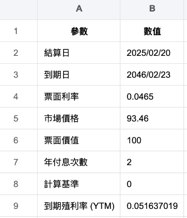

# YTM

_`Yield to Maturity`，到期殖利率。_

<br>

## 說明

1. 建立試算表。

    ```python
    import pandas as pd

    # 建立 Excel 試算表數據
    data = {
        "參數": [
            "結算日", "到期日", 
            "票面利率", "市場價格", "票面價值", 
            "年付息次數", "計算基準", "YTM 計算"
        ],
        "數值": [
            "2045/08/23", 
            "2046/02/23", 
            0.0465, 
            93.46, 100, 
            2, 0, 
            "=YIELD(A2, A3, A4, A5, A6, A7, A8)"
        ]
    }

    # 建立 DataFrame
    df = pd.DataFrame(data)

    # 定義 Excel 檔案名稱
    file_path = "data/債券YTM試算.xlsx"

    # 儲存 Excel
    df.to_excel(file_path, index=False)

    file_path
    ```

    

<br>

## 製作成網頁工具

_以下示範使用的是 Streamlit_

<br>

1. 安裝套件。

    ```bash
    pip install streamlit pandas numpy scipy
    ```

<br>

2. 建立腳本。

    ```bash
    code ytm_calculator.py
    ```

<br>

3. 編輯腳本；這裡會修正腳本來符合 Excel 公式的計算。

    ```python
    import streamlit as st
    import pandas as pd
    import numpy as np
    from scipy.optimize import newton


    # 修正 YTM 計算公式
    def bond_ytm(face_value, market_price, coupon_rate, years_to_maturity, payments_per_year):
        """使用 Newton-Raphson 方法計算到期殖利率 (YTM)"""
        coupon_payment = face_value * coupon_rate / payments_per_year

        # 定義目標函數
        def func(ytm):
            total = 0
            for t in range(1, int(years_to_maturity * payments_per_year) + 1):
                total += coupon_payment / (1 + ytm / payments_per_year) ** t
            total += face_value / (1 + ytm / payments_per_year) ** (payments_per_year * years_to_maturity)
            return total - market_price

        try:
            # 初始猜測 5%
            ytm = newton(func, 0.05)
            # 轉換為百分比
            return round(ytm * 100, 4)
        except RuntimeError:
            return "計算失敗"


    # 設定網頁標題
    st.title("📈 債券 YTM (到期殖利率) 計算器")

    # 建立輸入表單
    with st.form("ytm_form"):
        # 結算日
        settlement_date = st.date_input(
            "📅 結算日", value=pd.Timestamp.today().date()
        )

        # 到期日
        maturity_date = st.date_input(
            "🏁 到期日", value=pd.to_datetime("2054-6-1").date()
        )

        # 票面利率
        coupon_rate = st.number_input(
            "💰 票面利率 (%)", value=6.05, step=0.01
        ) / 100

        # 市場價格
        market_price = st.number_input(
            "📉 市場價格", value=100.53, step=0.01
        )

        # 票面價值
        face_value = st.number_input(
            "📜 票面價值", value=100, step=1
        )

        # 年付息次數
        payments_per_year = st.selectbox(
            "📆 每年付息次數", [1, 2, 4], index=1
        )

        # 提交按鈕
        submitted = st.form_submit_button(
            "📊 計算 YTM"
        )

        if submitted:
            # 計算剩餘年數
            years_to_maturity = (maturity_date - settlement_date).days / 365

            # 計算 YTM
            ytm_result = bond_ytm(
                face_value, market_price,
                coupon_rate,
                years_to_maturity,
                payments_per_year
            )

            # 顯示結果
            st.subheader("📈 計算結果")
            st.write(f"到期殖利率 (YTM): {ytm_result}%")

    # 顯示輸入資料表
    st.subheader("📋 你的輸入數據")
    df = pd.DataFrame(
        {
            "參數": [
                "結算日", "到期日", "票面利率",
                "市場價格", "票面價值", "年付息次數"
            ],
            "數值": [
                settlement_date,
                maturity_date,
                f"{coupon_rate * 100}%",
                market_price,
                face_value,
                payments_per_year,
            ],
        }
    )
    st.table(df)
    ```

<br>

4. 運行。

    ```bash
    streamlit run ytm_calculator.py
    ```

    

<br>

___

_END_