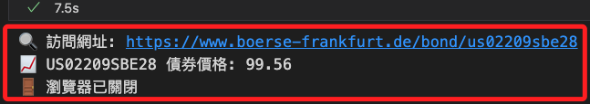
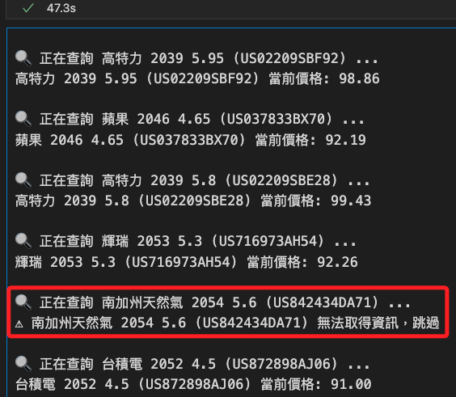
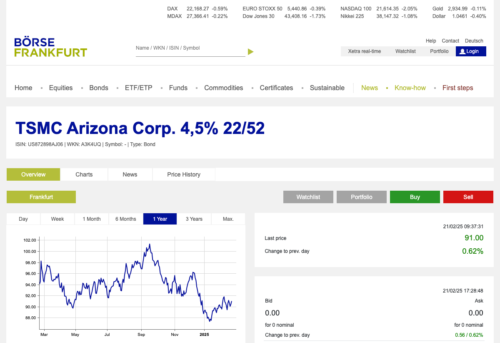

# 法蘭克福

_使用新版 Selenium_

<br>

## 代碼解析

1. 準備。

    ```python
    from selenium import webdriver
    from selenium.webdriver.chrome.service import Service
    from selenium.webdriver.common.by import By
    from selenium.webdriver.chrome.options import Options
    from selenium.webdriver.support.ui import WebDriverWait
    from selenium.webdriver.support import expected_conditions as EC
    from webdriver_manager.chrome import ChromeDriverManager

    # 設定 Chrome 選項
    options = Options()
    # 無頭模式 (新版)
    options.add_argument("--headless=new") 
    # 避免某些環境問題
    options.add_argument("--disable-gpu")
    # 在 Linux 環境避免權限問題
    options.add_argument("--no-sandbox")
    # 避免 Chrome 在 Docker 內記憶體不足
    options.add_argument("--disable-dev-shm-usage")
    # 防止 Selenium 被檢測
    options.add_argument("--disable-blink-features=AutomationControlled")

    # 自動安裝 ChromeDriver
    service = Service(ChromeDriverManager().install())

    # 啟動 WebDriver：帶入 service 及 options
    driver = webdriver.Chrome(service=service, options=options)
    ```

<br>

2. 查詢單一債券。

    ```python
    # 設定 ISIN Code，可以改成不同的債券 ISIN
    ISIN_CODE = "US02209SBE28"
    bond_url = f"https://www.boerse-frankfurt.de/bond/{ISIN_CODE.lower()}"

    print(f"🔍 訪問網址: {bond_url}")
    driver.get(bond_url)

    try:
        # 等待價格數據加載
        price_element = WebDriverWait(driver, 10).until(
            EC.presence_of_element_located((
                By.XPATH,
                "/html/body/app-root/app-wrapper/div/div/div/app-bond/div/div[2]/div[2]/div/div[1]/app-widget-price-box/div/div/table/tbody/tr[1]/td[@class='widget-table-cell text-right last-price text-color-green']"
            ))
        )

        # 取得價格
        bond_price = price_element.text
        print(f"📈 {ISIN_CODE} 債券價格: {bond_price}")
    # 例外處理
    except Exception as e:
        print(f"❌ 無法獲取價格: {e}")

    finally:
        # 關閉瀏覽器
        driver.quit()
        print("🚪 瀏覽器已關閉")
    ```

    

<br>

## 多商品查詢

_準備部分的代碼相同不做贅述，以下是包含準備部分的完整代碼_

<br>

1. 開始查詢。

    ```python
    from selenium import webdriver
    from selenium.webdriver.chrome.service import Service
    from selenium.webdriver.common.by import By
    from selenium.webdriver.chrome.options import Options
    from selenium.webdriver.support.ui import WebDriverWait
    from selenium.webdriver.support import expected_conditions as EC
    from webdriver_manager.chrome import ChromeDriverManager

    # 設定 Chrome 選項
    options = Options()
    # 無頭模式 (新版)
    options.add_argument("--headless=new")
    # 避免 GPU 問題
    options.add_argument("--disable-gpu")
    # 避免 Linux 權限問題
    options.add_argument("--no-sandbox")
    # 避免 Docker 記憶體不足
    options.add_argument("--disable-dev-shm-usage")  
    # 防止 Selenium 被檢測
    options.add_argument("--disable-blink-features=AutomationControlled")  

    # 自動安裝 ChromeDriver 並啟動 WebDriver
    service = Service(ChromeDriverManager().install())
    driver = webdriver.Chrome(service=service, options=options)

    # ISIN 對應的公司債名稱
    isin_to_name = {
        'US02209SBF92': '高特力 2039 5.95',
        'US037833BX70': '蘋果 2046 4.65',
        'US02209SBE28': '高特力 2039 5.8',
        'US716973AH54': '輝瑞 2053 5.3',
        'US842434DA71': '南加州天然氣 2054 5.6',
        'US872898AJ06': '台積電 2052 4.5',
        'USF2893TAE67': '法國電力 2040 5.6',
        'US05526DBV64': '英美菸草 2052 4.65',
        'US717081ED10': '輝瑞 2046 4.125',
        'US716973AG71': '輝瑞 2053 5.3'
    }

    # 遍歷每個 ISIN 查詢價格
    for isin, bond_name in isin_to_name.items():
        bond_url = f"https://www.boerse-frankfurt.de/bond/{isin.lower()}"
        print(f"\n🔍 正在查詢 {bond_name} ({isin}) ...")
        
        # 訪問網址
        driver.get(bond_url)

        try:
            # 等待價格數據加載
            price_element = WebDriverWait(driver, 10).until(
                EC.presence_of_element_located((
                    By.XPATH,
                    "/html/body/app-root/app-wrapper/div/div/div/app-bond/div/div[2]/div[2]/div/div[1]/app-widget-price-box/div/div/table/tbody/tr[1]/td[@class='widget-table-cell text-right last-price text-color-green']"
                ))
            )

            # 取得價格
            bond_price = price_element.text
            print(f"{bond_name} ({isin}) 當前價格: {bond_price}")

        except:
            # 查詢失敗時，簡單輸出提示，不顯示多餘錯誤資訊
            print(f"⚠️ {bond_name} ({isin}) 無法取得資訊，跳過")
            # 直接跳到下一個 ISIN
            continue

    # 關閉瀏覽器
    driver.quit()
    print("\n🚪 瀏覽器已關閉")
    ```

    

<br>

## 獲取截圖

1. 取得個別標的查詢畫面截圖。

    ```python
    from selenium import webdriver
    from selenium.webdriver.chrome.service import Service
    from selenium.webdriver.common.by import By
    from selenium.webdriver.support.ui import WebDriverWait
    from selenium.webdriver.support import expected_conditions as EC
    from webdriver_manager.chrome import ChromeDriverManager

    # 設定 Chrome 瀏覽器參數
    options = webdriver.ChromeOptions()
    # 使用新版無頭模式
    options.add_argument("--headless=new")
    # 避免 GPU 問題
    options.add_argument("--disable-gpu")
    # 避免 Linux 權限問題
    options.add_argument("--no-sandbox")
    # 避免 Docker 記憶體不足
    options.add_argument("--disable-dev-shm-usage")
    # 防止 Selenium 被檢測
    options.add_argument("--disable-blink-features=AutomationControlled")

    # 自動安裝 ChromeDriver 並啟動 WebDriver
    service = Service(ChromeDriverManager().install())
    driver = webdriver.Chrome(
        service=service, options=options
    )

    # 設定目標網址
    url = "https://www.boerse-frankfurt.de/bond/us872898aj06-tsmc-arizona-corp-4-5-22-52"
    print(f"🔍 正在訪問: {url}")
    driver.get(url)

    try:
        # 等待 Cookie 同意按鈕並點擊
        WebDriverWait(driver, 5).until(
            EC.element_to_be_clickable((
                By.ID, "cookie-hint-btn-accept"
            ))
        ).click()
        print("已接受 Cookie 設定")
    except Exception:
        print("⚠️ 未偵測到 Cookie 按鈕，可能已自動接受或不存在")

    try:
        # 確保主要內容區塊載入完成
        WebDriverWait(driver, 15).until(
            EC.presence_of_element_located((
                By.CLASS_NAME, "content-wrapper"
            ))
        )
        # 確保 `document.readyState` 為 "complete"
        WebDriverWait(driver, 10).until(
            lambda d: d.execute_script("return document.readyState") == "complete"
        )
        # 等待圖表載入 (嘗試找到 `canvas` 或 `svg` 元素)
        WebDriverWait(driver, 10).until(
            EC.presence_of_element_located((
                By.TAG_NAME, "canvas"
            ))
        )
        print("頁面與線圖載入完成，開始截圖")
        # 截取整個頁面的圖片
        screenshot_path = "screenshot.png"
        driver.save_screenshot(screenshot_path)
        print(f"📸 截圖已儲存至: {screenshot_path}")
    except Exception as e:
        print(f"❌ 頁面或圖表加載失敗: {e}")
    finally:
        # 關閉 WebDriver
        driver.quit()
        print("🚪 瀏覽器已關閉")
    ```

    

<br>

___

_END_