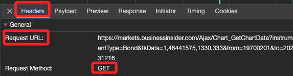

# Markets Insider

_Markets Insider 是 Business Insider 旗下的財經資訊平台，專門提供即時金融市場數據、股票報價、外匯、加密貨幣、期貨、商品價格等投資相關資訊。_

 

 

## 說明

_以下嘗試從 `Markets Insider` 網站取得標的商品的歷史交易紀錄，這裡以 `US02209SBE28` 為例。_

 

## 搜尋所需的封包

1. 訪問 [Markets Insider](https://markets.businessinsider.com/) 網站。

 

2. 在右上方輸入 ISIN Code `US02209SBE28` 進行搜尋。

    

 

3. 下方會顯示圖表，以下就是要來取得這張圖表中的歷史紀錄。

    

 

## 開始操作

1. 在瀏覽器點擊 `F12` 進行檢視。

 

2. 點擊 `Network` 然後切換到 `Fetch/XHR`。

    

 

3. 在 `Name` 欄位內任意選取一個項目，然後右邊切換到 `Respopnse`。

    

 

4. 在這個步驟需要逐一人工檢查，然後會在 `Chart...` 的項目下看到所需的歷史交易紀錄，也是網頁中用來繪製圖表的數據。

    

 

5. 也可以直接點擊。

    

 

6. 會在瀏覽器中展開這個資料。

    

 

7. 可以點擊 `Preview` 來展開資料查看，至此已經找到所需的封包。

    

 

8. 切換到 `Headers`，在 `Request URL` 的部分，使用的方法是 `GET`，這些都是重要的資訊，後面都還會用到。

    

 

___

_未完_