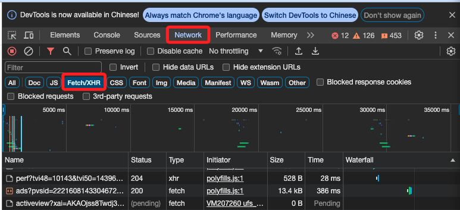

# Markets Insider

_Markets Insider 是 Business Insider 旗下的財經資訊平台，專門提供即時金融市場數據、股票報價、外匯、加密貨幣、期貨、商品價格等投資相關資訊。_

<br>


<br>

## 說明

_以下嘗試從 `Markets Insider` 網站取得標的商品的歷史交易紀錄，這裡以 `US02209SBE28` 為例。_

<br>

## 搜尋所需的封包

1. 訪問 [Markets Insider](https://markets.businessinsider.com/) 網站。

<br>

2. 在右上方輸入 ISIN Code `US02209SBE28` 進行搜尋。

    

<br>

3. 下方會顯示圖表，以下就是要來取得這張圖表中的歷史紀錄。

    

<br>

## 開始操作

1. 在瀏覽器點擊 `F12` 進行檢視。

<br>

2. 點擊 `Network` 然後切換到 `Fetch/XHR`。

    

<br>

3. 在 `Name` 欄位內任意選取一個項目，然後右邊切換到 `Respopnse`。

    

<br>

4. 在這個步驟需要逐一人工檢查，然後會在 `Chart...` 的項目下看到所需的歷史交易紀錄，也是網頁中用來繪製圖表的數據。

    

<br>

5. 也可以直接點擊。

    

<br>

6. 會在瀏覽器中展開這個資料。

    

<br>

7. 可以點擊 `Preview` 來展開資料查看，至此已經找到所需的封包。

    

<br>

8. 切換到 `Headers`，在 `Request URL` 的部分，使用的方法是 `GET`，這些都是重要的資訊，後面都還會用到。

    

<br>

## 解析

1. 取得全部資訊。

```python
import requests
import json
import time

# API URL
url = "https://markets.businessinsider.com/Ajax/Chart_GetChartData?instrumentType=Bond&tkData=1,46441575,1330,333&from=19700201&to=20250219"

# 加入 `User-Agent` 模擬瀏覽器
headers = {
    "User-Agent": "Mozilla/5.0 (Macintosh; Intel Mac OS X 10_15_7) AppleWebKit/537.36 (KHTML, like Gecko) Chrome/120.0.0.0 Safari/537.36"
}

# 重試機制
max_attempts = 3
attempt = 0
data = None  # 儲存 API 回應的數據

while attempt < max_attempts:
    try:
        print(
            f"🔍 正在查詢債券數據 (嘗試 {attempt + 1}/{max_attempts}) ..."
        )
        response = requests.get(url, headers=headers, timeout=15)
        
        # 檢查回應是否成功
        if response.status_code == 200:
            print("✅ API 請求成功，完整回應內容如下：")
            print(response.text)  # 完整輸出 API 回應
            break  # 直接跳出迴圈
        else:
            print(
                f"❌ 請求失敗，狀態碼: {response.status_code}"
            )
    
    except (requests.exceptions.Timeout, requests.exceptions.ConnectionError) as e:
        print(
            f"⚠️ 查詢超時，正在重試 ({attempt+1}/{max_attempts}) ..."
        )

    attempt += 1
    # 等待 5 秒後重試
    time.sleep(5)
```

2. 篩選交易資訊。

```python
import requests
import json
import pandas as pd

# API URL
url = "https://markets.businessinsider.com/Ajax/Chart_GetChartData?instrumentType=Bond&tkData=1,46441575,1330,333&from=19700201&to=20250219"

# 加入 `User-Agent` 模擬瀏覽器
headers = {
    "User-Agent": "Mozilla/5.0 (Macintosh; Intel Mac OS X 10_15_7) AppleWebKit/537.36 (KHTML, like Gecko) Chrome/120.0.0.0 Safari/537.36"
}

# 發送請求
response = requests.get(url, headers=headers, timeout=15)

# 解析回應數據
if response.status_code == 200:
    data = json.loads(response.text)

    # 轉換為 DataFrame
    df = pd.DataFrame(data)

    # 確保日期欄位是遞增排序
    df['Date'] = pd.to_datetime(df['Date'])
    # 按日期降序排序，最新的排在最前面
    df = df.sort_values(by='Date', ascending=False)

    # 提取最新交易日的數據
    # 最新一筆交易數據
    latest_trade = df.iloc[0]

    # 顯示結果
    latest_info = {
        "日期": latest_trade["Date"].strftime('%Y-%m-%d'),
        "收盤價": latest_trade["Close"],
        "開盤價": latest_trade["Open"],
        "最高價": latest_trade["High"],
        "最低價": latest_trade["Low"],
        "交易量": latest_trade["Volume"]
    }

    print("📊 最新債券交易資訊：")
    for key, value in latest_info.items():
        print(f"{key}: {value}")

else:
    print(f"❌ API 查詢失敗，狀態碼: {response.status_code}")
```


<br>

___


_未完_