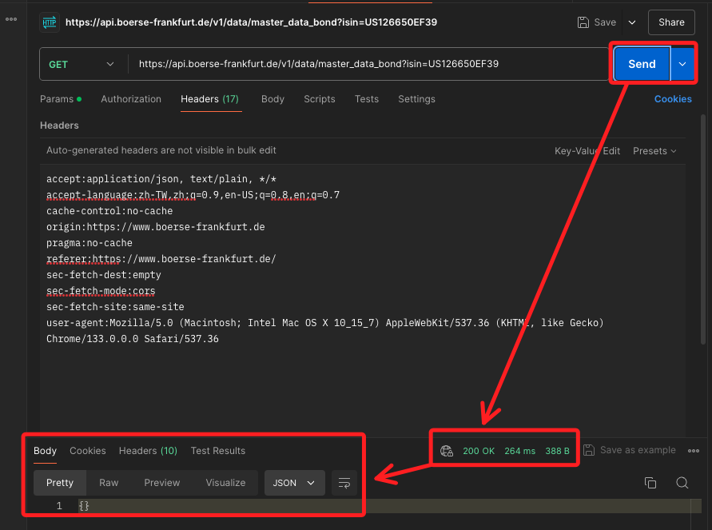

# 法蘭克福進階

<br>

## 說明

1. 進入法蘭克福 [官網首頁](https://www.boerse-frankfurt.de/en)，並輸入任意 ISIN CODE 如 `US126650EF39`，點擊 `ENTER` 後查詢。

    

<br>

2. 會看到以下頁面，此時開啟開發者模式。

    

<br>

3. 確保勾選了 `Disable cache`，這樣每次刷新都會取回新的資訊，而不是讀取快取中的資料。

    

<br>

4. 刷新頁面後，在 `Name` 中點擊任意項目，例如 `master_data_bond...`，在右側切換到 `Response` 觀察資訊內容是否為想取回的項目。

    

<br>

## 使用 Postman

1. 開啟桌面應用 `Postman`，點擊 `+` 開啟新的頁籤。

    

<br>

2. 在瀏覽器開發者模式中，切換到 `Headers` 頁籤，先確認 `Request Method`，這裡是 `GET`，然後複製 `Request URL`。

    

<br>

3. 在 Postman 中貼上內容，並選取為 `GET`，接著點擊 `Send`。

    

<br>

4. 查看下方的 `Body` 所回傳的資訊，這時顯示為空。

    

<br>

## 進階處理

1. 返回瀏覽器中，複製下方的 `Request Headers`。

    

<br>

2. 切換到 `Headers`，並點擊 `Bulk Edit`，將複製的內容貼上。

    

<br>

3. 先將不用的資訊刪除，保留 `accept:` 之後部分。

    

<br>

4. 清洗後如下。

    ```bash
    accept:application/json, text/plain, */*
    accept-language:zh-TW,zh;q=0.9,en-US;q=0.8,en;q=0.7
    cache-control:no-cache
    origin:https://www.boerse-frankfurt.de
    pragma:no-cache
    referer:https://www.boerse-frankfurt.de/
    sec-fetch-dest:empty
    sec-fetch-mode:cors
    sec-fetch-site:same-site
    user-agent:Mozilla/5.0 (Macintosh; Intel Mac OS X 10_15_7) AppleWebKit/537.36 (KHTML, like Gecko) Chrome/133.0.0.0 Safari/537.36
    ```

<br>

5. 點擊 `Send` 查看，此時網頁回傳 `200` 表示正常，但是 `Body` 卻是空的。

    

<br>

## 檢查

1. 回到網頁中，點擊所查詢的項目，會自動開啟新的頁籤進行訪問。

    

<br>

2. 可發現所取回的資訊確實回空。

    

<br>

3. 切換另一個項目進行訪問。

    

<br>

4. 發現可順利取得資訊。

    

<br>

5. 複製這個 URL 到 Postman 中進行檢索，其餘設定不變，僅更換 URL。

    

<br>

6. 點擊 `Send` 再觀察下方的 `Body`。

    

<br>

## 編輯腳本

1. 編輯腳本如下；其中網址部分要分拆為網址與參數，另外，參數與 `headers` 相同都要按照字典格式撰寫。

    ```python
    import requests

    url = "https://api.boerse-frankfurt.de/v1/bonds/api/v1/data_for_datasheet"
    params = {"isin": "US126650EF39"}
    headers = {
        "accept": "application/json, text/plain, */*",
        "accept-language": "zh-TW,zh;q=0.9,en-US;q=0.8,en;q=0.7",
        "cache-control": "no-cache",
        "origin": "https://www.boerse-frankfurt.de",
        "pragma": "no-cache",
        "referer": "https://www.boerse-frankfurt.de/",
        "sec-fetch-dest": "empty",
        "sec-fetch-mode": "cors",
        "sec-fetch-site": "same-site",
        "user-agent": "Mozilla/5.0 (Macintosh; Intel Mac OS X 10_15_7) AppleWebKit/537.36 (KHTML, like Gecko) Chrome/133.0.0.0 Safari/537.36",
    }

    response = requests.get(url, headers=headers, params=params)

    if response.status_code == 200:
        print("✅ 成功取得數據:", response.json())
    else:
        print("❌ 請求失敗，狀態碼:", response.status_code)
    ```

<br>

___

_END_