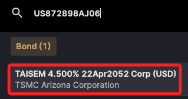
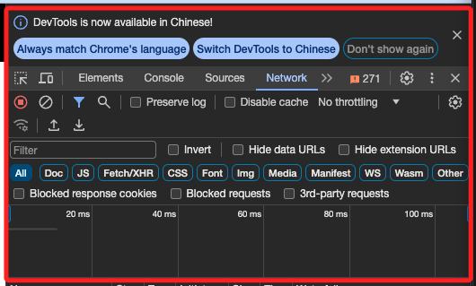
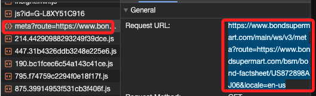
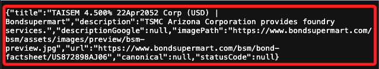
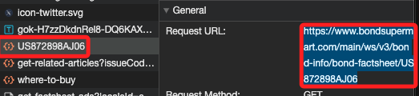
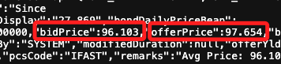
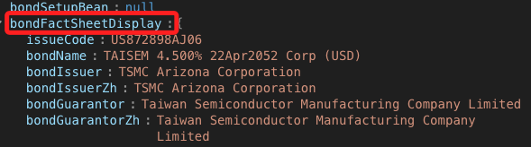
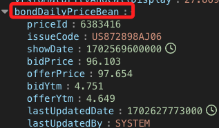

# Bondsupermart

<br>

## 說明

1. [官網](https://www.bondsupermart.com/bsm/)。

    

<br>

2. 先透過搜尋功能查詢 `US872898AJ06`。

    

<br>

3. 找到之後點擊開啟。

    

<br>

4. 打開 `F12` 檢視網頁。

    

<br>

5. 刷新一次頁面。

    

<br>

6. 逐一查看，其中網址。

    ```txt
    https://www.bondsupermart.com/main/ws/v3/meta?route=https://www.bondsupermart.com/bsm/bond-factsheet/US872898AJ06&locale=en-us
    ```

    

<br>

7. 提供的是債券的基本資料。

    

<br>

8. 再看看這個網址。

    ```txt
    https://www.bondsupermart.com/main/ws/v3/bond-info/bond-factsheet/US872898AJ06
    ```

    

<br>

9. 在密密麻麻的數據中，可以找到 `bidPrice` 以及 `offerPrice`。

    

<br>

10. 貼到 [JSON Editor Online](https://jsoneditoronline.org/#left=local.hogiko&right=local.yorure) 查看內容，包含了債券基本資料 `bondFactSheetDisplay`。

    

<br>

11. 也包含了交易基本資料 `bondDailyPriceBean`。

    

<br>

## 程式碼

_暫時先做到這_

<br>

1. 完整程式碼。

    ```python
    import requests
    from datetime import datetime
    import pytz

    # 設置目標網址
    url = 'https://www.bondsupermart.com/main/ws/v3/bond-info/bond-factsheet/US872898AJ06'
    # 發送 GET 請求
    response = requests.get(url)

    # 封裝函數
    def transform_date(_date_str):
        # 轉換為秒
        timestamp_s = _date_str / 1000.0
        # 建立 datetime 對象
        dt = datetime.utcfromtimestamp(timestamp_s)
        # 設置時區為 UTC
        dt = dt.replace(tzinfo=pytz.utc)
        # 轉換為台灣時區
        taipei_tz = pytz.timezone('Asia/Taipei')
        dt_taipei = dt.astimezone(taipei_tz)
        _result = dt_taipei.strftime('%Y-%m-%d %H:%M:%S')
        # 輸出轉換後的台灣時間
        return _result

    # 確認請求成功
    if response.status_code == 200:
        # 解析 JSON 數據
        data = response.json()

        # 提取 bondDailyPriceBean 下的 bidPrice 和 offerPrice、lastUpdatedDate
        bond_daily_price_bean = data.get('bondDailyPriceBean', {})
        #
        bid_price = bond_daily_price_bean.get('bidPrice')
        offer_price = bond_daily_price_bean.get('offerPrice')
        last_updated_date = bond_daily_price_bean.get('lastUpdatedDate')
        last_updated_date = transform_date(last_updated_date)

        # 輸出結果
        print(f'Bid Price: {bid_price}')
        print(f'Offer Price: {offer_price}')
        print(f'Last Updated Date: {last_updated_date}')
    else:
        print(
            'Failed to retrieve data, '
            f'status code: {response.status_code}'
        )
    ```

<br>

___

_END_