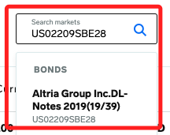
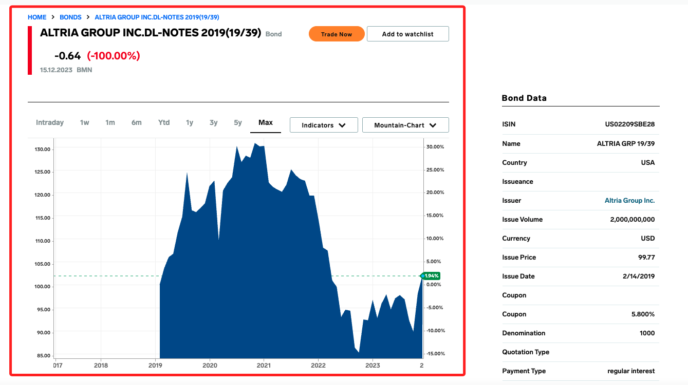
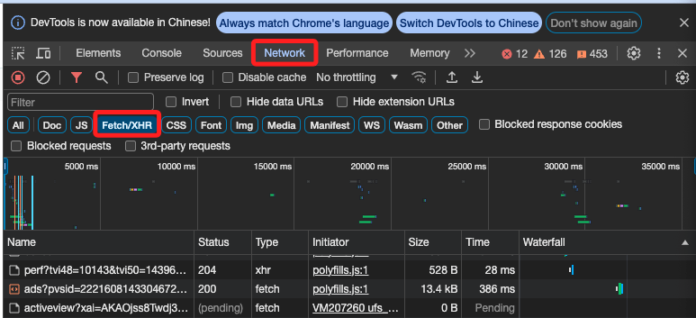
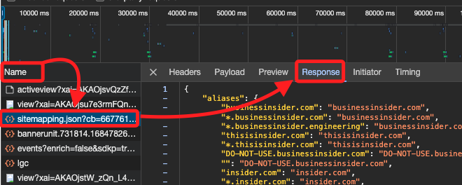
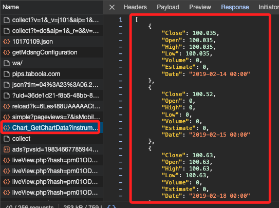
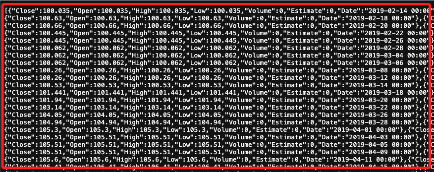
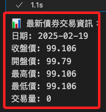

# Markets Insider

_Markets Insider 是 Business Insider 旗下的財經資訊平台，專門提供即時金融市場數據、股票報價、外匯、加密貨幣、期貨、商品價格等投資相關資訊。_

<br>


<br>

## 說明

_以下嘗試從 `Markets Insider` 網站取得標的商品的歷史交易紀錄，這裡以 `US02209SBE28` 為例。_

<br>

## 搜尋所需的封包

1. 訪問 [Markets Insider](https://markets.businessinsider.com/) 網站。

<br>

2. 在右上方輸入 ISIN Code `US02209SBE28` 進行搜尋。

    

<br>

3. 下方會顯示圖表，以下就是要來取得這張圖表中的歷史紀錄。

    

<br>

## 開始操作

1. 在瀏覽器點擊 `F12` 進行檢視。

<br>

2. 點擊 `Network` 然後切換到 `Fetch/XHR`。

    

<br>

3. 在 `Name` 欄位內任意選取一個項目，然後右邊切換到 `Respopnse`。

    

<br>

4. 在這個步驟需要逐一人工檢查，然後會在 `Chart...` 的項目下看到所需的歷史交易紀錄，也是網頁中用來繪製圖表的數據。

    

<br>

5. 也可以直接點擊。

    

<br>

6. 會在瀏覽器中展開這個資料。

    

<br>

7. 可以點擊 `Preview` 來展開資料查看，至此已經找到所需的封包。

    

<br>

8. 切換到 `Headers`，在 `Request URL` 的部分，使用的方法是 `GET`，這些都是重要的資訊，後面都還會用到。

    

<br>

## 解析

1. 取得全部資訊。

    ```python
    import requests
    import json
    import time

    # API URL
    url = "https://markets.businessinsider.com/Ajax/Chart_GetChartData?instrumentType=Bond&tkData=1,46441575,1330,333&from=19700201&to=20250219"

    # 加入 `User-Agent` 模擬瀏覽器
    headers = {
        "User-Agent": "Mozilla/5.0 (Macintosh; Intel Mac OS X 10_15_7) AppleWebKit/537.36 (KHTML, like Gecko) Chrome/120.0.0.0 Safari/537.36"
    }

    # 重試機制
    max_attempts = 3
    attempt = 0
    # 儲存 API 回應的數據
    data = None

    while attempt < max_attempts:
        try:
            print(
                "🔍 正在查詢債券數據"
                f" (嘗試 {attempt + 1}/{max_attempts}) ..."
            )
            response = requests.get(
                url, headers=headers, timeout=15
            )
            
            # 檢查回應是否成功
            if response.status_code == 200:
                print("API 請求成功，完整回應內容如下：")
                # 完整輸出 API 回應
                print(response.text)
                # 直接跳出迴圈
                break
            else:
                print(
                    f"❌ 請求失敗，狀態碼: {response.status_code}"
                )
        
        except (requests.exceptions.Timeout, requests.exceptions.ConnectionError) as e:
            print(
                f"⚠️ 查詢超時，正在重試 ({attempt+1}/{max_attempts}) ..."
            )

        attempt += 1
        # 等待 5 秒後重試
        time.sleep(5)
    ```

<br>

2. 篩選交易資訊；`instrumentType=Bond` 指定查詢的是 `債券`，`tkData=1,46441575,1330,333` 用於特定債券的標識符，不同債券會有不同的 `tkData`，`from=19700201&to=20231216` 指定查詢時間範圍。

    ```python
    import requests
    import json
    import pandas as pd

    # API URL
    url = "https://markets.businessinsider.com/Ajax/Chart_GetChartData?instrumentType=Bond&tkData=1,46441575,1330,333&from=19700201&to=20250219"

    # 加入 `User-Agent` 模擬瀏覽器
    headers = {
        "User-Agent": "Mozilla/5.0 (Macintosh; Intel Mac OS X 10_15_7) AppleWebKit/537.36 (KHTML, like Gecko) Chrome/120.0.0.0 Safari/537.36"
    }

    # 發送請求
    response = requests.get(url, headers=headers, timeout=15)

    # 解析回應數據
    if response.status_code == 200:
        data = json.loads(response.text)

        # 轉換為 DataFrame
        df = pd.DataFrame(data)

        # 確保日期欄位是遞增排序
        df['Date'] = pd.to_datetime(df['Date'])
        # 按日期降序排序，最新的排在最前面
        df = df.sort_values(by='Date', ascending=False)

        # 提取最新交易日的數據
        # 最新一筆交易數據
        latest_trade = df.iloc[0]

        # 顯示結果
        latest_info = {
            "日期": latest_trade["Date"].strftime('%Y-%m-%d'),
            "收盤價": latest_trade["Close"],
            "開盤價": latest_trade["Open"],
            "最高價": latest_trade["High"],
            "最低價": latest_trade["Low"],
            "交易量": latest_trade["Volume"]
        }

        print("📊 最新債券交易資訊：")
        for key, value in latest_info.items():
            print(f"{key}: {value}")

    else:
        print(f"❌ API 查詢失敗，狀態碼: {response.status_code}")
    ```

    

<br>

## 儲存標資訊

1. 查詢並儲存指定標的資訊。

    ```python
    import requests
    import pandas as pd
    from datetime import datetime

    # URL 從哪裡取得資料
    url = "https://markets.businessinsider.com/Ajax/Chart_GetChartData?instrumentType=Bond&tkData=1,46441575,1330,333&from=19700201&to=20250220"

    # 發送請求取得資料
    response = requests.get(url)

    # 檢查響應狀態碼，確保請求成功
    if response.status_code == 200:
        # 解析 JSON 數據
        data = response.json()

        # 轉換為 DataFrame
        df = pd.DataFrame(data)

        # 將日期從字串轉換為 datetime 對象
        df['Date'] = pd.to_datetime(df['Date'])

        # 儲存為 Excel 文件
        excel_file = 'data/MarketsInsider_數據.xlsx'
        df.to_excel(
            excel_file, index=False
        )

        print(f"數據已儲存到 {excel_file}")
    else:
        print(
            "Failed to retrieve data:",
            response.status_code
        )
    ```

<br>

## 批次下載

1. 這是對照表，提供做為參考，後續可作為獨立文件繼續拓展，無需寫入每一個腳本中。

    ```python
    isin_to_name = {
        'US02209SBF92': '高特力 2039 5.95', "1,46441569,1330,333",
        'US037833BX70': '蘋果 2046 4.65', "1,31618402,1330,333",
        'US02209SBE28': '高特力 2039 5.8', "1,46441575,1330,333",
        'US716973AH54': '輝瑞 2053 5.3', "1,127132136,1330,333",
        'US842434DA71': '南加州天然氣 2054 5.6', "",
        'US872898AJ06': '台積電 2052 4.5', "1,118393079,16,333",
        'USF2893TAE67': '法國電力 2040 5.6', "1,10955366,1330,333",
        'US05526DBV64': '英美菸草 2052 5.65', "1,117582253,1330,333",
        'US717081ED10': '輝瑞 2046 4.125', "",
        'US716973AG71': '輝瑞 2053 5.3', "1,127131476,1330,333",
    }
    ```

<br>

2. 批次查詢。

    ```python
    import requests
    import pandas as pd
    from datetime import datetime

    # ISIN 對應的 tkData
    isin_to_tkdata = {
        'US02209SBF92': ('高特力 2039 5.95', '1,46441569,1330,333'),
        'US037833BX70': ('蘋果 2046 4.65', '1,31618402,1330,333'),
        'US02209SBE28': ('高特力 2039 5.8', '1,46441575,1330,333'),
        'US716973AH54': ('輝瑞 2053 5.3', '1,127132136,1330,333'),
        'US842434DA71': ('南加州天然氣 2054 5.6', ''),  # 尚未查到
        'US872898AJ06': ('台積電 2052 4.5', '1,118393079,16,333'),
        'USF2893TAE67': ('法國電力 2040 5.6', '1,10955366,1330,333'),
        'US05526DBV64': ('英美菸草 2052 5.65', '1,117582253,1330,333'),
        'US717081ED10': ('輝瑞 2046 4.125', ''),  # 尚未查到
        'US716973AG71': ('輝瑞 2053 5.3', '1,127131476,1330,333')
    }

    # 查詢時間範圍
    start_date = "19700201"
    end_date = "20250220"

    # 儲存所有數據的 DataFrame 字典
    all_data = {}

    # 遍歷每個 ISIN，查詢價格數據
    for isin, (bond_name, tk_data) in isin_to_tkdata.items():
        print(f"\n🔍 正在查詢 {bond_name} ({isin}) ...")

        if not tk_data:
            print(f"⚠️ 無法取得 {bond_name} ({isin}) 的 tkData，跳過")
            # 若無 tkData，直接跳過
            continue

        # 設定 API URL
        url = f"https://markets.businessinsider.com/Ajax/Chart_GetChartData?instrumentType=Bond&tkData={tk_data}&from={start_date}&to={end_date}"
        
        # 發送請求
        response = requests.get(url)

        if response.status_code == 200:
            try:
                data = response.json()
                # 若 API 回傳空數據，則跳過
                if not data:
                    print(f"⚠️ {bond_name} ({isin}) 無數據，跳過")
                    continue

                # 轉換為 DataFrame
                df = pd.DataFrame(data)
                # 日期格式 yyyy/mm/dd
                df['Date'] = pd.to_datetime(df['Date']).dt.strftime('%Y/%m/%d')

                # 只保留 Close 欄位
                df = df[['Date', 'Close']]

                # 加入 ISIN 和 Bond Name
                df.insert(1, 'ISIN', isin)
                df.insert(2, 'Bond Name', bond_name)

                # 加入至數據字典
                all_data[bond_name] = df
                print(
                    f"{bond_name} ({isin}) 數據取得成功，"
                    f"共 {len(df)} 筆"
                )

            except Exception as e:
                print(
                    f"❌ 解析 {bond_name} ({isin}) "
                    f"JSON 失敗: {e}"
                )
        else:
            print(
                f"❌ {bond_name} ({isin}) 查詢失敗，"
                f"HTTP 狀態碼: {response.status_code}"
            )

    # 儲存至 Excel，每支債券分開存放在不同的 Sheet
    if all_data:
        excel_file = 'data/MI_歷史數據_全.xlsx'
        with pd.ExcelWriter(excel_file, engine='xlsxwriter') as writer:
            for sheet_name, df in all_data.items():
                # Excel Sheet 名稱最多 31 字元
                sheet_name = sheet_name[:31]
                df.to_excel(writer, sheet_name=sheet_name, index=False)
        print(
            f"\n📊 所有數據已儲存至 {excel_file}，"
            "每支債券單獨存放在不同的 Sheet"
        )
    else:
        print("\n⚠️ 無有效數據，未儲存 Excel 檔案")
    ```

<br>

2. 若要儲存個別文件。

    ```python
    import requests
    import pandas as pd
    from datetime import datetime

    # ISIN 對應的 tkData
    isin_to_tkdata = {
        'US02209SBF92': ('高特力 2039 5.95', '1,46441569,1330,333'),
        'US037833BX70': ('蘋果 2046 4.65', '1,31618402,1330,333'),
        'US02209SBE28': ('高特力 2039 5.8', '1,46441575,1330,333'),
        'US716973AH54': ('輝瑞 2053 5.3', '1,127132136,1330,333'),
        'US842434DA71': ('南加州天然氣 2054 5.6', ''),  # 尚未查到
        'US872898AJ06': ('台積電 2052 4.5', '1,118393079,16,333'),
        'USF2893TAE67': ('法國電力 2040 5.6', '1,10955366,1330,333'),
        'US05526DBV64': ('英美菸草 2052 5.65', '1,117582253,1330,333'),
        'US717081ED10': ('輝瑞 2046 4.125', ''),  # 尚未查到
        'US716973AG71': ('輝瑞 2053 5.3', '1,127131476,1330,333')
    }

    # 查詢時間範圍
    start_date = "19700201"
    end_date = "20250220"

    # 遍歷每個 ISIN，查詢價格數據
    for isin, (bond_name, tk_data) in isin_to_tkdata.items():
        print(f"\n🔍 正在查詢 {bond_name} ({isin}) ...")

        if not tk_data:
            print(f"⚠️ 無法取得 {bond_name} ({isin}) 的 tkData，跳過")
            # 若無 tkData，直接跳過
            continue

        # 設定 API URL
        url = f"https://markets.businessinsider.com/Ajax/Chart_GetChartData?instrumentType=Bond&tkData={tk_data}&from={start_date}&to={end_date}"
        
        # 發送請求
        response = requests.get(url)

        if response.status_code == 200:
            try:
                data = response.json()
                # 若 API 回傳空數據，則跳過
                if not data:
                    print(f"⚠️ {bond_name} ({isin}) 無數據，跳過")
                    continue

                # 轉換為 DataFrame
                df = pd.DataFrame(data)
                # 日期格式 yyyy/mm/dd
                df['Date'] = pd.to_datetime(df['Date']).dt.strftime('%Y/%m/%d')

                # 只保留 Close 欄位
                df = df[['Date', 'Close']]

                # 加入 ISIN 和 Bond Name
                df.insert(1, 'ISIN', isin)
                df.insert(2, 'Bond Name', bond_name)

                # 設定儲存的 Excel 檔名
                excel_filename = f"data/MI_歷史數據_{isin}_{start_date}-{end_date}.xlsx"

                # 儲存為獨立的 Excel 文件
                df.to_excel(excel_filename, index=False)
                print(
                    f"{bond_name} ({isin}) "
                    f"數據儲存至 {excel_filename}"
                )

            except Exception as e:
                print(f"❌ 解析 {bond_name} ({isin}) JSON 失敗: {e}")
        else:
            print(
                f"❌ {bond_name} ({isin}) 查詢失敗，"
                f"HTTP 狀態碼: {response.status_code}"
            )

    print("\n📊 所有數據下載完成！")
    ```

<br>

## 繪圖

1. 繪製基本圖形。

    ```python
    import pandas as pd
    import matplotlib.pyplot as plt
    import os
    from matplotlib.ticker import MaxNLocator

    # 設定 Excel 檔案名稱
    excel_file = "data/MI_歷史數據_全.xlsx"

    # 讀取 Excel 文件的所有工作表
    xls = pd.ExcelFile(excel_file)

    # 設定 MacOS 適用的字體，避免中文亂碼
    plt.rcParams["font.family"] = "Arial Unicode MS"
    # 確保負號正常顯示
    plt.rcParams["axes.unicode_minus"] = False

    # 確保輸出目錄存在
    output_dir = "charts"
    os.makedirs(output_dir, exist_ok=True)

    # 遍歷每個 Sheet，繪製並儲存折線圖
    for sheet_name in xls.sheet_names:
        df = pd.read_excel(xls, sheet_name=sheet_name)

        # 檢查 DataFrame 是否包含必要欄位
        if "Date" in df.columns and "Close" in df.columns:
            # 轉換日期格式
            df["Date"] = pd.to_datetime(df["Date"])

            # 計算最高點與最低點
            max_idx = df["Close"].idxmax()
            min_idx = df["Close"].idxmin()
            last_idx = df.index[-1]

            max_date, max_price = df.loc[max_idx, ["Date", "Close"]]
            min_date, min_price = df.loc[min_idx, ["Date", "Close"]]
            last_date, last_price = df.loc[last_idx, ["Date", "Close"]]

            # 設定圖形大小
            plt.figure(figsize=(12, 6))

            # 繪製折線圖
            plt.plot(
                df["Date"],
                df["Close"],
                marker="o",
                markersize=2,
                linestyle="-",
                linewidth=1.0,
                label="收盤價 (Close)",
            )

            # 標註最高點
            plt.annotate(
                f"最高: {max_price:.2f}",
                xy=(max_date, max_price),
                xytext=(max_date, max_price + 2),
                arrowprops=dict(facecolor="red", arrowstyle="->"),
                fontsize=10,
                color="red",
            )

            # 標註最低點
            plt.annotate(
                f"最低: {min_price:.2f}",
                xy=(min_date, min_price),
                xytext=(min_date, min_price - 2),
                arrowprops=dict(facecolor="blue", arrowstyle="->"),
                fontsize=10,
                color="blue",
            )

            # 標註最後價格
            plt.annotate(
                f"最後: {last_price:.2f}",
                xy=(last_date, last_price),
                xytext=(last_date, last_price + 2),
                arrowprops=dict(facecolor="black", arrowstyle="->"),
                fontsize=10,
                color="black",
            )

            # 設定標題與標籤
            plt.title(f"{sheet_name} - 價格變動", fontsize=14)
            plt.xlabel("日期", fontsize=12)
            plt.ylabel("收盤價 (Close)", fontsize=12)

            # 設定 X 軸日期間隔，使其不擁擠
            plt.xticks(rotation=45)
            # 最多顯示 8 個日期刻度
            plt.gca().xaxis.set_major_locator(MaxNLocator(nbins=8))

            # 顯示圖例
            plt.legend(fontsize=10)

            # 儲存圖表
            chart_path = os.path.join(output_dir, f"{sheet_name}.png")
            # 增加 DPI 使圖形更清晰
            plt.savefig(chart_path, bbox_inches="tight", dpi=300)
            plt.close()

    print(f"📊 所有折線圖已儲存至資料夾: {output_dir}")
    ```

<br>

## 添加美國各個天期公債

1. 安裝套件。

```bash
pip install akshare scipy
```

2. 繪圖，公司債價格線 加粗 (linewidth=2.0)，移除 點標記 (marker='')。

```python
import pandas as pd
import matplotlib.pyplot as plt
import os
from matplotlib.ticker import MaxNLocator
import akshare as ak
from scipy.interpolate import make_interp_spline
import numpy as np

# 設定 Excel 檔案名稱
excel_file = "data/MI_歷史數據_全.xlsx"

# 讀取 Excel 文件的所有工作表
xls = pd.ExcelFile(excel_file)

# 設定 MacOS 適用的字體，避免繁體中文顯示亂碼
plt.rcParams["font.family"] = "Arial Unicode MS"
# 確保負號正常顯示
plt.rcParams["axes.unicode_minus"] = False

# 確保輸出目錄存在
output_dir = "charts"
os.makedirs(output_dir, exist_ok=True)

# 取得美國國債利率資料
try:
    us_bond_rates = ak.bond_zh_us_rate()
    us_bond_rates["日期"] = pd.to_datetime(us_bond_rates["日期"])

    # 過濾僅保留所需的欄位（繁體中文）
    selected_columns = {
        "美国国债收益率2年": "美國國債收益率2年",
        "美国国债收益率5年": "美國國債收益率5年",
        "美国国债收益率10年": "美國國債收益率10年",
        "美国国债收益率30年": "美國國債收益率30年",
        "美国国债收益率10年-2年": "美國國債收益率10年-2年",
    }

    us_bond_rates = us_bond_rates.rename(columns=selected_columns)[
        ["日期"] + list(selected_columns.values())
    ]

    # 補齊數據缺失值
    us_bond_rates = us_bond_rates.set_index("日期").interpolate().reset_index()

    print(f"成功取得美國國債利率數據：{list(us_bond_rates.columns[1:])}")

except Exception as e:
    print(f"❌ 無法取得美國國債利率數據：{e}")
    us_bond_rates = None

# 遍歷每個 Sheet，繪製並儲存折線圖
for sheet_name in xls.sheet_names:
    df = pd.read_excel(xls, sheet_name=sheet_name)

    # 檢查 DataFrame 是否包含必要欄位
    if "Date" in df.columns and "Close" in df.columns:
        # 轉換日期格式
        df["Date"] = pd.to_datetime(df["Date"])

        # 設定圖形
        fig, ax1 = plt.subplots(figsize=(12, 6))

        # 繪製公司債價格（左 Y 軸）
        ax1.plot(
            df["Date"],
            df["Close"],
            linestyle="-",
            linewidth=2.0,
            label=f"{sheet_name} 收盤價",
            color="blue",
        )
        ax1.set_ylabel("公司債價格", fontsize=12, color="blue")
        ax1.tick_params(axis="y", labelcolor="blue")

        # 繪製美國國債利率（右 Y 軸）
        if us_bond_rates is not None:
            # 建立右 Y 軸
            ax2 = ax1.twinx()

            # 合併美國國債利率資料
            merged_df = pd.merge(
                df, us_bond_rates, left_on="Date", right_on="日期", how="left"
            )

            # 設定不同顏色與樣式
            bond_colors = {
                "美國國債收益率2年": "green",
                "美國國債收益率5年": "orange",
                "美國國債收益率10年": "red",
                "美國國債收益率30年": "purple",
                "美國國債收益率10年-2年": "brown",
            }

            # 計算「10年-2年」的最小值
            min_spread = merged_df["美國國債收益率10年-2年"].min()

            # 遍歷選定的美國國債利率數據，使用 B-Spline 平滑曲線
            for bond_col, color in bond_colors.items():
                if bond_col in merged_df.columns:
                    x = np.arange(len(merged_df["Date"]))
                    # 確保數據完整
                    y = merged_df[bond_col].interpolate()

                    # 避免數據點不足導致插值錯誤
                    if len(y.dropna()) > 3:
                        # B-Spline 平滑曲線
                        spl = make_interp_spline(x, y, k=3)
                        x_smooth = np.linspace(x.min(), x.max(), 500)
                        y_smooth = spl(x_smooth)

                        # 避免索引越界
                        x_smooth_int = np.clip(
                            x_smooth.astype(int), 0, len(merged_df["Date"]) - 1
                        )

                        ax2.plot(
                            merged_df["Date"].iloc[x_smooth_int],
                            y_smooth,
                            linestyle="-",
                            linewidth=1.5,
                            label=bond_col,
                            color=color,
                            # 半透明處理
                            alpha=0.3,
                        )

            ax2.set_ylabel("美國國債利率 (%)", fontsize=12, color="green")
            ax2.tick_params(axis="y", labelcolor="green")

            # 讓「10年-2年」不會超出底線
            ax2.set_ylim(
                # 若「10年-2年」數據為負，讓底線適應
                min(-0.5, min_spread * 1.2),
                # 最高值留 20% 空間
                max(merged_df[bond_colors.keys()].max()) * 1.2,
            )

        # 設定標題與標籤
        ax1.set_title(f"{sheet_name} - 價格變動與美國國債利率", fontsize=14)
        ax1.set_xlabel("日期", fontsize=12)

        # 設定 X 軸日期間隔，使其不擁擠
        ax1.xaxis.set_major_locator(MaxNLocator(nbins=8))
        plt.xticks(rotation=45)

        # 顯示圖例
        fig.legend(loc="upper left", bbox_to_anchor=(0.1, 0.9), fontsize=10)

        # 儲存圖表
        chart_path = os.path.join(output_dir, f"{sheet_name}.png")
        # 增加 DPI 使圖形更清晰
        plt.savefig(chart_path, bbox_inches="tight", dpi=300)
        plt.close()

print(f"📊 所有折線圖已儲存至資料夾：{output_dir}")
```

___

_未完_