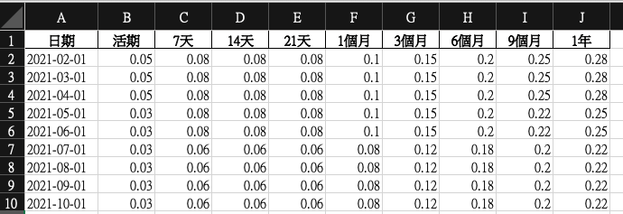
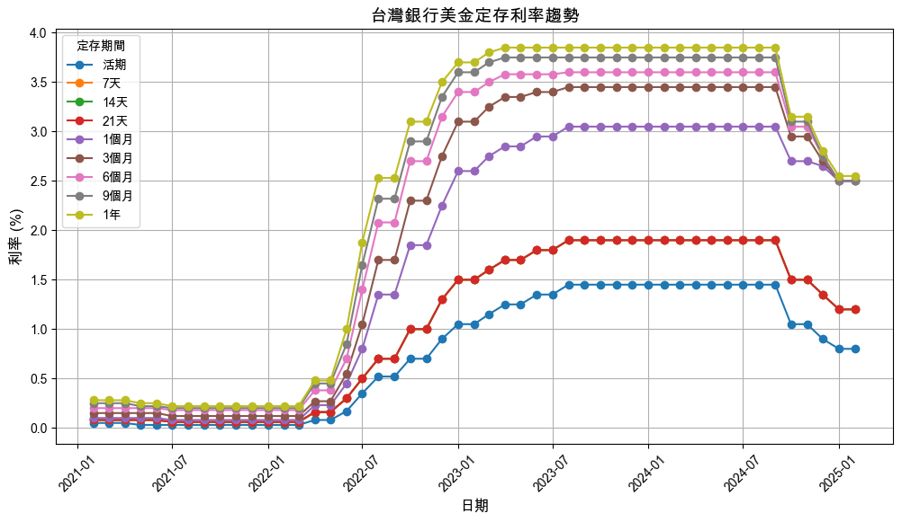

# 外幣定存

_台灣銀行_

<br>

## 查詢

1. 查詢台銀各天期美金定存利率歷史資訊。

    ```python
    import pandas as pd
    import requests
    from bs4 import BeautifulSoup
    from datetime import datetime, timedelta

    def fetch_rates(date):
        """
        從台灣銀行網站爬取指定日期的美金定存利率
        :param date: 日期 (格式：YYYY-MM-DD)
        :return: 各定存期間的利率列表 (若無數據則返回空列表)
        """
        url = f"https://rate.bot.com.tw/ir/index/{date}"
        
        # 添加 `User-Agent` 避免被封鎖
        headers = {
            "User-Agent": "Mozilla/5.0 (Windows NT 10.0; Win64; x64) AppleWebKit/537.36 (KHTML, like Gecko) Chrome/120.0.0.0 Safari/537.36"
        }

        # 發送 HTTP GET 請求
        response = requests.get(url, headers=headers)

        # 確保請求成功
        if response.status_code != 200:
            print(f"⚠️ 無法取得 {date} 的數據 (HTTP {response.status_code})")
            return []

        # 解析 HTML 內容
        soup = BeautifulSoup(response.text, "html.parser")

        # 查找包含美金定存利率的表格行
        rows = soup.find_all("tr")
        for row in rows:
            if "美金" in row.text:
                cells = row.find_all("td", class_="text-right")
                rates = [cell.text.strip() for cell in cells]

                # 確保資料完整後轉換為浮點數
                try:
                    rates = [float(rate.replace(",", "")) for rate in rates]
                    return rates
                except ValueError:
                    print(f"⚠️ {date} 數據格式異常: {rates}")
                    return []
        
        print(f"⚠️ {date} 未找到美金定存利率數據")
        return []

    # 設定抓取範圍 (最近 4 年)
    end_date = datetime.now()
    start_date = end_date.replace(year=end_date.year - 4)

    # 儲存每個月第一天的利率資訊
    data = []
    while start_date <= end_date:
        first_day_of_month = start_date.replace(day=1)  # 取得當月第一天
        rates = fetch_rates(first_day_of_month.strftime("%Y-%m-%d"))
        
        if rates:
            data.append([first_day_of_month.strftime("%Y-%m-%d")] + rates)
        else:
            print(f"❌ {first_day_of_month.strftime('%Y-%m-%d')} 沒有可用數據")
        
        # 前進一個月
        start_date += timedelta(days=32)
        start_date = start_date.replace(day=1)

    # 將數據轉換為 pandas DataFrame
    column_names = ["日期", "活期", "7天", "14天", "21天", "1個月", "3個月", "6個月", "9個月", "1年"]
    df = pd.DataFrame(data, columns=column_names)

    # 顯示前幾行數據
    print(df.head())

    # 儲存為 Excel 文件，檔名包含日期
    current_date = datetime.now().strftime("%Y%m%d")
    file_name = f"台銀美金定存利率_{current_date}.xlsx"
    df.to_excel(file_name, index=False)
    print(f"✅ 已儲存至 {file_name}")
    ```

    

<br>

2. 讀取儲存的文件進行繪圖。

    ```python
    import pandas as pd
    import matplotlib.pyplot as plt
    import matplotlib.font_manager as fm

    # 讀取 Excel 文件
    file_path = "台銀美金定存利率_20250220.xlsx"
    df = pd.read_excel(file_path)

    # 確保日期欄位為時間格式
    df["日期"] = pd.to_datetime(df["日期"])

    # 設定 MacOS 的字型，避免中文顯示亂碼
    plt.rcParams["font.family"] = "Arial Unicode MS"

    # 繪製折線圖
    plt.figure(figsize=(12, 6))
    # 排除日期欄位，只繪製數據欄位
    for col in df.columns[1:]:
        plt.plot(df["日期"], df[col], label=col, marker="o", linestyle="-")

    # 圖表標題與標籤
    plt.title("台灣銀行美金定存利率趨勢", fontsize=14)
    plt.xlabel("日期", fontsize=12)
    plt.ylabel("利率 (%)", fontsize=12)
    # 避免 X 軸日期擠在一起
    plt.xticks(rotation=45)
    plt.legend(title="定存期間", fontsize=10)
    plt.grid(True)

    # 顯示圖表
    plt.show()
    ```

    

<br>

___

_END_