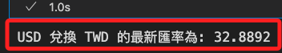
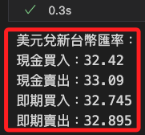

# 各種 API

<br>

## 敏感資訊

_使用 `.env` 儲存 API Key，並透過 `dotenv` 套件來讀取環境變數。_

<br>

1. 安裝 `python-dotenv`。

    ```bash
    pip install python-dotenv
    ```

<br>

2. 在專案目錄下建立 `.env` 與 `.gitignore` 檔案，並在 `.gitignore` 中寫入要忽略的檔案避免提交到 GitHub。

    ```bash
    touch .env .gitignore
    echo ".env" >> .gitignore
    ```

<br>

3. 在 `.env` 寫入以下內容。

    ```bash
    API_KEY=<填入自己的-API_KEY>
    ```

<br>

4. 更新 Python 代碼。

    ```python
    import os
    from dotenv import load_dotenv

    # 讀取 `.env` 檔案
    load_dotenv()

    # 取得 API Key
    API_KEY = os.getenv("API_KEY")
    ```

<br>

## 台銀 API

1. 查詢並顯示。

    ```python
    import pandas as pd

    url = "https://rate.bot.com.tw/xrt/flcsv/0/day"

    # 改用 UTF-8 讀取
    df = pd.read_csv(url, encoding="utf-8")

    # 顯示前幾筆資料
    print(df.head())
    ```

<br>

2. 將查詢結果存入檔案。

    ```python
    import pandas as pd
    import datetime

    # 取得當天日期
    today_date = datetime.datetime.today().strftime("%Y%m%d")
    # 設定存檔路徑與名稱
    file_name = f"data/API_台銀匯率_{today_date}.csv"
    # 匯率 API 來源
    url = "https://rate.bot.com.tw/xrt/flcsv/0/day"
    # 讀取 CSV，確保第一列為標題
    # 明確設定 `index_col=False` 保留第一欄 `幣別`
    df = pd.read_csv(
        url, encoding="utf-8", index_col=False
    )
    # 儲存檔案，確保第一列標題不被忽略，並保留完整欄位
    df.to_csv(
        file_name, index=False, encoding="utf-8-sig"
    )
    print(f"✅ 已成功儲存至 {file_name}")
    ```

<br>

## ExchangeRate-API

1. 查詢當前最新匯率。

    ```python
    import requests
    import os
    from dotenv import load_dotenv

    # 讀取 `.env` 檔案
    load_dotenv()

    # 取得 API Key
    API_KEY = os.getenv("API_KEY")
    # 幣別
    base_currency = "USD"
    target_currency = "TWD"

    # 最新匯率 API
    url = f"https://v6.exchangerate-api.com/v6/{API_KEY}/latest/{base_currency}"

    # 發送請求
    response = requests.get(url)

    # 確保 API 回應成功
    if response.status_code == 200:
        data = response.json()

        # 取得 USD -> TWD 匯率
        rate = data["conversion_rates"].get(target_currency)

        if rate:
            print(
                f"{base_currency} 兌換 {target_currency} "
                f"的最新匯率為: {rate}"
            )
        else:
            print(f"無法取得 {target_currency} 的匯率")
    else:
        print(
            f"API 錯誤，狀態碼: {response.status_code}, "
            f"錯誤訊息: {response.text}"
        )
    ```

    

<br>

## TWDER

1. 查詢最新匯率。

    ```python
    import twder

    # 取得所有幣別的即時匯率
    rates = twder.now_all()

    # 取得美元 (USD) 的即時匯率
    usd_rates = rates.get('USD')

    if usd_rates:
        # 現金買入
        cash_buying = usd_rates[1]
        # 現金賣出
        cash_selling = usd_rates[2]
        # 即期買入
        spot_buying = usd_rates[3]
        # 即期賣出
        spot_selling = usd_rates[4]

        print(f"美元兌新台幣匯率：")
        print(f"現金買入：{cash_buying}")
        print(f"現金賣出：{cash_selling}")
        print(f"即期買入：{spot_buying}")
        print(f"即期賣出：{spot_selling}")
    else:
        print("無法取得美元兌新台幣的匯率資料。")
    ```

    

<br>

___

_未完_