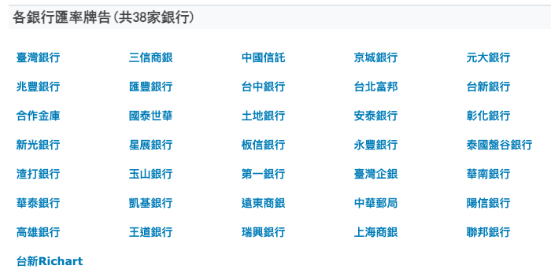
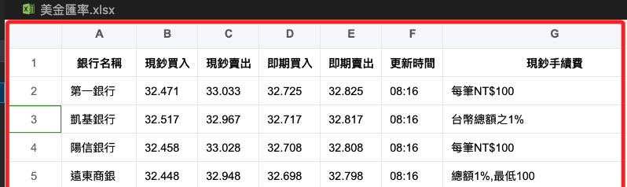
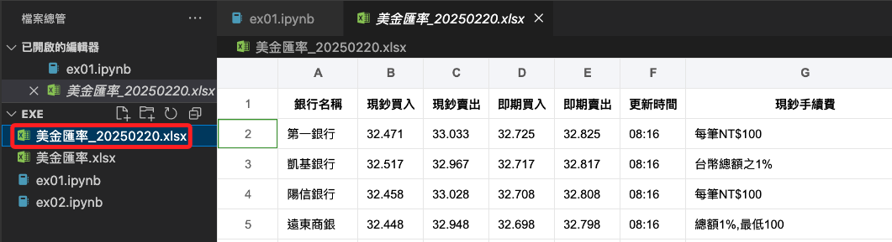
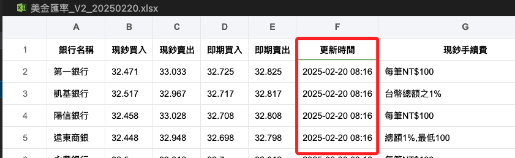
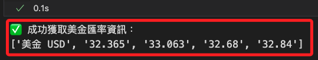
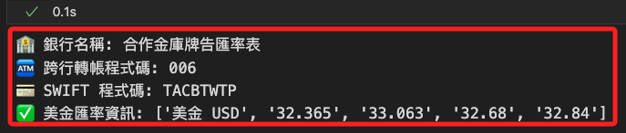
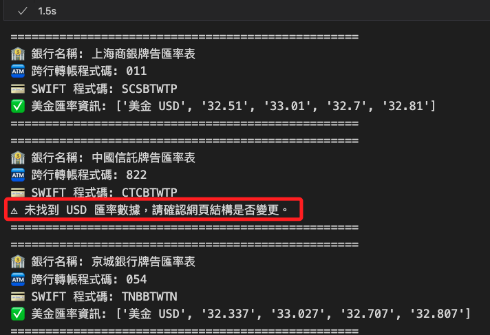
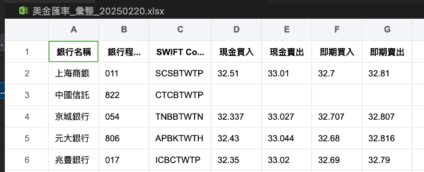
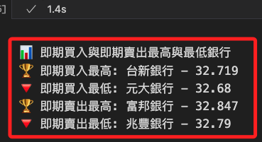

# [比率網](https://www.findrate.tw/)

_38家銀行牌告匯率_

<br>


<br>

## 網頁內容

1. 首頁中有各幣別匯率資訊。

    

<br>

2. 可查詢指定銀行的外匯資訊。

    

<br>

## 各種查詢

1. 直接取回全部銀行指定匯率資訊。

    ```python
    import requests
    from bs4 import BeautifulSoup
    import pandas as pd

    url = "https://www.findrate.tw/USD/"
    response = requests.get(url)
    data = response.text

    soup = BeautifulSoup(data, 'html.parser')
    table = soup.find_all('table')[1]

    # 提取訊息
    exchange_rates = []
    # 跳過標題行
    for row in table.find_all('tr')[1:]:
        cols = row.find_all('td')
        # 檢查行是否有預期的列數
        if len(cols) == 7:
            exchange_rates.append([col.text.strip() for col in cols])

    # 建立 DataFrame
    if exchange_rates:
        df = pd.DataFrame(
            exchange_rates, 
            columns=[
                "銀行名稱", "現鈔買入", "現鈔賣出", "即期買入", 
                "即期賣出", "更新時間", "現鈔手續費"
            ]
        )
        # 儲存到 Excel
        df.to_excel("美金匯率_.xlsx", index=False)
    else:
        print("未找到資料或表格格式不同。")
    ```

    

<br>

2. 優化以上代碼，添加 `User-Agent`，並以日期作為檔案名稱的尾綴。

    ```python
    import requests
    from bs4 import BeautifulSoup
    import pandas as pd
    from datetime import datetime

    # 目標網址
    url = "https://www.findrate.tw/USD/"

    # 添加 User-Agent 避免被阻擋
    headers = {
        "User-Agent": "Mozilla/5.0 (Windows NT 10.0; Win64; x64) AppleWebKit/537.36 (KHTML, like Gecko) Chrome/120.0.0.0 Safari/537.36"
    }

    # 發送請求
    response = requests.get(url, headers=headers)

    # 確保請求成功
    if response.status_code == 200:
        data = response.text
        soup = BeautifulSoup(data, 'html.parser')

        # 找到所有表格，避免索引錯誤
        tables = soup.find_all('table')
        
        if len(tables) > 1:
            # 目標表格
            table = tables[1]

            # 提取訊息
            exchange_rates = []
            # 跳過標題行
            for row in table.find_all('tr')[1:]:
                cols = row.find_all('td')
                # 確保符合預期格式
                if len(cols) == 7:
                    exchange_rates.append([col.text.strip() for col in cols])

            # 建立 DataFrame
            if exchange_rates:
                df = pd.DataFrame(
                    exchange_rates, 
                    columns=[
                        "銀行名稱", "現鈔買入", "現鈔賣出", "即期買入", 
                        "即期賣出", "更新時間", "現鈔手續費"
                    ]
                )

                # 生成 Excel 檔案名稱
                today_str = datetime.now().strftime('%Y%m%d')
                excel_filename = f"美金匯率_{today_str}.xlsx"

                # 儲存到 Excel
                df.to_excel(excel_filename, index=False)

                print(f"✅ 匯率資料已儲存至 {excel_filename}")
            else:
                print("⚠️ 未找到可用的匯率數據。")
        else:
            print("⚠️ 未找到目標表格，請確認網頁結構是否變更。")
    else:
        print(f"❌ 無法取得數據，HTTP 狀態碼: {response.status_code}")
    ```

    

<br>

3. 在查詢結果中加入日期。

    ```python
    import requests
    from bs4 import BeautifulSoup
    import pandas as pd
    from datetime import datetime

    def fetch_data():
        """從指定網站抓取美金匯率數據"""
        url = "https://www.findrate.tw/USD/"

        # 添加 `User-Agent` 以模擬瀏覽器，避免請求被阻擋
        headers = {
            "User-Agent": "Mozilla/5.0 (Windows NT 10.0; Win64; x64) AppleWebKit/537.36 (KHTML, like Gecko) Chrome/120.0.0.0 Safari/537.36"
        }

        # 發送請求
        response = requests.get(url, headers=headers)

        # 檢查請求是否成功
        if response.status_code != 200:
            print(f"❌ 無法取得數據，HTTP 狀態碼: {response.status_code}")
            return []

        # 解析 HTML 內容
        soup = BeautifulSoup(response.text, 'html.parser')

        # 嘗試提取日期資訊
        date_info = soup.find('span', style="float:right")
        if not date_info:
            print("⚠️ 無法找到更新日期，請確認網頁結構是否變更。")
            return []

        # 解析日期
        date_text = date_info.text.strip().split('時間：')[-1]
        # 移除 `-` 轉為 YYYYMMDD 格式
        date_str = date_text.replace('-', '')

        # 找到所有表格，避免索引錯誤
        tables = soup.find_all('table')
        if len(tables) < 2:
            print("⚠️ 未找到目標表格，請確認網頁結構是否變更。")
            return []

        # 目標表格
        table = tables[1]

        # 提取匯率數據
        exchange_rates = []
        # 跳過標題行
        for row in table.find_all('tr')[1:]:
            cols = row.find_all('td')
            # 確保行數符合預期
            if len(cols) == 7:
                row_data = [col.text.strip() for col in cols]

                # 處理更新時間，移除 HTML 註解並合併日期
                update_time = BeautifulSoup(row_data[5], "html.parser").text
                # 完整時間資訊
                row_data[5] = f"{date_text} {update_time}"
                exchange_rates.append(row_data)
        # 回傳數據與日期字串
        return exchange_rates, date_str

    # 抓取數據
    exchange_rates, date_str = fetch_data()

    if exchange_rates:
        # 建立 DataFrame
        df = pd.DataFrame(
            exchange_rates, 
            columns=[
                "銀行名稱", "現鈔買入", "現鈔賣出", "即期買入",
                "即期賣出", "更新時間", "現鈔手續費"
            ]
        )

        # 生成 Excel 檔案名稱
        excel_filename = f"美金匯率_V2_{date_str}.xlsx"

        # 儲存為 Excel 檔案
        df.to_excel(excel_filename, index=False)

        print(f"✅ 匯率資料已儲存至 {excel_filename}")
    else:
        print("⚠️ 沒有找到可用的數據。")
    ```

    

<br>

4. 從指定銀行查詢指定資訊；其中已加入 User-Agent，避免請求被阻擋。

    ```python
    from bs4 import BeautifulSoup
    import requests

    # 指定查詢的銀行網址（範例：台灣銀行）
    url = "https://www.findrate.tw/bank/10/"

    # 添加 `User-Agent` 以模擬瀏覽器，避免請求被阻擋
    headers = {
        "User-Agent": "Mozilla/5.0 (Windows NT 10.0; Win64; x64) AppleWebKit/537.36 (KHTML, like Gecko) Chrome/120.0.0.0 Safari/537.36"
    }

    # 發送請求
    response = requests.get(url, headers=headers)

    # 檢查請求是否成功
    if response.status_code != 200:
        print(f"❌ 無法取得數據，HTTP 狀態碼: {response.status_code}")
    else:
        # 解析 HTML 內容
        soup = BeautifulSoup(response.text, 'html.parser')

        # 找到包含匯率的表格
        table = soup.find('table', {'width': '725px'})
        
        # 確保表格存在
        if table:
            # 存放 USD 匯率資訊
            usd_info = None
            
            # 遍歷表格中的每一行，查找 USD
            for row in table.find_all('tr'):
                cols = row.find_all('td')
                if cols and 'USD' in cols[0].text:
                    usd_info = [col.text.strip() for col in cols]
                    break  # 找到後即停止搜尋
            
            # 顯示結果
            if usd_info:
                print("✅ 成功取得美金匯率資訊：")
                print(usd_info)
            else:
                print("⚠️ 未找到 USD 匯率數據，請確認網頁結構是否變更。")
        else:
            print("⚠️ 未找到目標表格，請確認網頁結構是否變更。")
    ```

    

<br>

5. 在以上的查詢輸出中加入銀行資訊。

    ```python
    from bs4 import BeautifulSoup
    import requests

    # 指定銀行查詢網址（範例：台灣銀行）
    url = "https://www.findrate.tw/bank/10/"

    # 添加 `User-Agent` 以模擬瀏覽器，避免請求被阻擋
    headers = {
        "User-Agent": "Mozilla/5.0 (Windows NT 10.0; Win64; x64) AppleWebKit/537.36 (KHTML, like Gecko) Chrome/120.0.0.0 Safari/537.36"
    }

    # 發送請求
    response = requests.get(url, headers=headers)

    # 檢查請求是否成功
    if response.status_code != 200:
        print(f"❌ 無法取得數據，HTTP 狀態碼: {response.status_code}")
    else:
        # 解析 HTML 內容
        soup = BeautifulSoup(response.text, 'html.parser')

        # 取得銀行名稱
        bank_title = soup.find('div', {'id': 'Title'})
        bank_name = bank_title.h1.text if bank_title else "未找到銀行名稱"

        # 取得跨行轉帳程式碼和 SWIFT 銀行國際程式碼
        bank_info_paragraph = bank_title.find_next_sibling('p') if bank_title else None
        if bank_info_paragraph:
            bank_transfer_code = bank_info_paragraph.find_all('b')[0].text if len(bank_info_paragraph.find_all('b')) > 0 else "未找到轉帳程式碼"
            swift_code = bank_info_paragraph.find_all('b')[1].text if len(bank_info_paragraph.find_all('b')) > 1 else "未找到 SWIFT 程式碼"
        else:
            bank_transfer_code = "未找到轉帳程式碼"
            swift_code = "未找到 SWIFT 程式碼"

        # 找到包含匯率的表格
        table = soup.find('table', {'width': '725px'})

        # 確保表格存在
        usd_info = None
        if table:
            # 遍歷表格中的每一行，查找 USD
            for row in table.find_all('tr'):
                cols = row.find_all('td')
                if cols and 'USD' in cols[0].text:
                    usd_info = [col.text.strip() for col in cols]
                    break  # 找到後即停止搜尋

        # 顯示結果
        print(f"🏦 銀行名稱: {bank_name}")
        print(f"🏧 跨行轉帳程式碼: {bank_transfer_code}")
        print(f"💳 SWIFT 程式碼: {swift_code}")
        
        if usd_info:
            print("✅ 美金匯率資訊:", usd_info)
        else:
            print("⚠️ 未找到 USD 匯率數據，請確認網頁結構是否變更。")
    ```

    

<br>

## 封裝

1. 批次查詢多家銀行資訊；從結果可知，若有未提供資訊的狀態並不會出錯。

    ```python
    import requests
    from bs4 import BeautifulSoup

    def fetch_data(bank_index):
        """
        從指定的銀行索引頁面抓取銀行資訊與 USD 匯率數據
        """
        # 指定銀行查詢網址
        url = f"https://www.findrate.tw/bank/{bank_index}/"

        # 添加 `User-Agent` 以模擬瀏覽器，避免請求被阻擋
        headers = {
            "User-Agent": "Mozilla/5.0 (Windows NT 10.0; Win64; x64) AppleWebKit/537.36 (KHTML, like Gecko) Chrome/120.0.0.0 Safari/537.36"
        }

        # 發送請求
        response = requests.get(url, headers=headers)

        # 檢查請求是否成功
        if response.status_code != 200:
            print(
                f"❌ 無法取得數據 (HTTP 狀態碼: {response.status_code})"
                f"，跳過銀行索引 {bank_index}"
            )
            return

        # 解析 HTML 內容
        soup = BeautifulSoup(response.text, 'html.parser')

        # 取得銀行名稱
        bank_title = soup.find('div', {'id': 'Title'})
        bank_name = bank_title.h1.text.strip() if bank_title else f"未找到銀行名稱 (索引: {bank_index})"

        # 取得跨行轉帳程式碼和 SWIFT 銀行國際程式碼
        bank_info_paragraph = bank_title.find_next_sibling('p') if bank_title else None
        if bank_info_paragraph:
            bank_transfer_code = bank_info_paragraph.find_all('b')[0].text if len(bank_info_paragraph.find_all('b')) > 0 else "未找到轉帳程式碼"
            swift_code = bank_info_paragraph.find_all('b')[1].text if len(bank_info_paragraph.find_all('b')) > 1 else "未找到 SWIFT 程式碼"
        else:
            bank_transfer_code = "未找到轉帳程式碼"
            swift_code = "未找到 SWIFT 程式碼"

        # 找到包含匯率的表格
        table = soup.find('table', {'width': '725px'})

        # 確保表格存在並提取 USD 匯率數據
        usd_info = None
        if table:
            for row in table.find_all('tr'):
                cols = row.find_all('td')
                if cols and 'USD' in cols[0].text:
                    usd_info = [col.text.strip() for col in cols]
                    # 找到後即停止搜尋
                    break

        # 顯示結果
        print("=" * 50)
        print(f"🏦 銀行名稱: {bank_name}")
        print(f"🏧 跨行轉帳程式碼: {bank_transfer_code}")
        print(f"💳 SWIFT 程式碼: {swift_code}")
        
        if usd_info:
            print("✅ 美金匯率資訊:", usd_info)
        else:
            print("⚠️ 未找到 USD 匯率數據，請確認網頁結構是否變更。")
        print("=" * 50)

    # 主程式: 遍歷銀行索引 1~10
    if __name__ == '__main__':
        # 10 家銀行
        for i in range(1, 11):
            fetch_data(i)
    ```

    

<br>

2. 將結果儲存。

    ```python
    import pandas as pd
    import requests
    from bs4 import BeautifulSoup
    from datetime import datetime

    def fetch_data(bank_index):
        """
        從指定的銀行索引頁面抓取銀行資訊與 USD 匯率數據
        """
        # 指定銀行查詢網址
        url = f"https://www.findrate.tw/bank/{bank_index}/"

        # 添加 `User-Agent` 以模擬瀏覽器，避免請求被阻擋
        headers = {
            "User-Agent": "Mozilla/5.0 (Windows NT 10.0; Win64; x64) AppleWebKit/537.36 (KHTML, like Gecko) Chrome/120.0.0.0 Safari/537.36"
        }

        # 發送請求
        response = requests.get(url, headers=headers)

        # 檢查請求是否成功
        if response.status_code != 200:
            print(
                f"❌ 無法取得數據 (HTTP 狀態碼: {response.status_code})，"
                f"跳過銀行索引 {bank_index}"
            )
            return None

        # 解析 HTML 內容
        soup = BeautifulSoup(response.text, 'html.parser')

        # 取得完整銀行名稱
        bank_title = soup.find('div', {'id': 'Title'})
        full_bank_name = bank_title.h1.text.strip() if bank_title else f"未找到銀行名稱 (索引: {bank_index})"
        # 去除多餘字串
        bank_name = full_bank_name.split('牌告匯率')[0].strip()

        # 取得跨行轉帳程式碼和 SWIFT 銀行國際程式碼
        bank_info_paragraph = bank_title.find_next_sibling('p') if bank_title else None
        if bank_info_paragraph:
            bank_transfer_code = bank_info_paragraph.find_all('b')[0].text if len(bank_info_paragraph.find_all('b')) > 0 else "未找到轉帳程式碼"
            swift_code = bank_info_paragraph.find_all('b')[1].text if len(bank_info_paragraph.find_all('b')) > 1 else "未找到 SWIFT 程式碼"
        else:
            bank_transfer_code = "未找到轉帳程式碼"
            swift_code = "未找到 SWIFT 程式碼"

        # 找到包含匯率的表格
        table = soup.find('table', {'width': '725px'})

        # 確保表格存在並提取 USD 匯率數據
        usd_info = None
        if table:
            for row in table.find_all('tr'):
                cols = row.find_all('td')
                if cols and 'USD' in cols[0].text:
                    # 只提取匯率數據
                    usd_info = [col.text.strip() for col in cols[1:]]
                    # 找到後即停止搜尋
                    break

        # 檢查是否有取得到 USD 匯率數據
        if usd_info is not None:
            return [bank_name, bank_transfer_code, swift_code] + usd_info
        else:
            # 無數據則填入 None
            return [bank_name, bank_transfer_code, swift_code] + [None, None, None, None]

    # 初始化儲存所有銀行數據的列表
    all_bank_data = []

    # 遍歷 1~10 的銀行索引
    for i in range(1, 11):
        result = fetch_data(i)
        if result:
            all_bank_data.append(result)

    # 建立 DataFrame
    df = pd.DataFrame(
        all_bank_data, 
        columns=[
            "銀行名稱", "銀行程式碼", "SWIFT Code", 
            "現金買入", "現金賣出", "即期買入", "即期賣出"
        ]
    )

    # 取得當前日期，格式為 YYYYMMDD
    current_date = datetime.now().strftime("%Y%m%d")

    # 生成 Excel 檔案名稱
    file_name = f"美金匯率_彙整_{current_date}.xlsx"

    # 儲存為 Excel 檔案
    df.to_excel(file_name, index=False)

    print(f"✅ 匯率數據已儲存至 {file_name}")
    ```

    

<br>

## 比較

1. 顯示即期買入與即期賣出最高與最低的銀行。

    ```python
    import pandas as pd
    import requests
    from bs4 import BeautifulSoup

    def fetch_data(bank_index):
        """
        從指定的銀行索引頁面抓取銀行資訊與 USD 匯率數據
        """
        url = f"https://www.findrate.tw/bank/{bank_index}/"

        headers = {
            "User-Agent": "Mozilla/5.0 (Windows NT 10.0; Win64; x64) AppleWebKit/537.36 (KHTML, like Gecko) Chrome/120.0.0.0 Safari/537.36"
        }

        response = requests.get(url, headers=headers)
        if response.status_code != 200:
            print(f"❌ 無法取得數據 (HTTP 狀態碼: {response.status_code})，跳過銀行索引 {bank_index}")
            return None

        soup = BeautifulSoup(response.text, 'html.parser')

        bank_title = soup.find('div', {'id': 'Title'})
        full_bank_name = bank_title.h1.text.strip() if bank_title else f"未找到銀行名稱 (索引: {bank_index})"
        bank_name = full_bank_name.split('牌告匯率')[0].strip()

        table = soup.find('table', {'width': '725px'})

        usd_info = None
        if table:
            for row in table.find_all('tr'):
                cols = row.find_all('td')
                if cols and 'USD' in cols[0].text:
                    usd_info = [col.text.strip() for col in cols[1:]]  # 只提取匯率數據
                    break  

        if usd_info:
            try:
                return [bank_name, float(usd_info[2]), float(usd_info[3])]  # 即期買入、即期賣出
            except ValueError:
                print(f"⚠️ {bank_name} 資料格式錯誤，跳過")
                return None
        else:
            return None

    # 抓取所有銀行數據
    all_bank_data = []
    for i in range(1, 11):
        result = fetch_data(i)
        if result:
            all_bank_data.append(result)

    # 建立 DataFrame
    df = pd.DataFrame(all_bank_data, columns=["銀行名稱", "即期買入", "即期賣出"])

    # 找出即期買入最高與最低
    if not df.empty:
        max_buy = df.loc[df["即期買入"].idxmax()]
        min_buy = df.loc[df["即期買入"].idxmin()]
        max_sell = df.loc[df["即期賣出"].idxmax()]
        min_sell = df.loc[df["即期賣出"].idxmin()]

        print("\n📊 即期買入與即期賣出最高與最低銀行")
        print(f"🏆 即期買入最高: {max_buy['銀行名稱']} - {max_buy['即期買入']}")
        print(f"🔻 即期買入最低: {min_buy['銀行名稱']} - {min_buy['即期買入']}")
        print(f"🏆 即期賣出最高: {max_sell['銀行名稱']} - {max_sell['即期賣出']}")
        print(f"🔻 即期賣出最低: {min_sell['銀行名稱']} - {min_sell['即期賣出']}")
    else:
        print("❌ 無法取得有效的匯率數據")
    ```

    

<br>

___

_END_