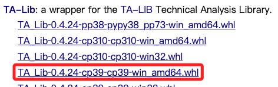

# TA-Lib

_Technical Analysis Library，可參考 [官網](https://ta-lib.github.io/ta-lib-python/doc_index.html)，也可參考 [這篇文章](https://havocfuture.tw/blog/python-indicators-talib)。_

<br>

## 說明

1. TA-Lib 包含了超過 150 種技術分析指標，如移動平均線、相對強弱指數（RSI）、布林帶等。

<br>

2. [下載](https://www.lfd.uci.edu/~gohlke/pythonlibs/#ta-lib)。

<br>

## 安裝

_使用 Mac 系統_

<br>

1. 若尚未安裝 `Homebrew`，先參考 [Homebrew 官網](https://brew.sh/) 進行指令。

    ```bash
    /bin/bash -c "$(curl -fsSL https://raw.githubusercontent.com/Homebrew/install/HEAD/install.sh)"
    ```

<br>

2. 或使用 Homebrew 來安裝 TA-Lib 的 C 語言庫。

    ```bash
    brew install ta-lib
    ```

<br>

3. 通過 pip 安裝 Python 的 TA-Lib 接口。

```bash
pip install TA-Lib
```

<br>

## Windows 安裝

1. [下載 whl 檔案](https://www.lfd.uci.edu/~gohlke/pythonlibs/#ta-lib) ，要與系統與 Python 適配。

    

<br>

7. 下載的檔案上點擊右鍵。

    

<br>

8. 安裝

    

<br>

9. 再安裝一次試試：這個步驟基本上是多餘的，只是用來測試是否安裝完成。

    ```bash
    pip install TA-Lib
    ```

    

<br>

---

_END_