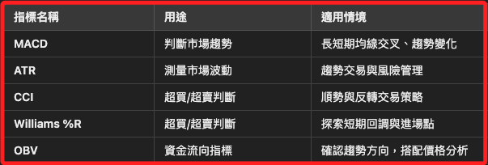
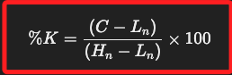
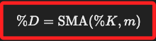

# 技術指標



<br>

## 使用

1. 導入函式庫。

    ```python
    import talib
    ```

<br>

## 模擬數據

_因為以下的分析需要數據，這裡不做特別下載，所以自行模擬_

<br>

1. 模擬 360 天數據並存入檔案。

    ```python
    import pandas as pd
    import numpy as np
    import openpyxl
    import datetime

    # 設定隨機數種子以保持數據一致性
    np.random.seed(0)

    # 模擬 360 天的股市資料，僅包含工作日
    dates = pd.date_range(
        start="2024-01-01", periods=360, freq='B'
    )

    # 產生股市數據
    open_prices = np.random.uniform(low=100, high=200, size=len(dates))
    high_prices = open_prices + np.random.uniform(low=0, high=10, size=len(dates))
    low_prices = open_prices - np.random.uniform(low=0, high=10, size=len(dates))
    close_prices = np.random.uniform(low=low_prices, high=high_prices)

    # 建立 DataFrame
    stock_data = pd.DataFrame({
        # 只保留 "YYYY-MM-DD"
        'Date': dates.strftime('%Y-%m-%d'),
        'Open': open_prices,
        'High': high_prices,
        'Low': low_prices,
        'Close': close_prices
    })

    # 設定存檔名稱 (使用日期範圍作為尾綴)
    start_date = stock_data['Date'].iloc[0].replace('-', '')
    end_date = stock_data['Date'].iloc[-1].replace('-', '')
    excel_file_path = f'data/股市資料_{start_date}-{end_date}.xlsx'

    # 儲存數據到 Excel (設定 sheet 名稱)
    with pd.ExcelWriter(excel_file_path, engine='openpyxl') as writer:
        stock_data.to_excel(
            writer, index=False, sheet_name="Stock Data"
        )

    print(f"股市資料已儲存到 {excel_file_path}")
    ```

<br>

2. 展示其中 10 筆的收盤數據。

    ```python
    # 首先讀取剛才儲存的 Excel 文件
    stock_data_read = pd.read_excel(excel_file_path, index_col=0)

    # 從讀取的數據中提取收盤價
    close_prices = np.array(stock_data_read['Close'])

    # 顯示前 10 個收盤價
    close_prices[:10]
    ```

<br>

3. 計算移動平均 `SMA`。

    ```python
    # 計算 30 日簡單移動平均線
    moving_average = talib.SMA(close_prices, timeperiod=30)
    moving_average
    ```

<br>

4. 指數移動平均`EMA`。

    ```python
    EMA = talib.EMA(close_prices, timeperiod=30)
    EMA
    ```

<br>

5. 相對強弱指數（RSI）。

    ```python
    RSI = talib.RSI(close_prices, timeperiod=14)
    RSI
    ```

<br>

## 隨機指標

_Stochastic Oscillator，STOCH_

<br>

1. 隨機指標是技術分析中常用的 `動量指標（Momentum Indicator）`，用來衡量價格相對於一段時間內的最高點與最低點的位置，並判斷市場是否處於超買或超賣狀態。

<br>

2. STOCH 指標主要由兩條線組成，分別是 `%K 線（快速隨機線）` 與 `%D 線（慢速隨機線，%K 的移動平均線）`。

<br>

3. `%K` 計算公式如下，其中 `C` 是當前收盤價，`Lₙ` 最近 n 天內的最低價，`Hₙ` 最近 n 天內的最高價。

    

<br>

4. `%D` 計算公式如下，`SMA` 是簡單移動平均線 `Simple Moving Average`，`m` 是平滑天數，一般為 3 天。

    

<br>

5. 代碼。

    ```python
    df = pd.read_excel(excel_file_path)

    # 確保欄位名稱正確
    print(df.head())

    # 確保 `high`, `low`, `close` 欄位正確讀取
    high = df["High"].values.astype(np.float64)
    low = df["Low"].values.astype(np.float64)
    close = df["Close"].values.astype(np.float64)

    # 確保 `high`, `low`, `close` 已正確轉換為 NumPy 陣列
    print(f"High: {high[:5]}")
    print(f"Low: {low[:5]}")
    print(f"Close: {close[:5]}")

    # 計算 STOCH 隨機指標
    slowk, slowd = talib.STOCH(
        high, low, close,
        fastk_period=5,
        slowk_period=3, slowk_matype=0,
        slowd_period=3, slowd_matype=0
    )

    # 轉換回 DataFrame 方便檢視
    df["SlowK"] = slowk
    df["SlowD"] = slowd

    # 顯示最後 10 筆數據
    print(df.tail(10))

    # 儲存結果到 Excel
    output_file = "data/股市資料_STOCH.xlsx"
    df.to_excel(output_file, index=False)
    print(f"結果已儲存到 {output_file}")
    ```

<br>

## ADX

_Average Directional Index，平均方向指數_

<br>

1. 這個指標用來衡量市場趨勢的強度，範圍在 `0~100` 之間，低於 20 表示趨勢較弱或無趨勢，20-40 表示趨勢較強，40-60 表示趨勢非常強，高於 60 表示極端強勢趨勢。

<br>

2. 可簡化分水嶺，當 ADX > 25 代表有趨勢且越高趨勢越強；反之若 ADX < 20 代表市場波動較小，沒有明確趨勢。

<br>

3. 計算方式基於 +DI（正向指標） 和 -DI（負向指標），但 `ADX` 只關注趨勢強度，而不考慮方向。

<br>

## BBANDS

_Bollinger Bands，布林通道_

<br>

1. 這是一種 波動率指標，用來判斷價格是高估還是低估；上軌（Upper Band）= 20 日均線 + 2 倍標準差，中軌（Middle Band）= 20 日均線（SMA），下軌（Lower Band） = 20 日均線 - 2 倍標準差。

<br>

2. 價格如果接近 上軌，表示可能超買；如果接近 下軌，表示可能超賣。

<br>

## 代碼

1. 以下代碼讀取前面步驟儲存的數據檔案 `excel_file_path`，若有變更可逕自修改；首先轉換 `High`、`Low`、`Close` 為 NumPy 陣列，避免 `TA-Lib` 錯誤，接著計算 `BBANDS` 與 `ADX` 的三條軌道線，並將數據存入 Excel 並顯示最後 10 筆數據。

    ```python
    import pandas as pd
    import numpy as np
    import talib

    # 讀取 Excel 檔案
    df = pd.read_excel(excel_file_path)

    # 確保欄位名稱正確
    print(df.head())

    # 轉換數據格式為 NumPy 陣列，避免 `TA-Lib` 無法運行
    high = df["High"].values.astype(np.float64)
    low = df["Low"].values.astype(np.float64)
    close = df["Close"].values.astype(np.float64)

    # 計算 ADX，趨勢強度指標
    df["ADX"] = talib.ADX(high, low, close, timeperiod=14)
    # 計算 BBANDS，布林通道
    df["UpperBand"], df["MiddleBand"], df["LowerBand"] = talib.BBANDS(
        close, timeperiod=20, nbdevup=2, nbdevdn=2, matype=0
    )
    # 顯示最後 10 筆數據
    print(df.tail(10))
    # 儲存結果到 Excel
    output_file = "data/股市資料_ADX_BBANDS.xlsx"
    df.to_excel(output_file, index=False)
    print(f"結果已儲存到 {output_file}")
    ```

<br>

___

_END_
